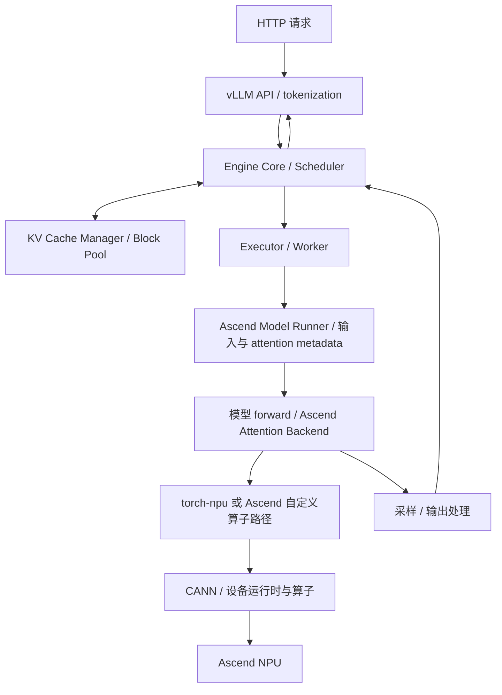

# 真实 vLLM / Ascend 系统实验路线

记录日期：2026-09-20。用户决定：后续实验基于已运行的真实系统，逐层理解
vLLM、vLLM-Ascend 和 Ascend 软件栈；每个实验对应一个主要问题。

## 实验原则

- 基线是现有 Ascend 910B2C、Qwen2.5-0.5B-Instruct、单卡 BF16、eager。
- 以远端实际加载的源码、commit 和文件指纹为依据，文档用于导航。
- 每个实验保存复现命令、版本、实际日志或 trace、结论与证据边界。
- 先解释正常执行，再研究生命周期违规；教学 generation 不等于真实 vLLM 已有字段。
- Python 调用返回不等于设备执行完成。主机日志和设备 profiler 分开解释。
- 观察工具会影响运行开销；带插桩运行不作为吞吐或延迟基准。
- 每次只引入一个主要变量。保持模型、输入和采样参数可复现。

## 架构导航（职责图，不预设进程数量）

进程和线程边界、实际算子路径，以所选版本及运行配置的观测结果为准。
安装了 triton-npu 不等于当前模型的每个算子都经过 Triton。

## 实验顺序

当前进度：**Practice 07、08、09、10 已在远端真实运行完成**。
07 于 2026-09-20 完成请求路径追踪，见 [结果与证据](practice_07_real_request_trace/RESULTS.md)；
08 于 2026-09-22 完成跨 block 的真实 KV 映射及第一层数据校验，
见 [结果与证据](practice_08_real_kv_mapping/RESULTS.md)；
09 同日完成 Python → PyTorch → CANN → NPU 的真实算子关联，
见 [结果与证据](practice_09_operator_trace/RESULTS.md)。同日进一步覆盖该 trace 的全部 33 种设备任务，
形成 [完整算子执行流程图](practice_09_operator_trace/OPERATOR_FLOW.md)。
2026-09-23 完成 **Practice 10：提取真实模型计算图**：24 层、852 个 FX 节点、49 个分区，
已验证真实请求进入编译执行路径，见 [结果](practice_10_model_graph/RESULTS.md)。

2026-09-22 根据用户的学习方向调整顺序：将算子调用与设备时间线提前为 Practice 09；
原计划的释放复用、continuous batching 顺延。graph 对照与独立算子实验留到后续。

2026-09-23 根据用户要求，下一步优先提取实际模型的计算图，建立节点、tensor 依赖、
自定义算子边界与 vLLM 分图的对应关系。设备图与性能对照仍作为后续问题，
不把 FX 计算图等同于 NPU Graph 或 profiler 时间线。

| Practice | 主要问题 | 操作与预期证据 |
|---|---|---|
| 07：真实请求追踪 | prompt 经过哪些模块？ | 单请求生成少量 token，关联 API、scheduler、worker、runner 与输出的源码和事件 |
| 08：真实 KV 映射 | token 写入哪个 KV block？ | 记录实际 block size、block table、slot mapping、KV tensor 布局 |
| 09：真实算子与 NPU 时间线 | Python 调用怎样对应到设备执行？ | 预热后采集一个请求，关联第一层 KV 写入、attention 的 Python 范围、PyTorch 算子、CANN flow 与 NPU kernel |
| 10：真实模型计算图 | forward 的算子与 tensor 怎样连接？ | 导出实际 Dynamo FX 图、节点 shape/源码、attention 副作用边界和 vLLM 分区，验证真实请求运行 |
| 11：真实释放和复用 | request 结束后 block 怎样回收？ | A/B 请求，追踪 block ID、引用计数、空闲队列；再开启 prefix caching 做对照 |
| 12：continuous batching | 多个请求怎样共享一次执行？ | 长短请求交错到达，记录每轮请求集合、调度 token 数和完成情况 |
| 13：执行模式与独立算子 | graph 改变什么，真实算子能否单独复现？ | 基于 09/10 比较 eager/graph 的设备时间线，再提取小规模算子实验，核对输入输出和 KV 更新 |

11 特别区分 request 结束、引用计数归零、缓存淘汰、数据覆盖。
07/08 的主机调用日志不能证明设备上的生命周期违规或 race；09 的 profiler 也有观察开销，
不能由一次正常 trace 推断原始运行绝无 race。
多卡通信、HCCL、TP/PP、分离式 prefill/decode 留作单卡路径明确后的扩展，需要相应硬件。

## Practice 07 的完成标准

目录：`practice_07_real_request_trace/`。

1. 保存已加载包的路径、版本、源码 commit/工作区状态和关键文件 SHA256。
2. 在单卡 eager 服务上发送一个固定请求，生成 4～8 个 token；关闭 prefix caching。
3. 关联 request ID、进程 PID、线程 TID、调度步、已计算 token 数及本步 token 数。
4. 记录实际 worker/runner/backend 类和模型输入 shape。
5. 记录输出数量、结束原因以及 scheduler 清理入口。
6. 用这些记录说明 API → Scheduler → Ascend Runner → 输出的真实路径。

原始 trace 和运行摘要需明确区分启动预热与用户请求。下一实验在这个链路上加入 KV 映射。

## 参考入口

- [vLLM Architecture](https://docs.vllm.ai/en/latest/design/arch_overview/)
- [Ascend ModelRunner Prepare Inputs](https://docs.vllm.ai/projects/ascend/en/latest/developer_guide/Design_Documents/ModelRunner_prepare_inputs.html)
- [vLLM Prefix Caching](https://docs.vllm.ai/en/latest/design/prefix_caching/)
- [Ascend Service Profiling](https://docs.vllm.ai/projects/ascend/en/latest/developer_guide/performance_and_debug/service_profiling_guide.html)

以上 latest 文档可能变化。实验结果必须引用该次运行的本地源码位置，而不是只引用 latest。
