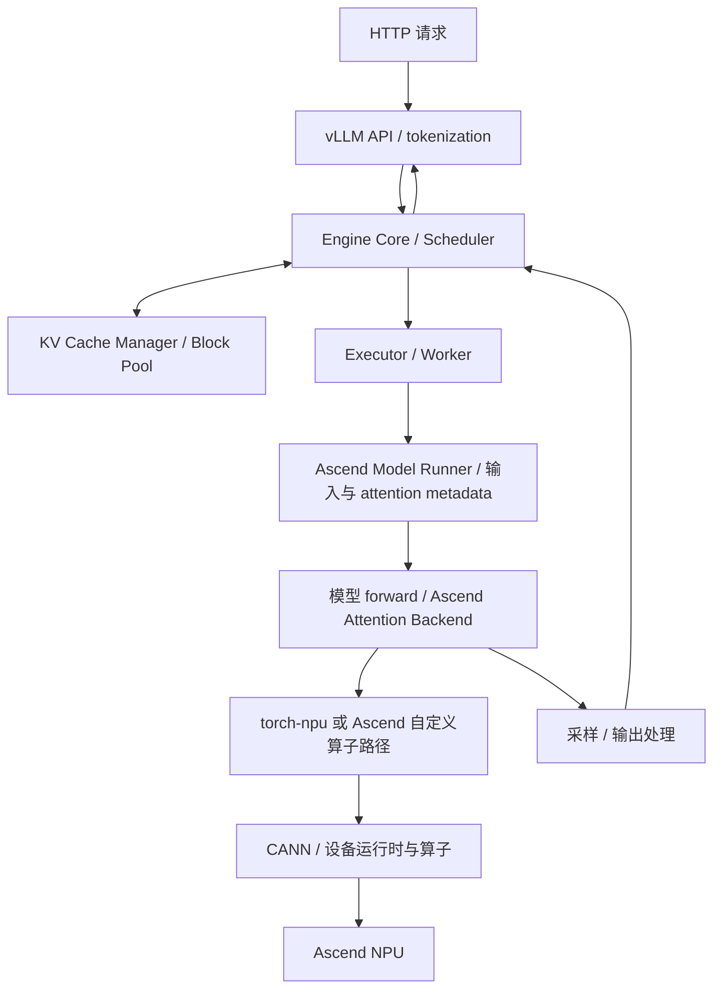

# 真实 vLLM / Ascend 系统实验路线

记录日期：2026-09-20。用户决定：后续实验基于已运行的真实系统，逐层理解
vLLM、vLLM-Ascend 和 Ascend 软件栈；每个实验对应一个主要问题。

## 实验原则

- 基线是现有 Ascend 910B2C、Qwen2.5-0.5B-Instruct、单卡 BF16、eager。
- 以远端实际加载的源码、commit 和文件指纹为依据，文档用于导航。
- 每个实验保存复现命令、版本、实际日志或 trace、结论与证据边界。
- 先解释正常执行，再研究生命周期违规；教学 generation 不等于真实 vLLM 已有字段。
- Python 调用返回不等于设备执行完成。主机日志和设备 profiler 分开解释。
- 观察工具会影响运行开销；带插桩运行不作为吞吐或延迟基准。
- 每次只引入一个主要变量。保持模型、输入和采样参数可复现。

## 架构导航（职责图，不预设进程数量）

```mermaid
flowchart TD
    A[HTTP 请求] --> B[vLLM API / tokenization]
    B --> C[Engine Core / Scheduler]
    C <--> D[KV Cache Manager / Block Pool]
    C --> E[Executor / Worker]
    E --> F[Ascend Model Runner / 输入与 attention metadata]
    F --> G[模型 forward / Ascend Attention Backend]
    G --> H[torch-npu 或 Ascend 自定义算子路径]
    H --> I[CANN / 设备运行时与算子]
    I --> J[Ascend NPU]
    G --> K[采样 / 输出处理]
    K --> C
    C --> B
```

进程和线程边界、实际算子路径，以所选版本及运行配置的观测结果为准。
安装了 triton-npu 不等于当前模型的每个算子都经过 Triton。

## 实验顺序

当前进度：**Practice 07–16 已在远端真实运行完成**。
07 于 2026-09-20 完成请求路径追踪，见 [结果与证据](practice_07_real_request_trace/RESULTS.md)；
08 于 2026-09-22 完成跨 block 的真实 KV 映射及第一层数据校验，
见 [结果与证据](practice_08_real_kv_mapping/RESULTS.md)；
09 同日完成 Python → PyTorch → CANN → NPU 的真实算子关联，
见 [结果与证据](practice_09_operator_trace/RESULTS.md)。同日进一步覆盖该 trace 的全部 33 种设备任务，
形成 [完整算子执行流程图](practice_09_operator_trace/OPERATOR_FLOW.md)。
2026-09-23 完成 **Practice 10：提取真实模型计算图**：24 层、852 个 FX 节点、49 个分区，
已验证真实请求进入编译执行路径，见 [结果](practice_10_model_graph/RESULTS.md)。
同日完成 **Practice 11：展开第一层 attention 的真实执行**：两阶段存储传递链、
5 条重点算子链、attention 内 5+3 个设备任务，并明确设备图重放内部的关联缺口，
见 [结果](practice_11_attention_execution/RESULTS.md)。

同日完成 **Practice 12：真实释放与复用的串行基线**：A/B 复用 B1，核对所有24层存储、
192条 KV/FIA 设备关联、原生采样结果等待与释放/再分配的顺序。
见 [结果](practice_12_kv_block_reuse/RESULTS.md)。在原生小池基线上新增可切换的 eager /
PIECEWISE graph，使用匹配请求与脚本重采集。两模式均保留192条直接KV/FIA链；
graph的decode普通分区重放，488个重放任务仍缺少逐FX关联。
新增run05/06逐事件及逐replay资源台账：输入/输出存储、捕获快照、原生event与slot准备链。
发现启动阶段graph对象ID可复用，完成event也跨轮复用；以具体发生次序区分。
隐藏workspace、完整逐ATen参数、prefix caching、并发和async scheduling仍待后续单独开展。

2026-09-24 按用户要求，Practice 13优先研究正常推理的CPU提交与运行时执行：
隔离Triton冷缓存，记录编译、注册、真实参数、队列、CANN下发、NPU执行和CPU重叠活动。
正式eager请求1444个设备任务均已关联，8次Triton编译发生于启动/预热；
明确区分注册边界和未暴露的代码DMA、原生参数包字节。见[结果](practice_13_operator_submission/RESULTS.md)。
原continuous batching和独立算子扩展顺延为14、15。

同日按用户要求，Practice 14只研究KV池的实际初始化分配，不增加推理请求或模式对照。
已核对24层48个K/V存储、allocator快照和887对CANN物理内存申请/映射，
确认服务默认使用expandable segments，reshape与模型绑定复用原存储。
见[逐步结果](practice_14_kv_pool_allocation/RESULTS.md)。后续batching与独立算子顺延为15、16。

同日按用户要求，Practice 15优先构建调度层kernel execution graph。
重新采集单请求eager模型，连接1444个任务的CPU/CANN下发、stream顺序、原生等待和局部数据关系；
另以真实双stream控制实验验证event代次及跨流同步。完整数据依赖尚未覆盖，明确保留未知访问。
见[结果](practice_15_kernel_execution_graph/RESULTS.md)。batching与执行模式扩展顺延为16、17。

同日按用户要求，Practice 16优先演示真实多stream计算并行。
独立矩阵/向量分支完成三轮单流与双流对照，72个计算任务逐项关联；双流每轮约3.3ms重叠，
单流为零，全部输出正确。总跨度仅小幅改善，明确区分重叠与加速。
见[结果](practice_16_multistream_parallel/RESULTS.md)。batching与执行模式扩展顺延为17、18。

Practice 16随后补充同步消融：每轮等待与最后统一等待在无profiler条件下各重复七次，
完整耗时中位数20.522ms与20.163ms；独立提前读取诊断56次均读到哨兵，最终等待后全量输出正确。
另采144个计算任务及拷贝/event证据，明确提交更快不等于计算已完成。见[同步对照](practice_16_multistream_parallel/SYNC_COMPARISON.md)。

随后补充A→B数据依赖与独立C的三stream实验：只删除B的event等待，7/7次无profiler运行在最终汇合后
仍保留旧输入产生的错误输出；保留依赖则全部正确。另采78个计算任务核对实际顺序，C在B等待期间
仍有约3.4ms计算。见[跨stream依赖](practice_16_multistream_parallel/CROSS_STREAM_DEPENDENCY.md)。

同日继续完成Practice 17：在真实vLLM eager请求中定位Ascend sampler的指数随机数stream。
Qwen batch 32与Llama batch 64的提前随机分支均在5个scheduler step中的4个与模型计算重叠，
物理stream分别为44和46；另保留关闭开关、小batch和请求级seed对照，证明多stream不自动等于并行。
图连接逐task stream顺序、设备event wait、Host event同步及实际被sampler消费的q tensor。
见[结果](practice_17_vllm_multistream/RESULTS.md)。

2026-09-22 根据用户的学习方向调整顺序：将算子调用与设备时间线提前为 Practice 09；
原计划的释放复用、continuous batching 顺延。graph 对照与独立算子实验留到后续。

2026-09-23 根据用户要求，下一步优先提取实际模型的计算图，建立节点、tensor 依赖、
自定义算子边界与 vLLM 分图的对应关系。设备图与性能对照仍作为后续问题，
不把 FX 计算图等同于 NPU Graph 或 profiler 时间线。

同日用户同意将“FX attention 节点 → 运行时数据与设备执行”提前为 Practice 11。
沿用 10 的 graph 配置，原释放复用与 batching 实验顺延。

| Practice | 主要问题 | 操作与预期证据 |
|---|---|---|
| 07：真实请求追踪 | prompt 经过哪些模块？ | 单请求生成少量 token，关联 API、scheduler、worker、runner 与输出的源码和事件 |
| 08：真实 KV 映射 | token 写入哪个 KV block？ | 记录实际 block size、block table、slot mapping、KV tensor 布局 |
| 09：真实算子与 NPU 时间线 | Python 调用怎样对应到设备执行？ | 预热后采集一个请求，关联第一层 KV 写入、attention 的 Python 范围、PyTorch 算子、CANN flow 与 NPU kernel |
| 10：真实模型计算图 | forward 的算子与 tensor 怎样连接？ | 导出实际 Dynamo FX 图、节点 shape/源码、attention 副作用边界和 vLLM 分区，验证真实请求运行 |
| 11：attention 节点的真实执行 | 一个 FX 节点使用哪些存储、对应哪些设备任务？ | graph 模式下关联第一层 Q/K/V、上下文、KV 写入、output 与后续分区；区分直接调用与重放证据 |
| 12：真实释放和复用 | request 结束后 block 怎样回收？ | 已完成串行 eager / PIECEWISE graph 匹配对照；关联24层设备访问、原生等待、引用计数和空闲队列。prefix caching 对照留待扩展 |
| 13：CPU提交与运行时执行 | 何时编译/注册，提交什么，CPU与NPU怎样重叠？ | 已完成冷编译与预热后eager推理；真实参数、队列correlation、CANN/NPU flow、结果回传等待及离线执行时间线 |
| 14：KV池实际分配 | 初始化时谁申请内存，地址、物理句柄和KV tensor怎样对应？ | 已完成预算、48个存储、allocator历史、CANN物理申请/映射、reshape与绑定的逐项核验；不发送推理请求 |
| 15：kernel execution graph | host提交怎样连接到stream、同步及数据关系？ | 已完成1444个eager设备任务的类型化图、局部RAW与KV存储候选边；独立双stream真实实验验证event复用和等待 |
| 16：真实多stream并行 | 两个独立算子是否在设备上重叠执行？ | 已完成三轮单流/双流对照，实际kernel区间交集、输出校验、终点event等待及离线时间线 |
| 17：vLLM真实多stream | 模型与采样分支怎样并行？ | 已完成Qwen/Llama随机数stream与model stream、同步、消费数据的关联及匹配对照 |
| 18：全模型kernel数据DAG | 数据依赖、关键路径和stream分配怎样分析？ | 已实现全任务tensor边界投影、KV索引契约、关键路径及离线分配；native内部workspace缺口使精确数据DAG仍未完成 |
| 19：真实kernel核数 | 一个KV写入kernel使用多少核？ | 已查询24 Cube/48 Vector，隔离真实ATB写入并改变tokens；60个精确任务、100次完整池校验、独立完成计时与流水线指标；逐物理核时间线仍未知 |

2026-09-28 根据用户要求，Practice 18 改为全模型 kernel 数据依赖与调度分析。
四轮真实 eager 采集覆盖 1,444 个设备任务、四次 forward 的全部 24 层。
结果与严格完整性边界见 [Practice 18](practice_18_kernel_data_dag/README.md)。
原 continuous batching、FULL graph 及重放内部关联实验保留为后续任务。

12 特别区分 request 结束、引用计数归零、缓存淘汰、数据覆盖。
07/08 的主机调用日志不能证明设备上的生命周期违规或 race；09 的 profiler 也有观察开销，
不能由一次正常 trace 推断原始运行绝无 race。
多卡通信、HCCL、TP/PP、分离式 prefill/decode 留作单卡路径明确后的扩展，需要相应硬件。

## Practice 07 的完成标准

目录：`practice_07_real_request_trace/`。

1. 保存已加载包的路径、版本、源码 commit/工作区状态和关键文件 SHA256。
2. 在单卡 eager 服务上发送一个固定请求，生成 4～8 个 token；关闭 prefix caching。
3. 关联 request ID、进程 PID、线程 TID、调度步、已计算 token 数及本步 token 数。
4. 记录实际 worker/runner/backend 类和模型输入 shape。
5. 记录输出数量、结束原因以及 scheduler 清理入口。
6. 用这些记录说明 API → Scheduler → Ascend Runner → 输出的真实路径。

原始 trace 和运行摘要需明确区分启动预热与用户请求。下一实验在这个链路上加入 KV 映射。

2026-09-28 新增 [Practice 22](practice_22_stream_lifecycle/README.md)：从进程启动追踪
stream 创建、池取用、上下文切换、graph 捕获与 replay。四组原生行为对照和四组基线完成；
26 条 graph 活动流归属为主流及 25 个分区，句柄／Model ID 按生命周期关联。
CANN 内部流底层创建调用及精确 NOTIFY ID 配对仍保留为缺口，不作完整恢复声明。

2026-09-29 新增 [Practice 23](practice_23_independent_inference/README.md)：完整预训练 Qwen 的
独立输入／KV harness，对照同流、双流与 batch=2。长 prefill 观察到真实计算交叠；
144 个性能样本、24 个诊断 trial，80 条任务边界要求均通过。长 prefill 的 batch 数值
未通过预设容差，单独保留失败；其余三形状 batching 更快。不代表 vLLM 原生请求调度。
后续[数值定位](practice_23_independent_inference/NUMERICS.md)已确认第 0 层 MLP 投影的
batch 形状分歧，完成 FP64／有理数参考核验及独立全 FP32 三方测量。原始 BF16 失败状态保留。

2026-09-29 新增 [Practice 24](practice_24_graph_replay/README.md)：完整 FP32、固定步
NPUGraph 与 eager 的六配置对照，288 个性能样本、48 个诊断 trial 全部通过数值校验。
40 次 replay 的 48,204 个内部任务精确关联，160 条输入／输出边界和 32 项任务顺序检查通过。
Graph 双流四形状都快于 graph 串行，但 batch=2 更快；不同 graph 内部 stream 也可能受同一
调用流的 completion → launch 顺序串行化。固定初始 KV，不代表持续生成或 native vLLM
调度；原生 kernel 完整内存 DAG 与精确 NOTIFY ID 仍未知。下一计划项为 P3b 多模态资格核验。

2026-09-29 新增 [Practice 25](practice_25_multimodal_overlap/README.md)：完整预训练
Qwen2.5-VL-3B 的跨请求视觉／语言阶段 eager 对照。192 个性能样本、32 个诊断 trial、
224 次逐元素输出校验及 8 格完整原生路径对照通过；真实视觉特征消费、独立 KV/MRoPE
与 256 条依赖要求有明确证据。先语言后视觉的 prefill 双流耗时下降 6.76%–13.16%，
但先视觉提交及单步 decode 无同样收益；视觉路径内部主机同步限制单 CPU 供给。
该实验为 HF 阶段 harness，未实现 native vLLM 多模态流水线或完整隐式 CPU 因果图。

2026-09-29 新增 [Practice 26](practice_26_decode_utilization/README.md)：真实 BF16 vLLM
64-token 连续生成的 eager / PIECEWISE 对照。20 个无 profiler 正式请求、四个独立诊断，
全部 48 个正式／预热响应 token 一致。plain 稳定 decode 的计算时间覆盖约 23% / 63%，
graph 请求完成时间中位数约 308 ms，eager 约 713 ms；未观察到跨流计算重叠。
结合 CPU/CANN 下发、任务空隙和独立硬件指标说明提交间隙与少核算子并存，
不将覆盖率解释为芯片利用率，也不将收益归因于流数量本身。

2026-09-29 新增 [Practice 27](practice_27_vision_metadata/README.md)：针对 P3b 的视觉元数据同步做
native / lengths / cached 三组消融，576 个性能样本、96 个诊断、816 次输出检查逐元素一致。
视觉同步 API 为 91 → 7 → 0；仅移除分段长度读取仍无 VL overlap，完整元数据预计算后
VL 的 prefill / decode 均有实际 kernel 重叠，相对同版本单流分别快 7.18%–7.98% / 5.17%–10.74%。
1,031,690 个设备任务、768 条边界要求核验通过；准备成本和单请求延迟另列。
这验证了元数据路径对提交顺序的影响，未实现 graph、native vLLM 集成或硬件资源竞争计数器分析。

2026-10-03 新增 [Practice 33](practice_33_conflict_access/README.md)：补上 P32 缺失的冲突访问一半。
候选 B 真实写入复用地址后，omit 组 10/10 轮旧 copy 全量读到哨兵值——无保护的跨 stream 生命周期
在本硬件上必然产生数据损坏；record 组 0/10 复用、join 组 10/10 提前复用但设备顺序保护完好，
synced 校验组 10/10 完好。6 轮 profiler 把元素结果与设备任务顺序互证（写入早于旧 copy 约 25.8 ms /
旧 copy 早于写入约 0.6 µs）。配套[调用点审计](references/cross_stream_call_site_audit/README.md)：
vllm-ascend 全库 0 处 record_stream，采样同步路径 `fill_exponential` 为 omit 等价结构
（实践中被调度间隔缓解），op-plugin 4 处显式 recordStream 为正向对照。
候选 1（fill_exponential 定向实验）、graph update_stream 与 HCCL 路径留待后续。

2026-10-03 新增 [Practice 34](practice_34_sampling_gap/README.md)：量化默认采样路径的复用危险。
源码确认 `enable_async_exponential` 默认 False，非 greedy 采样默认走 fill_exponential（omit 等价结构）。
600 轮受控迭代给出损坏不等式：**消费端设备延迟 > 下一轮填充间隔即 100% 损坏（19/19），
否则为 0**；正常 vLLM 节奏（步进约 10ms > 采样链 µs–ms）靠时序余量安全。record_stream 与
先导等待两种修法全程 0 损坏，后者与 do_async_exponential 的先导等待同构。
真实服务的确定性触发验证与 graph/HCCL 候选留待后续。

2026-10-03 新增 [Practice 35](practice_35_live_sampling_reuse/README.md)：真实 vLLM 引擎上的复用前置条件测量。
经 sitecustomize 注入逐行同语义的 random_sample 包装（不修改安装源码），default 与 async_scheduling
两种引擎下地址复用 64/68 常态发生、前置条件 0 次、步进间隔中位约 12 ms、重复生成一致；
enable_async_exponential 变体 0 次进入该路径。P32→P35 证据链闭合：默认采样路径的安全性来自
引擎结构与负载余量，而非显式保护；结构性修法已由 P34 验证。重负载深积压场景与 graph/HCCL
候选留待后续。

## 参考入口

- [vLLM Architecture](https://docs.vllm.ai/en/latest/design/arch_overview/)
- [Ascend ModelRunner Prepare Inputs](https://docs.vllm.ai/projects/ascend/en/latest/developer_guide/Design_Documents/ModelRunner_prepare_inputs.html)
- [vLLM Prefix Caching](https://docs.vllm.ai/en/latest/design/prefix_caching/)
- [Ascend Service Profiling](https://docs.vllm.ai/projects/ascend/en/latest/developer_guide/performance_and_debug/service_profiling_guide.html)

以上 latest 文档可能变化。实验结果必须引用该次运行的本地源码位置，而不是只引用 latest。

2026-09-28 补充 Practice 15 的 eager / PIECEWISE 匹配模型实验：同一10输入/4输出请求，
75次实际replay、150个runtime connection边界任务、732个缺少逐算子flow的图内任务均显式记录。
两模式4次原生完成边界和192条KV/FIA直接关联完整；26条物理stream不等同于并行度。
见 [graph补充实验](practice_15_kernel_execution_graph/GRAPH_MODE.md)，FULL graph与性能对照仍未完成。
