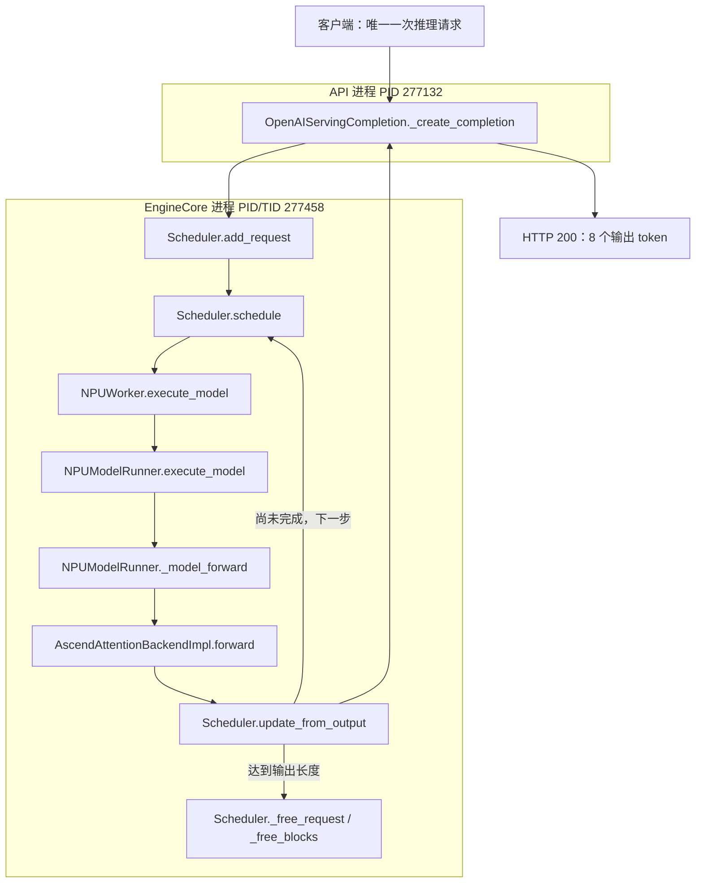

# Practice 07：真实运行结果

日期：2026-09-20。环境为 `ascend910` 上的 Ascend 910B2C、Qwen2.5-0.5B-Instruct。
**已完成真实 HTTP → scheduler → Ascend runner → 模型 attention → 输出 → 清理的追踪。**

成功运行：[2026-09-20-run02/summary.md](results/2026-09-20-run02/summary.md)。
原始证据：[events](results/2026-09-20-run02/events)、
[服务日志](results/2026-09-20-run02/server.log)、
[HTTP 响应](results/2026-09-20-run02/response.json)。

## 1. 实际进程边界



图中 forward 到 scheduler 输出之间包含采样等步骤，箭头表示简化数据流，不表示直接函数调用。
NPU 实际执行位于 Python 调用背后，本图未画设备 kernel 时间线。

此次 executor 是 `UniProcExecutor`。Scheduler、NPUWorker、NPUModelRunner 的事件
在同一个 PID/TID，不能将“模块不同”直接理解成“进程不同”。另有一个 Python resource tracker
辅助进程，不参与上述模型执行步骤。进程证据见 [processes.txt](results/2026-09-20-run02/processes.txt)。

实际 scheduler 对象是 Ascend 的 `BalanceScheduler`，调用记录落在 vLLM 基类的
`Scheduler.schedule`。远端 `patch_balance_schedule.py:71–73` 显示 balance 功能关闭时会
`return super().schedule()`；这与本次进入基类调度函数的观测一致。
相关源码片段及文件指纹保存在 [source_notes.json](results/2026-09-20-run02/source_notes.json)。
这也说明“vLLM 管调度、Ascend 只管算子”不是严格的软件边界，插件还可能扩展调度实现。

## 2. Prefill 和 decode 在实际数据中的区别

实际输入 `The capital of France is` 经 tokenizer 得到 **5 个 token**。
本次请求生成 **8 个 token**，`finish_reason=length`。

| 步骤 | 已计算 token（该步前） | 新处理 token | 模型 input_ids shape | 产出 |
|---|---:|---:|---|---|
| 1 | 0 | 5 | `[5]` | 第 1 个输出 token |
| 2 | 5 | 1 | `[1]` | 第 2 个输出 token |
| 3 | 6 | 1 | `[1]` | 第 3 个输出 token |
| … | … | … | … | … |
| 8 | 11 | 1 | `[1]` | 第 8 个输出 token |

第一步处理整个 prompt，并从最后位置的结果采样出第一个输出 token。
后续每一步把上一步生成的 token 作为新输入，结合已有 KV 继续预测。
所以这里是 **1 个 prefill 步 + 7 个 decode 步**，不是 1 + 8。

清理入口的真实记录是 `computed_tokens=12`、`output_tokens=8`、
`status=FINISHED_LENGTH_CAPPED`。最终逻辑序列有 5+8=13 个 token，
但最后一个输出 token 刚被采样出来，请求就结束了，没有再将它送入下一次 forward；
因此 computed_tokens 是 12。这是后续研究 KV 长度时应注意的区别。

源码 `Scheduler.schedule` 的注释说明，它内部主要根据已计算 token 和待计算 token 的差额调度，
不一定以两个独立的“prefill 函数 / decode 函数”表达这两种工作负载。
这里的阶段分类来自本次 token 数和输入 shape，而非臆造的内部状态字段。

## 3. 真正执行到了 Ascend attention

观测到的模型是 `vllm.model_executor.models.qwen2.Qwen2ForCausalLM`，
不是直接运行 Transformers 的 `generate()`。
实际 backend 是 `vllm_ascend.attention.attention_v1.AscendAttentionBackendImpl`。

第一层 attention：

| 阶段 | Q shape | K shape | dtype / device |
|---|---|---|---|
| 第 1 步 | `[5, 14, 64]` | `[5, 2, 64]` | BF16 / `npu:0` |
| 后续步 | `[1, 14, 64]` | `[1, 2, 64]` | BF16 / `npu:0` |

本次只采集主机可见的 tensor 元数据，没有复制 tensor 内容，也没有设备同步。
这些记录证明模型调用进入 Ascend backend，并使用 NPU tensor；尚未识别具体 kernel 或测量其耗时。

## 4. 第一轮失败及解决

[run01/server.log](results/2026-09-20-run01/server.log) 保留了首次启动失败：

```text
ValueError: No common block size for 16.
```

该轮没有设置 `--block-size`，当前配置的 KV manager 使用 16，而安装的
`AscendAttentionBackend.get_supported_kernel_block_sizes()` 返回 `[128]`。
`select_common_block_size` 未找到兼容大小，因此初始化失败，尚未发送推理请求。

第二轮显式指定 `--block-size 128` 后成功；没有更改依赖或已安装源码。
不能由此推断所有版本或所有 Ascend attention backend 都固定只支持 128。

## 5. 可复现依据与限制

- vLLM 包版本 `0.21.0+empty`，源码 HEAD `ad7125a431e176d4161099480a66f0169609a690`，工作区干净。
- vLLM-Ascend 包版本 `0.21.0rc1`，源码 HEAD `80610e4438dba05011b05f89fc45d91e96992671`；
  存在未跟踪构建目录 `csrc/build_out/`，完整状态保存于环境快照。
- [环境与模型指纹](results/2026-09-20-run02/environment.json)、
  [已观测源码指纹](results/2026-09-20-run02/source_hashes.json)、
  [运行时插桩脚本快照](results/2026-09-20-run02/instrumentation) 已归档。
- HTTP 返回的 `system_fingerprint` 与 Git HEAD 是不同信息，不用前者替代源码版本记录。
- 成功请求没有 trace_error；8 个调度步都有 worker、runner、forward、attention 和 engine output 证据。
- 汇总器用真实归档及人为损坏的副本测试：缺失 attention 证据、错误 step 关联、HTTP token 数不符、
  插桩错误都会被拒绝，避免把不完整日志当作结论。
- Python 返回、scheduler 清理返回均不能证明设备完成或物理内存清零；本轮不作 race 检测结论。
- 输出文本用于验证真实生成链路，不是模型回答质量评估。本次也不是性能测量。
- 实验服务已退出，结束检查中 NPU 无运行中的推理进程。既有设备告警按此前约定未处理。

下一步是 Practice 08：沿着已确认的 runner/attention 路径，记录真实 block table 和 slot mapping。
