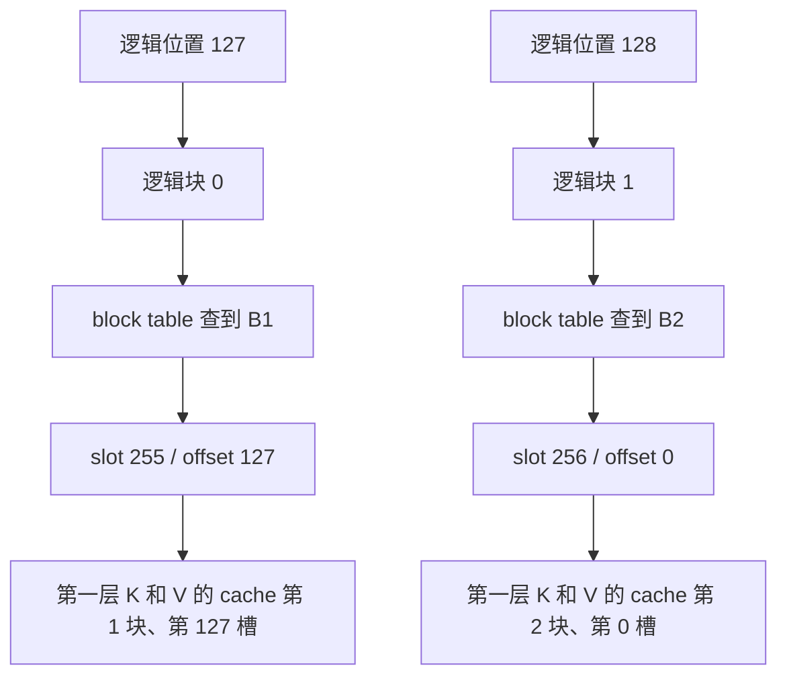

# Practice 08：真实 KV 映射结果

2026-09-22，Ascend 910B2C、Qwen2.5-0.5B-Instruct，单卡 BF16、eager。
真实运行一次请求，输入 **126** 个 token，输出 **8** 个 token；服务正常退出。
本轮直接核对了第一层 **133 个 token 位置**的 KV 写入。

证据：[完整摘要](results/2026-09-22-run01/summary.md)、
[逐 token 映射 CSV](results/2026-09-22-run01/token_mapping.csv)、
[原始事件](results/2026-09-22-run01/events)、[服务日志](results/2026-09-22-run01/server.log)。

## 1. 真实发生的跨块分配

| 调度步 | 本轮 token 位置 | request 的 block table | 新分配块 | 写入 slot |
|---|---|---|---|---|
| 1 | 0～125 | `[1]` | B1 | 128～253 |
| 2 | 126 | `[1]` | 无 | 254 |
| 3 | 127 | `[1]` | 无 | 255 |
| 4 | 128 | `[1, 2]` | B2 | 256 |
| 5～8 | 129～132 | `[1, 2]` | 无 | 257～260 |

关键的两次映射：

```text
token position 127
    logical_block = 127 // 128 = 0
    physical_block = block_table[0] = 1
    offset = 127 % 128 = 127
    slot = 1 * 128 + 127 = 255

token position 128
    logical_block = 128 // 128 = 1
    physical_block = block_table[1] = 2
    offset = 128 % 128 = 0
    slot = 2 * 128 + 0 = 256
```

这里的 255/256 不只是公式计算值。它们也出现在从 **NPU 上读回的 slot_mapping**，
以及实际 KV 写入 adapter 收到的参数中，均与 CPU manager / runner 的映射一致。
本轮分到的 B1/B2 恰好相邻，不代表所有 request 都能获得连续块。



为什么不是从 B0 开始？当前源码 `BlockPool.__init__` 将 block 0 取出作为 null/placeholder block。
源码片段见 [source_notes.json](results/2026-09-22-run01/source_notes.json)。
具体分配 ID 取决于池状态；复现时应核对各层一致性，不将 `[1, 2]` 当成普遍规律。

## 2. 第一层的真实存储布局

本轮 K 和 V 分别具有如下连续 tensor 视图：

```text
shape  = [11781, 128, 2, 64]
          │      │   │   └─ 每个 head 的维度
          │      │   └───── KV head 数
          │      └───────── 每个 block 的 token 槽数
          └──────────────── 池中的 block 槽数（不是 request 的块数）

stride = [16384, 128, 64, 1]   # 以元素为单位
dtype  = bfloat16             # 每元素 2 bytes
device = npu:0
```

一个 token 在这一层的 K 是 `[2,64]`，V 也是 `[2,64]`。
因此一个 token 的 K+V 共 `2 × 2 × 64 × 2 = 512 bytes`；一个 block 的本层 K+V 是 64 KiB。
这些数字只描述这一层，不是整个模型的每 token KV 总量。

新增 B2 前后，cache 的 shape 和 data_ptr 保持相同。本轮的“分配新 block”是选择既有
KV 存储池里的另一个槽，不是为每个新 token 重新扩容整个 tensor。
11781 是本次内存预算下的观测值，其他运行可能不同。

## 3. 不只看地址，还核对了写入后的 K/V

实际进入的 Python adapter 是：

```text
AscendAttentionBackendImpl.reshape_and_cache
    → BaseDeviceAdaptor.reshape_and_cache
    → torch_npu._npu_reshape_and_cache  # 已观测 adapter 的源码调用
```

每步记录 adapter 输入的 `slot_mapping`、新 K/V shape 和目标 cache 视图。
adapter 返回后，诊断回调把该步触及的第一层 cache blocks 复制到 CPU，按 slot 取出对应位置，
再与 adapter 收到的 K/V 输入逐元素比较。

8 个步骤均得到：

```text
key_equal   = true
value_equal = true
```

共检查 `126 + 7 = 133` 个 token 位置，且只检查第一层。
使用的是完整 `[2,64]` K/V 行，结果只保存比较布尔值，不保存完整 K/V 数据。
因此可以确认本次观测的 slot 指向了正确的新 K/V 数据；不推断其他层或所有工作负载都正确。
这里的 Python / torch-npu 调用名不是 NPU kernel profiler 给出的设备 kernel 名称。

## 4. 逻辑序列长 134，为什么只写了 133 个位置？

126 个 prompt token + 8 个输出 token = 134 个逻辑 token。
最后一个输出 token 位于 133，刚采样出来就达到停止条件，没有下一轮 forward。
所以本次已计算并写入 KV 的位置是 0～132，`computed_tokens=133`。
不能把“生成了一个 token”和“已经为这个 token 计算并存入 KV”视为同一个事件。

## 5. 可复现性与结论边界

- [environment.json](results/2026-09-22-run01/environment.json)：版本、Git HEAD/状态、模型指纹。
- [command.json](results/2026-09-22-run01/command.json)：实际命令，关闭 prefix caching、chunked prefill 和 async scheduling。
- [prompt_info.json](results/2026-09-22-run01/prompt_info.json)：`hello` 的 token ID 14990 重复 126 次。
- [instrumentation](results/2026-09-22-run01/instrumentation)：当次追踪脚本快照，包含复用的 Practice 07 代码。
- [source_hashes.json](results/2026-09-22-run01/source_hashes.json)：实际观测入口的源码指纹。
- [device_after.txt](results/2026-09-22-run01/device_after.txt)：服务停止后的设备状态。

本次追踪没有修改 vLLM 源码或 KV 内容，但读取设备索引和数据会引入同步及额外开销。
**这不是性能测试，也不能用于证明原始异步执行不存在 race。**
尚未研究不同 request 的 block 复用、所有层的 KV、prefix sharing、设备 kernel 时间线。
下一步 Practice 09 再研究真实释放和复用。
