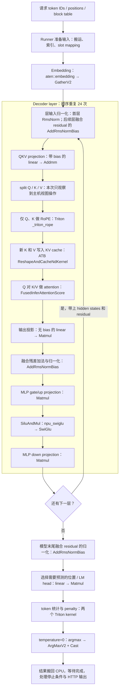
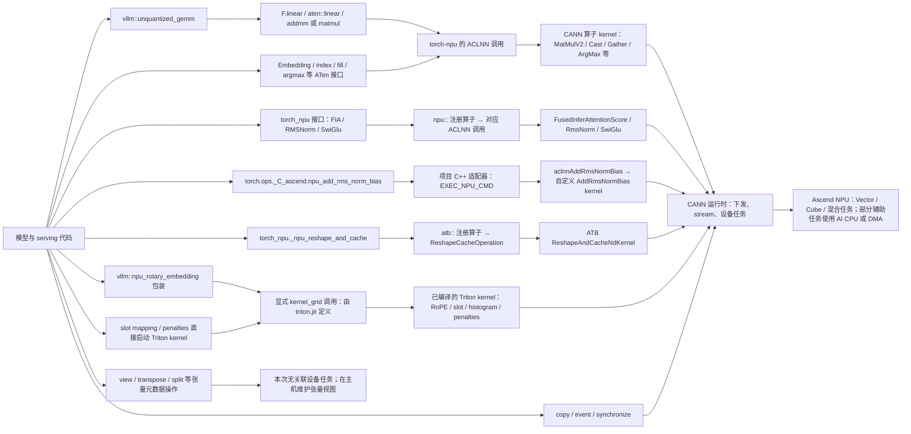
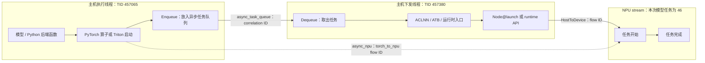

# Practice 09 深化：从模型架构到所有已观测算子的执行路径

这份图覆盖 **本次 Qwen2.5-0.5B、BF16、单卡 eager、126 输入 / 2 输出请求中出现的全部设备任务类型**。
它不是 vLLM-Ascend 全部模型、量化方式、硬件和执行模式的支持清单。

本次扩展复用 run01 的完整 profiler 数据，没有重新跑模型，没有修改原始 trace。
新增的自动分析逐一核对了 **770 个设备任务的两种 flow ID、770 个 CANN connection ID、687 行 kernel CSV、748 对入队/出队事件**。
另有 `PROFILING_ENABLE`、`PROFILING_DISABLE` 两个采集控制标记，不将它们冒充模型算子。

## 图一：模型需要什么计算？

这张图依据当前模型和后端源码画出逻辑计算顺序；trace 核对了相关算子类型和次数。
原始插桩只给第一层 attention 加了细粒度 Python 标签，因此图中的其他模型模块不是新增的逐函数运行日志。
实线表示这里的逻辑先后关系，不表示每个方框只对应一个 kernel，也不表示 GPU/NPU 每步同步。
架构顺序可直接对照 [Qwen2 模型源码](results/2026-09-22-run01/full_analysis/sources/vllm/vllm/model_executor/models/qwen2.py)。



图中的 K/V 写入使用旋转后的 K 和未经过 RoPE 的 V。Attention 同时使用 Q 和可见的 K/V；
prefill 与 decode 的输入布局、历史 KV 使用方式有区别，本次两者均进入 fused attention 路径。
残差并非全部表现为独立 `Add` kernel：实际实现在归一化处将加法融合。

两次 forward 的数量核对：

| 模型计算 | 实际设备 kernel 次数 | 为什么 |
|---|---:|---|
| Embedding | 2 | 每次 forward 一次 |
| 首层不带 residual 的 RMSNorm | 2 | 每次 forward 一次 |
| 带 residual 的 AddRmsNormBias | 96 | 每次有 23 个后续层输入 norm、24 个 post-attention norm、1 个 final norm |
| QKV 投影 Addmm | 48 次 MatMulV2 + 48 次 Cast | 24 层 × 2；一个 Addmm 调用对应两个设备任务 |
| 其余 Matmul | 146 | 每层输出投影、gate/up、down 共 3 次：24 × 2 × 3，再加两次 LM head |
| RoPE / KV 写入 / Attention / SwiGlu | 各 48 | 每层各一次 × 24 层 × 2 |

首层 `[126,14,64]` 的 Q 与 `[126,2,64]` 的 K/V，来自 14 个 Q heads、2 个 KV heads、每 head 64 维。
这是模型结构带来的 shape；block size=128 则属于运行时缓存配置，不能混为同一层的概念。

## 图二：同一个模型怎样混合使用不同实现？

**接口命名空间、kernel 实现技术、运行时下发，是三个不同维度。**
尤其不能仅凭 `vllm::` 就认定底层是项目自写 C++，或仅凭出现 CANN 就排除 Triton。



图中的 Triton 编译属于实现机制；本次 profiler 在预热之后开启，不能把图理解为采集期间观察到了 JIT 编译。
`copy / event / synchronize` 的作用也不相同：copy 可以触发搬运任务，event 建立/记录依赖，synchronize 在主机等待。
它们不能被统一计为“计算 kernel”。

### A. 自定义 Python 接口，底层仍调用普通 ATen

[ops/linear.py][linear] 的 `AscendUnquantizedLinearMethod.apply` 调用：

```python
torch.ops.vllm.unquantized_gemm(x, layer.weight, bias)
```

同文件中的实际实现则是：

```python
def unquantized_gemm(x, weight, bias=None):
    return torch.nn.functional.linear(x, weight, bias)
```

trace 验证了两条链：

```text
vllm::unquantized_gemm → aten::linear → aten::addmm → aclnnAddmm → Cast + MatMulV2
vllm::unquantized_gemm → aten::linear → aten::matmul → aclnnMatmul → MatMulV2
```

不能仅凭名字里有 `gemm` 或 `vllm::`，就断定存在一个叫 GEMM 的独立自定义设备 kernel。

### B. torch-npu 的直接接口

[activation.py][activation] 调用 `torch_npu.npu_swiglu(x)`；
[layernorm.py][norm] 在没有 residual 时调用 `torch_npu.npu_rms_norm(...)`；
[attention_v1.py][attention] 调用 `torch_npu.npu_fused_infer_attention_score(...)`。
这些接口在本次 trace 中分别对应 `SwiGlu`、`RmsNorm`、`FusedInferAttentionScore`。

FIA 的 prefill 路径还关联到 24 次 contiguous 整理 kernel。接口数量、kernel 数量并不相同。

### C. 项目自带的 C++ / Ascend C 自定义算子

[layernorm.py][norm] 在存在 residual 且自定义算子启用时调用：

```python
torch.ops._C_ascend.npu_add_rms_norm_bias(...)
```

[torch_binding.cpp][binding] 将它注册到 `torch::kPrivateUse1`；
[C++ 适配器][normcpp] 再执行：

```cpp
EXEC_NPU_CMD(aclnnAddRmsNormBias, x1, x2, gamma, beta, epsilon, y, rstd, x);
```

trace 中可以对应到 `_C_ascend::npu_add_rms_norm_bias → aclnnAddRmsNormBias → AddRmsNormBias`。
这里才有明确的项目 C++ 适配代码证据。我们没有声称已经分析该 kernel 内部每条设备指令。

### D. ATB 路径

[device_op.py][device] 的 `BaseDeviceAdaptor.reshape_and_cache` 调用 `torch_npu._npu_reshape_and_cache`。
运行记录显示它进入 `atb::_npu_reshape_and_cache → ReshapeCacheOperation → ReshapeAndCacheNdKernel`。
首轮 prefill 的输入整理还触发额外的 Slice kernel；所以这条路径有 72 个计算设备任务，而不是仅 48 个写入 kernel。

### E. Triton：不只是 RoPE

| 用途 | 显式启动位置 | kernel 定义位置 | 本次设备调用数 |
|---|---|---|---:|
| RoPE | [rope.py][rope]：`_triton_rope[(n_row,)](...)` | 同文件 `@triton.jit` | 48 |
| KV slot mapping | [Ascend block_table.py][ascendblock]：`_compute_slot_mapping_kernel[(num_reqs + 1,)](...)` | [vLLM block_table.py][vllmblock] | 2 |
| token 统计/掩码 | [bincount.py][bincount]：`token_bin_counts_and_mask_kernel[(grid_size,)](...)` | 同文件 `@triton.jit` | 3 |
| repetition 等 penalty | [penalty.py][penalty]：`apply_all_penalties_kernel[grid](...)` | 同文件 `@triton.jit` | 2 |

[rotary_embedding.py][rotary] 有明确的 `if HAS_TRITON` 分支；
[sampler.py][sampler] 的 penalties 路径也检查 `HAS_TRITON` 和 `no_penalties`。
因此“选择某种实现”可能发生在不同模块，而不集中在一个全局后端开关里。

本次为何有 penalty？[模型 generation_config.json][genconfig] 默认 `repetition_penalty=1.1`，
[server.log](results/2026-09-22-run01/server.log) 明确记录了默认采样参数覆盖。
请求只把温度改成 0，并没有把 repetition penalty 改回 1。
因此最终是 **penalty 调整 logits 后做 argmax**，不是直接对原始 logits 做 argmax。

[penalties.py][penalties] 将输出 token IDs 搬到设备后，进入统计和 penalty kernel。
首轮尚无生成历史，输出 token 列表为空，[bincount.py][bincount] 的空输入分支直接返回，
因此两步合计 3 次统计 kernel：prefill 的 prompt 一次，decode 的 prompt 和 output 各一次。

### F. 视图、分配、复制和同步

本次 6049 个主机 `cpu_op` 事件，不等于 6049 次设备计算。

- `aten::view`、`aten::as_strided`、`aten::transpose`、`aten::split_with_sizes` 等，本次没有关联到设备任务；这与源码中的张量视图使用一致。
- `empty_tensor`、`aten::empty` 涉及分配；没有 kernel 不等于没有成本。
- `aten::copy_` 在不同上下文可对应 DMA 搬运、Slice 或 Cast kernel，不能仅看接口名就确定执行方式。
- `Event::synchronize` 是等待设备完成；没有它自己的关联 kernel，不代表它不影响延迟。
- 也有主机 tensor 上的操作。对“没有关联设备任务”的事件，分析器不自动断言它是 no-op。

## 图三：调用怎样跨过主机与设备边界？

下面画的是本次 profiler 支持的关系；并非每个设备任务都与一个入队记录一一对应。
748 对入队/出队记录对应 770 个可关联的设备任务，原因之一是一次下发可以产生多个任务。



这三种关联线不是同一件事：第一种连接主机队列两端，第二种连接 CANN 下发与设备任务，第三种连接框架事件与设备任务。
分析器使用同线程区间包含关系恢复主机算子的嵌套；设备关联始终要求显式 flow ID，不采用“时间最接近”推测。
原始 trace 的 CANN/设备 lane 使用合成 PID 分组；它们不是额外启动的操作系统进程。

第一层 KV 写入 kernel 在对应 Python 适配器返回后 51.913 µs 才开始，是这条异步链路的具体例子。
这些带插桩的时间不能当作未插桩运行的性能基准。

## 完整性、证据与阅读顺序

| 独立维度 | 本次数量 | 解释 |
|---|---:|---|
| 主机 cpu_op 事件 | 6049 | 包含嵌套包装和 14 个 P09 注解 |
| 主机事件不同名称 | 106 | 包含上述注解名称，不等于 106 种数学计算 |
| 设备任务 | 772 | 687 个 CSV kernel、79 个搬运、4 个 event、2 个 profiler 控制任务 |
| 不同设备任务名称 | 33 | 全部有分类；控制任务明确独立列出 |
| 同时有两种 host/device flow 的设备任务 | 770 | 每条都核对 host、CANN、device 端点 |
| 核对 CANN connection ID | 770 | 下发事件与设备任务一致 |
| 核对 kernel CSV | 687 | name、task、stream、开始时间及持续时间一致 |
| 核对入队/出队 | 748 对 | flow ID 与两端 correlation ID 一致 |

1. 本文：从架构理解路径。
2. [完整自动汇总][summary]：每种设备任务的名字与计数。
3. [host_operators.csv][hosts]：所有主机接口的次数、直接/间接关联和无关联任务的次数。
4. [device_tasks.csv][tasks]：全部 772 条任务、完整主机祖先链、flow ID、CSV 核验结果。
5. [kernel_examples.json][examples]：33 种设备任务各一个原始证据示例，包含原始事件。
6. [queue_pairs.json][queues]：全部 748 对主机异步队列事件。
7. [source_manifest.json][sources]：24 个源码/模型配置文件的路径和 SHA256；源码快照可直接在本地阅读。

源码快照是在采集后补充收集的，已核对当次记录的仓库 HEAD、已观测源码指纹、所选文件无本地修改，
并核对模型配置指纹。它们解释代码结构，不能替代缺失的运行时函数栈。
`outside_annotated_model` 表示事件不在已标记的 `execute_model` 范围内，包括采样等工作；
本分析不擅自给这些事件附加未观测的 Python scope 或层编号。

这次没有量化、MoE、多卡通信或 graph replay，因此图中不把这些未执行路径标成实测结果。
研究这些形式时，应新建相应工作负载再采集。

[linear]: results/2026-09-22-run01/full_analysis/sources/vllm_ascend/vllm_ascend/ops/linear.py
[activation]: results/2026-09-22-run01/full_analysis/sources/vllm_ascend/vllm_ascend/ops/activation.py
[norm]: results/2026-09-22-run01/full_analysis/sources/vllm_ascend/vllm_ascend/ops/layernorm.py
[attention]: results/2026-09-22-run01/full_analysis/sources/vllm_ascend/vllm_ascend/attention/attention_v1.py
[binding]: results/2026-09-22-run01/full_analysis/sources/vllm_ascend/csrc/torch_binding.cpp
[normcpp]: results/2026-09-22-run01/full_analysis/sources/vllm_ascend/csrc/moe/add_rms_norm_bias/add_rms_norm_bias_torch_adpt.h
[device]: results/2026-09-22-run01/full_analysis/sources/vllm_ascend/vllm_ascend/device/device_op.py
[rope]: results/2026-09-22-run01/full_analysis/sources/vllm_ascend/vllm_ascend/ops/triton/rope.py
[ascendblock]: results/2026-09-22-run01/full_analysis/sources/vllm_ascend/vllm_ascend/worker/block_table.py
[vllmblock]: results/2026-09-22-run01/full_analysis/sources/vllm/vllm/v1/worker/block_table.py
[bincount]: results/2026-09-22-run01/full_analysis/sources/vllm_ascend/vllm_ascend/ops/triton/bincount.py
[penalty]: results/2026-09-22-run01/full_analysis/sources/vllm_ascend/vllm_ascend/ops/triton/penalty.py
[rotary]: results/2026-09-22-run01/full_analysis/sources/vllm_ascend/vllm_ascend/ops/rotary_embedding.py
[sampler]: results/2026-09-22-run01/full_analysis/sources/vllm_ascend/vllm_ascend/sample/sampler.py
[penalties]: results/2026-09-22-run01/full_analysis/sources/vllm_ascend/vllm_ascend/sample/penalties.py
[genconfig]: results/2026-09-22-run01/full_analysis/sources/model/generation_config.json
[summary]: results/2026-09-22-run01/full_analysis/summary.md
[hosts]: results/2026-09-22-run01/full_analysis/host_operators.csv
[tasks]: results/2026-09-22-run01/full_analysis/device_tasks.csv
[examples]: results/2026-09-22-run01/full_analysis/kernel_examples.json
[queues]: results/2026-09-22-run01/full_analysis/queue_pairs.json
[sources]: results/2026-09-22-run01/full_analysis/source_manifest.json
