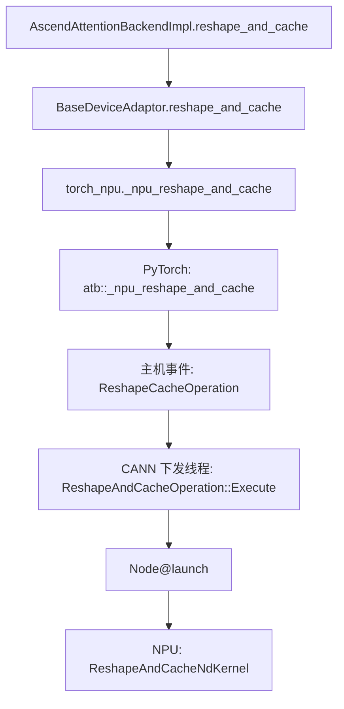

# Practice 09：真实算子调用与 NPU 执行结果

2026-09-22 在远端 Ascend 910B2C 运行完成。单卡 Qwen2.5-0.5B-Instruct，BF16、eager。
先执行一次预热，再采集一个 **126 输入 / 2 输出**的请求；服务正常退出，设备无遗留进程。

**结论：已经将第一层 KV 写入和 attention 的 Python 调用、PyTorch 算子、CANN 下发与实际 NPU kernel 对应起来。**
使用的是 profiler 的关联 ID，并与 kernel CSV 交叉核对，不是根据相似名称猜测。

## 1. 这一次真正执行了什么？

采集请求 ID：`cmpl-practice09-profile-0-9b57ff02`。
预热占用调度步 1、2，采集请求对应步 3、4。

| 阶段 | 本轮处理 token 数 | 第一层 Q shape | 第一层 K/V shape | attention 状态 |
|---|---:|---|---|---|
| prefill，step 3 | 126 | `[126,14,64]` | `[126,2,64]` | `PrefillNoCache` |
| decode，step 4 | 1 | `[1,14,64]` | `[1,2,64]` | `DecodeOnly` |

本次两个阶段都走 `forward_fused_infer_attention`，没有进入 `forward_paged_attention`。
不能因为处于 decode 阶段就认定必然调用名字含 paged 的函数；实际路径取决于版本和配置。
这也不意味着 decode 不使用分页 KV，函数名和缓存组织方式需要分别理解。

## 2. KV 写入链路



`torch_npu._npu_reshape_and_cache` 是 Python 侧使用的接口；本次 profiler 展示的注册算子名称为
`atb::_npu_reshape_and_cache`，设备名称又是 `ReshapeAndCacheNdKernel`。它们位于不同层。

以第一层 prefill 写入为例：

- Python/PyTorch 主线程：进程与线程均为 `457065`。
- CANN 下发线程：`457380`。
- NPU stream：`46`，task：`1339`。
- `async_npu` flow ID：`1790085076511474334`。
- `HostToDevice` flow ID：`7103875907584`。
- CANN `Node@launch` 和设备任务具有相同 `connection_id=1654`。

trace 中为了分组显示而创建的设备/CANN lane PID 不应被当作操作系统进程 PID。

## 3. Attention 链路

```text
AscendAttentionBackendImpl.forward_impl
    → forward_fused_infer_attention
    → torch_npu.npu_fused_infer_attention_score
    → PyTorch: npu::npu_fused_infer_attention_score
    → 主机事件: aclnnFusedInferAttentionScoreV3
    → CANN: AscendCL@aclnnInnerFusedInferAttentionScore
    → Node@launch
    → NPU: FusedInferAttentionScore
```

第一层 prefill attention 的主机调用还关联到一个 `aclnnContiguous_SliceAiCore_Slice` 设备任务，
之后才是 `FusedInferAttentionScore`。这说明一个 PyTorch 算子可能对应多个设备任务。
decode 的同一 PyTorch 算子在本次采集中只关联一个 `FusedInferAttentionScore` 任务。

## 4. Python 返回与设备完成是不同的时刻

下表是第一层的四个核心 kernel，来自本次 profiler 的原始数据。

| 阶段 | Kernel | Task ID | 设备执行时间，µs | 设备开始减去对应 Python 函数返回，µs |
|---|---|---:|---:|---:|
| prefill KV 写入 | `ReshapeAndCacheNdKernel` | 1339 | 10.2605 | +51.913 |
| prefill attention | `FusedInferAttentionScore` | 1341 | 29.401 | +46.967 |
| decode KV 写入 | `ReshapeAndCacheNdKernel` | 1764 | 1.860 | +14.556 |
| decode attention | `FusedInferAttentionScore` | 1765 | 21.041 | −15.979 |

前三行的 kernel 都在相应 Python 注解范围结束后才开始。
最后一行 kernel 在 Python 范围结束前已经开始，但仍在其结束后约 5.062 µs 才执行完。
所以仅观察 Python 函数进入和返回，不能得到设备完成时刻。

这里比较的 Python 范围分别是 `BaseDeviceAdaptor.reshape_and_cache` 和
`AscendAttentionBackendImpl.forward_fused_infer_attention`，不把它们与内部 PyTorch 算子的持续时间混用。
这些是带 profiler 和注解开销的诊断结果，**不作为性能基准，也不证明原始未插桩运行的精确排队时间**。

## 5. 整个模型的观测范围

原始 trace 包含 6049 个 `cpu_op` 事件、772 个设备任务，kernel CSV 包含 687 行。
设备任务包含搬运和事件等，不能将这三个计数视为同一种“算子数量”。

设备 trace 中有 48 次 KV 写入 kernel 和 48 次 attention kernel，对应 24 层 × 2 次 forward。
还实际观测到 `_triton_rope`、MatMul、AddRmsNormBias、SwiGlu 等设备任务。
这表明本次执行涉及多类实现路径，不能将整个 forward 归为同一种算子实现。
本练习详细关联的是第一层 KV 写入与 attention，没有逐个分析其他所有算子的源码。

## 6. 从哪里开始读证据？

1. [summary.md](results/2026-09-22-run01/summary.md)：四条链路的自动校验结果。
2. [operator_links.csv](results/2026-09-22-run01/operator_links.csv)：Python → PyTorch → kernel 名称及关联 ID。
3. [operator_links.json](results/2026-09-22-run01/operator_links.json)：每条链路的原始事件、源码位置、kernel CSV 行。
4. [first_layer_trace.json](results/2026-09-22-run01/first_layer_trace.json)：从完整 trace 筛选的第一层教学时间线，保留原始时间与 flow ID。
5. [source_notes.json](results/2026-09-22-run01/source_notes.json)：远端实际安装的关键函数源码片段与文件 SHA256。

完整原始 profiler、CANN 采集数据、CSV、分析日志和数据库均保存在
[profiler](results/2026-09-22-run01/profiler)；共约 6.5 MB。
可用 MindStudio Insight 导入 `first_layer_trace.json`，搜索 `P09/step=3` 或 `P09/step=4`，
分别展开主机与设备 lane，沿关联线查看调用和执行。

`/stop_profile` 时安装的 profiler 输出了当前状态为 RECORD 的停止提示。
本次仍成功导出；检查器要求两个 forward、14 个注解范围、48 次 KV 写入和 48 次 attention，
并核对四条示例链路的 flow、task、stream、时间与 CSV，均通过。
这些检查支持本练习的结论，不宣称整份采集在所有事件类型上绝对无损。

采集时的脚本保存在 `instrumentation/`。当时 `summarize_profile.py` 仅列出导出文件；
读取真实格式后完成的离线关联分析器另存于 `analysis/`，并在 `analysis_provenance.json` 记录指纹。
没有改写原始采集事件或用后续分析代码替换当时的采集快照。
