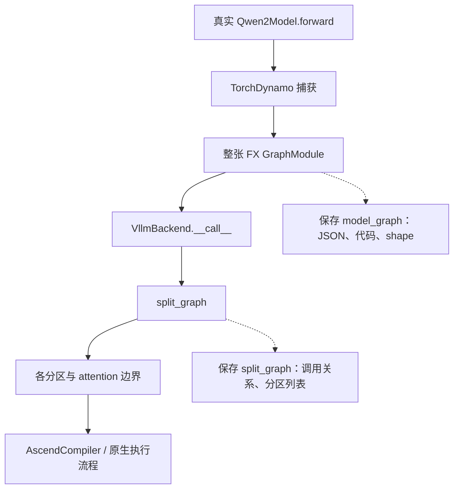

# Practice 10：提取真实模型的计算图

本练习只回答：**真实 vLLM 中，模型 forward 的算子怎样通过 tensor 连接起来？**

模型仍是远端的 Qwen2.5-0.5B-Instruct，使用 Ascend 910B2C、BF16、TP=1。
提取的是 vLLM 实际捕获的 `torch.fx.GraphModule`，不是重新写一个 Transformer 再画图。
结果见 [RESULTS.md](RESULTS.md)。

已归档的阅读入口：

- [第一层计算图 SVG](results/2026-09-23-run02/analysis/first_layer.svg)：直接看 Q/K/V、残差和 attention 输出。
- [交互式节点浏览器](results/2026-09-23-run02/analysis/graph_viewer.html)：本地浏览器打开，可按层查看全部节点。
- [完整 FX forward 代码](results/2026-09-23-run02/graphs/model_graph_529365_1.py.txt)：机器导出的真实计算顺序。

## 先区分三种“图”

| 对象 | 回答的问题 | 本练习怎样观察 |
|---|---|---|
| 模型 FX 计算图 | 哪个算子的输出被哪个算子使用？ | 导出节点、参数、输入边、shape、源码位置 |
| vLLM 分图 | 编译器怎样划分模型？ | 保存 `split_graph` 的输出及各分区的算子列表 |
| NPU Graph | 怎样记录并重放设备任务？ | 本次配置启用 PIECEWISE，但不把 FX 图当作设备任务图 |

Practice 09 的 profiler 回答“调用和执行在什么时候发生”，本练习的 FX 图回答“值怎样流动”。
FX 图中出现一个 attention 节点，不意味着设备只执行一个 kernel。

## 提取方法



`graph_capture.py` 用 `sys.setprofile` 在两个真实函数的调用/返回处读取 GraphModule。
不替换模型、不替换编译器、不修改已安装的 vLLM，也不读取权重或 KV 的数值。
异常会写入 `capture_error`，离线检查会拒绝把这样的结果判为成功。

与 Practice 09 相比，移除 `--enforce-eager`，启用原生 `mode=3`、`PIECEWISE`，
只配置一个设备图捕获尺寸 `[1]`。本版本 Ascend `platform.py` 会在
`cudagraph_mode=NONE` 时把 compilation mode 也设成 NONE，所以这里不能直接沿用 eager。
显式关闭 AOT 和编译磁盘缓存，确保本次真的经过可观察的 Dynamo → VllmBackend 入口。
`custom_ops=["all"]` 保留自定义算子封装。

**图在服务启动的编译/预热阶段产生**，不代表每个 HTTP 请求都会重新生成一张图。
之后发送和 Practice 09 相同的 126 个输入 token、2 个输出 token 请求，确认服务确实可运行。

## 在远端复现

先把整个 practice 目录和已有的 `practice_03_ascend_start/collect_environment.py`
同步到 `/data/tianchi`。本机离线阅读结果不需要安装 torch。

```bash
ssh ascend910
cd /data/tianchi
source /usr/local/Ascend/cann-9.0.0/set_env.sh
export PATH=/usr/local/python3.12.13/bin:$PATH

python practice_10_model_graph/run_graph.py \
  --output practice_10_model_graph/results/my-run

python practice_10_model_graph/analyze_graph.py \
  practice_10_model_graph/results/my-run
```

输出目录必须不存在；端口 8010 必须空闲。runner 只关闭自己创建的服务进程组。
详细命令、环境变量、安装源码快照、日志和响应均写入输出目录。
这是观测实验，不作为性能基准。

## 按这个顺序读代码

1. `run_graph.py`：选择执行配置、启动真实服务、发送请求、关闭服务。
2. `sitecustomize.py`：只在设置 `P10_GRAPH_DIR` 的实验子进程中开启观察。
3. `graph_capture.py` 的 `profile()`：找到编译器实际收到的 graph。
4. `dump_graph()`：把 `graph.graph.nodes` 和 `node.all_input_nodes` 保存为节点与边。
5. `analyze_graph.py`：检查图的完整性，生成第一层图和可浏览的节点数据。

FX 的 `placeholder` 表示图的输入，包括 token、positions、权重或 buffer；
`call_function` / `call_method` 表示计算或 tensor 操作；`output` 表示图的返回值。
一条 `A → B` 边表示 B 的参数引用 A 的结果。包含原地修改的算子还需结合 schema、
节点顺序和框架的副作用约定理解，不能只按纯函数 DAG 解读。

## 证据边界

- 图的范围由 vLLM 选择的编译入口决定；不能把模型主体的图叫成完整 HTTP serving 图。
- 自定义算子可能把 KV 更新、attention 内部计算或 Triton 调用隐藏在一个节点中。
- tensor 的 shape/dtype 属于编译期元数据；不是保存了中间 tensor 的实际数值。
- FX 边不等于 stream/event 同步边，也不能用它判断真实设备执行完成时刻。
- FX 代码文件用于阅读；没有模型权重、运行上下文和编译器环境，不能独立运行。

参考：[PyTorch 的 FX / 自定义 backend 入口](https://docs.pytorch.org/docs/main/user_guide/torch_compiler/torch.compiler_custom_backends.html)、
[vLLM 编译调试说明](https://github.com/vllm-project/vllm/blob/main/docs/design/debug_vllm_compile.md)。
具体行为以本次归档的已安装源码为准。
