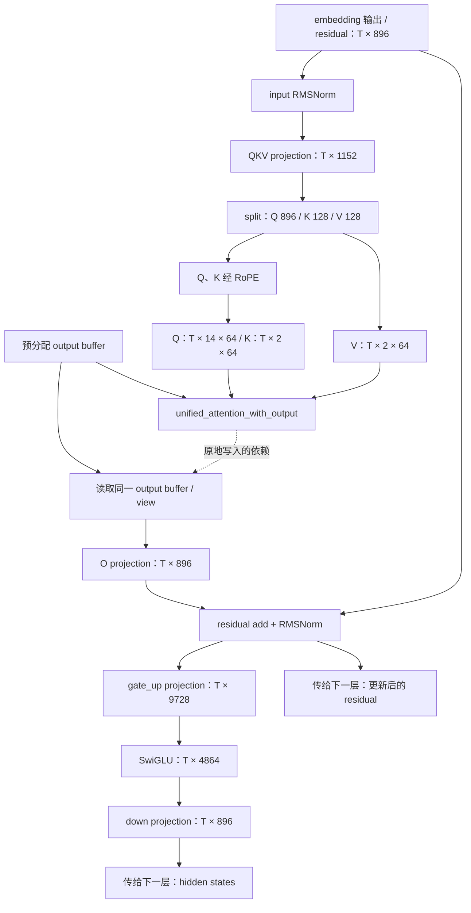

# 实测结果：真实 Qwen2Model 的计算图

2026-09-23 在 `ascend910` 完成，主归档为 `results/2026-09-23-run02/`。
**已经提取真实模型主体的整张 FX 图、vLLM 分图，并验证真实请求使用编译后的执行路径。**

建议先打开 [第一层 SVG](results/2026-09-23-run02/analysis/first_layer.svg)，
再用 [离线节点浏览器](results/2026-09-23-run02/analysis/graph_viewer.html) 沿节点阅读。
HTML 需在本地浏览器打开；GitHub 页面显示的是其源码。

## 1. 实际提取到了什么

| 项目 | 观测结果 |
|---|---|
| 模型主体 | vLLM `Qwen2Model.forward`，24 层 |
| FX 节点 | 852 |
| 普通参数引用边 | 1,087 |
| placeholder | 175：170 个参数 tensor、1 个 RoPE buffer、input_ids、positions、2 个符号尺寸 |
| call_function / call_method | 531 / 145，共 676 个调用节点 |
| output | 1，返回 BF16 NPU hidden states `[s72, 896]` |
| attention 节点 | 24 个 `vllm.unified_attention_with_output` |
| 线性层节点 | 96 个 `vllm.unquantized_gemm`，每层 QKV / O / gate_up / down 四个 |
| RoPE / SwiGLU | 各 24 个 |
| vLLM 分区 | 49：25 个普通分区 + 24 个 attention 边界分区 |

这些是 **FX 节点数，不是 NPU kernel 数**。例如 `getitem` 取 tuple 元素、`view`
调整 tensor 视图；自定义算子则可能在内部执行多个 kernel。

原始证据：

- [整图 JSON：全部节点、参数、依赖、shape、schema、源码栈](results/2026-09-23-run02/graphs/model_graph_529365_1.json)
- [FX 生成的 forward 代码](results/2026-09-23-run02/graphs/model_graph_529365_1.py.txt)
- [带 shape 和源码位置的可读图](results/2026-09-23-run02/graphs/model_graph_529365_1.readable.txt)
- [分图后的代码，包含子图定义](results/2026-09-23-run02/graphs/split_graph_529365.readable.txt)
- [49 个分区的算子列表](results/2026-09-23-run02/graphs/split_graph_529365.partitions.json)
- [机器检查摘要](results/2026-09-23-run02/analysis/summary.json)

`s72` 是 input_ids 长度的符号名，`s80` 是 positions 长度的符号名。
它们不是 token ID、层数或 block ID，也不表示 72 / 80 个 token。
本次实际请求中，两者对应的长度先为 126，随后为 1。符号名称在重新捕获时可以改变。

## 2. 从第一层读懂 tensor 流动

以下是根据实测节点整理的阅读图，省略了权重输入、getitem、部分 view 和残差辅助节点；
完整自动生成图见 SVG。`T` 表示本轮 token 数。



例如，在浏览器中点 `output_parallel_1`：

- target 是 `vllm.unquantized_gemm`，模块位置是第 0 层 `self_attn.qkv_proj`。
- 输入是 RMSNorm 的结果、QKV weight 和 bias。
- 结果 shape 是 `[s72, 1152]`。
- `split` 把它分为 896 / 128 / 128，即 14 个 Q head、2 个 K head、2 个 V head，每个 head 64 维。

这比调用顺序多提供了一层信息：能直接追踪“某个 tensor 是谁生成、谁读取”。

## 3. 为什么 attention 看起来没有输出

实际 schema 中包含：

```text
vllm::unified_attention_with_output(..., Tensor(a3!) output, ...) -> ()
```

`!` 表示该参数会被修改，`-> ()` 表示没有返回 tensor。因此原始 FX 中这个节点
的 `value` 是 None，`users` 为空，但它仍然必须执行。

实际过程是：

```text
output_2 = 预先分配的输出 tensor 的 view
unified_attention_with_output(query, key, value, output_2, layer_name)
attn_output = output_2.view(...)     # 读到 attention 已经写入的内容
```

普通 FX 引用边会同时从 `output_2` 指向 attention 和后续 view；不能仅按返回值连线
推导“attention 没有影响后续计算”。SVG 的 **24 条橙色虚线** 根据真实 schema 和 buffer
使用关系补充这种写入依赖，独立保存在 [mutation_edges.json](results/2026-09-23-run02/analysis/mutation_edges.json)，
没有篡改原始 FX 图。它们也不是 profiler 中的设备同步事件。

安装源码的 `attention.py` 第 706 行定义该操作，第 749 行附近注册
`mutates_args=["output", "output_block_scale"]`，见
[源码快照](results/2026-09-23-run02/sources/vllm/vllm/model_executor/layers/attention/attention.py)。

## 4. KV cache 和 Triton 在哪里

**当前图保留了封装边界。** attention 的显式参数是 Q、K、V、output、layer_name。
其实现通过 `get_attention_context(layer_name)` 获取 KV cache 和 attention metadata，
再调用 backend。physical blocks、slot mapping 和 KV 写入内部流程没有在这张 FX 图中展开；
应结合 Practice 08/09 的证据阅读。

同样，RoPE 在本图中叫 `vllm.npu_rotary_embedding`。它是注册的自定义算子名称，
名称本身不能说明最终执行 CANN 算子还是 Triton kernel。
[归档 rotary_embedding.py](results/2026-09-23-run02/sources/vllm_ascend/vllm_ascend/ops/rotary_embedding.py)
中的 `rope_forward_oot` 仍包含 `HAS_TRITON` 分支。
Practice 09 在 eager 配置下实际看到 `_triton_rope`；本次没有重采 kernel profiler，
因此不把旧配置的 kernel 明细当作这次 graph 配置的实测时间线。

## 5. 整图、分图与 NPU Graph 的关系

本次先在 `VllmBackend.__call__` 入口保存 Dynamo 捕获的整张模型主体图，
然后在 `split_graph` 返回时保存分区。整图覆盖 24 层；49 个分区是后端按
splitting_ops 划分的结果，**不是发生了 49 次 Python graph break**。
本版本的 `torch.compile` 入口配置了 `fullgraph=True`，见
[wrapper.py](results/2026-09-23-run02/sources/vllm/vllm/compilation/wrapper.py)。

分区大致为：

```text
embedding + 第 0 层 QKV/RoPE
→ 第 0 层 attention
→ 第 0 层 O/MLP + 第 1 层 QKV/RoPE
→ 第 1 层 attention
→ ...
→ 第 23 层 attention
→ 第 23 层 O/MLP + 最终 norm
```

所以一个普通分区不一定等于一个 Transformer layer。
图中没有 softmax 展开式，不意味着模型省掉了 attention；它被包含在自定义算子内。

启动配置为 `mode=3`、`cudagraph_mode=PIECEWISE`、`cudagraph_capture_sizes=[1]`。
实际 AscendCompiler 日志还显示 `enable_npugraph_ex=True`、`enable_static_kernel=False`。
这些最终值记录在 [server.log](results/2026-09-23-run02/server.log)，不能只按某段平台源码猜测最终配置。
日志出现设备图捕获及 `Replaying aclgraph`；这证明本次运行确实涉及设备图，
但导出的 852 节点 FX 图位于这些后续编译、优化与设备执行步骤之前，**不是 NPU Graph dump**。

## 6. 图确实用于真实请求了吗

归档事件表明：

1. 服务启动时，runner 用 2048 个 token 做初始 profiling/编译；整图捕获一次。
2. 启动完成后发送固定的 `hello` token ID 14990 × 126，请求输出 2 个 token。
3. 请求时间窗口内恰有两次 model forward：126-token prefill、1-token decode。
4. 两次均进入 `TorchCompileWithNoGuardsWrapper.__call__`，且已有 compiled bytecode。
5. 请求成功，输出文本为 `" syntax,"`，`finish_reason=length`，与 Practice 09 此输入的文本一致。

事件见 [events-529365.jsonl](results/2026-09-23-run02/graphs/events-529365.jsonl)，
时间窗口见 [request_window.json](results/2026-09-23-run02/request_window.json)，
响应见 [response.json](results/2026-09-23-run02/response.json)。时间关联只使用同一远端机器的时钟。
一次文本相同不等于验证所有中间 tensor 数值等价，也不证明性能收益。

这张图在 `Qwen2Model.forward` 的 hidden states 处结束。
`Qwen2ForCausalLM.compute_logits` 和 sampler 在外部继续运行，故图中看不到 LM head、argmax、HTTP 或 scheduler。

## 7. 复核与归档

```bash
# 本地 CPU 即可运行
python3 practice_10_model_graph/analyze_graph.py \
  practice_10_model_graph/results/2026-09-23-run02
python3 -m unittest discover -s practice_10_model_graph -p 'test_*.py' -v

# 如需重新渲染 SVG，需要 Graphviz；归档已经附带 SVG
dot -Tsvg practice_10_model_graph/results/2026-09-23-run02/analysis/first_layer.dot \
  -o practice_10_model_graph/results/2026-09-23-run02/analysis/first_layer.svg
```

检查包括节点/边双向一致性、参数引用拓扑、24 层与 49 分区完整性、attention 可变参数 schema，
以及请求期间确实经过编译路径。损坏输入边、删除 schema 或删除运行证据的负例必须失败。
离线页面也验证了按层过滤、852 节点浏览、节点跳转、原地写入说明和搜索。
6 个测试在本地 Python 3.7.5 与远端 Python 3.12.13 均通过；3 个 Mermaid 图通过语法检查。
远端服务已关闭，NPU 进程列表恢复为空。

`instrumentation/` 是运行时采集脚本快照；`sources/` 是实际安装源码；
`analysis/` 是从原始数据生成的阅读材料；分析脚本另存于 `analysis_tools/`。
本次没有修改安装包。版本与模型指纹见 [environment.json](results/2026-09-23-run02/environment.json)，
源码 commit/指纹见 [source_manifest.json](results/2026-09-23-run02/source_manifest.json)。

归档校验：在仓库根目录运行 `sha256sum -c practice_10_model_graph/SHA256SUMS`。
