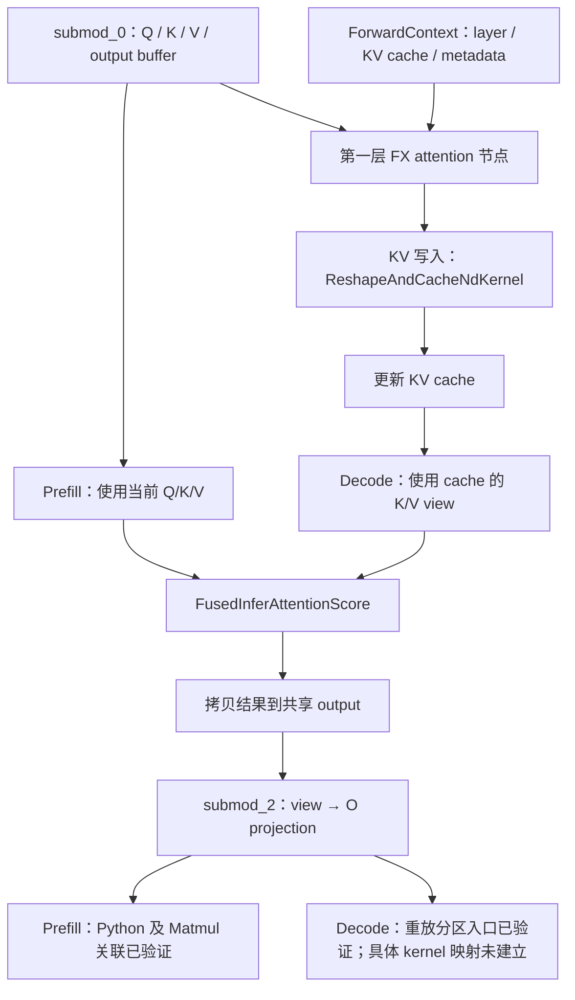

# 实测：一个 FX attention 节点怎样执行

2026-09-23 在 `ascend910` 完成；主归档为 `results/2026-09-23-run02/`。
**第一层 FX attention 已连接到真实输入、KV 存储、输出 buffer，以及设备执行证据。**

阅读入口：

- [交互式对照页面](results/2026-09-23-run02/analysis/attention_viewer.html)：在本地浏览器打开，切换 prefill / decode。
- [Prefill 展开图](results/2026-09-23-run02/analysis/prefill.svg)、[Decode 展开图](results/2026-09-23-run02/analysis/decode.svg)。
- [完整对应关系 JSON](results/2026-09-23-run02/analysis/attention_evidence.json)、[算子关联表](results/2026-09-23-run02/analysis/operator_links.csv)。

## 1. 保留了什么配置

与 Practice 10 一样：Qwen2.5-0.5B-Instruct、910B2C、BF16、TP=1、block size 128，
关闭 prefix caching / chunked prefill / async scheduling，最大并发请求数 1。
编译配置是 `mode=3`、`PIECEWISE`、capture sizes `[1]`、`custom_ops=["all"]`。
禁用磁盘编译缓存与 AOT；实际 AscendCompiler 日志仍显示 `enable_npugraph_ex=True`。

本次增加主机元数据观测和 profiler：先发一次预热请求，再采集一次
`hello` token ID 14990 × 126、输出 2 token 的请求。
请求成功，返回 `" syntax,"`；最后 computed tokens 为 127，输出数为 2。
预热对应调度步 1/2，正式请求为步 3/4。

同一轮重新导出的模型图仍为 **24 层、852 个 FX 节点、49 个分区**。
实际 vLLM / vLLM-Ascend 源码 commit 与 Practice 10 相同，均未修改安装源码。
完整配置、版本和源文件指纹见 [command.json](results/2026-09-23-run02/command.json)、
[environment.json](results/2026-09-23-run02/environment.json)、
[source_manifest.json](results/2026-09-23-run02/source_manifest.json)。

## 2. 追踪的是同一个什么节点

整图中的节点：

```text
name   = unified_attention_with_output
target = vllm.unified_attention_with_output
layer  = model.layers.0.self_attn.attn
args   = query, key, value, output_2, layer_name
return = None；通过原地修改 output_2 交付结果
```

它单独位于 `submod_1`。前面的 `submod_0` 产生 Q、K、V、output buffer 和 residual；
后面的 `submod_2` 以 output buffer 为输入，先做 view，再做第 0 层 O projection，
然后继续 MLP 和下一层的部分计算。

保存了这三个原生分区的真实代码：
[submod_0](results/2026-09-23-run02/graphs/first_layer_submod_0.py.txt)、
[submod_1](results/2026-09-23-run02/graphs/first_layer_submod_1.py.txt)、
[submod_2](results/2026-09-23-run02/graphs/first_layer_submod_2.py.txt)。
这些分区不是我们手动拆出来的；捕获点是原生 `split_graph` 的返回。

## 3. 数据来源在 prefill 与 decode 之间改变

| 观测项 | Prefill，step 3 | Decode，step 4 |
|---|---|---|
| 本轮 token 数 | 126 | 1 |
| Q shape | `[126,14,64]` | `[1,14,64]` |
| 本轮 K/V shape | `[126,2,64]` | `[1,2,64]` |
| attention 状态 | PrefillNoCache | DecodeOnly |
| KV 写入输入 | 本轮 K/V | 本轮 K/V |
| FIA 实际读取的 K/V | 本轮 K/V | KV cache 的 view |
| FIA 的 KV 长度 | 126 | 127 |
| FIA 的 block table | None | `[1,16]` 的 NPU tensor |
| 前后普通分区执行方式 | 编译 callable，runtime mode NONE | PIECEWISE ACL graph replay |

**这里 prefill 的 NONE 只表示没有使用设备图重放，并不是关闭 torch.compile。**
模型已编译；设备图只捕获了 `[1]` 这个尺寸，所以 126-token prefill 走 callable。

第一层 K cache、V cache 各为 `[11761,128,2,64]`，BF16、`npu:0`。
decode 的 FIA 参数把它们视为 `[11761,128,128]`；两种形状的存储指针和 offset 相同，
只是把最后两个维度合并，并没有在本次观测中把 cache 复制成另一份。

KV 来自 `get_attention_context(layer_name)` 返回的真实 layer 对象。
本次该 helper 返回的 `context_slot_mapping` 为 None；Ascend 实际使用的是
`attn_metadata.slot_mapping`，并将其传给 KV 写入操作。
**不能看到相似字段名就假定走的是同一条路径。**

正式请求的 CPU block table 是 `[2]`。根据主机表和逻辑位置推导：

```text
prefill：logical positions 0…125 → 应写入 slots 256…381
decode ：logical position 126   → 应写入 slot 382
```

本实验仅核对传给算子的 NPU slot tensor 的存储、shape、dtype；没有读取其数值。
以上槽号是主机表推导值，不能声称本次已经逐项校验 NPU slot 内容。

## 4. output 的原地写入依赖如何落实

在两个阶段都验证了：

```text
submod_0 返回的 Q/K/V/output
       == 传入第一层 attention 的对应 tensor 存储与视图

attention 入口的 output
       == attention 返回时的 output 存储
       == submod_2 / ACLGraphWrapper 收到的 output_2 存储与视图
```

这里的 `==` 是 pointer、offset、dtype、shape/stride 的对应检查，**不是数据数值比较**。
同一个调用区间内，存储与 offset 的对应关系有意义；不能拿地址跨释放、复用判断对象身份。

还要区分 storage pointer 和 data pointer：本次 decode 的 Q/K/V 共享一个底层 storage，
但 offset 分别为 0 / 896 / 1024 个 BF16 元素，所以 data pointer 不同。
共享存储不等于访问相同元素；判断依赖还需要 offset、shape 和 stride。

| 阶段 | attention output / 后续分区输入的 data pointer | output shape |
|---|---|---|
| Prefill | `20624434586112` | `[126,14,64]` |
| Decode | `20846697515520` | `[1,14,64]` |

prefill 还实际进入了 `unquantized_gemm` 的 Python 实现，记录到 O projection 输入
为 `[126,896]`，与 attention output 共享存储、起始地址和 offset。
这就是 `view` 的效果：变换视图，随后由 O projection 读取其中的数值。

decode 则直接进入 `ACLGraphWrapper` 的重放路径，不再调用分区内部的
`PiecewiseBackend.__call__` / `unquantized_gemm` Python 实现。
因此，decode 的运行时存储检查到达 **重放分区入口**；其中 view → O projection 的关系
由保存的分区代码说明，不能伪造一次不存在的 Python O projection 调用。

## 5. 第一层 attention 内部实际执行了哪些设备任务

以下每个任务都通过真实 `async_npu` 和 `HostToDevice` flow 关联，核对 CANN connection ID。
计算 kernel 还逐条匹配 `kernel_details.csv` 的名称、Task ID、Stream ID、起始时间和 duration；
MEMCPY_ASYNC 是传输任务，不要求它出现在计算 kernel CSV 中。

| 阶段 | 设备任务，按本层实际执行顺序 | Stream / Task |
|---|---|---|
| Prefill | `aclnnInplaceCopy_SliceAiCore_Slice` | 46 / 1485 |
| Prefill | `ReshapeAndCacheNdKernel` | 46 / 1486 |
| Prefill | `aclnnContiguous_SliceAiCore_Slice` | 46 / 1487 |
| Prefill | `FusedInferAttentionScore` | 46 / 1488 |
| Prefill | `MEMCPY_ASYNC` | 46 / 1489 |
| Decode | `ReshapeAndCacheNdKernel` | 46 / 1907 |
| Decode | `FusedInferAttentionScore` | 46 / 1908 |
| Decode | `MEMCPY_ASYNC` | 46 / 1909 |

这说明 **一个 FX attention 节点在本次 prefill 对应 5 个设备任务，decode 对应 3 个**。
两次都验证了 KV 写入 kernel 在同一 stream 上先于 FIA 完成，FIA 随后执行。
末尾拷贝任务位于 FIA 的 Python 范围内；归档源码同时显示将 attention 结果复制到调用者的 output。
前面的布局相关任务不应简单当成独立模型层，也不凭任务名猜测其具体操作了哪块输入内存。

还单独关联了 prefill 的 O projection：`aten::linear` → `aclnnMatmul` →
`aclnnMatmul_MatMulCommon_MatMulV2`，stream 46 / task 1490。
它在设备时间线上位于本层 FIA 之后。

两个 KV 写入 + 两个 FIA + 一个 prefill O projection，共 **5 条重点算子链**；
attention 范围内的完整 **5+3 个任务**另保存在 JSON 的 `attention_tasks` 中。
全请求另观测到 48 个 KV 写入 kernel 和 48 个 FIA kernel，对应 24 层 × 2 次 forward。

简化后的职责与数据关系如下；带实测地址和任务编号的版本见 SVG：



图中 decode 的 Q 仍来自本轮上游计算；KV cache 仅提供 K/V。
这是按源码、元数据和 profiler 整理的展开图，不是底层 attention 的完整数学图。

## 6. 为什么不能给 decode 的每个 kernel 都贴上 FX 节点名

全请求 trace 有 847 个设备任务，计算 kernel CSV 有 687 行；两者统计范围不同。
其中存在 25 个 `MODEL_EXECUTE` 任务，与本轮 25 个普通分区重放相呼应，
但**数量一致本身不能建立逐分区对应关系**。

244 个带有效 Model Id 的设备任务，在本次 trace 中都没有 `async_npu` flow endpoint，
其 `HostToDevice` flow 也找不到对应的主机起点。不能用它们的名字、先后顺序，
或者孤立的 connection ID 强行匹配某个 FX 节点。

保存了 [逐任务关联缺口](results/2026-09-23-run02/analysis/replay_coverage.json)。
这些任务已被观测到在设备执行；缺口是 **FX 节点到重放内部 kernel 的精确关联**。
要进一步补齐，需要研究设备图捕获期记录与重放期 Model/Task 标识的关系。

`server.log` 还保留了 stop profiler 时处于 RECORD 状态的通用告警。
本次通过了所声明的 23 个主机范围、5 条重点算子链和 8 个 attention 内任务的完整性检查；
不能据此声称整个 profiler 捕获了所有可能的事件类型。

## 7. 离线复核与文件位置

```bash
python3 practice_11_attention_execution/analyze_attention.py \
  practice_11_attention_execution/results/2026-09-23-run02
python3 practice_11_attention_execution/render_attention.py \
  practice_11_attention_execution/results/2026-09-23-run02
python3 -m unittest discover -s practice_11_attention_execution -p 'test_*.py' -v
```

分析只用 Python 标准库，兼容本地 Python 3.7 与远端 3.12；重新生成 SVG 需要 Graphviz，
归档已经包含 SVG 和 HTML。节点浏览与阶段切换可以离线使用。

- [主机事件](results/2026-09-23-run02/events/events-542370-542370.jsonl)：存储地址、调用范围、上下文与请求 ID。
- [第一层 profiler 摘录](results/2026-09-23-run02/analysis/first_layer_trace.json)：保留真实时间戳和 flow ID，可用 trace viewer 打开。
- `profiler/`：原始采集文件及工具导出的全量 trace / CSV。
- `instrumentation/`：运行时脚本快照；`analysis_tools/`：离线分析与展示脚本快照。
- `sources/`：实际安装的编译、attention、设备适配等源码。

测试覆盖真实结果，以及错误存储指针、错误 decode K 来源、损坏 flow、缺失范围、错误 Task ID 等负例。
8 个测试在本地 Python 3.7.5 和远端 Python 3.12.13 均通过。离线页面的阶段切换、存储表和
5/3 个任务展示通过检查；SVG 已渲染并检查，文档 Mermaid 通过语法检查。
远端实验服务已关闭，NPU 进程列表恢复为空。
本次观测没有读取 NPU tensor 数值或插入显式同步，不等于没有观测开销；不作为性能或 race 结论。

在仓库根目录执行 `sha256sum -c practice_11_attention_execution/SHA256SUMS` 可复核归档。
