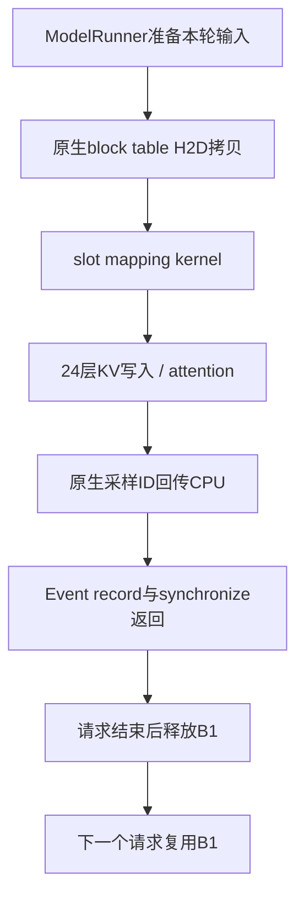

# Practice 12：逐事件 / 逐次 replay 的资源记录

新增真实运行：`2026-09-23-run05-eager-resources`、`2026-09-23-run06-graph-resources`。
两轮使用相同观测脚本、模型、输入和非模式配置；保留旧run02–04作为历史证据。

[对照入口](results/2026-09-23-resource-comparison/index.html) ·
[eager逐事件页面](results/2026-09-23-run05-eager-resources/analysis/resource_viewer.html) ·
[graph逐replay页面](results/2026-09-23-run06-graph-resources/analysis/resource_viewer.html)。
页面完全离线，可按请求、事件、partition或地址筛选。

## 记录的粒度

“事件”有两层，避免把部分Python插桩误认为所有设备行为：

1. **资源观测事件**：allocation/free、准备输入、CpuGpuBuffer拷贝、生成slot mapping、
   model forward、24层attention/KV写入/FIA、采样结果回传、原生event record/synchronize。
   这些边界记录可见tensor的地址、shape、dtype、stride、storage offset及进入/返回状态。
2. **完整profiler事件清单**：本次窗口内每个`cpu_op`和每个设备任务都有记录，包括未关联项。
   未在Python边界观测到的ATen输入/输出地址明确标为未采集，不把外围tensor当作每个算子的精确参数。

Graph另外逐次记录真实`NPUGraph.replay`，其父事件是`ACLGraphWrapper`。
126-token prefill没有设备图重放，仍可从“观测事件”查看准备和编译callable执行。

| 覆盖范围 | eager | PIECEWISE graph |
|---|---:|---:|
| 资源观测范围 | 362 | 512 |
| 实际replay记录 | 0 | 50 |
| 全窗口CPU事件，包含观测范围 | 12432 | 9338 |
| 全窗口设备任务 | 1542 | 1692 |
| 缺少所检查的精确flow关联的设备任务 | 2 | 590 |
| 原生完成边界 | 4 | 4 |
| CpuGpuBuffer拷贝调用 / 零长度调用 | 32 / 4 | 32 / 4 |
| 已核对的slot准备依赖链 | 4 | 4 |
| 各轮forward中地址/布局稳定的权重tensor | 170 | 170 |
| 已核对的KV/FIA链 | 192 | 192 |

这些CPU数量包含插桩开销，不是模型算子总数，也不用于比较速度。

## 每条记录回答什么

`analysis/resource_ledger.json`是完整台账，`resource_summary.json`是覆盖统计。

| 字段 / 数据集 | 含义与边界 |
|---|---|
| `events[].id / parent / host_scope` | 唯一观测范围、主机调用嵌套和profiler时间；返回不等于设备完成 |
| `role / step / phase / host_trace_step` | 请求与执行轮次；保留原始hook step。allocator在schedule返回前执行，按request的computed_tokens显式归入新轮次 |
| `resources / observed_entry / observed_exit` | 可见输入、输出、缓冲区、权重和allocator状态；只记录元数据 |
| `logical_owner` | request、B1及其分配/释放区间；不是框架已有generation |
| `preparation_events` | 同一请求/轮次的真实准备范围；关联轮次不等于已证明每项数据就绪 |
| `direct_device_tasks` | 由真实flow端点建立的直接设备关联；空列表不自动解释为没有执行 |
| `completion_boundary / completion_evidence` | 本轮原生结果等待及其event record发生次序；不伪装成每个kernel都单独等待 |
| `replays[].capture_occurrence` | 进程、wrapper和捕获时刻标识的捕获记录；不只用Python对象ID |
| `resources_before / resources_after / checks` | replay前后资源与捕获快照比较：图、pool、descriptor、输入地址/布局、可见标量、输出存储 |
| `earlier_return_aliases` | 较早返回的同地址资源候选；明确不是最后写入者证明，也不是自动生成的数据依赖 |
| `completion_boundaries` | 原生event对象、每次record/wait、采样tensor、CPU目标和设备传输任务 |
| `preparation_chains` | block table H2D → slot kernel → 24层KV写入的设备顺序证据 |
| `cpu_events / device_tasks` | 原始事件、精确flow端点、CANN connection匹配、缺口；`trace:N`是原始traceEvents数组索引 |

## 已验证的具体链条

每个请求各有prefill和decode，因此每模式4条准备链：

B→C→D核对实际flow、传入的同一存储地址、同一设备stream和任务先后。
D→E→F及释放/再分配沿用原先的192条算子链与原生完成边界检查。
**这是元数据生成顺序的验证；没有读回NPU slot数值，也没有证明每个模型输入值均正确。**

32次CpuGpuBuffer.copy_to_gpu中，4次`n=0`，返回shape=[0]，没有设备任务；
其余28次各有一个精确关联的MEMCPY_ASYNC。这种空操作与缺少证据分开记录。

四轮复用了同一个原生transfer event对象，因此单个event对象ID也不足以表示某次完成。
台账以每次`event_record`范围和对应`synchronize`范围区分发生次序，并核对对象身份一致。
在本版本trace中，profiler的`Event::synchronize`范围包住Python方法观测范围，分析器据此核对嵌套，
不会反过来要求Python范围包住profiler包装层。

## Graph的新发现

启动阶段记录了50次捕获，实测的50次replay对应其中25个捕获基线，A/B各重放25个分区。
实际记录中，不同捕获曾出现相同`id(graph)`；这说明对象ID不是跨生命周期唯一标识。
分析器按同一进程、wrapper、graph以及replay之前最近一次捕获定位基线，再比较资源。
捕获记录标识是分析层观测标识，没有修改框架对象或allocator。

50次replay均通过输入地址、布局、batch descriptor、graph pool及输出存储核对。
这只说明可见资源满足这些条件。图内部workspace、临时存储的完整分配/释放历史没有暴露，
输入内容也没有逐元素读取，`complete_resource_safety`始终是`not_proven`。

本次graph的590个未关联设备任务包括488个带有效Model Id的重放任务、
50个MODEL_EXECUTE、50个NOTIFY_WAIT，以及PROFILING_ENABLE/DISABLE。
其中488个任务已包含NOTIFY_RECORD，不能再重复相加。
**没有把50次主机replay按序号或时间最近强配给50个MODEL_EXECUTE。**
每次replay记录本轮原生完成边界，同时保留其单独设备执行映射的缺口。

## 谁负责保证资源有效

- Scheduler / KVCacheManager / BlockPool负责请求逻辑归属与回收；ref_cnt不是设备访问计数。
- ModelRunner准备、更新输入和映射缓冲区；ACLGraphWrapper依赖这些外部准备工作。
- ACLGraphWrapper选图；torch-npu/CANN负责提交和执行既有依赖。
- 原生stream/event协议提供完成边界；图内存池与存储管理负责设备存储生命周期。

台账能查到这些层的观测证据，但没有新增全局安全检查器。FULL graph、异步调度、并发请求、
prefix sharing、隐藏workspace或逐设备地址的最后访问仍需后续受控实验。

## 代码入口与复核

- `resource_observer.py`：只读tensor/stream/捕获元数据，不保留tensor强引用。
- `lifetime_trace.py`：原生Python调用边界；不替换allocator，不新增wait、event query或设备读回。
- `audit_resources.py`：验证生命周期、构建完整事件清单、核对replay与准备链。
- `render_resources.py`：离线搜索与逐条浏览。
- `test_resources.py`：真实归档加损坏证据测试，包括错误地址/布局/pool/descriptor、event身份不匹配、
  slot生产者地址错误、拷贝长度错误、缺失flow及对象ID复用。

本地Python3.7.5和远端Python3.12.13共33项测试通过；交互页面完成离线、筛选、分页、
模式切换、完成/准备链、链接及移动端检查。运行命令见[README](README.md)。
