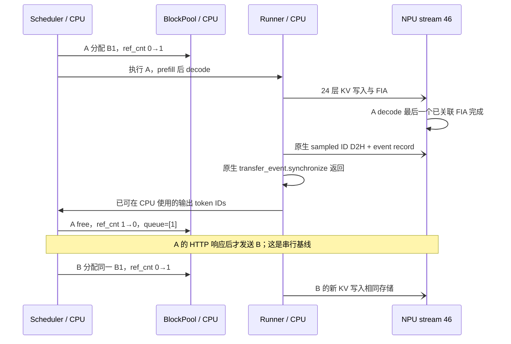

# Practice 12：eager / graph 下的真实 KV 释放与复用

2026-09-23 在同一台 Ascend910B2C 上重新采集匹配对照：
`run03-eager` / `run04-graph`。**两种模式都验证了同一 B1 的释放与复用，
以及24层已观测 KV 访问完成 → 原生结果等待返回 → 释放 → 再分配的顺序。**

- [离线交互对照](results/2026-09-23-mode-comparison/index.html)：切换模式，播放真实生命周期。
- [完整对照表与诊断时间](results/2026-09-23-mode-comparison/comparison.md)、[机器可读结果](results/2026-09-23-mode-comparison/comparison.json)。
- [复现命令及模式开关](README.md)。

## 主对照结果

| 观察 | eager / run03 | graph / run04 |
|---|---|---|
| 模式 | enforce-eager | compile mode=3、PIECEWISE、capture sizes=[1] |
| 126-token prefill | eager | 编译 callable；设备图 runtime NONE |
| 1-token decode | eager | 25个普通分区重放；attention保持直接调用 |
| 可核对的 KV/FIA 设备链 | 192 | 192 |
| A/B 复用物理块、存储层数 | B1、24层 | B1、24层 |
| 原生等待后释放、再分配 | 验证通过 | 验证通过 |
| 主机观测范围 | 310 | 410 |
| 设备任务 / 计算kernel CSV行数 | 1542 / 1374 | 1692 / 1374 |
| MODEL_EXECUTE | 0 | 50 |
| 带有效 Model Id 的任务 | 0 | 488 |
| 上述任务缺少 torch flow / CANN起点 | 0 / 0 | 488 / 488 |

graph 的两个 decode 各进入25个 ACL wrapper；捕获图已存在，未再进入对应 Python 分区 body，
A/B 使用相同的捕获图对象。prefill 各进入25个编译分区 body。设备侧同时观察到50个
MODEL_EXECUTE。这些是实际重放的证据，不只是启动参数声称开启 graph。

**本次 PIECEWISE 没有捕获 attention 分区，所以 KV 写入和 FIA 的192条直接调用链仍然完整。**
488个重放内部任务缺少逐节点关联，不等于本次 KV 生命周期证据缺失；也不能按时间最近
为这些任务补造 FX 归属。FULL graph 或 attention 被捕获时需重新验证。

设备任务增加150，具体为50个 MODEL_EXECUTE、50个 NOTIFY_RECORD、50个 NOTIFY_WAIT；
计算kernel CSV行数相同，部分RoPE任务名变为 `_triton_rope_1`。主机范围多100源于
四步各增加25个 ACL wrapper 观测范围。计数变化不能证明性能提高或建立逐FX节点映射。

比较器验证请求、模型文件指纹、模型配置、安装源码、Python/包环境、观测脚本、profiler
和非模式参数相同。A输出token IDs为19482、11，B为284、536，两种模式一致。
两轮各自验证A/B共用同一存储，不要求不同进程的绝对设备地址相等。

本地Python3.7.5和远端Python3.12.13的19项测试覆盖真实归档，以及以下错误或
证据缺失：捕获图缺失、decode错误声称进入Python body、图对象身份不一致、KV flow缺失、
提前释放、错误block/refcount/存储地址，以及不匹配请求或观测脚本。此处没有新增generation字段。

本实验每模式仅一次带插桩的A/B请求，**不计算加速比**。两种模式均关闭prefix caching、
chunked prefill和async scheduling，结果不推广到并发、共享KV或FULL graph。
没有额外NPU数据读回或设备同步。以下保留旧run02的独立记录；其地址、时间和11项测试
属于历史基线，不与新对照混用。

---

# 历史基线 run02：真实 B1 从 A 释放，再由 B 复用

2026-09-23，远端 `ascend910`；有效归档：`results/2026-09-23-run02/`。
**A、B 实际复用了同一个 B1，24 层的 K/V 存储地址保持一致；本次 A 的最后一次已观测 KV
访问完成后，原生采样结果等待返回，随后释放，B 再次分配并写入。没有观察到这次串行复用发生访问重叠。**

- [交互生命周期页面](results/2026-09-23-run02/analysis/reuse_viewer.html)：本地浏览器打开，逐步查看真实里程碑与各层存储。
- [结构化证据](results/2026-09-23-run02/analysis/reuse_evidence.json)、[192 条算子关联](results/2026-09-23-run02/analysis/operator_links.json)。
- [时间线摘录](results/2026-09-23-run02/analysis/lifetime_trace.json)、[独立 SVG](results/2026-09-23-run02/analysis/lifecycle.svg)。

## 1. 怎样确保真实 allocator 会复用同一块

当前 `BlockPool.get_new_blocks` 从空闲队列头取块，`free_blocks` 将 ref_cnt 归零的非 null 块
放回尾部。普通大池下 A 释放的块不一定马上交给 B。

本次使用原生 `--num-gpu-blocks-override 2`，实际池为：

| 时刻 | B0 | B1 ref_cnt | free queue |
|---|---|---:|---|
| 初始 / 预热结束 | null，保留 | 0 | `[1]` |
| A 分配后 | null，保留 | 1 | `[]` |
| A 释放后 | null，保留 | 0 | `[1]` |
| B 分配后 | null，保留 | 1 | `[]` |
| B 释放后 | null，保留 | 0 | `[1]` |

表中是读取真实 CPU allocator 状态的结果，不是手工模拟的状态机。
B1 的 CPU block 对象身份和 pool 身份在这些边界保持一致。
没有修改 allocator、空闲队列、引用计数，也没有增加 generation 字段。

运行参数还包括 max-model-len=128、max-num-batched-tokens=128、block-size=128、max-num-seqs=1。
A 输入 `hello` 的 ID 14990 ×126；B 输入 `world` 的 ID 14615 ×126；均生成 2 token。
每个请求各执行 prefill(126) + decode(1)，computed=127，逻辑长度128。
A 返回 `" syntax,"`，B 返回 `" = class"`；这些文本只证明生成路径完成，不评价回答质量。

与 P11 的 graph 配置不同，本次回到 eager，关闭 prefix caching、chunked prefill 和 async scheduling，
便于完整追踪所有层的直接调用。A 的 HTTP 响应返回后才发送 B。
这不是一次覆盖并发、prefix sharing 或异步调度的复用测试。

## 2. physical block 对应的设备存储也确实相同

24 层的 K/V cache 都分别为：

```text
shape  = [2, 128, 2, 64]
stride = [16384, 128, 64, 1]
dtype  = bfloat16
device = npu:0
```

分析器检查 A/B × prefill/decode 的所有层 cache 布局、data_ptr、storage_ptr 和 offset 都一致。
例如第 0 层：

| Tensor | 池 data_ptr | B1 第 0 个 token 槽的地址 |
|---|---:|---:|
| K cache | 20624433488384 | 20624433521152 |
| V cache | 20624433554432 | 20624433587200 |

B1 起始地址 = pool base + `stride[0] × element_size` = base + 32768 bytes。
它们是本次进程中的地址，不是跨进程固定地址。

每步 CPU block table 都为 `[1]`；据此推导 prefill 的写入 slot 为128～253，decode 为254。
本次只记录 NPU slot tensor 的地址与布局，**没有读回 slot 数值，也没有逐元素比较 KV 内容**。
设备写入的归属由 CPU 映射、传入的同一 slot tensor / cache 存储和实际写入 kernel 共同建立。
P08 的数值校验是独立证据，不能替代本次没有执行的读回。

decode 的 FIA 接收到上述 cache 的 `[2,128,128]` view，存储地址不变，KV length=127；
prefill 的 FIA 使用当前 K/V、block_table=None。

## 3. 释放前发生了什么

下表全部来自同一 profiler 时间轴，以 A 的 pool allocation 范围起点为0。
取24层已关联 KV 写入与 FIA 中结束最晚者，称为“最后一次已观测 KV 访问”；
这不是通过逐条设备内存指令获取的最后读写地址。

| 事件 | 相对时间 ms |
|---|---:|
| A 分配 B1 完成 | 0.126572 |
| A prefill 最后一次已观测 KV 访问结束 | 40.944444 |
| A prefill 原生结果等待返回 | 43.008625 |
| A decode 最后一次已观测 KV 访问结束 | 81.509326 |
| A decode 采样 ID 的 D2H 完成 | 83.509565 |
| A decode 设备 EVENT_RECORD 完成 | 83.590169 |
| A decode 原生 Event 等待返回 | 83.666628 |
| A 释放 B1 完成 | 84.261380 |
| B 分配同一 B1 完成 | 90.057180 |
| B 首次 KV 写入 kernel 开始 | 94.099569 |
| B decode 最后一次已观测 KV 访问结束 | 169.742233 |
| B decode 原生结果等待返回 | 171.867438 |
| B 释放 B1 完成 | 172.422720 |

A 的最后一次访问为第23层 FIA，stream46 / task2041；B decode 为 task2811。
A 最后一次已观测 KV 访问结束到 pool free **入口**相隔2676.5975 µs；
A pool free **返回**到 B pool allocate **入口**相隔5708.148 µs。
这些是带插桩、串行 HTTP 请求下的诊断时间，不能当作真实 serving 的安全裕量或性能基准。
本地机器与远端墙钟可能有偏差；本分析不混用本地时间戳判断设备顺序。



## 4. 是谁在等设备？并不是 free_blocks 自己

[归档 GPUModelRunner._to_list](results/2026-09-23-run02/sources/vllm/vllm/v1/worker/gpu_model_runner.py)
第7090行附近的原生路径：

```python
pinned = self.sampled_token_ids_pinned_cpu[:sampled_token_ids.shape[0]]
pinned.copy_(sampled_token_ids, non_blocking=True)
self.transfer_event.record()
self.transfer_event.synchronize()
return pinned.tolist()
```

NPUModelRunner 继承这段逻辑。本次实际 `transfer_event` 类型为
`torch_npu.npu.streams.Event`，不是据源码中的 CUDA 注释猜测设备类型。
Ascend runner 的 `_bookkeeping_sync` 在关闭 async scheduling 时调用 `_to_list`。

每个步骤均捕获原生 `_to_list` 范围中的 `Event::synchronize`，以及通过两种 flow 关联的
`MEMCPY_ASYNC` 和 `EVENT_RECORD`。KV/FIA 与采样 ID 传输位于同一 stream46，
已核对 KV访问结束 ≤ D2H开始、D2H结束 ≤ EVENT_RECORD开始、event结束 ≤ 原生等待返回。
随后才进入 `KVCacheManager.free → BlockPool.free_blocks`。

`free_blocks` 的源码做引用计数与空闲队列操作，没有自行等待 NPU。
因此，研究生命周期不能只盯住 free 函数，还要看调用它之前系统已经建立的完成依赖。

**本轮 event 与 KV 计算在 CPU 开始 Event::synchronize 前已经完成。**
我们观察到了原生完成边界，并结合源码解释其作用；不能声称 CPU 实际阻塞了整个 KV 计算时间，
也不能把等待范围的42～47 µs全部解释为“等待 KV”。

## 5. 完整性与复现

- 310 个主机注解范围，进入 / 返回 / profiler 范围逐一对应。
- 24层 × 4次 forward × 2种重点算子 = **192 条 KV/FIA 关联链**。
- 全窗口96个 KV写入 kernel、96个 FIA kernel；另验证4次原生结果传输 / 等待。
- 全窗口1542个设备任务、1374行计算 kernel CSV；总数还包括158个搬运、8个event与2个采集控制标记。
- 所有重点链核对 torch-to-NPU flow、CANN flow、connection ID、task/stream、CSV开始时间和duration。
- 保存 [命令](results/2026-09-23-run02/command.json)、[环境](results/2026-09-23-run02/environment.json)、
  [源码指纹](results/2026-09-23-run02/source_manifest.json)、[脚本快照](results/2026-09-23-run02/instrumentation)
  和 [原始主机记录](results/2026-09-23-run02/events)。
- vLLM源码 `ad7125a431e176d4161099480a66f0169609a690`；
  vLLM-Ascend源码 `80610e4438dba05011b05f89fc45d91e96992671`；所选源码无本地修改。
- 首轮因观测器字段命名冲突被分析器拒绝，不用于结论；见 [排除记录](results/excluded_pilot.json)。
  原始失败归档保留在远端；本地主归档是有效的run02。
- `server.log` 保留 stop profiler 的 RECORD 状态通用告警。已核对本文声明的范围和关联，
  不据此宣称所有事件类型都无遗漏。

见 [README](README.md) 的复现命令。测试覆盖真实结果、错误引用计数、错误块ID、缺少layer、
错误cache地址、缺少flow / 原生wait、提前释放与观测器错误；另检查不提前消费释放迭代器。
实验服务已退出，[NPU结束状态](results/2026-09-23-run02/device_after.txt)无运行中的推理进程。
11项测试在本地Python3.7.5与远端Python3.12.13均通过；交互页面的13个里程碑、24层选择、
播放/暂停、离线链接和窄屏布局通过浏览器检查，SVG已目视检查，Mermaid通过语法检查。
见 [验证记录](results/2026-09-23-run02/validation.json)。
在仓库根目录执行 `sha256sum -c practice_12_kv_block_reuse/SHA256SUMS` 可复核归档。

## 6. 对 Practice 05/06 的推进

之前用 generation 演示：physical identity 可以相同，allocation identity 已经不同。
现在真实看到 B1 的 ref_cnt经历0→1→0→1，物理存储继续存在，所属请求从A换成B。

本轮进一步建立了**这次串行配置下**“设备访问 → 原生完成边界 → 释放 → 复用”的证据链。
尚未验证并发请求、prefix caching共享、设备图重放或开启async scheduling后的复用；
没有故意让A通过旧引用再访问B的块，也没有构建通用的KV lifetime violation detector。
