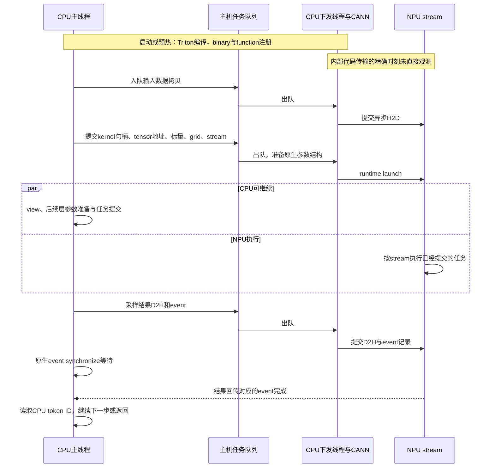

# Practice 13：本次真实运行说明了什么

**CPU下发的是“执行哪个kernel、用哪些地址和参数、放到哪个stream”的任务。NPU稍后执行；CPU可以继续准备后续操作，直到需要结果时再等待。** 编译、注册、下发和执行是四件不同的事。

正式运行：`2026-09-24-run03`。查看[离线交互报告](results/2026-09-24-run03/analysis/index.html)或[完整关联证据](results/2026-09-24-run03/analysis/submission_evidence.json)。

## 实验范围与覆盖

Ascend 910B2C，Qwen2.5-0.5B-Instruct，24层，单卡BF16 eager，原生KV池。prompt为“请简要解释为什么天空是蓝色的。”，10个输入token、4个输出token；先预热，再正式记录1次prefill与3次decode。4个token只用于观测，返回文本“ 天空之所以”，不是答案质量测试。

| 记录 | 本次结果 |
|---|---:|
| 设备任务（含2个profiler控制任务） | 1,446 |
| 同时有PyTorch flow、CANN flow、connection ID及队列关联的推理任务 | 1,444 |
| 已验证的CPU入队/出队对 | 1,422 |
| 正式请求的Triton launcher调用 | 111 |
| Triton compiler调用 / binary注册 | 8 / 8 |
| 编译发生阶段 | 启动1次，预热7次 |
| 正式请求期间新编译 / 新Triton binary注册 | 0 / 0 |
| 正式请求参数与函数观测范围 | 1,146 |
| 采样结果D2H与原生event等待边界 | 4 |

1,444不是计算算子数量：其中有拷贝和event。1,422对队列记录也不必等于kernel数量：一个队列任务可以产生多个设备任务。本次全部1,444个推理任务都在物理stream 46，按设备开始时间排列后，相邻任务没有观测到执行重叠。这不能推广为多个stream的全局顺序保证。

版本与模型指纹见[environment.json](results/2026-09-24-run03/environment.json)，实际命令见[command.json](results/2026-09-24-run03/command.json)。vLLM commit为`ad7125a431e176d4161099480a66f0169609a690`，vLLM-Ascend为`80610e4438dba05011b05f89fc45d91e96992671`；torch-npu 2.10.0，Triton 3.2.0 / triton-ascend 3.2.1，CANN 9.0.0。

## 1. 算子什么时候编译？

这次为Triton指定全新缓存目录，记录了8次真正经过compiler stages的调用。覆盖RoPE、slot mapping、token histogram/mask、sampling penalties四类kernel。编译发生在服务启动和预热阶段，每次约1.03–1.48秒；正式请求直接使用已建立的编译结果和句柄。

这里的8次是编译调用/特化记录，不是8种不同算法，也不保证二进制字节各不相同。归档包括`.ttir`、`.ttadapter`、`.npubin`、metadata，以及本机生成的host launcher `.so`与C++源码。分析器用二进制SHA连接compiler输出和`load_binary`输入，再把正式launch的函数句柄连接到相应初始化记录。

这也解释了：**eager仍然会使用编译好的NPU kernel，Triton仍可能JIT编译；eager不等于“完全不编译”。** 这里没有开启模型的graph捕获/replay。

CANN/ATB路径由已安装的运行库提供。我们记录到调用、部分tiling/运行时API和NPU执行；其二进制的历史构建时间没有出现在本次trace中，不能拿首次调用时间冒充编译时间，也不据此排除库内部初始化。

源码入口：[Triton compiler](results/2026-09-24-run03/sources/packages/triton/compiler/compiler.py)的`compile`与`_init_handles`、[Ascend compiler stages](results/2026-09-24-run03/sources/packages/triton/backends/ascend/compiler.py)的`add_stages`。

## 2. 算子什么时候传给NPU？

当前证据能确定到**交给设备运行时注册**：`load_binary(name, binary, shared, device)`包围了本机原生注册调用。实际源码依次调用`rtDevBinaryRegister`与`rtFunctionRegister`，返回module/function句柄，之后launch复用句柄。

我们记录了这些调用的入口/返回时间、二进制hash和句柄。**没有直接观测到kernel代码的DMA起止、NPU代码缓存驻留时间或底层是否延迟加载。** 因而不能说“load_binary返回的那一微秒就是代码已经拷贝完成的时刻”。

源码：[npu_utils.cpp](results/2026-09-24-run03/sources/packages/triton/backends/ascend/npu_utils.cpp)的`registerKernel`。该源码解释注册机制；JSON时间范围是Python `load_binary`边界，没有伪造每个内部C API的独立时间戳。

## 3. CPU提交什么参数，什么时候提交？

以prefill的第一层RoPE为例，实际Python→launcher边界包括：

| 参数 | 本次值 |
|---|---|
| grid | `(10, 1, 1)` |
| runtime stream handle | `139790334500864` |
| function handle | `139789179999000` |
| Q地址 / shape / dtype | `20624433815040` / `[10,14,64]` / BF16，位于`npu:0` |
| K地址 / shape / dtype | `20624433833472` / `[10,2,64]` / BF16，位于`npu:0` |
| position地址 / shape / dtype | `20624432964096` / `[10]` / INT64，位于`npu:0` |
| runtime标量 | `q_row_stride=896`、`k_row_stride=128`、`num_tokens=10`等 |
| 编译期常量 | `n_qh=14`、`n_kh=2`、`hd=64`、`IS_NEOX_STYLE=True`等 |

这些地址和句柄只属于本次进程；runtime stream handle也不是profiler物理stream ID 46。

生成的[实际RoPE C++ launcher](results/2026-09-24-run03/launcher_sources/f226515bd2e5148e5de3d6c86d2b11afd9a9a93503c7f76c5caf5fccf42efdf3.cpp)展示了两层提交：

1. Python调用launcher时，tensor被取出`data_ptr`，标量被解析；`OpCommand.SetCustomHandler(launch_call).Run()`提交主机任务。
2. 下发线程执行`launch_call`，按ABI组织参数结构体，调用`rtKernelLaunch(func, blockNum, &args, sizeof(args), NULL, stream)`。

运行参数结构体包含地址、标量、grid及内部控制字段。**constexpr在编译时固化，不等于每次全部写入设备参数包。** 这里的tensor参数通常是已在NPU上的数据地址，传地址不等于重新搬运整个tensor。

本次观测记录了Python参数值、C++生成的打包结构、队列和CANN下发时间；没有拦截每次原生ABI结构体的全部字节，也没有直接标定参数包DMA时刻。隐藏workspace/tiling指针不能凭Python记录补造。

其他路径也不是黑箱名称：KV写入记录`atb::_npu_reshape_and_cache`的实际参数；FIA记录`npu::npu_fused_infer_attention_score`的Q/K/V、mask、block table、长度、head数、scale、layout；线性层记录X、weight、bias。

**prefill和decode的参数确实不同。** 本次prefill的FIA直接使用形状`[10,2,64]`的当前K/V，`block_table=None`；第一次decode使用KV池tensor及NPU block table，`actual_seq_lengths_kv=[11]`。不能把所有attention调用都画成相同的缓存读取方式。

## 4. 运行时如何安排任务，执行顺序是什么？

主线程和下发线程是不同的线程。第一层RoPE的真实时间如下；单位µs，以该次CPU入队开始为0：

| 边界 | 开始 | 持续 | 线程/stream |
|---|---:|---:|---|
| PyTorch host算子范围 | -0.234 | 4.365 | CPU TID 639050 |
| CPU Enqueue | 0.000 | 3.502 | CPU TID 639050 |
| 工作线程 Dequeue | 8.326 | 6.724 | CPU TID 639361 |
| CANN `Node@launch` | 9.953 | 2.638 | CPU TID 639361 |
| NPU `_triton_rope` | 23.062 | 4.760 | stream 46，task 2011 |

CPU host算子范围已返回，NPU随后才开始执行。queue correlation ID为1968；关联同时核对两类flow、CANN connection ID和kernel CSV，而不是寻找“时间最近的kernel”。

本机生成的launcher明确报告`Node@launch`并调用`rtKernelLaunch`。其他CANN路径还可见`aclrtLaunchKernelWithHostArgs`等API。报告中的运行时API列表表示同一已验证dequeue范围内的调用；一个dequeue可包含多个kernel，因此不把列表中的每个API都强行与一个kernel一一对应。

注意profiler中CANN和PyTorch的PID是不同命名空间；分析器使用明确的OS线程ID与dequeue范围匹配，未要求这些合成PID相等。不同阶段相同名称也不靠名称猜测身份。

## 5. NPU计算时，CPU在干什么？

第一层prefill FIA执行区间长23.601µs。这个区间内，CPU主线程已有`aten::view`和`aten::as_strided`范围，分别重叠1.721µs和1.540µs；Python仍处于attention/FIA范围内。它展示了CPU继续进行后续主机操作、NPU执行已提交计算的重叠。

没有匹配CPU范围的区间不代表CPU空闲；一个范围覆盖某段时间也不代表CPU一直在执行指令。它可能包含等待和本实验记录开销。这里没有OS `sched_switch`跟踪，所以不给出CPU忙碌百分比。

当CPU需要采样结果时有真正的完成边界。每一步原生`_to_list`路径是：

```text
NPU上的token ID → 非阻塞D2H → event.record()
                                  ↓
                         event.synchronize()
                                  ↓
                          CPU转成Python列表
```

prefill结果源tensor为NPU INT32 `[1,1]`，地址`20624433522176`，CPU目标地址`7696606560256`；对应D2H设备task 2405。分析器核对4步的event对象身份、record/wait/return顺序及D2H结束不晚于等待返回。这里的等待来自vLLM原生代码，不是观察工具增加的同步。

输入侧也分别记录拷贝源/目标。例如prefill准备阶段的一次INT32 `[1,2]`缓冲区复制：CPU地址`7696654794752`→NPU地址`20624433508352`，设备task 1979。复制数据与把该地址作为kernel参数提交，是两个可区分的步骤。

## 完整过程示意

以下是机制示意，不是按比例绘制的时间线；具体间隔以报告内profiler记录为准。



## 怎样使用这些结论

先读报告的一个RoPE例子，区分编译、注册、CPU提交和NPU执行；再对照FIA、KV写入和H2D/D2H。最后看全部任务顺序，理解“一次模型forward”会产生许多不同类型的队列与设备任务。

当前是关闭异步调度的单请求eager基线，不能代替graph replay、并发请求或多stream实验。原始证据、工具快照和校验清单均已归档；复现步骤见[README](README.md)。
