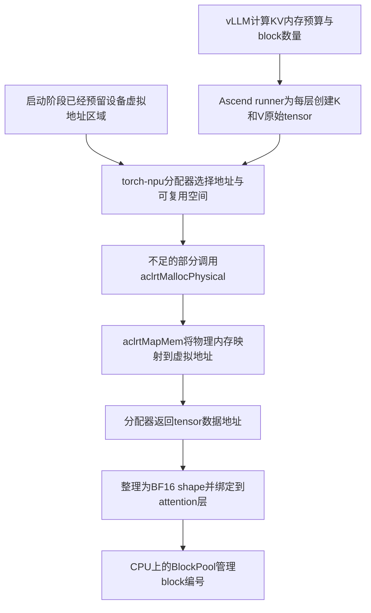

# Practice 14：KV池的实际分配

只研究一件事：**服务初始化时，KV tensor怎样取得NPU内存？**

本次真实运行发现：vLLM-Ascend默认启用了`expandable_segments:True`。KV池复用已预留的设备虚拟地址区域，通过`aclrtMallocPhysical`取得物理内存句柄，再通过`aclrtMapMem`建立映射。**本次KV分配没有走“一张tensor调用一次普通aclrtMalloc”的路径。**

先读[逐步结果](RESULTS.md)，再看[48个K/V存储的分配表](results/2026-09-24-run02/analysis/allocations.csv)。本练习不扩展算子执行、graph对照或并发测试；只启动真实服务到`/health`就绪，然后关闭，不发送业务推理请求。服务自身仍会执行正常的模型加载、内存profiling和预热。

## 观测链



这里有三种不同的“块”：

| 名称 | 本次含义 |
|---|---|
| vLLM KV block | 能容纳128个token的缓存单位，由CPU上的vLLM管理编号 |
| torch-npu allocator block | 为某张tensor提供的存储区间，可能包含分配器对齐余量 |
| CANN物理内存块 | 本次每次申请20MiB，返回句柄，再映射到设备虚拟地址 |

它们不是一一对应关系。尤其是一个KV tensor覆盖许多vLLM block，也可以依靠许多CANN物理内存块提供存储。

## 远端复现

沿用Ascend 910B2C、Qwen2.5-0.5B-Instruct、单卡BF16、eager；KV容量由框架正常计算，不覆盖block数量，不改动allocator策略。

```bash
ssh ascend910
cd /data/tianchi
source /usr/local/Ascend/cann-9.0.0/set_env.sh
export PATH=/usr/local/python3.12.13/bin:$PATH

# 使用一个尚不存在的输出目录。
python practice_14_kv_pool_allocation/run_allocation.py \
  --output practice_14_kv_pool_allocation/results/my-run

python practice_14_kv_pool_allocation/analyze_allocation.py \
  practice_14_kv_pool_allocation/results/my-run
```

默认端口8014，模型路径`/data/huggingface_home/hub/Qwen2.5-0.5B-Instruct`；可通过`--port`、`--model`调整。需要现有的vLLM/Ascend软件栈、GCC及CANN开发头文件。环境采集复用Practice 03的`collect_environment.py`。分析器针对本练习的24层、单卡、可扩展内存段路径核验，遇到不同路径会明确失败。

观测仅对启动的服务进程树生效，不修改已安装库或bashrc。启动器保留原有`LD_PRELOAD`，只在子进程中设置`LD_AUDIT`并增加glibc静态TLS预留，以兼容当前容器的jemalloc。原始设置与实际命令保存在`command.json`。

## 如何读代码

1. [run_allocation.py](run_allocation.py)的`main()`：编译观测库、保存环境与源码、启动服务、等待就绪、关闭服务。
2. [allocation_trace.py](allocation_trace.py)的`TARGETS`和`handle()`：记录预算、配置、48个raw tensor、reshape、实际绑定以及CPU BlockPool。KV分配前后各保存一次torch-npu内存快照。
3. [native_alloc_trace.c](native_alloc_trace.c)：记录torch-npu调用CANN时的API、大小、返回地址或句柄、PID/TID和主机时间。原函数按原参数调用一次，返回值不变。
4. [analyze_allocation.py](analyze_allocation.py)：把tensor地址、allocator记录、物理句柄及映射地址对应起来，核对预算、存储复用与总字节数。

普通`LD_PRELOAD`不能覆盖这里的显式`dlsym(handle, name)`查找，因此使用GNU动态链接器的audit接口；只改写来自torch-npu的指定内存API绑定。分配器历史和原生API记录相互核验，缺记录就拒绝输出成功结论。

## 本地复核，不需要NPU

```bash
python3 practice_14_kv_pool_allocation/analyze_allocation.py \
  practice_14_kv_pool_allocation/results/2026-09-24-run02
python3 -m unittest discover -s practice_14_kv_pool_allocation -p 'test_*.py' -v

cd practice_14_kv_pool_allocation
sha256sum -c SHA256SUMS
```

离线分析仅依赖Python标准库（3.7以上）。8项测试覆盖真实结果，以及句柄错配、漏掉映射、指针错误、预算错误和reshape换存储等反例。

正式归档是`results/2026-09-24-run02/`：`events/`为Python阶段记录，`native/`为实际CANN调用，`allocator_before/after.json`为分配器快照，`sources/`为安装源码快照，`instrumentation/`为采集工具原件，`analysis/`为派生结果。第一轮排除原因见[excluded_pilots.json](excluded_pilots.json)。

本次不读取KV内容、不调用额外的设备同步；`torch.zeros`的清零语义来自实际初始化源码，不声称记录了清零kernel的完成时刻。观测有主机开销，不用于性能比较。证据到达CANN API和分配器层，驱动内部页表操作及HBM物理页地址没有暴露。
