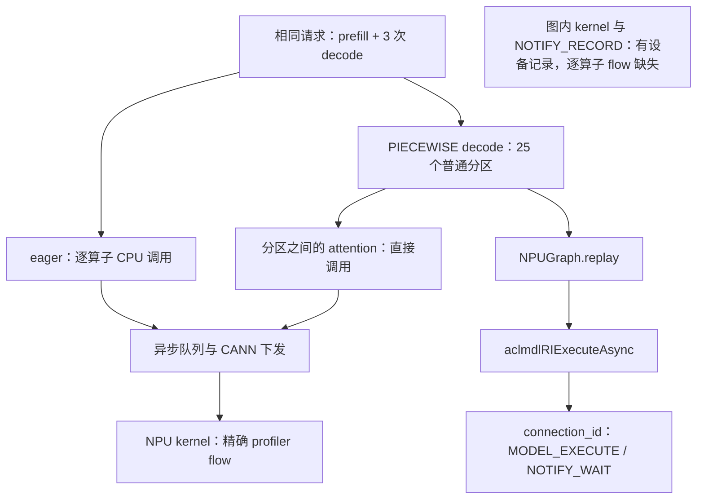

# Practice 15：补充真实 graph 模式执行图

2026-09-28 在同一 Ascend 910B2C 上完成一组新采集：
`2026-09-28-eager-run01` / `2026-09-28-graph-run01`。
目的与原实验一相同：从 CPU 调用出发，追踪运行时下发、NPU 任务、stream 顺序、完成等待和有证据的数据关系。

先打开 [eager / graph 离线对照](results/2026-09-28-mode-comparison/index.html)，
再进入 [graph 执行图](results/2026-09-28-graph-run01/analysis/index.html)。
浏览器底部的 replay 表可逐次查看捕获基线、输入输出元数据和原生下发 API；橙色设备节点表示缺少逐算子的 host flow。
[Markdown 对照表](results/2026-09-28-mode-comparison/comparison.md)与[流程 SVG](results/2026-09-28-mode-comparison/execution_paths.svg)也可直接阅读。

## 精确关联的第一层细节 SVG

每种模式均导出 prefill 与三个 decode 的独立图，共8张：

| 阶段 | eager | PIECEWISE graph |
|---|---|---|
| prefill | [SVG](results/2026-09-28-eager-run01/analysis/first_attention_prefill.svg) | [SVG](results/2026-09-28-graph-run01/analysis/first_attention_prefill.svg) |
| decode-1 | [SVG](results/2026-09-28-eager-run01/analysis/first_attention_decode-1.svg) | [SVG](results/2026-09-28-graph-run01/analysis/first_attention_decode-1.svg) |
| decode-2 | [SVG](results/2026-09-28-eager-run01/analysis/first_attention_decode-2.svg) | [SVG](results/2026-09-28-graph-run01/analysis/first_attention_decode-2.svg) |
| decode-3 | [SVG](results/2026-09-28-eager-run01/analysis/first_attention_decode-3.svg) | [SVG](results/2026-09-28-graph-run01/analysis/first_attention_decode-3.svg) |

这些是从真实执行图提取的局部细节，不是上面的概念流程示意图。
SVG 的执行连线全部来自 `execution_graph.json`，同名 `.json` 保留完整证据与 `original_edge_index`；
同名 `.dot` 保留执行图布局；导出器另外在 SVG 底部附加图例和元数据关联表。边上展示实际 flow ID、queue correlation 或 runtime connection ID。

- eager 及 graph prefill：第一层 RoPE、attention 范围内的拷贝、KV写入和FIA，以及各自CPU/CANN调用链。
- graph decode：第一层attention前后的 `submod_0` / `submod_2` replay、原生execute API、MODEL_EXECUTE / NOTIFY_WAIT，以及KV/FIA直接调用。
- graph decode 另有独立的 **tensor view 元数据关联**面板：前分区返回的Q/K/V/预分配output与attention参数一致，attention output与后分区输入一致，共5组。
  同时核对同进程、同线程、同forward、同step和host调用先后；这些元数据相等关系不表示设备同步、kernel级生产者或完成先后。
  特别是output来自预分配buffer，不能据此声称前一个replay写入了attention结果。
- 每个decode窗口仍有244个图内任务缺少本层/具体replay归属，图内明确注明排除；未按时间临近或相同地址给它们补线。
  跨stream的NOTIFY配对仍未建立，KV池候选边仍用虚线，不改称精确字节依赖。

导出入口为 `export_mode_focus.py`，也已接入 `build_mode_graph.py`。

2026-09-28 随 [Practice 19](../practice_19_kernel_core_usage/README.md) 补充核数标注：
每个精确匹配 CSV 的 kernel 节点保存 `core_usage`，SVG 展示
`Accelerator Core / Block Num / Mix Block Num`。零值显示 unknown / not reported，
不能解释为没有使用计算核。它们也不是 KV 存储块数、物理核 ID 或核利用率。
此次仅重新分析已有 eager / graph 记录，未改动原始采集及其关联缺口。
图较宽，建议直接打开SVG并放大；悬停节点可见记录，旁边JSON适合逐项核查。

## 场景与控制变量

- Qwen2.5-0.5B-Instruct，单卡 TP=1，BF16；同一自然语言 prompt，10 输入 token、4 输出 token。
- max-model-len=256、max-num-seqs=1、block-size=128、gpu-memory-utilization=0.3，原生 KV 池定容。
- 关闭 prefix caching、chunked prefill、async scheduling；每模式一次预热后，只 profile 一个正式请求。
- eager 使用 `--enforce-eager`；graph 使用编译 mode=3、PIECEWISE、capture sizes=[1]、custom_ops=[all]。
- 两次都使用新建的独立 Triton cache；比较器核对模型文件指纹、安装源码、包环境、采集脚本、请求和非模式参数。
- 保留原来 2026-09-24 的 eager 与双 stream 实验。新对照不与旧运行的地址、stream 句柄或时间混用。

两次输出 token IDs 均为 `[40666, 102, 34794, 105133]`，文本为 ` 天空之所以`。
这只验证本次四个采样 token 一致，不是精度评测。

## 最主要的变化：下发粒度变了



这里故意没有把 J 连到某个具体 replay：当前原始 profiler 没有提供它们之间的精确逐任务关联。
图上缺少连线表示证据未建立，不能理解成这些任务在语义上没有依赖。

**10-token prefill 未匹配捕获尺寸1，因此执行编译后的 callable；三个 1-token decode 各发生25次 replay。**
预热与启动阶段记录了8次 Triton 编译和对应二进制注册，正式请求期间两模式都没有新增编译或注册。
这不意味着每次 replay 重新编译或重新上传 kernel，也不表示观测到了精确的代码 DMA 时间。

| 证据 | eager | PIECEWISE graph |
|---|---:|---:|
| 设备任务，不含2个 profiler 控制任务 | 1,444 | 1,669 |
| 计算 kernel CSV 行数 | 1,279 | 1,279 |
| 物理 stream | 1 | 26 |
| 两条精确 host flow 完整的任务 | 1,444 | 787 |
| replay 次数 | 0 | 75 |
| runtime connection 关联的 replay 边界任务 | 0 | 150 |
| 有 Model Id、缺少逐算子 flow 的任务 | 0 | 732 |
| 原生 event 完成 → CPU 等待返回 | 4 | 4 |
| Attention 调用 / KV 与 FIA 直接关联任务 | 96 / 192 | 96 / 192 |
| RoPE 确定 RAW 数据边 | 192 | 48 |
| decode KV 存储候选边 | 144 | 144 |

新增225个设备任务恰好是75个 `MODEL_EXECUTE`、75个 `NOTIFY_RECORD`、75个 `NOTIFY_WAIT`。
72个 decode RoPE 名称由 `_triton_rope` 变为 `_triton_rope_1`。计算 kernel 数量保持一致；这不是性能收益的证明。

## 从一次 replay 能追到哪里

分析器将以下层次分开记录：

1. **Python / 框架层**：哪个分区、哪次 replay、使用哪个 graph 对象；与更早的同进程捕获记录匹配。
   75次均核对输入地址、shape/stride、graph pool 和持久输出存储。对象 ID 配合捕获发生次序使用。
2. **运行时下发层**：同一 CPU 线程的 replay 范围内，存在唯一 `AscendCL@aclmdlRIExecuteAsync`。
   通过真实 `connection_id` 关联一个 `MODEL_EXECUTE` 和一个 `NOTIFY_WAIT`，不要求存在缺失的 profiler flow。
3. **设备图内部**：732个带有效 Model Id 的任务仍有名称、Task Id、物理 stream、起止时间；计算任务均核对 CSV。
   其中657个是计算任务，75个是 `NOTIFY_RECORD`。缺少逐算子 flow，因此没有把它们强行分配给某次 Python replay 或 FX 节点。
4. **请求完成层**：4次采样结果 D2H、event record、原生 `aclrtSynchronizeEvent` 返回核对通过，后续步骤在前次等待之后提交。

图内任务的 prefill/decode 标签只依据原生完成边界之间的设备时间窗口，字段为
`phase_evidence=between_native_completion_boundaries_only`。这不是逐分区或逐 FX 归属证据。
两种模式的图都执行 `validate_dag()`；无环只说明结构自洽，不保证数据依赖完整或不存在 race。

**26条物理 stream 不等于26路计算同时执行。** 主执行 stream 与图内部 stream 有运行时协调；
本实验没有原生 notify 身份配对证据，所以保留 notify 节点，却不按时间相邻伪造跨流同步边。
同 stream 的相邻任务仍逐项验证无重叠并连接顺序边。

Attention 在 PIECEWISE 的捕获分区之外，所以24层 × 4步的 KV 写入与 FIA 仍可直接关联。
decode 的 RoPE 已进入重放，缺少本轮 launcher 参数关联，所以只保留 prefill 的48条确定 RAW 边。
144条 KV 存储候选边仍只证明共用池，未读取实际 slot 值，不能断言精确字节重叠。

## 复现

远端保留 Practice 03、07、09、13 和本目录。采集器只启动和清理自己的服务进程组；输出目录必须不存在。

```bash
cd /data/tianchi
source /usr/local/Ascend/cann-9.0.0/set_env.sh
export PATH=/usr/local/python3.12.13/bin:$PATH

python practice_15_kernel_execution_graph/run_model_modes.py \
  --mode eager --output practice_15_kernel_execution_graph/results/my-eager
python practice_15_kernel_execution_graph/run_model_modes.py \
  --mode graph --output practice_15_kernel_execution_graph/results/my-graph
```

离线证据分析使用 Python 3.7+ 标准库；细节 SVG 导出还需要 Graphviz 的 `dot` 命令。分别重建图，再比较：

```bash
python3 practice_15_kernel_execution_graph/build_mode_graph.py \
  practice_15_kernel_execution_graph/results/my-eager
python3 practice_15_kernel_execution_graph/build_mode_graph.py \
  practice_15_kernel_execution_graph/results/my-graph
python3 practice_15_kernel_execution_graph/compare_model_modes.py \
  --eager practice_15_kernel_execution_graph/results/my-eager \
  --graph practice_15_kernel_execution_graph/results/my-graph \
  --output practice_15_kernel_execution_graph/results/my-comparison
python3 -m unittest discover -s practice_15_kernel_execution_graph -p 'test_*.py' -v
```

`graph_trace.py` 组合 Practice 13 的已有观察器，用 `sys.setprofile` 增加 ACL 分区、捕获和 replay 观测。
不修改已安装 vLLM / torch-npu，不新增设备同步或 tensor 数值读回。
`run_model_modes.py` 是独立入口，没有修改 Practice 13 runner 或其他进行中的实验。

本地归档省略 host `precompiled.h.gch`，其指纹在各 run 的 `unarchived_build_intermediates.json`；
远端原件保留。NPU 二进制、原始 trace / CSV、源码、命令、请求、观察器快照均保留。
对照目录的 `analysis_tools/` 保存本次离线工具及依赖，`SHA256SUMS` 覆盖归档。

这是 PIECEWISE 执行机制与证据覆盖的对照，不是 FULL graph、并发请求、多卡实验或性能基准。

验证：22项自动化测试通过，覆盖原14项及8项模式对照/证据损坏测试；离线浏览器的阶段筛选、75条replay、缺失flow展示、键盘操作和移动端布局检查通过。

细节图新增6项测试：八个局部图的连线来源、未知图内任务排除、错误tensor view、错误forward归属、错误host先后，以及SVG节点/边与JSON一致性。
