# Practice 15 结果：真实 kernel execution graph

2026-09-24 在已有 Ascend 910B2C 上完成两项采集。模型使用 Qwen2.5-0.5B-Instruct、单卡 BF16、eager。
模型运行和控制实验分别分析，没有混合统计。

## 先看模型图

[交互浏览器](results/2026-09-24-model-run01/analysis/index.html) 默认显示 prefill 开始的 24 个任务。
选择 `decode-1` 对比 attention；点击 `_triton_rope`、`ReshapeAndCacheNdKernel` 或 `FusedInferAttentionScore`，
可以看到对应 CPU 算子、队列 correlation ID、CANN 下发以及 tensor 参数。

也可以直接打开 [prefill 第一层 SVG](results/2026-09-24-model-run01/analysis/first_attention_prefill.svg)
和 [decode 第一层 SVG](results/2026-09-24-model-run01/analysis/first_attention_decode-1.svg)。

| 核验项 | 本次结果 |
|---|---:|
| 正式请求 | 输入 10 token，输出 4 token |
| 执行步 | 1 次 prefill + 3 次 decode |
| 关联到 CPU / CANN 的设备任务 | 1,444 |
| 物理 stream | 46，一条 |
| 队列配对 | 1,422；一个队列条目可产生多个设备任务 |
| 全图节点 / 类型化边 | 4,204 / 7,428 |
| 同 stream 相邻执行边 | 1,443 |
| 原生结果 event→CPU 同步返回 | 4 |
| 同步返回→后续步骤主机调用 | 3 |
| 有实际参数支持的 RoPE RAW 边 | 192，涉及 288 个任务 |
| decode K/V 缓存池候选边 | 144 |
| 参数范围 | 723 |
| 直接观察到 runtime stream 句柄的 launcher | 111 |

profiler 另有 2 个控制任务，未计入 1,444 个推理任务。
原始 trace、CSV、队列和编译产物均重新核验，结果见 [summary.json](results/2026-09-24-model-run01/analysis/summary.json)。

本进程中的 Triton raw stream 句柄为 `140572952948736`，通过 111 次唯一 launcher→task 关联映射到物理 stream 46。
句柄数值不是 stream 编号，也不能用于另一次运行。

## 顺序边与数据边回答不同的问题

`RoPE → KV 写入 → FIA` 可以按真实 stream 顺序出现，但不意味着每一对相邻任务之间都有数据传递。

- RoPE 写入的 K view 被 KV 写入读取；RoPE 写入的 Q view 被 FIA 读取。这两条关系由实际 view 元数据和算子语义支撑。
- 无缓存 prefill 的 FIA 直接读取当前 K/V，不能将“前面执行了 KV 写入”解释为它读取了刚写入的 KV 池。
- decode 的 FIA 参数指向 K/V 缓存池。我们确认存储相同，但没有采集这次 slot/block 索引的实际值，因此将 cache→FIA 标为存储级候选关系。

模型图覆盖全部已关联设备任务的 stream 与下发顺序；**全模型逐 kernel 数据依赖仍不完整**。
未观察到的原生 workspace、地址释放/复用和内核内部访问不会被虚构成确定边。
这也是没有按全局地址做“最后写入者”推断的原因。

## 双 stream：验证真正的跨流同步边

打开 [完整小图 SVG](results/2026-09-24-stream-run02/analysis/execution_graph.svg)。

```mermaid
flowchart LR
    A["stream A：y = x + 1"] --> R1["record event，代次 1"]
    R1 --> W1["stream B：wait 代次 1"]
    W1 --> B["z = y × 2"]
    B --> R2["record 同一 event，代次 2"]
    R2 --> W2["stream A：wait 代次 2"]
    W2 --> C["out = z + x"]
    C --> R3["record 同一 event，代次 3"]
    R3 --> H[CPU synchronize 返回]
```

本次实际映射：

| 流 | host `stream_id` | runtime 句柄 | 物理 stream | 设备任务 |
|---|---|---|---|---:|
| A | 96 | 140424008548352 | 44 | 5 |
| B | 97 | 140424008581120 | 43 | 3 |

8 个任务包括 3 个计算 kernel、3 个 `EVENT_RECORD` 和 2 个 `EVENT_WAIT`；计算 kernel 均与 CSV 匹配。
得到 6 条 stream 顺序边、2 条跨 stream event 边、2 条 RAW 数据边和 1 条 CPU 完成等待边。
结果 tensor 全部为 5，真实 NPU 计算校验通过。

同一个 event 句柄对应三个 record 代次。`wait_1` 只依赖第一次 record，`wait_2` 依赖第二次；
仅用句柄构建一个永久 event 节点会丢失这种关系。
host `wait_event()` 返回与设备 `EVENT_WAIT` 完成分别记录；跨流边的语义是 record 完成先于 wait 完成。

这项实验人为构造跨流依赖用于验证图分析器。它没有改变模型运行，也不证明模型应使用多 stream。

## 可复核性与限制

14 项自动化测试通过，包括错误 event 代次、错误 event 句柄、断开 flow、错误 Q 指针、
别名区间误判、同 stream 重叠、资源读写角色错误，以及环/悬空边的拒绝检查。
所有分析产物可按 [README](README.md) 从原始记录离线重建。

模型记录复用 Practice 13 的采集实现，因此注解仍使用 `P13/`，request ID 仍含 `practice13-profile`；
`command.json` 和 `instrumentation/` 保留实际执行信息。这是本次新运行，未将旧 trace 改名作为新采集。

未测试 graph capture/replay、多卡、并发请求或性能收益。真实 kernel execution graph 的“节点和执行顺序覆盖”
与“数据依赖覆盖”分别报告，后者仍需更完整的逐算子访问和存储生命周期观测。
