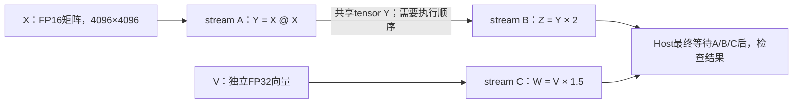

# 三个stream：A生成、B消费，C独立计算

**只删除B对A的等待，最终即使等三条流全部完成，B的结果仍然错误。保留等待时结果正确，独立的C仍能并行执行。**

先看[交互时间线](results/2026-09-24-dependency-run01/analysis/index.html)或[六轮SVG](results/2026-09-24-dependency-run01/analysis/timeline.svg)。本实验补充在Practice 16中，与原单流/双流实验、CPU提前读取实验分别归档。

## 工作负载



- X全部为1/64，A产生的Y应全部为1；B的Z应全部为2。
- V有67,108,864个元素，全部为0.25；C的W应全部为0.375。
- 每轮开始将Y初始化为 **−7**。如果B在A更新前读取Y，就会算出 **−14**。
- A在最终写Y前，先做五次相同矩阵乘法到独立scratch，形成可观测的真实排队工作；C连续执行六次向量乘法。

这五次前置计算是**有意扩大缺少依赖时的观察窗口**。它们不是模型的一部分，也不表示一般负载必然出现同样错误率。两种模式始终执行同样的工作。

依赖关系是单向 **A→B**，没有B→A的循环。C不读写X、scratch、Y或Z；六张基础tensor存储互不重叠，B通过同一个Y对象读取A的输出。

## 唯一切换的地方

核心逻辑如下，完整实现见 [run_dependency.py](run_dependency.py) 的 `trial()`：

```python
with torch.npu.stream(stream_a):
    # 前置矩阵工作省略
    torch.mm(X, X, out=Y)
    a_done.record(stream_a)

with torch.npu.stream(stream_b):
    if mode == "event_wait":
        stream_b.wait_event(a_done)  # no_wait模式只删除这一处
    torch.mul(Y, 2, out=Z)
    b_done.record(stream_b)

with torch.npu.stream(stream_c):
    # 实际重复六次
    torch.mul(V, 1.5, out=W)
    c_done.record(stream_c)

# 两种模式都保留，CPU绝不提前读取结果。
a_done.synchronize()
b_done.synchronize()
c_done.synchronize()
```

`wait_event`返回后Host继续提交C；它约束的是B后续设备工作。三个终点的`synchronize`负责让CPU安全读取最终结果。
初始化同步、最终汇合和所有tensor的存储生命周期都保留，没有提前释放、错误地址或CPU抢读。

## 结果：等待完成不能修复已经算错的数据

无profiler条件下，两种模式交替运行，各重复七次。计时包含计算、事件提交和三条流的最终等待；初始化与正确性检查不计入。

| 策略 | 完整耗时中位数 | 完整耗时范围 | B的最终输出Z | A与C输出 |
|---|---:|---:|---|---|
| 保留A→B event等待 | 5.199781ms | 5.136–5.628ms | 7/7轮全部为2，正确 | 全部正确 |
| 删除A→B event等待 | 5.055410ms | 5.032–5.122ms | 7/7轮全部为−14，错误 | 全部正确 |

每轮对Z的 **16,777,216个元素**统计正确值、旧值和其他值；上述“全部”不是只检查前几个元素。前八个元素额外保存供阅读。
删除等待的路径虽然耗时稍短，但输出错误，不能当作有效性能优化。

错误发生过程是：

```text
Y初始为−7
    ↓
B先读取Y，计算并保存Z=−14
    ↓
A稍后写入Y=1
    ↓
Host等A/B/C全部完成
    ↓
Y已经是1，但Z仍然是−14
```

随后，在最终汇合之后**重新执行一次B**，Z才变成正确的2。此修复步骤位于计时范围外，原始错误统计在修复前保存，没有用修复结果掩盖失败。

与[上一项CPU提前读取实验](SYNC_COMPARISON.md)不同：上次补上等待后，CPU能读到已正确生成的结果；这次B已在设备上基于旧数据算出了错误结果，光等待不会触发重算。

## profiler证明了什么

性能测量之外，另采三组配对trace，共六轮。

| 核验项 | 数量或结果 |
|---|---|
| 物理stream | A=44，B=43，C=42 |
| 正式计算kernel | 78：每轮A六次、B一次、C六次 |
| event record | 18，每轮三个 |
| 跨stream EVENT_WAIT | 3，仅保留等待的三轮存在 |
| Host终点event等待 | 18，所有六轮各等待三条流 |
| 保留等待 | 三轮均为A写Y完成后，B才开始消费 |
| 删除等待 | 三轮均为B已结束，A才开始写Y |

78个计算任务全部匹配CPU flow、CANN flow、connection ID和kernel CSV。event记录与跨流等待关联到实际`aclrtRecordEvent` / `aclrtStreamWaitEvent`，并核对等待使用的event句柄及具体轮次。终点等待关联到实际`aclrtSynchronizeEvent`。

第一组缺少依赖的trace中，B的消费kernel持续 **27.721μs**，在A最终生产kernel开始前已完成。因此这次无需假设“读到了一半新值、一半旧值”：记录显示它完整地跑在新Y生产之前，全部−14与该顺序一致。

独立C没有被一起阻塞。保留依赖的三轮，C在B的设备等待区间内累计计算：

| profiler轮次 | C与B等待区间的交集 | A/C实际计算区间的交集 |
|---|---:|---:|
| trace-00-event_wait | 3.377395ms | 3.377355ms |
| trace-01-event_wait | 3.376135ms | 3.376095ms |
| trace-02-event_wait | 3.419337ms | 3.419297ms |

两列分别计算，**没有把EVENT_WAIT本身计为计算工作**。这些是设备任务区间，不是逐时钟周期的核心利用率。
初始化、校验、修复重算及profiler控制的109个额外设备任务单独保留，不混入78个正式计算任务。

这里的结论是：**必须保留有数据依赖的执行顺序；这种局部依赖并不要求独立分支全局串行。**

## 复现和代码入口

远端目录仍是 `/data/tianchi/practice_16_multistream_parallel`，使用已有torch-npu和CANN，无需模型或新依赖。

```bash
cd /data/tianchi
source /usr/local/Ascend/cann-9.0.0/set_env.sh
export PATH=/usr/local/python3.12.13/bin:$PATH

python practice_16_multistream_parallel/run_dependency.py \
  --output practice_16_multistream_parallel/results/my-dependency-run
python practice_16_multistream_parallel/analyze_dependency.py \
  practice_16_multistream_parallel/results/my-dependency-run
```

默认 `--repeats 7 --profile-repeats 3 --a-steps 6 --c-steps 6`。输出目录必须不存在。不同硬件、负载或Host速度可能使缺少等待的路径偶尔正确；工具会保存实际结果，不强行要求每次都失败。

本地标准库即可重建报告：

```bash
python3 practice_16_multistream_parallel/analyze_dependency.py \
  practice_16_multistream_parallel/results/2026-09-24-dependency-run01
python3 -m unittest discover -s practice_16_multistream_parallel -p 'test_*.py' -v
cd practice_16_multistream_parallel
sha256sum -c SHA256SUMS
```

- [run_dependency.py](run_dependency.py)：三条流、唯一可切换的等待、最终汇合、完整检查与修复重算。
- [analyze_dependency.py](analyze_dependency.py)：验证结果计数、真实flow、event身份、流内顺序、A→B关系与C的重叠区间。
- [render_dependency.py](render_dependency.py)：设备时间线与可点击任务证据。

当前Practice 16共24项离线测试通过，新增8项覆盖实际依赖实验、错误event、错误输入契约、缺最终等待、结果计数伪装、存储别名、缺flow和错误计时。
本轮源码、安装的`streams.py`、实际参数/地址、完整profiler和工具快照均归档。没有执行vLLM请求、KV block复用或抢占，不把这次受控失败率推广为真实服务故障率。

接口语义参考：[torch-npu Stream/Event官方源码](https://github.com/Ascend/pytorch/blob/master/torch_npu/npu/streams.py)。本次判断以归档安装版本和实际设备记录为准。
