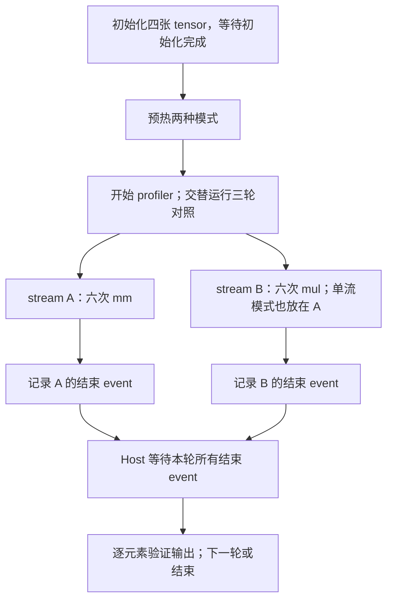

# Practice 16：真实多 stream 算子并行

只回答：**两个独立算子放到不同 stream 后，在 NPU 上是否真的重叠执行？**

已在现有 Ascend 910B2C 上完成三轮匹配对照。双 stream 每轮约有 **3.3ms 的计算区间重叠**；单 stream 对照为零。全部输出校验通过。

先打开[交互时间线](results/2026-09-24-run02/analysis/index.html)，或直接看[六轮 SVG](results/2026-09-24-run02/analysis/timeline.svg)，再读[结果说明](RESULTS.md)。HTML 离线可用，点击 kernel 可查看真实 CPU/CANN flow、物理 stream 和任务编号。

## 与 Practice 15 的区别

Practice 15 的双 stream 控制实验是 `产生 y → 等待 → 消费 y`，有意用 event 将计算串起来。
本练习使用**互不依赖、存储不重叠的两个分支**：

```text
矩阵分支：Y = X @ X        X: FP16 [4096,4096]，全为 1/64，Y 应全为 1
向量分支：W = V * 1.5      V: FP32 [67108864]，全为 0.25，W 应全为 0.375
```

每轮各执行六次。重复使用各自的输出，但同一分支内始终按同一 stream 顺序执行；两个分支使用完全不同的存储。四张 tensor 共 576MiB，全部保留到两条流完成之后。

| 条件 | 单 stream 对照 | 双 stream 实验 |
|---|---|---|
| Host 提交顺序 | mm0、mul0、mm1、mul1…… | 相同 |
| 矩阵乘法 | stream A | stream A |
| 向量乘法 | stream A | stream B |
| 两分支之间的等待 | 同一 stream 自带顺序 | 无跨分支 event wait |
| 轮末完成边界 | 等待 A 的终点 event | 先记录 A/B 两个终点 event，再分别等待 |

选择矩阵乘法与向量乘法，是为了给不同计算资源提供可重叠的工作。实际任务类型分别为 `AI_CORE` 和 `AI_VECTOR_CORE`，不单凭 Python 算子名称推断。没有修改核数限制，也没有添加自定义 kernel。

## 主流程和安全边界



两条分支没有生产者/消费者关系，因此不需要互相等待。初始化后同步一次，确保输入已经可读；每轮结束等待涉及的全部 stream，确保输出校验和下一轮开始时没有旧任务在途。这些等待属于实验设计，不是自动插入的安全检测器。

没有模型、vLLM、图捕获、并发 Host 线程或 KV block 复用。**这是研究真实 NPU 并行机制的独立算子实验，不代表 vLLM 会自动得到同样的并行。**

## 远端复现

目录已同步至 `/data/tianchi/practice_16_multistream_parallel`。使用已有软件栈，无需下载模型或安装依赖。

```bash
ssh ascend910
cd /data/tianchi
source /usr/local/Ascend/cann-9.0.0/set_env.sh
export PATH=/usr/local/python3.12.13/bin:$PATH

# 选择尚不存在的目录；确认设备可用于实验。
python practice_16_multistream_parallel/run_parallel.py \
  --output practice_16_multistream_parallel/results/my-run

python practice_16_multistream_parallel/analyze_parallel.py \
  practice_16_multistream_parallel/results/my-run
```

默认三轮、每分支六次，可用 `--rounds`、`--pairs` 调整；shape 固定，以便集中理解并行。
脚本仅设置本进程的 `allow_internal_format=False`，不改已安装源码、bashrc 或服务配置。
部分 torch-npu 版本该选项只有 setter，归档中原值为 `null` 表示无法读取，不表示原来为 False。

## 本地重建与代码入口

离线分析只依赖 Python 3.7+ 标准库，无需 NPU。

```bash
python3 practice_16_multistream_parallel/analyze_parallel.py \
  practice_16_multistream_parallel/results/2026-09-24-run02
python3 -m unittest discover -s practice_16_multistream_parallel -p 'test_*.py' -v
cd practice_16_multistream_parallel
sha256sum -c SHA256SUMS
```

1. [run_parallel.py](run_parallel.py)：从 `main()` 进入，重点看 `workload()` 中 stream 上下文、两个终点 event 和 `validate()`。
2. [analyze_parallel.py](analyze_parallel.py)：`analyze()` 核验 CPU→CANN→设备的真实 flow 与 CSV；`overlap_metrics()` 计算实际 kernel 区间交集。
3. [render_parallel.py](render_parallel.py)：将真实设备区间绘制为同一比例尺的时间线。

分析器不根据“最近时间”配对，也不把两分支首尾包围的范围重叠当成计算重叠。Epoch 微秒以 Decimal 分析，相减后才转换为绘图坐标。
若复现时双 stream 没有重叠，会如实输出零；不因为创建了两个 stream 就报告并行成功。

正式数据是 `results/2026-09-24-run02/`：包含原始 profiler、设备信息、安装的 `streams.py`、实际采集脚本、参数/地址/主机记录、输出校验和分析工具快照。
试跑与早期启动失败的排除原因见 [excluded_pilots.json](excluded_pilots.json)。

接口语义参考：[torch-npu Stream/Event 官方源码](https://github.com/Ascend/pytorch/blob/master/torch_npu/npu/streams.py)。本次以归档的已安装版本与实际 profiler 为证据，不以 latest 源码代替运行版本。
