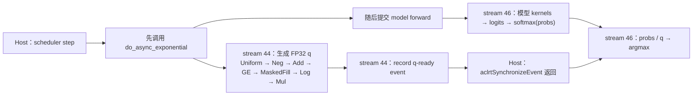
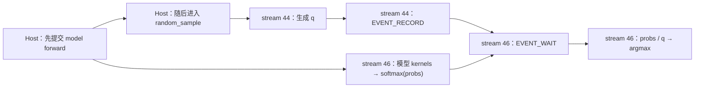

# Practice 17：真实 vLLM 请求触发的多 stream kernel execution graph

这次不再使用独立算子模拟，而是在 **vLLM-Ascend 真实请求**中找到可重复的多 stream 路径：随机采样所需的指数随机张量 `q` 在物理 stream 44 上生成，模型 forward 与采样主体在物理 stream 46 上执行。

两个本地模型都能形成设备计算重叠：

- Qwen2.5-0.5B-Instruct：batch 32、请求不设置独立 seed、`enable_async_exponential=true` 时，5 个 scheduler step 中 4 个重叠，共 **105.385μs**。
- Llama-3.2-1B-Instruct：batch 64 使用同一路径，5 个 step 中 4 个重叠，共 **1082.181μs**。batch 32 的阈值对照为零重叠。

先读[完整结果](RESULTS.md)和[跨 run 对照 JSON](results/comparison.json)。仓库保留六组 `analysis/summary.json`；完整证据包中的 `analysis/execution_graph.json` 是逐设备任务图，可由压缩 trace 与 kernel CSV 离线重建。完整包保留在实验工作区和远端，不随公开提交上传。

## 最终图是什么

`enable_async_exponential=true` 时，每个 engine step 折叠后是下面的 fork/join 图：



图中有两类真正的数据依赖：模型分支产生 `probs`，随机分支产生 `q`，两者都被 `div → argmax` 消费。观测器逐 step 核对 `q` 的 shape、dtype、data pointer、storage pointer 和 event handle；生产端与消费端完全一致。

关闭该开关时，仍不是单 stream。普通 `random_sample` 也在 stream 44 上生成 `q`，区别是 Host 先提交模型，再提交随机分支，并在 stream 46 插入设备侧 event wait：



因此，“两条物理 stream”“设备计算重叠”和“启用提前随机数分支”是三个不同事实。Qwen batch 32 的关闭组没有重叠；Llama batch 64 的关闭组在较大的混合 prefill step 中仍与模型尾部重叠 1052.263μs，但其余 4 个 step 为零。开启组把随机分支移到模型前面提交，4 个满批 step 都发生重叠。

## 图中保存什么

每个 device-task 节点保存：

- task 名、类型、物理 stream、Task ID、起止时间；
- PyTorch host operator、CANN API、两段真实 flow ID 与 connection ID；
- 所属 engine step 和 Python scope；
- 对应 `kernel_details.csv` 行。

边分为：

| 边 | 含义 |
|---|---|
| `stream_order` | 同一物理 stream 上相邻的已观测任务顺序 |
| `event_wait` | 关闭组中 stream 44 record 到 stream 46 wait 的设备依赖 |
| `event_sync` | 开启组中 q-ready record 到 Host event 同步返回 |
| `host_after_wait` | Host 同步返回后才提交消费 `q` 的采样 kernel |
| `data_contract` | 同一 `q` 存储从生产分支传到 `div/argmax` 消费路径 |

`stream_order` 只表示 stream 顺序，不自动等于 tensor 依赖。重叠量是两组真实 compute-task 区间集合的交集；不把 event、copy 或两分支的外包络区间算成计算重叠，也不等同于指令级核心占用率或吞吐收益。

## 怎样触发

必要条件不是模型类型，而是采样和负载形态：

1. 使用随机采样，当前实验为 `temperature=0.8, top_p=0.9`。
2. 通过 `--additional-config '{"enable_async_exponential": true}'` 让 runner 在 model forward 前预生成 `q`。
3. 提供足够大的活跃 batch，使 `[batch, vocab]` 随机分支持续到模型 kernel 开始。
4. 不在每个请求上设置独立 seed。本脚本用服务器级 `--seed 123` 保持环境固定；若请求级 generator 数等于 batch，sampler 会逐行投递随机 kernel。本次 Qwen 校准组每个满批 step 从 7 个变为 224 个随机计算任务，但设备在慢速 Host 投递期间已经逐行完成，最终仍为零重叠。

单请求、Qwen 请求级 seed、Llama batch 32 都证明：创建了第二条 stream 或打开配置，不保证时间上必然重叠。

## 与 Practice 15/16 的关系

- Practice 15 的模型请求主要呈现单条模型 stream；独立双 stream probe 用来验证建图方法。
- Practice 16 用人工独立算子证明 NPU 可以并行，并研究正确/错误的数据依赖。
- Practice 17 找到同一个 vLLM engine step 内真实存在的第二计算分支，并把它的 stream、event、数据对象和执行顺序接回模型推理。

这不是把两个独立实验拼到一起。stream 44 的随机张量最终由同一步的 sampler 消费，生产和消费 tensor 身份已逐项匹配。

## 远端复现

使用已有 CANN、torch-npu、vLLM 和本地模型，无需下载：

```bash
cd /data/tianchi
source /usr/local/Ascend/cann-9.0.0/set_env.sh
export PATH=/usr/local/python3.12.13/bin:$PATH

# Qwen：batch 32 已观测到 4/5 step 重叠
python practice_17_vllm_multistream/run_vllm.py \
  --model /data/huggingface_home/hub/Qwen2.5-0.5B-Instruct \
  --mode enabled --batch-size 32 --port 8017 \
  --output practice_17_vllm_multistream/results/my-qwen-enabled

# Llama：batch 64 已观测到 4/5 step 重叠
python practice_17_vllm_multistream/run_vllm.py \
  --model /data/huggingface_home/hub/Llama-3.2-1B-Instruct \
  --mode enabled --batch-size 64 --port 8019 \
  --output practice_17_vllm_multistream/results/my-llama-enabled

python practice_17_vllm_multistream/analyze_run.py \
  practice_17_vllm_multistream/results/my-qwen-enabled
```

输出目录必须不存在，端口必须空闲。runner 固定 TP=1、BF16、eager，关闭 prefix caching、chunked prefill 和 async scheduling，以隔离 sampler stream。它先预热同形状请求，再只 profile 一次正式批量请求，最后只终止自己创建的服务进程组。

## 本地离线验证

完整证据包中的 `trace_view.json.gz` 是原始 trace 的无损压缩；分析器直接支持 gzip。证据包存在时，无需 NPU、torch 或网络即可重建：

```bash
python3 practice_17_vllm_multistream/verify_results.py \
  practice_17_vllm_multistream/results

python3 practice_17_vllm_multistream/build_comparison.py \
  practice_17_vllm_multistream/results

python3 -m unittest discover -s practice_17_vllm_multistream -p 'test_*.py' -v
cd practice_17_vllm_multistream
sha256sum -c SHA256SUMS
```

`verify_results.py` 先核对证据包每个文件及解压后原始 trace 的 SHA-256，再从 profiler flow 与 kernel CSV 重建全部六张图，并要求重建摘要与归档摘要完全一致。公开 clone 没有完整证据包时，测试仍核对六组发布摘要与跨 run 对照；证据重建项会跳过。

源码入口：

- [run_vllm.py](run_vllm.py)：启动真实服务、发送批量请求和控制 profiler。
- [multistream_trace.py](multistream_trace.py)：无设备同步的 Python scope/tensor 身份观测。
- [analyze_run.py](analyze_run.py)：flow、CSV、stream、event、tensor 与重叠分析。
- [build_comparison.py](build_comparison.py)：生成六组对照汇总。
- [excluded_pilots.json](excluded_pilots.json)：排除的早期观测窗口及保留校准组原因。

完整证据包为每个 run 保存安装版本源码。配置默认值和限制来自 `ascend_config.py`，实际提前分支来自 `worker/model_runner_v1.py`，两种采样汇合路径来自 `sample/sampler.py`；`collect_sources.py` 会在复现时重新归档这些文件。结论以本次归档源码和设备 trace 为准。
