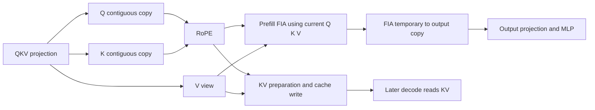

# 2026-09-28：全模型 kernel 依赖分析结果

正式结果使用 `results/2026-09-28-run04`，模型是 Qwen2.5-0.5B-Instruct，单卡 eager，
单请求、10 个 prompt token、4 个输出 token。四轮真实采集后，新增输入观测与
Practice 15 基线的逐阶段设备任务清单、响应 usage 和生成文本均一致。

已经得到完整设备任务清单、公开 tensor 依赖投影、关键路径、条件并行度和离线
stream/event 方案。**尚未得到完整精确的原生逐 kernel 数据依赖 DAG**：native
workspace 和内部缓冲生命周期仍缺失，因此没有实机自动改流，也没有实测加速结论。

打开[交互图](report/index.html)，查看[机器可读汇总](report/summary.json)和
[验证记录](report/validation.json)。

## 覆盖与完整性

| 项目 | 正式采集 |
|---|---:|
| 设备任务 | 1,444 |
| forward 设备任务 | 1,260 |
| prefill forward | 387 |
| 每次 decode forward | 291 |
| 层覆盖 | 4 次 forward × 24 层 |
| 配对 dispatcher 调用 | 5,449 |
| 可关联公开参数 / tensor 契约的任务 | 1,436 |
| 不含 tensor 参数的任务 | 8 个 `EVENT_RECORD`，保留为屏障 |
| 多 kernel 调用范围 | 156 |
| 已验证 FIA 临时输出 → 最终 output 拷贝 RAW | 96 |
| 物理 stream | 46 |

公开参数关联覆盖所有计算及拷贝任务，但不能据此写成“全部实际内存读写已覆盖”。
156 个多 kernel 范围包括 96 个 linear、24 个 cache、24 个 FIA、8 个比较和 4 个
argmax 调用。图保留它们的内部顺序，调度器把同一调用放在同一 stream 连续执行。
单 kernel 原生算子的隐藏 workspace 或全局状态也不能仅凭任务数量排除。

KV 契约重建了本次 block 2（block size 128）上的写入 slots：prefill 256–265，
三次 decode 分别 266、267、268。decode attention 分别读取截至 position
10、11、12 的上下文。读写身份按实际 K/V 存储代次与 token 行字节范围关联。
这些索引来自已观测 CPU 输入和已核验源码关系，不是 NPU 内存指令 trace。

## 关键路径与可并行度

下表仅针对 tensor 依赖**投影**，W 是设备任务时长之和，CP 是该图的加权最长路径。
时长来自带重型观测的本次 trace；默认 event 延迟为零，native 调用不得跨流拆分。

| 范围 | W / ms | CP / ms | W/CP | 2-stream 模拟 / ms | 跨流 wait |
|---|---:|---:|---:|---:|---:|
| prefill forward | 2.459959 | 2.261990 | 1.08752 | 2.261990 | 96 |
| decode 1 forward | 2.025632 | 2.025632 | 1.00000 | 2.025632 | 0 |
| decode 2 forward | 2.016843 | 2.016843 | 1.00000 | 2.016843 | 0 |
| decode 3 forward | 2.010558 | 2.010558 | 1.00000 | 2.010558 | 0 |
| 整次请求的设备任务 | 11.505395 | 10.717598 | 1.07350 | 10.722838 | 206 |

在这个投影下，prefill forward 的 ASAP 活跃任务峰值是 2，decode 是 1。
prefill 的 4/8-stream 方案没有继续缩短模拟完成时间；decode 的 1/2/4/8-stream
方案均等长，启发式选择单 stream。

**decode 的数值为 1，只说明本次配置、输入、已构建投影中的结果。** 它不能证明所有
模型 forward 都只能串行，也不能排除实现替换、不同 batch、分布式通信或异步分支
带来的其他并行机会。原生缺失依赖与保守多余依赖还会影响投影本身。

实际执行图保留 stream 46 的 FIFO，W/CP 自然等于 1。它与上表不是同一组边。
此外，正式采集的整次设备时间窗口约 1,883.879 ms，远大于 11.505 ms 的 kernel
工作量；Python 观测及 Host 提交空隙很大，**不能把表中毫秒数当作服务延迟或把
W/CP 当作实测加速比**。

## 图中的分支是什么

prefill 的一层可概括为下面的结构，节点是为说明关系做的聚合；完整逐任务图在报告中。

prefill FIA 在该路径使用当前 K/V，因此 KV 写入可以形成旁支；Q、K 的独立连续化
拷贝也有分支。decode FIA 使用 KV 池，cache 写入进入其依赖链。输出拷贝必须等待
FIA 的实际结果，然后才能进入后续 projection；漏掉这条边会产生虚假的并行任务。

自动分配采用剩余路径长度优先的 list scheduling；event 按 producer 独立 generation
生成。调度验证不仅比较时刻，还检查 FIFO + event 是否蕴含每条原始依赖，确保不能
用“碰巧执行得晚”代替同步。完整性门槛未通过，因此这些 event 清单只是离线方案。

## 一次实际修正：外层 dispatcher 不等于内部完整观测

前三轮揭示了 TorchDispatch 的一个关键边界：redispatch 自定义算子时 mode 被弹出，
外层 `unified_attention_with_output` 的参数不会包含 FIA 的临时返回 tensor。
如果直接把外层参数分给内部 output copy，就会漏掉 FIA→copy 依赖，错误地得到
decode 约 1.007 的 W/CP。

第四轮在已进入的 Python attention、linear、RoPE 实现里重新开启 mode。
记录到 384 个 linear、96 个 attention 和 96 个 RoPE 内部观测范围；真实 kernel
清单与输出未改变，但 FIA 临时结果的实际消费者现在可见。补齐 96 条 RAW 后，
三次 decode forward 的 W/CP 均为 1。

验证器会拒绝旧 run03，原因明确是
`missing actual FIA temporary -> output copy RAW dependency`。
正式报告只使用修正后的 run04；前三轮保留作排错证据。

## 事件延迟的条件敏感性

[离线扫描](report/schedule_sensitivity.json)为跨流依赖增加假设延迟，结果如下。
它不模拟 Host event 提交成本或设备资源竞争；所填延迟不是实测值。

| 假设依赖延迟 | prefill 所选 streams | 条件 W / 模拟时间 | decode 所选 streams |
|---|---:|---:|---:|
| 0 ns | 2 | 1.08752 | 1 |
| 1,000 ns | 2 | 1.07610 | 1 |
| 5,000 ns | 2 | 1.05834 | 1 |

## 验证与尚未完成的部分

- 20 个标准库单元测试：部分覆盖、别名、RAW/WAR/WAW、存储换代、逐字节参考模型、
  带权菱形图、slack、错误事件、传递依赖、native 调用分组、strided view 和 KV position。
- Practice 13 原有 10 个回归测试通过。
- 正式 trace 校验四轮全部 24 层、96 条 FIA 输出依赖、原始 flow 与 queue、证据哈希、
  三种图的拓扑及 60 个 1/2/4/8-stream 方案。
- 离线浏览器验证范围 / 图筛选、stream 选项、节点详情、搜索和移动布局。

完整性结果仍是：`complete_exact_data_dag=false`。
要完成原请求中的“完整数据依赖 DAG”，仍需取得 CANN/native 内部 kernel 的
workspace、私有中间 tensor、分配释放和改流后的 allocator 生命周期证据。
当前没有这些观测，所以保留真实 FIFO 的方案才不依赖删除未知约束。
