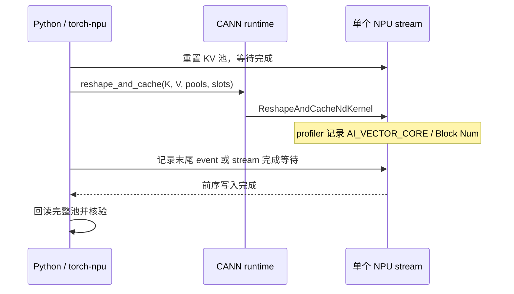

# Practice 19：一个真实 KV kernel 使用多少 NPU 核？

从 Practice 15 的设备任务继续向下观察：设备有多少核，某个 kernel 报告使用多少核，输入规模变化后会发生什么？

本次直接调用服务器安装的 `torch_npu._npu_reshape_and_cache`，实际执行 ATB 的 `ReshapeAndCacheNdKernel`。不加载模型、不自写替代 kernel。采用单卡、单 stream、BF16、eager，固定布局，只改变输入 token 数。阅读 [实测结论](RESULTS.md)，或直接打开 [离线交互报告](results/2026-09-28-run01/analysis/index.html) 和 [核数 SVG](results/2026-09-28-run01/analysis/core_counts.svg)。

## 实验边界

- 设备查询：`torch.npu.get_device_properties(0)`，记录 Cube / Vector 核数与容量。
- K、V：各 `[N, 2, 64]`；KV 池：各 `[8, 128, 2, 64]`；slot：NPU 上的 int32 `[128, …, 127+N]`。
- N = 1、4、10、16、24、32、48、64、128、256。缓存、数据和 stream 在整个实验中存活。
- 初始化完成后，依次做预热、无 profiler 定时、plain profiler、PipeUtilization profiler。
- 每轮测试在已完成的重置后开始，结束时明确等待；CPU 回读并比对完整 K/V 池，包括未写入区域，以及 K/V 输入未被修改。

注意两个不同的 block：`slot // 128` 指向 **KV 存储块**；profiler 的 `Block Num` 描述 **kernel 任务核数**。例如 slot=128 写入 KV block 1，与使用哪一个计算核没有直接对应关系。

## 如何读代码

1. [run_core_probe.py](run_core_probe.py)：`main()` 分配输入与池；`launch()` 调实际 ATB 算子；`reset()` 和 `validate()` 管理测试边界；最后保存运行证据。
2. [analyze_core_probe.py](analyze_core_probe.py)：用标签和原生 flow 关联 host 调用、CANN 与 NPU，再精确匹配 CSV；拒绝错误输出、缺失关联或未完成的计时。
3. [render_core_report.py](render_core_report.py)：只展示已经核验的派生数据，不运行 NPU。

调用与完成关系：



## 在远端重新采集

在 `/data/tianchi` 执行，使用已经安装 torch-npu/ATB 的 Python。先确保目标设备没有其他实验负载。输出目录必须尚不存在，避免覆盖原始证据。

```bash
cd /data/tianchi
source /usr/local/Ascend/cann-9.0.0/set_env.sh
export PATH=/usr/local/python3.12.13/bin:$PATH
npu-smi info

python practice_19_kernel_core_usage/run_core_probe.py \
  --output practice_19_kernel_core_usage/results/my-run \
  --tokens 1,4,10,16,24,32,48,64,128,256 \
  --rounds 7 --iterations 100 --profile-repeats 3

python practice_19_kernel_core_usage/analyze_core_probe.py \
  practice_19_kernel_core_usage/results/my-run
```

默认逻辑设备为 NPU 0；这台虚机的运行记录中它对应物理 NPU 5。实际设备属性和环境值保存在 `run.json`。脚本使用已安装版本的私有 ATB 接口，其他 torch-npu 版本可能需要核对 schema。

## 只做离线复现

本地 Python 标准库即可，不需 PyTorch/NPU，也不需要网络：

```bash
python practice_19_kernel_core_usage/analyze_core_probe.py \
  practice_19_kernel_core_usage/results/2026-09-28-run01
python -m unittest discover -s practice_19_kernel_core_usage -p 'test_*.py' -v
cd practice_19_kernel_core_usage
sha256sum -c SHA256SUMS
```

直接在浏览器打开结果的 `analysis/index.html`。切换 token 数、plain/pipe 和重复编号，可查看关联的原始 CSV 字段、flow ID、task ID 与物理 stream。表格中无 profiler 耗时与 profiler kernel 耗时有各自的测量边界。

## 证据保存

`results/2026-09-28-run01/` 包含 `run.json`、设备前后状态、采集日志、两份原始 profiler 输出、采集时源码快照、分析工具快照、测试记录和浏览器检查记录。`analysis/core_evidence.json` 保留每个 KV 任务的 CSV 字段与精确关联证据；`SHA256SUMS` 覆盖本练习文件。

Practice 15 的 2026-09-28 eager / graph 派生图也增加了原始 `Accelerator Core / Block Num / Mix Block Num` 标注。零值明确标为 unknown / not reported；没有重采集模型，也没有补造 graph 内缺失的逐算子关联。

## 解释字段的官方资料

- [CANN 9.0 kernel_details 字段](https://www.hiascend.com/document/detail/zh/canncommercial/900/devaids/Profiling/atlasprofiling_16_1149.html)：核类型、Block Num、Mix Block Num 等原始字段定义。
- [Ascend PyTorch Profiler](https://www.hiascend.com/document/detail/en/mindstudio/2610/TITools/ascend_pytorch_profiler/docs/en/ascend_pytorch_profiler/ascend_pytorch_profiler_user_guide.md)：采集级别与硬件指标配置。实际使用方式以归档的已安装 `profiler_config.py` 为准。

这些字段没有提供物理核 ID 的完整时间线。本练习也没有拦截内核内部 tiling，不能据此宣称全芯片满载、精确 token→物理核分配或 HBM 带宽饱和。
