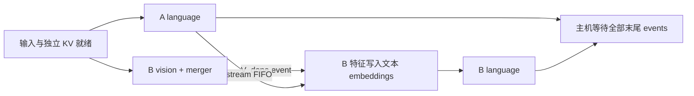

# Practice 25：跨请求视觉编码与语言计算的双流实验

P3b 使用完整预训练 **Qwen2.5-VL-3B-Instruct**，比较串行与双 stream 的真实视觉／语言执行路径。请求 A 已完成视觉编码，正在执行语言 prefill 或一个 decode 步；请求 B 正在编码另一张图片，随后将视觉特征交给自己的语言模型。

完整结果见 [RESULTS.md](RESULTS.md)，设备任务与依赖见[离线交互图](report/index.html)。

## 工作量与状态隔离

- 同一模型实例：32 层视觉编码器与 merger、36 层语言 decoder 和 LM head；原始 BF16 权重，eager attention，一个 CPU 提交线程。
- A 使用另一张图片，视觉像素预算相当于 64 个合并后 token；图文上下文扩展为 512 tokens。prefill 运行完整语言部分；decode 从这个已准备的前缀执行一步。
- B 使用 `beach.jpeg` 或 `beijing.jpeg`，视觉预算 64 / 256，两档均按原始宽高比由 processor 调整。记录实际 grid/token 数，预算不等于最终精确 token 数。
- 2 张 B 图片 × 2 档视觉负载 × 2 个 A 阶段，共 8 格；每格串行／双流各 12 次无 profiler 测量。LV/VL 提交顺序交替，模式顺序每两轮交换；每种组合重复 3 次。
- 每格另外采集 4 个诊断 trial，分别覆盖两模式和两种提交顺序。串行中 A language 和 B vision 共用 L stream，双流中 B vision 使用 V stream；B merge/language 始终位于 L stream。



两模式执行相同三个模型阶段，结果都包含 B 的语言消费；不能只让视觉编码器运行后就宣称完成请求。A vision／decode 前缀预先准备，因此本轮也不是两个完整自回归请求的 HTTP 端到端时间。

共享权重只读，A/B 分别持有 DynamicCache。位置编码在 CPU 按真实 multimodal grid 生成，然后显式传给语言模型；共享模型 `rope_deltas` 在正式 harness 中保持 `None`。原生完整 forward / generation 参考仅在独立资格阶段使用该缓存，并在返回时清理。

## 特征 handoff 与校验

视觉路径调用原模型 `get_image_features`（包含真实 ViT 和 merger）。B 的语言 stream 等待 `V_done` 后，通过原模型同样的 `masked_scatter` 操作填充图像占位符，再运行完整语言 decoder 和 LM head。

诊断记录生产者／消费者的实际 feature 指针、形状和字节范围，以及合并后的 embedding 指针；核对 A/B KV、features 和 embeddings 的活跃字节范围不重叠。特征与输入引用保留到 B 末尾 event 完成，之后才读取／释放。没有提前释放跨流临时结果。

每个正式样本比较完整视觉特征、A/B logits 与全部 36 层 K/V：两个语言输出各 73 个 tensor；要求有限且逐元素相同，贪心 token 一致。正式 8 格另与完整模型 forward / native generation 逐元素对照，不用两个拆分 harness 互相验证。

## 测量与图的边界

计时包括 A language、B vision、B merge/language、stream event 控制与末尾主机等待；图像读取／CPU 预处理、输入传输、A 视觉处理、A decode 前缀与 KV clone 均在计时外。正式计时没有 profiler 或逐模型方法 observer；记录 pair wall time、A/V/B 设备就绪时间、主机提交时间与 allocated/reserved 峰值。

HB 图独立恢复 FIFO、event 和 host join。视觉特征就绪、embedding 就绪、输入就绪与输出完成要求单独验证，不能作为证明边添加回图。kernel 重叠按真实计算区间并集求交。

视觉 eager 实现含根据元数据选择 window、设备到主机读取与同步。分析器记录 vision scope 中的原生同步调用和主机 scalar 读取；这些内部主机阻塞未全部建成 CPU 因果图，所以“显式同步图没有 A↔V 边”不等价于执行时毫无隐式顺序限制。Profiler 会改变主机供给，独立计时与诊断结果分别报告。

这是 HF 模型阶段执行 harness，不是 vLLM 原生多模态调度，不是 HydraInfer 复现。native workspace 的完整访存、逐物理核利用率及全模型精确数据 DAG 尚未恢复。

## 复现

Ascend 主机已有 checkpoint 和 [P3b 图片](../datasets/p3b_images/README.md)：

```bash
cd /data/tianchi
python practice_25_multimodal_overlap/qualify.py \
  --output practice_25_multimodal_overlap/results/qualification-new
python practice_25_multimodal_overlap/run.py \
  --output practice_25_multimodal_overlap/results/formal-new
```

容器已将物理 NPU 5 映射为逻辑 0，沿用现有映射，不额外设置 `ASCEND_RT_VISIBLE_DEVICES=5`。输出目录必须不存在。脚本不修改已安装软件包。

本地仅需 Python 标准库和同仓库 Practice 17 / 20 的 flow / HB 逻辑：

```bash
mkdir -p /tmp/p25-replay
cat practice_25_multimodal_overlap/results/published/evidence.tgz.part-* | tar -xz -C /tmp/p25-replay
python practice_25_multimodal_overlap/analyze.py /tmp/p25-replay/formal-r02
python practice_25_multimodal_overlap/render_report.py \
  /tmp/p25-replay/formal-r02/analysis/execution_graph.json /tmp/p25-report.html
python -m unittest discover -s practice_25_multimodal_overlap -p 'test_*.py'
```

证据压缩后约 95 MiB，以两个小于 50 MiB 的分片保存；解压和生成完整执行图需要约 2 GiB 磁盘与数 GiB 分析内存。分片／原始文件 SHA256 见 `archives.json` 与 `evidence_manifest.json`；最终结论仅取 `formal-r02`。资格检查及中断轮次说明见 `excluded_runs.json`。完整图用 gzip 保存，交互 HTML 内嵌数据，可离线打开。

`contracts.json` 固定本轮已审计源码；软件或执行路径变化后需重新核验契约，不能跳过哈希检查使用旧证据。

本轮从归档独立核对 246 个原始文件，汇总与完整执行图逐字节一致；7 项反事实检查通过。验证详情见 [replay_validation.json](results/published/replay_validation.json)。
