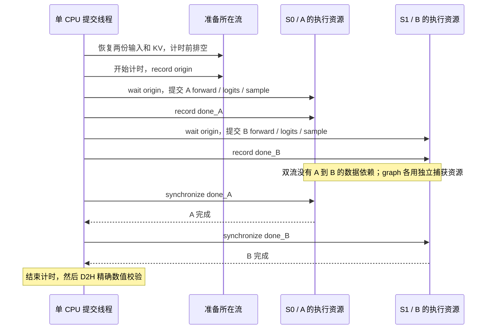

# Practice 28：原生 vLLM decode 的单流／双流对照

研究问题：两个独立 decode 任务已就绪时，只改变任务所属 stream，能否增加真实计算重叠并缩短总完成时间？

实测结论见 [RESULTS.md](RESULTS.md)，打开 [HTML 报告](report/index.html) 可查看 32 条实际 CPU／设备时间线。正式 288 组对照没有显示稳定的双流加速；诊断中 A/B 计算重叠均为 0。

本练习采用真实 vLLM / vLLM-Ascend 模型、分页 KV、Attention 和 PIECEWISE graph。它是固定 decode 步的受控执行实验，不是两个 HTTP 服务，也不是 Transformers forward。

设计约束见 [PLAN.md](PLAN.md)。下面是提交协议，实际是否重叠必须看采集的设备时间线。



serial 组将 B 也提交到 S0，其余协议相同。图中的箭头是提交与依赖关系，不代表测得的并行时间。

## 工作量与对照

Qwen2.5-0.5B-Instruct，BF16，TP=1，每任务 batch=1；同一进程、一个 CPU 提交线程。使用两个不同的固定 10-token 输入，通过原生请求生成 64 token，保存第 16、32、47 个 decode 的实际输入、KV、metadata、采样状态和数值参考。步骤编号沿用 P26：prefill=0，decode=1…63。

| 场景 | A | B |
|---|---|---|
| `same32` | A 请求 decode 32 | B 请求 decode 32 |
| `mixed16_47` | A 请求 decode 16 | B 请求 decode 47 |

每个后端分别对比 `serial` 与 `parallel`：前者两个任务都提交到 S0，后者 A→S0、B→S1。单流也不在 A/B 之间插入 CPU 等待。Graph 两组复用同一批图对象，不改变分区方式或算子实现。

计时单元是原生 `_model_forward → compute_logits → _sample`，包含 KV 写入、Attention、模型其余计算、贪心采样和 `logprobs=1`。输入准备、slot mapping、KV 恢复、预热、图捕获、D2H 校验均在计时外。不得将耗时直接与 P26 HTTP 请求完成时间相除。

默认关闭 prefix caching、chunked prefill、async scheduling 和提前随机采样；graph 为 PIECEWISE、capture size 1、custom_ops=all。每实例 KV 内存预算为 16 MiB，在当前模型下提供 1,280 token 容量（10 个 128-token 块）；实际池大小按完整 block 向下取整。显式记录这个与 P26 自动内存预算的差异。

## 状态隔离与恢复

两个 runner 共享只读参数及原生缓存的固定 RoPE 查找表；输入、输出、KV、Attention 实例、metadata、采样状态、workspace、可变 RoPE 缓冲和 graph pool 分别持有。模块级可变引用由 `GlobalState.active()` 按任务绑定，退出时恢复原引用；底层 tensor 仍由各自状态对象持有。

`get_rope()` 的 `_ROPE_DICT` 会共享 `AscendRotaryEmbedding` 及其 `cos_sin_cache`。当前 Qwen Triton 路径读取该表，写 Q/K；它不是每步被覆盖的 `_cos` / `_sin` / KV。最终资格检查单独保存该表的地址和执行前后哈希，其余模型 buffer 仍纳入跨实例可写存储检查。具体远端依据：`vllm/model_executor/layers/rotary_embedding/__init__.py:83–84`、`vllm_ascend/ops/rotary_embedding.py:233–249`、`vllm_ascend/ops/triton/rope.py:91–93,120–122,159–161`。

Graph 使用原生 dummy capture 和 runner 的固定输入地址。真实 Attention metadata 只用于运行，不能拿它代替原生 PIECEWISE 初始化捕获。图内与调用 stream 的关联必须依据实际证据。

每轮在上一轮终点等待完成后恢复初始 KV；公共 origin event 建立输入就绪边；两任务提交完成后分别 record 终点 event，CPU 最后统一等待。异常路径只等待已经提交工作的流或已经 record 的 event，避免等待从未记录的 event。

不修改已安装源码、不改 shell 配置、不重启其他服务、不重置设备。控制器只管理自己创建并记录的进程组；普通异常先清理，60 秒清理超时后终止本实验进程。源码关键文件和模型配置前后校验哈希；最后用未加载实验适配器的独立进程重跑原生请求，比较 64 个 token。

当前的 Python 全局引用恢复与可见 tensor 地址检查不等于完整 native workspace 安全证明。资格失败时保存现场并停止正式测量，不能通过放宽数值容差或改用其他框架得到“通过”。

## 代码阅读顺序

1. `run_suite.py`：设备占用检查、冻结每轮脚本、启动自有子进程、资格门槛、退出清理及原生恢复验证。
2. `native.py`：原生状态采集、字节池 KV 视图的值克隆、两个执行实例、临时状态绑定、单流／双流提交。
3. `child.py`：原生数值资格检查、跨实例存储范围核对、输入交换及提交后的异常恢复。
4. `experiment.py`：平衡性能测量和单独的 plain / PipeUtilization 采集；只在诊断进程安装 replay 观察器。
5. `analyze.py`：精确 flow、CANN connection、CSV 和图对象关联，按实际 kernel 区间计算重叠。
6. `common.py` / `test_analysis.py`：可恢复绑定、存储范围和区间计算的本地测试。

## 运行

远端 `/data/tianchi` 中使用已有 CANN、torch-npu、vLLM 和本地权重。输出目录必须不存在。

```bash
python -B practice_28_native_decode_streams/run_suite.py \
  --qualification-only \
  --output practice_28_native_decode_streams/results/qualification-new

python -B practice_28_native_decode_streams/run_suite.py \
  --output practice_28_native_decode_streams/results/formal-new
```

完整套件先做未插桩原生基线及 eager/graph 资格检查；资格通过才运行 3 次独立进程/后端、每场景每策略 12 轮，总计 288 个正式 pair。每格预热 3 次，交替 AB/BA，轮换策略顺序和输入交换。plain 与 Pipe 分开运行，各场景/策略记录 AB、BA 各一次。

本地测试：

```bash
python -m unittest discover -s practice_28_native_decode_streams -p 'test_*.py' -v
```

离线分析依赖同仓库 P26/P17 的证据关联辅助函数，不需要 NPU：

```bash
python practice_28_native_decode_streams/analyze.py <正式结果目录>/graph-plain
```

仓库保存了压缩原始证据。只做离线复核时：

```bash
mkdir -p /tmp/p28-review
tar -xmf practice_28_native_decode_streams/results/suite-01-archive/evidence.tgz -C /tmp/p28-review
for run in eager-plain graph-plain eager-pipe graph-pipe; do
  python /tmp/p28-review/suite-01/analysis_tools/practice_28_native_decode_streams/analyze.py \
    "/tmp/p28-review/suite-01/$run"
done
python practice_28_native_decode_streams/render_report.py /tmp/p28-review/suite-01 \
  --output /tmp/p28-review/report
```

`collector/` 冻结实际采集版本，`analysis_tools/` 冻结最终分析版本及 P26/P17 辅助函数；`manifest.json` 列出归档内每个文件的 SHA256。正式测量后增强的 buffer 审计不改变计时或模型路径，另外通过最终资格轮保存证据。早期试跑的错误及恢复均另存 `qualification-*-archive`，不纳入性能统计。

性能结论仅使用无 profiler 数据。计算覆盖率、核数字段、流水线 ratio 分别报告，不合成为未经测量的整卡利用率。出现真实重叠也不自动意味着总完成时间缩短。
