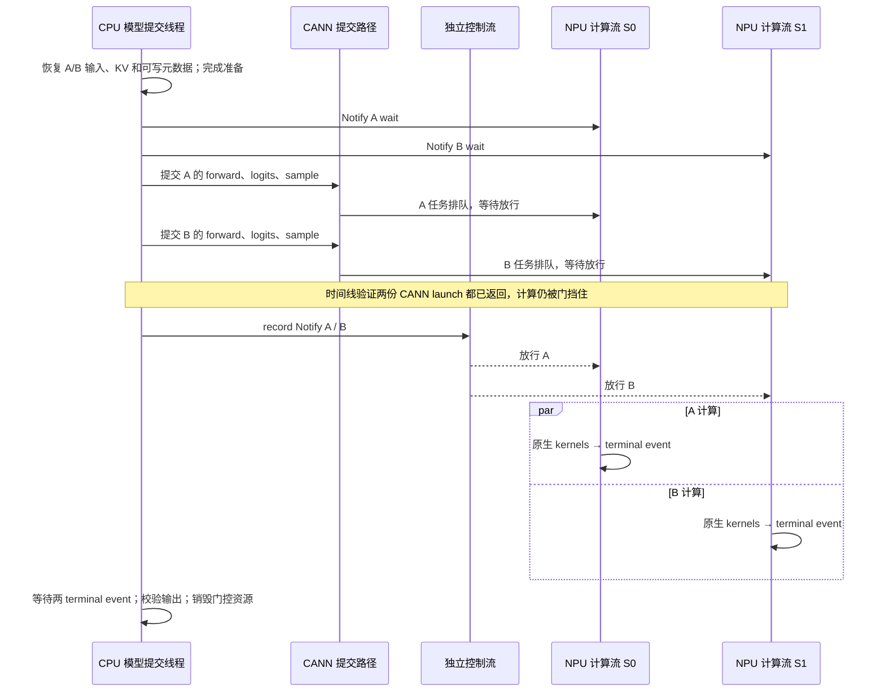

# Practice 29：先排队，再放行

**提前排队后，两个真实 decode 可以在 NPU 上重叠执行。** 首轮只做 eager、same32、固定 AB 顺序的三种情况。双流的放行后完成时间变短，但包含排队和门控的整体时间仍比正常提交长。见 [结果](RESULTS.md)、[任务目标](../tasks/2026-09-30-practice29-prequeued-streams.md)。

这遵循“先做薄，再做厚”：没有 graph、更多形状、硬件利用率计数器或大规模 benchmark。三次连续样本用于理解机制，不声称稳定收益。

## 最短阅读顺序

1. [gate.py](gate.py)：`close()` 在计算流插入 Notify wait；`open()` 在独立的原生控制流 record Notify。一个等待者一个 Notify，消费后自动 reset。
2. [probe.py](probe.py)：先用两个 1024 元素加法验证等待确实生效、CPU 能继续提交、看门狗能解锁。50 ms 停留只用于这个小验证。
3. [model.py](model.py)：`main()` 获取原生 decode 32 前态，构建两个资源独立的 runner capsule，预热后执行三种情况；`gated_pair()` 是新的核心流程。
4. [analyze.py](analyze.py)：检查 Python 返回、CANN launch 返回、实际设备计算三个不同时间点。所有 576 个 launch 返回早于放行，才接受“已提前排队”。



单流对照将 A/B 排入同一个 S0，只放一个等待；保持 FIFO。普通双流使用 Practice 28 的输入就绪 Event，不加起跑门。控制流顺序 record 两个 Notify，**不保证同时启动**；是否重叠由实际 kernel 区间判断。

## 复用和临时干预的边界

模型计算复用 [Practice 28 native.py](../practice_28_native_decode_streams/native.py)，详见其[临时包装说明](../practice_28_native_decode_streams/EXPERIMENT_ADAPTERS.md)。本练习不改 vLLM/vLLM-Ascend/torch-npu 安装源码、配置或服务。

- 从两个原生请求保存 decode 32 的输入、注意力元数据、KV 前态和原生输出。快照阶段的 `_model_forward` / `_sample` 包装完成后恢复。
- 本次仅通过 `Bindings` 把实验模块 `native.STEPS` 临时设为 `(32,)`，退出即恢复。
- 正式计算仍为 `forward → compute_logits → sample`，计算路径不删减；调度由固定步 harness 控制，不是在线 serving scheduler 的性能测试。
- 两个 capsule 独占 KV、输入、可写元数据、workspace 等；共享已审计的只读模型权重及 RoPE 表。每轮开始前恢复相同前态，结束后再访问或复用资源。
- `GlobalState.active()` 暂时切换进程内 Python 资源绑定。模型提交只有一个 CPU 线程；torch-npu 自身仍有下发工作线程。新增看门狗线程只发放行控制命令，不提交模型计算。
- 诊断复用 P28 的 `record_function` 标签，以保持精确关联；标签中的 `P28/` 不代表运行了旧实验。未安装其 graph replay 包装。

`exact_join.py` 是 P28 `analyze_trial` 及依赖函数的可读副本，只扩展两处 Notify 原生调用关联：将 `aclrtWaitAndResetNotify` / `aclrtRecordNotify` 加入 connection ID 索引，并允许 `NOTIFY_RECORD` 使用该关联。不修改 P28 历史分析代码。其他关联仍沿 CPU→任务队列→CANN→设备 flow→kernel CSV 精确身份验证。

## 安装版同步原语与恢复

实机 CANN **9.0.0**，torch / torch-npu **2.10.0**。头文件 `/usr/local/Ascend/ascend-toolkit/latest/include/acl/acl_rt.h`：

| 接口 | 行号 | 本实验用途 |
|---|---:|---|
| `aclrtGetCurrentContext` / `aclrtSetCurrentContext` | 1204 / 1186 | 借用 torch-npu 初始化的上下文；看门狗线程设置同一上下文 |
| `aclrtCreateStream` | 2272 | 创建独立放行流 |
| `aclrtSynchronizeStreamWithTimeout` | 2362 | 销毁前有界检查原生流完成 |
| `aclrtStreamQuery` | 2374 | 查询计算流是否仍为 NOT_READY |
| `aclrtCreateNotify` | 3305 | 每个计算流创建一个新 Notify |
| `aclrtRecordNotify` | 3343 | 独立控制流放行 |
| `aclrtWaitAndResetNotify` | 3354 | 在计算流插入等待，不用 AI Core 忙等 kernel |

官方 [Notify 管理说明](https://www.hiascend.com/doc_center/source/en/CANNCommunityEdition/910/others/acldevg/runtime_doc_dev_0027.html)说明一对一消费和 wait-before-record 用法。接口以安装版头文件及实测为准。部分文档与本机头文件对非零等待超时单位描述不一致；本实验使用 `timeout=0`，由 **2 秒独立 Host 看门狗**和外层进程超时保证有界恢复，不依赖该单位解释。

普通 `torch.npu.Event` 仅用于已提交任务后的终止标记，未把“等待尚未 record 的普通 Event”当成起跑门。安装版 `ExternalEvent` 也提供先 wait 后 record 的语义，但本轮未使用它。

所有 stream handle 在关门前解析；放行直接调用原生 CANN，不排在被门挡住的 torch-npu 任务队列后。异常时先开门、再等待已提交任务、最后销毁 Notify 和自建控制流。Probe 还故意让看门狗放行一次，验证恢复路径。无法恢复时控制器只终止自己创建的进程组，不 reset 设备。

`run.py` 冻结采集脚本和依赖，核对两个 revision、16 个关键源码/配置文件指纹、设备空闲状态，并在实验前后各做一次新进程原生推理。指纹审计针对列出的文件，不声称对整个安装树做了逐字节审计。

## 复现

远端已有同级 Practice 28。若在其他副本运行，须保持本仓库目录布局；采集时会冻结依赖。运行目录必须是一个不存在的新路径。

```bash
ssh ascend910
cd /data/tianchi

# 只验证起跑门（也包含前后原生推理恢复检查）
python -B practice_29_prequeued_streams/run.py \
  --gate-only --output practice_29_prequeued_streams/results/my-gate-run

# 本轮完整最小场景：自带门控资格检查，无需重复运行上一条
python -B practice_29_prequeued_streams/run.py \
  --output practice_29_prequeued_streams/results/my-round

python -B practice_29_prequeued_streams/analyze.py \
  practice_29_prequeued_streams/results/my-round
python -B practice_29_prequeued_streams/render.py \
  practice_29_prequeued_streams/results/my-round \
  --output practice_29_prequeued_streams/figures/my-round
```

设备被其他任务占用时自动停止。源码审计和正常推理复测成功不代表未知错误可被自动恢复；恢复失败会明确记录并停止，不尝试更改系统设置。

本轮远端原始目录：`/data/tianchi/practice_29_prequeued_streams/results/{gate-01,round-01}`。本地保留[门控证据包](results/gate-01-archive/)和[模型证据包](results/round-01-archive/)，包含精确 trace/CSV、冻结采集代码、离线分析工具、数值检查、版本、指纹及恢复日志；排除设备二进制与编译缓存。每个文件有 SHA256 manifest。

无需 NPU 的离线复核（Python 3.10+）：

```bash
mkdir -p /tmp/p29-review
tar -xzf practice_29_prequeued_streams/results/round-01-archive/evidence.tgz -C /tmp/p29-review
/usr/bin/python3 -B /tmp/p29-review/round-01/analysis_tools/practice_29_prequeued_streams/analyze.py \
  /tmp/p29-review/round-01
/usr/bin/python3 -B -m unittest discover -s practice_29_prequeued_streams -p 'test_*.py' -v
```

门控资格由代表时间线证明；无 profiler 样本使用同一协议并检查门状态，不逐样本采集 CANN trace。Profiler 的停止提示可能警告数据不完整，本轮通过全量 CSV 任务覆盖、关联和三组任务清单一致性检查验证用于结论的数据。
