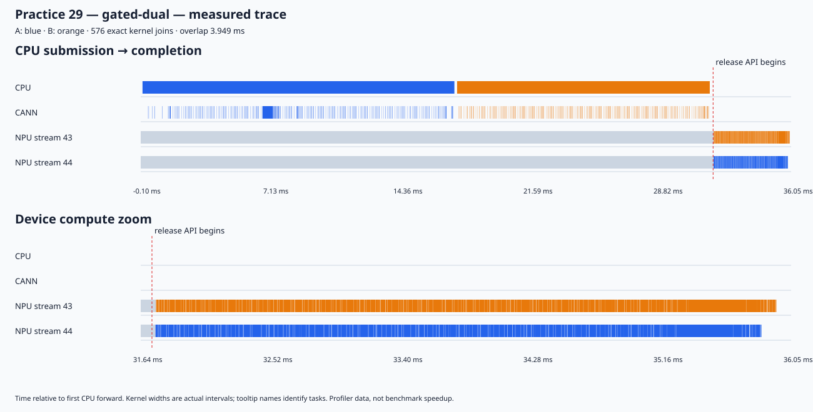

# 首轮发现：先排队，确实能重叠；暂时没有端到端收益

2026-09-30，Qwen2.5-0.5B-Instruct，BF16，单 Ascend 910B2C，eager。两个不同请求的 decode 32；每个任务 batch=1，固定 AB 顺序，单 CPU 模型提交线程。没有 graph、Pipe 计数器或服务吞吐压测。

## 1. 起跑门是真的

先用两个小加法测试：CANN 已提交两条 kernel，设备计算流等待约 51 ms；独立控制流 record Notify 后才执行。门关闭和放行后分别返回 NOT_READY、COMPLETE，结果正确。另一次故意不主动放行，看门狗成功恢复。

接入真实模型后，两组门控时间线均证明：**A/B 共 576 个 kernel 的原生 launch 调用全部在放行前返回，所有计算都在各自 Notify wait 完成后开始。** 最后一条 launch 返回分别早于放行约 228 µs（单流）、248 µs（双流），正式实验没有触发看门狗。不能只凭 Python 返回认定这个条件满足；本轮同时验证了 CANN 提交和设备区间。

## 2. 排除“第二份工作来得晚”后，出现了并行

| 代表 trace | 计算 stream | kernel 数 | A/B 实际计算交集 | 第一条到最后一条 kernel 的跨度 |
|---|---|---:|---:|---:|
| 正常双流 | 44、43 | 288 + 288 | 0 | 28.263 ms |
| 门控单流 | 44 | 288 + 288 | 0 | 4.985 ms |
| 门控双流 | 44、43 | 288 + 288 | **3.949 ms** | **4.212 ms** |

三组 kernel 名称、core 类型和 block 数清单一致，全部 1,728 个 kernel 通过 CPU/CANN/device/CSV 精确关联。交集按实际 kernel 区间的并集求交，未使用 forward 外包络。

普通双流中，B 第一条 native launch 仍晚于 A 最后一条计算约 **338 µs**，复现 Practice 28 的现象。门控双流中，两份工作提前可用，设备发生明显重叠。本轮没有发现 forward CPU scope 内的 CANN Synchronize 调用；这只是当前 trace 的观测范围。

三张图均可单独打开，包含 CPU 提交、CANN launch、Notify 等待和逐 kernel 区间，并提供计算区域放大：

- [正常双流](figures/normal-dual.svg)
- [提前排队，单流](figures/gated-single.svg)
- [提前排队，双流](figures/gated-dual.svg)

## 3. 放行后更快，整体仍更慢

以下为 **3 次连续无 profiler 样本的中位数**，均已预热；它们只能说明本轮观察方向。

| 情况 | 放行 API 开始 → CPU 确认两任务完成 | 完整执行耗时 |
|---|---:|---:|
| 正常双流 | 不适用：没有起跑门 | **21.901 ms** |
| 门控单流 | **5.050 ms** | **28.156 ms** |
| 门控双流 | **4.253 ms** | **27.384 ms** |

门控双流的放行后时间比门控单流短约 **15.8%**。这里是 Host 测得的放行至 join 时间，包含控制通知和 CPU 等待返回，并非纯 kernel 用时。

完整耗时包含模型 CPU 提交、门控创建/放行/销毁及等待，不含每轮输入/KV 前态恢复、数值检查、模型初始化或 profiler。普通双流沿用 P28 计时范围；门控额外开销保留在表内。门控双流总体仍比正常双流慢约 **25.0%**：等待所有任务排好队也延迟了本可提前开始的计算。**“释放后更快”不能称为端到端加速。**

固定 AB、每组仅三次，未随机交错或做多进程统计；不据此声称稳定性能提升。Profiler 时间线只解释机制，不与无 profiler 耗时混算收益。

## 4. 正确性、来源与恢复

- 2 次预热、3 次诊断、9 次无 profiler pair，共 **28 次分支结果检查**；每次 53 个 tensor，logits、token、logprobs 和完整 KV 均与原生参考精确相等、有限值检查通过。
- 两份 capsule 可写存储不重叠；共享只读权重和 RoPE 表前后哈希一致。
- vLLM：`ad7125a431e176d4161099480a66f0169609a690`；实际导入 `/vllm-workspace/vllm/vllm/__init__.py`。
- vLLM-Ascend：`80610e4438dba05011b05f89fc45d91e96992671`；实际导入 `/vllm-workspace/vllm-ascend/vllm_ascend/__init__.py`。
- torch `2.10.0+cpu` + torch-npu `2.10.0`，CANN `9.0.0`。本次导入 vLLM 的 `__version__` 为 `0.21.0`，以实际记录为准。
- 两轮控制器均完成恢复：16 个审计文件哈希未变，实验自有进程退出，NPU 空闲，新进程原生 64-token 输出与实验前一致。未修改安装库、配置或运行服务，未 reset 设备。

详细数据见 [分析汇总](results/round-01-archive/analysis_summary.json)、[关联验证](results/round-01-archive/analysis_validation.json)、[恢复结果](results/round-01-archive/status.json)及证据包内 `model/correctness.json`、`model/measurements.json`、`sources_{before,after}.json`。采集代码按轮次冻结；之后新增的离线分析独立放在证据包 `analysis_tools/`。

## 还不能回答什么，下一步只加什么

本轮说明：**相同 native decode 计算在提前可用时，确实可以跨 stream 重叠；此前未重叠不能据此解释为硬件不支持并行。**

它没有测整芯片核利用率，也没有证明重叠期间没有资源竞争或“核已满”。3.95 ms 的交集不等于 3.95 ms 的节省，更不代表并行会翻倍。

按“先做薄，再做厚”，下一轮首先只加 BA 提交顺序和少量独立重复，确认放行后差异的方向。之后才考虑用 graph 缩短 Host 下发开销，研究如何在不人为等待两份工作全部排队的情况下获得重叠；无需立即扩成完整 benchmark 矩阵。
