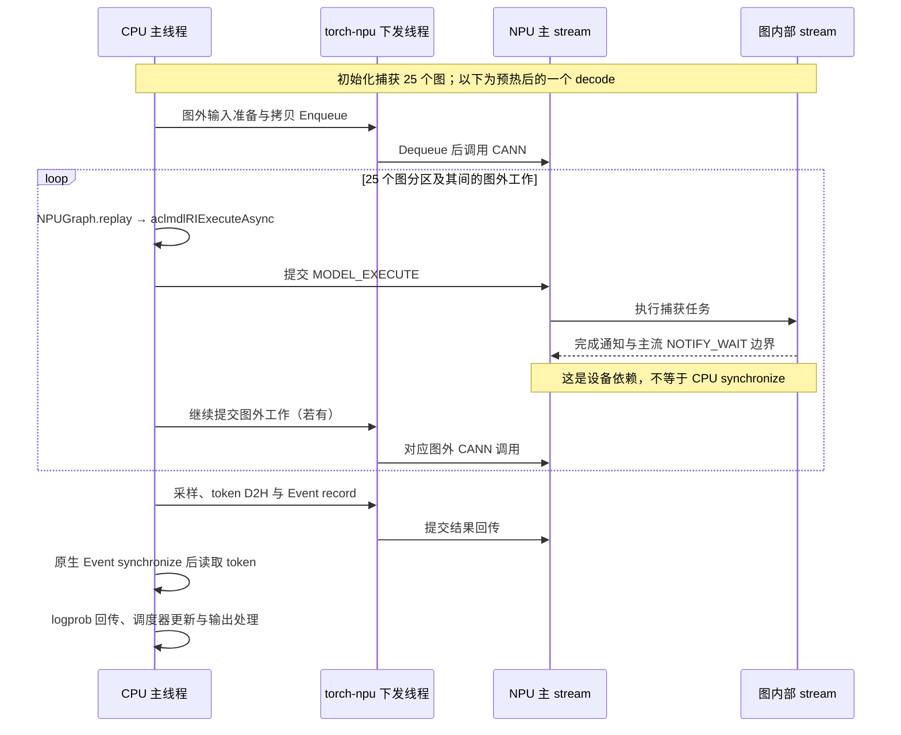

# Graph mode：减少逐算子提交，但没有消除 CPU 工作

本轮补充 **PIECEWISE graph、capture size=1**，保持单请求、BF16、Qwen2.5-0.5B-Instruct、10 输入 / 64 输出及其他基础配置一致。重新采集 `eager-02` 与 `graph-01`，不直接拿旧轮诊断耗时当性能基线。

入口：[对照报告](report/comparison/index.html) · [graph 时间线](report/graph-01/index.html) · [eager 时间线](report/eager-02/index.html) · [graph decode 32 SVG](report/graph-01/decode32.svg) · [graph 完整请求 SVG](report/graph-01/request.svg)。

## 先看未插桩请求

| 无 profiler、无请求阶段包装的参考请求 | eager | graph |
|---|---:|---:|
| 第一次 | 722.001 ms | 291.454 ms |
| 第二次 | 727.261 ms | 291.484 ms |
| 第三次 | 725.879 ms | 291.055 ms |
| 中位数 | **725.879 ms** | **291.454 ms** |

本组单请求延迟中位数约改善 **2.49 倍**。每种模式仅三个参考请求，进程相互隔离；不代表吞吐压测或其他模型、长度的性能。

两种模式各自 11 次响应（含预热、诊断与恢复）完全一致；跨模式的 64 个 token、logprob、rank 与结束原因也精确相等。对比程序保留数值差值字段，本轮最大 logprob 绝对差为 0，不预设未来跨模式必须逐位相等。

## 问题一：CPU 的时间花在哪里？

以下来自带 profiler 的诊断请求，不能与上述无 profiler 请求混为同一组性能测量：

| CPU 阶段 | eager 墙钟 / 线程 CPU | graph 墙钟 / 线程 CPU |
|---|---:|---:|
| 完整请求观察范围 | 1006.260 / 1005.599 ms | 458.497 / 457.809 ms |
| decode 32 整步 | 15.992 / 15.982 ms | 6.785 / 6.774 ms |
| decode 32 forward | 13.099 / 13.098 ms | 4.249 / 4.249 ms |
| 输入准备 | 583.223 / 582.077 µs | 546.907 / 545.748 µs |
| 采样提交 | 274.905 / 274.322 µs | 252.820 / 252.210 µs |
| token 回传与列表转换 | 111.348 / 110.883 µs | 101.040 / 100.452 µs |
| logprob 回传 | 86.350 / 75.712 µs | 86.503 / 75.707 µs |
| forward 内的 25 次 replay 调用合计 | 未发生 | **316.317 / 302.652 µs** |

**graph 的 forward 仍不等于一次 replay。** 本配置每步有 25 个图分区，同时还执行图外工作。扣除已计时 replay 后，该步 forward 尚有约 **3.933 ms**，包括分区调度、图外算子及未细分的框架和观测工作；不能全部叫作 Python 开销。进一步细分仍属于待开始的下一个 subtask。

两种模式的诊断线程 CPU 时间都接近墙钟时间，已观测到的长时间休眠等待不是主要现象；这不排除运行时自旋、短等待或观测成本。

诊断请求的外层计时分别约为各自参考中位数的 **1.386 / 1.574 倍**。graph 多记录了 1,575 次 replay scope，两种模式的观测成本不同。因此上表用于解释路径，不把诊断差值当作纯优化收益。

## 问题二：什么时候提交任务，什么时候等待？

graph 初始化阶段捕获了 **25 个图对象**。本轮 prefill 没有 replay；63 个 decode 每步 25 次，共 **1,575 次**。测量请求内没有重新捕获。

实际远端源码入口：

- `/vllm-workspace/vllm-ascend/vllm_ascend/compilation/acl_graph.py:152`：`ACLGraphWrapper.__call__` 根据 runtime mode 决定直接执行 runnable 或进入捕获/replay 路径；本配置是 PIECEWISE，不能称为全请求 full graph。
- 同文件 `:271`：`entry.aclgraph.replay()`。
- `/usr/local/python3.12.13/lib/python3.12/site-packages/torch_npu/npu/graphs.py:372–374`：`NPUGraph.replay()` 调用 `super().replay()`。

本轮 replay 的 `aclmdlRIExecuteAsync` 记录在 **CPU 主线程 TID 1441357**，没有关联普通算子的 Enqueue/Dequeue。通过 CANN connection ID 找到主 stream 的 `MODEL_EXECUTE` / `NOTIFY_WAIT`，再以 graph dump 的 model、stream、task 序列和完成边界对应图内部任务。图内 kernel **没有本次单独的 Host launch**，不能凭其执行时刻补画逐算子提交。

图外输入拷贝、部分算子、采样和结果回收仍有主线程 Enqueue → torch-npu 下发线程 Dequeue → CANN 的路径。整个请求记录的队列对从 eager 的 **21,512** 减到 graph 的 **9,227**；两边计算任务都精确核验了 **19,298** 项，其中 graph 有 **13,797** 项属于捕获图内部。

这是证据支持的结构示意，精确时刻见 SVG/交互图；没有恢复底层每个 notify 的内部 ID，不能将示意箭头当成额外采集的事件。

两种模式都保留 **64 次 token Event 同步 + 192 次 logprob Stream 同步**。CANN 同步调用范围合计：eager **0.865 ms**，graph **0.695 ms**，都不是本轮请求的大头。设备 `NOTIFY_WAIT` 不加入这个 CPU 阻塞调用合计。

本轮 Python `graph_task_update_begin/end` 包装与 CANN update 事件均未记录到调用。结论限于本次 PIECEWISE 路径；输入准备与 buffer 更新仍存在，不能理解为 graph 不需要维护输入，更不能推广到 FULL graph。`acl_graph.py:267–270` 中 FULL 模式的主流 synchronize 条件也不能套用到本轮。

## 问题三：设备任务间隙时，CPU 在干什么？

graph decode 32 的三个较大、未被记录设备任务覆盖的间隙：

| 间隙 | 后续任务 | 可确认的提交进度 |
|---|---|---|
| 223.309 µs | 第一个 `MODEL_EXECUTE` | 其中 201.793 µs 在 replay 的 CANN 调用开始之前；没有普通队列关联 |
| 167.247 µs | 输入 `MEMCPY_ASYNC` | 其中 141.303 µs 在 Enqueue 开始之前 |
| 120.645 µs | `_compute_slot_mapping_kernel` | 其中 99.542 µs 在 Enqueue 开始之前 |

第一项只能定位到 runner/forward/replay 的粗范围，没有细粒度 CPU 操作覆盖完整空隙；第二、三项可看到输入拷贝、slot mapping、slice 等相关操作。**graph 仍可能等 CPU 准备下一份工作，但当前时间重叠不是全部因果证明。**

虽然 graph 有 **26 条物理 stream**，本轮所有记录的计算任务跨 stream 重叠为 **0 µs**，峰值同时执行计算的 stream 数为 1。性能改善不能解释成“26 条 stream 同时算”。stream 数不是 core 利用率，也不能把局部间隙当作整颗 NPU 空闲。

## 初始化、恢复与证据边界

初始化墙钟单独保存在 `initialization.json`：eager 各进程约 31–32 秒，graph 约 40 秒。它包含加载、初始 profiling、编译/捕获等阶段，不是纯编译耗时；诊断 graph 的 dump 也在此范围内。编译日志、capture begin/end 时间及 25 份 dump 均归档。正式请求在引擎初始化和两次预热之后测量。

实际导入路径仍为 `/vllm-workspace/vllm` 与 `/vllm-workspace/vllm-ascend`，revision 分别为 `ad7125a431e176d4161099480a66f0169609a690` 和 `80610e4438dba05011b05f89fc45d91e96992671`。每轮 27 个已审计文件前后相同，两轮审计哈希相同，基础配置和输入相同。全部包装恢复、新进程原生推理及设备空闲检查通过。

两轮的 profiler 停止日志仍保留 schedule 警告；用于结论的 64 步、全部 kernel CSV 身份、graph 任务序列与完成边界均通过覆盖检查。不据此宣称未采集的 runtime 事件也完整。

原始目录位于远端 `/data/tianchi/practice_30_cpu_submission_timeline/results/{eager-02,graph-01}`。本地便携归档见 [eager](results/eager-02-archive/) 和 [graph](results/graph-01-archive/)，包含当时冻结的采集代码及最终离线分析工具。源码和运行服务未修改；本轮没有人为改变 stream 或同步机制。
