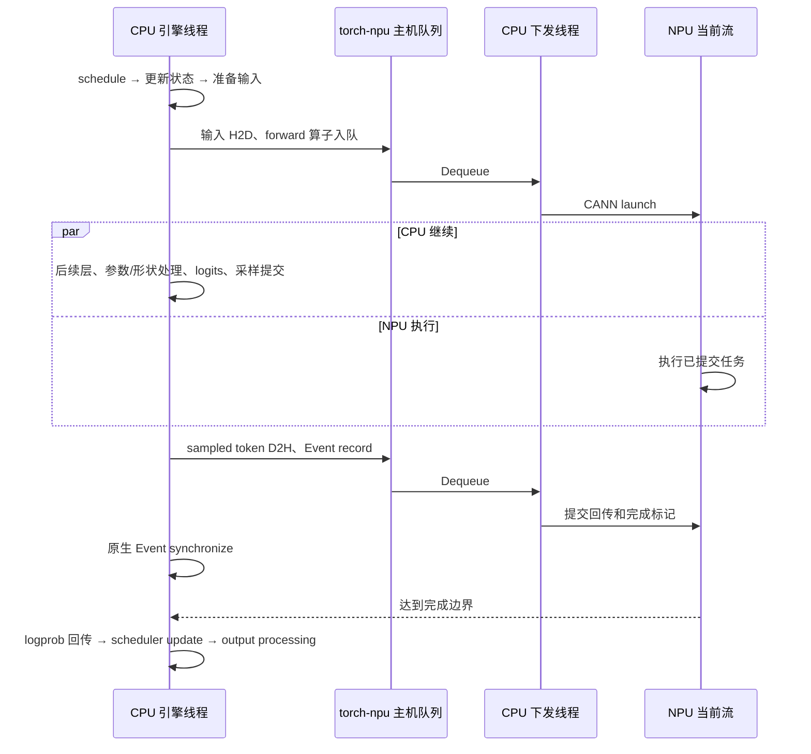

# Practice 30：单请求的 CPU 下发时间线

**这一轮把“CPU 一直在提交工作”和“CPU 等设备结果”分开观察。** 使用完整原生请求，保留调度、KV 增长和结果回收；没有起跑门、第二个请求或人工改 stream。

入口：[离线交互报告](report/index.html) · [发现与证据](RESULTS.md) · [完整请求 SVG](report/request.svg) · [decode 32 SVG](report/decode32.svg)。

## 怎么读

1. 先看完整请求的 64 个步骤：prefill 一次，decode 63 次。
2. 选择 decode 32，横向阅读 CPU 阶段、PyTorch host、Enqueue、下发线程 Dequeue、CANN launch、NPU。
3. 点击“输入 H2D / 线性层 / RoPE / token D2H 与等待”，查看精确关联和实际源码入口。
4. 看阶段表中的墙钟与线程 CPU 时间，再看三个最大设备任务空隙。不要把父子阶段时长相加。

报告保留所有步骤，CPU 非设备算子表和四个细读实例集中在 decode 32。图中灰白空白不是 CPU/硬件 idle 的证明；CPU 调用范围也不代表线程始终运行。

## 工作负载与代码主流程

Qwen2.5-0.5B-Instruct，BF16，单 Ascend910B2C，eager；固定 10-token 输入、64-token 贪心输出，`ignore_eos=True`、`logprobs=1`。TP=1、batch=1、max model len=256、block size=128、KV budget=16 MiB。prefix cache、chunked prefill、async scheduling 关闭，`distributed_executor_backend=uni`、`VLLM_ENABLE_V1_MULTIPROCESSING=0`。

这是 `LLM.generate()` 的 in-process 引擎路径，不含 HTTP、跨进程服务通信或并发调度。分词在正式计时前完成，输出处理属于请求范围。当前配置仍存在 torch-npu 自己的下发线程。

| 文件 | 作用 |
|---|---|
| [run.py](run.py) | 冻结脚本、记录源码/版本、按顺序管理三个自有子进程，执行恢复检查 |
| [child.py](child.py) | 原生初始化与预热，运行 reference / diagnostic / recovery |
| [observer.py](observer.py) | 在实际对象上临时包装 17 类阶段，记录嵌套、线程与双时钟；退出恢复 |
| [analyze.py](analyze.py) | 阶段自身时间、队列关联、同步边界、decode 32 三个最大空隙 |
| [exact_join.py](exact_join.py) | 从 Practice 26 复用精确 flow/CSV 关联，适配本轮输入并导出队列证据 |
| [render.py](render.py) / [viewer.html](viewer.html) | 生成两张 SVG 和离线可点击报告 |

`child.py` 只复用 Practice 28 的 `make_engine`、配置、prompt 和 `generate`，不调用其 capsule、快照恢复或双流提交。模型计算由原生引擎驱动。



这是调用关系示意。实际下发、完成和等待时刻以报告为准。

## 计时与干预边界

每个阶段保存 `perf_counter_ns()` 和 `thread_time_ns()` 增量，所有记录在 profiler 停止后统一写出。线程 CPU 时间包含 Python/C++ 及可能的自旋，不能理解为“有效业务计算”；墙钟减线程 CPU 不能直接归因为 GIL、锁、设备等待或 OS 抢占。

同线程直接子阶段从父阶段扣除，得到自身墙钟和自身线程 CPU 时间；跨线程不相减、不相加成请求总时长。阶段计时位于 `record_function` 边界内，因而与图上的 profiler 标记时长略有差异。标记、包装及 profiler 自身也有开销。

观察器只在预热后安装，保存原 callable，并在异常和正常退出时都恢复。`EngineCore.step_fn` 缓存了原 bound method，因此包装这个实际被调用的属性；没有仅替换未被调用的 `step`。`LogprobsTensors.tolists` 是唯一类级包装，其余是本实验引擎实例属性。未删除或新增设备等待，不在热路径 `.cpu()`、复制 KV 或打印日志。

`exact_join.py` 复用 P26 关联检查，新增本轮格式适配、原始 queue 范围导出、可测试的步骤检查；对已经验证为嵌套的阶段使用逆序查找最内层范围。优化前后完整分析证据逐项相同。CPU/NPU 实际时间均来自同一远端 profiler 时钟；不会拿本地时间与远端时间相减。

## 远端复现

保持仓库同级 Practice 17、28、29 的目录布局。P28 提供原生初始化及配置，P29 提供有界子进程控制，P17 提供离线区间辅助函数。

```bash
ssh ascend910
cd /data/tianchi
python -B practice_30_cpu_submission_timeline/run.py \
  --output practice_30_cpu_submission_timeline/results/new-run
python -B practice_30_cpu_submission_timeline/analyze.py \
  practice_30_cpu_submission_timeline/results/new-run
python -B practice_30_cpu_submission_timeline/render.py \
  practice_30_cpu_submission_timeline/results/new-run \
  --output practice_30_cpu_submission_timeline/report/new-run
```

输出目录必须不存在。只运行 eager；不开放额外 workload 矩阵。三个隔离进程分别为：

- reference：预热 2 次，3 次无 profiler 请求。
- diagnostic：预热 2 次，1 次带阶段观察器的 CPU/NPU profiler 请求。
- recovery：新进程预热 2 次，1 次原生请求。

设备已有进程时拒绝开始。每个子进程有 300 秒上限；超时仅终止该自有进程组，先 TERM、再有界 KILL，不 reset NPU。控制器在异常路径也尝试原生恢复。安装源码、配置和已有服务不修改。

本轮远端原始目录为 `/data/tianchi/practice_30_cpu_submission_timeline/results/round-01`。源码从远端实际安装路径读取；本地旧快照未用于代替远端检查。运行前后审计 25 个关键文件。运行时 introspection 另发现 `BalanceScheduler.schedule`，随后补采其源码并核对与记录 revision 的 Git 内容完全一致；该补充文件不冒充运行前后双次审计。未来复现的控制器已把它加入初始审计。

## 离线复核与恢复证据

[便携证据包](results/round-01-archive/)保留冻结采集代码、trace/CSV、阶段记录、源码快照、响应、分析工具和哈希清单；编译缓存与大型 CANN 二进制缓冲留在远端。

```bash
mkdir -p /tmp/p30-review
tar -xzf practice_30_cpu_submission_timeline/results/round-01-archive/evidence.tgz -C /tmp/p30-review
/usr/bin/python3 -B /tmp/p30-review/round-01/analysis_tools/practice_30_cpu_submission_timeline/analyze.py \
  /tmp/p30-review/round-01
/usr/bin/python3 -B -m unittest discover -s practice_30_cpu_submission_timeline -p 'test_*.py' -v
```

本地离线工具使用 Python 3.10+；远端采集使用安装的 Python 3.12。归档内离线分析不需要 NPU。原始 trace 的 profiler 停止提示保留在日志中，本轮通过完整 kernel CSV 覆盖和身份关联检查核验用于结论的数据。

本轮没有采集完整 Python/C++ 栈、OS `sched_switch` 或硬件计数器。尚未覆盖的时间保留“未归因”，下一轮再针对具体空隙加细粒度观察。
