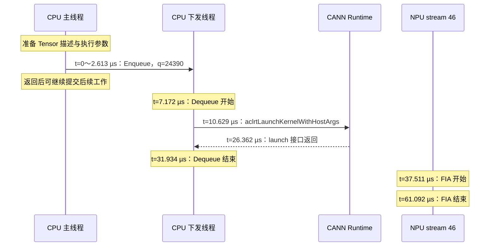

# FIA：什么时候提交、什么时候执行、参数怎样选择 `.o`

2026-10-02。P30 的下一小步，仅比较 BF16/KV 长度 42、BF16/43、FP16/42。**已确认“文件 → 加载的字节 → binary handle → tiling entry → function handle → launch”的身份链。** 长度 42→43 没换 binary 或入口；BF16→FP16 两者都换。

## 1. 先分清两组证据

| 证据 | 回答的问题 | 范围 |
|---|---|---|
| 原模型 `attention-01` profiler | FIA 何时入队、下发、在 NPU 开始/结束 | Qwen2.5-0.5B、PIECEWISE graph，decode 32 第一层的一次图外 attention |
| 本目录隔离探针 | 实际选哪个 `.o`，哪个入口，参数如何影响选择 | 使用相同 Q/K/V 形状和配置、固定合成数据，独立 eager FIA；每进程调用两次 |

探针没有重新跑完整模型，不能把它选中的文件冒充原模型那次调用已直接记录的文件。两者配置相符，为解释原路径提供强支持；严格关联仍需在模型进程记录同样的 binary 身份。两组绝对时钟和开销也不能混算。

实际环境：CANN 9.0.0、torch/torch-npu 2.10.0，NPU 910B2C。远端导入 vLLM `/vllm-workspace/vllm/vllm/__init__.py`，revision `ad7125a431e176d4161099480a66f0169609a690`；vLLM-Ascend `/vllm-workspace/vllm-ascend/vllm_ascend/__init__.py`，revision `80610e4438dba05011b05f89fc45d91e96992671`。完整路径和文件 SHA256 见 [selection.json](evidence/selection.json)。

## 2. 原模型中，FIA 什么时候被提交？

令主线程 `Enqueue@aclnnFusedInferAttentionScoreV3` 开始为 **t=0**。它的原始 profiler 时间为 `1790932150788349.338 µs`。以下是同一次调用，不是几个相邻同名算子的拼接：

| 事件 | 执行者 | 开始 / 结束，µs |
|---|---|---:|
| Enqueue：放入 torch-npu 主机任务队列 | 主线程 TID 1624824 | 0.000 / 2.613 |
| Dequeue：取出并执行主机任务 | 下发线程 TID 1625419 | 7.172 / 31.934 |
| `Node@launch` | 同一下发线程 | 9.896 / 26.706 |
| `aclrtLaunchKernelWithHostArgs` | 同一下发线程 | 10.629 / 26.362 |
| `FusedInferAttentionScore` 实际设备任务 | NPU stream 46，task 28820 | 37.511 / 61.092 |

所以“提交”需要指明层次：**t=0 是 CPU 入队；t=10.629 是开始调用设备 launch 接口；t=37.511 才是 NPU 开始计算**。设备耗时 23.581 µs。launch 返回到设备开始之间相隔 11.149 µs，这段不能全部命名为参数复制、调度或等前序任务；本次没有进一步分解。

关联依据是队列 correlation `24390`、CANN connection `45283`、设备 stream/task `46/28820` 及计算任务 CSV 第 9717 行（沿用分析器行号口径）。新提取的 `aclrtLaunchKernelWithHostArgs` 必须处于同一工作线程的 `Node@launch` 内且唯一；不是靠名字匹配。见 [model_launch.json](evidence/model_launch.json)、[原模型关联报告](../report/attention/attention.json)。



此图展示 Host 调用与设备执行的时间，不把 runtime 内部未观测的参数 DMA 画成确定事件。它也不意味着每次 launch 都要等 API 返回后设备才执行；这里只有这个样本呈现了这样的顺序。

## 3. 参数分三层看

**Python / torch-npu 接口层**：实际远端调用位于 `/vllm-workspace/vllm-ascend/vllm_ascend/attention/attention_v1.py:1146`。已从远端读取并冻结为 [对应源码](sources/06-attention_v1.py#L1146)。

```python
attn_output, _ = torch_npu.npu_fused_infer_attention_score(
    query=query, key=key, value=value,
    atten_mask=attn_metadata.attn_mask, block_table=block_table,
    input_layout="TND", block_size=block_size,
    actual_seq_lengths=attn_metadata.actual_seq_lengths_q,
    actual_seq_lengths_kv=actual_seq_lengths_kv,
    num_key_value_heads=self.num_kv_heads,
    num_heads=self.num_heads, scale=self.scale, sparse_mode=3,
)
```

| 参数 | 基线值 | 存在哪里 / 作用 |
|---|---|---|
| Q | BF16 `[1,14,64]` | NPU，当前一个 token 的 14 个 query heads |
| K、V | 各 BF16 `[10,128,128]`，stride `[16384,128,1]` | NPU 已有 KV pool 的 view；末维为 2 heads × 64 |
| block table | INT32 `[1,2]` | NPU，逻辑块到物理块的映射 |
| attention mask | INT8 `[2048,2048]` | NPU，传给 Python 接口的 mask dtype；不据此推断 CANN 内部描述未经适配 |
| query / KV 有效长度 | `[1]` / `[42]` | CPU Python 列表，容量与有效长度不同 |
| num_heads / num_key_value_heads | 14 / 2 | CPU 整数，GQA 的 head 分组 |
| layout / block_size | `TND` / 128 | 布局解释和分页块大小 |
| scale / sparse_mode | 0.125 / 3 | attention 缩放与 mask 模式 |

探针只将 block table 固定为 `[[3,0]]`，实际读取物理 B3 的前 42/43 个位置。原模型没有记录 block table 内容，不声称也使用 B3。所有设备 Tensor 在 FIA 前已分配、上传并同步；FIA 不需要把整块 Q/K/V 从 CPU 再上传一遍。具体地址见各 case 的 `parameters.json`；地址是进程/设备上下文中的设备指针，不是公开的物理 HBM 地址。

**aclnn 两段式接口层**：安装头文件 `/usr/local/Ascend/cann-9.0.0/include/aclnnop/aclnn_fused_infer_attention_score_v3.h:26` 声明 `GetWorkspaceSize`，`:49` 声明执行接口；见[冻结头文件](sources/aclnn_fused_infer_attention_score_v3.h)。前者接收 Tensor/TensorList 描述、长度数组、标量和输出描述，返回 workspace 大小及 executor；后者接收：

```cpp
aclnnFusedInferAttentionScoreV3(workspace, workspaceSize, executor, stream);
```

探针实际观察到默认参数 `preTokens=nextTokens=2147483647`、`innerPrecise=0`、`antiquantMode=0`、`softmaxLseFlag=false`、key/value antiquant mode 均为 0；workspace 为 **92,274,688 bytes（88 MiB）**。这是临时工作区请求，不能解释为 attention 的实际 KV 大小，也不等于本次新申请了同等大小的物理内存。

**runtime launch 层**：`/usr/local/Ascend/cann-9.0.0/include/acl/acl_rt.h:4445`，见[头文件](sources/acl_rt.h#L4445)。

```cpp
aclrtLaunchKernelWithHostArgs(funcHandle, numBlocks, stream, cfg,
                            hostArgs, argsSize,
                            placeHolderArray, placeHolderNum);
```

三种 case 均实测 `numBlocks=24`、`argsSize=2960`、`placeHolderNum=5`。这里是核函数 handle、执行网格、stream 与主机参数包。**2960 bytes 不是 Q/K/V Tensor 总大小**。本轮没有解码该参数包或 placeholder 的每个字段，因此不宣称已知道每个 kernel ABI 偏移，或 tiling data 的具体数值。

设备端源码的形参则包括 Q/K/V、mask、block table、输出、workspace、tiling 等地址；见下节。CPU 描述对象、长度列表、executor、binary/function handle 都不能当成 NPU 物理地址。

## 4. 第一次调用怎样找到已编译的代码？

在隔离基线的 scope 1 中，观察到完整链条：

```text
主线程 TID 1640280
  aclnnFusedInferAttentionScoreV3GetWorkspaceSize
    open 预装 FIA .o / .json
    aclrtBinaryLoadFromData(18,899,504 bytes)
      SHA256 与磁盘 .o 完全相同 → binary handle 558621344
    返回 workspace=92,274,688，executor=538679936

下发线程 TID 1640382
  aclnnFusedInferAttentionScoreV3(... executor=538679936 ...)
    aclrtBinaryGetFunctionByEntry(binary=558621344,
                                  entry=5000000000010200203)
      → function handle 538686960
    aclrtLaunchKernelWithHostArgs(function=538686960,
                                  blocks=24, stream=525433888, ...)
```

这些数是一次进程内的身份标识；换进程会变化。`analyze.py` 串联实际 handle，核验线程、范围包含、workspace、返回状态、文件/加载字节 SHA256 及 metadata 的入口，不能只看到文件被打开就认定它被执行。

同进程第二次调用仍记录到 `GetWorkspaceSize`，但没有新的 binary load 记录；复用同一 binary/function handle、相同 entry。**不把“没再加载”进一步写成“所有参数缓存都命中，没做 tiling”**，本轮没有捕获 CANN 内部 tiling/cache 的全部行为。

这与 torch-npu 安装头文件 `.../torch_npu/include/third_party/op-plugin/op_plugin/utils/op_api_common.h:306` 的 V1 包装结构一致：`:334–336` 转换参数并调用 workspace 接口，`:340–342` 准备 workspace，`:344–358` 构造执行闭包、通过 `RunOpApiV2` 提交。见[源码](sources/05-op_api_common.h#L306)。文件还包含其他宏/缓存路径，不将它们全部标为当前启用；本次线程归属由 hook 实测确认。

## 5. 参数怎样影响选择具体的 `.o`？

本次 binary 目录：

```text
/usr/local/Ascend/cann-9.0.0/opp/built-in/op_impl/ai_core/tbe/kernel/
ascend910b/ops_transformer/fused_infer_attention_score/
```

| 最小案例 | 实际文件（共同前缀 `FusedInferAttentionScore_`） | 实际 entry / tilingKey | workspace / blocks |
|---|---|---:|---|
| BF16，KV=42 | `3b093497fc536d61a77a7a3293a524da.o` | `5000000000010200203` | 88 MiB / 24 |
| BF16，KV=43 | 同上 | 同上 | 同上 |
| FP16，KV=42 | `8cd36e66e4ceb2d60ef96db29a147347.o` | `5000000000010200103` | 88 MiB / 24 |

**第一层：选择 binary 家族。** 安装的 `.../kernel/config/ascend910b/ops_transformer/fused_infer_attention_score.json`，前一个配置条目的 Q/K/V dtype 为 bfloat16、format 为 ND，shape 为动态 `[-2]`；`:473` 指向 BF16 binary 的 metadata。见[配置](sources/07-fused_infer_attention_score.json#L473)。匹配 FP16 配置则指向另一文件。配置中某些动态属性的 0/空值不是本次调用实参。

编译侧也可读：`.../impl/ops_transformer/dynamic/fused_infer_attention_score.py:63` 的 `add_dtype_fmt_option_single()` 将 dtype / format 转为编译宏，例如 `-DDTYPE_QUERY=bfloat16_t` 或 `half`。见[源码](sources/02-fused_infer_attention_score.py#L63)。**这解释不同 dtype 的预编译产物；不表示当前调用执行了该 Python 编译器。**

**第二层：在 binary 内选择特化入口。** BF16 文件的 metadata 有 **327 个 `kernelList` 条目**，FP16 有 333 个。FIA 不是“一种参数对应一个独立 `.o`”。BF16 metadata `:1781` 的 `tilingKey` 精确等于实际 `funcEntry`，并给出 `MIX_AIC`、`taskRation=1:2` 和带相同 key 后缀的 kernel 名。见[metadata](evidence/FusedInferAttentionScore_3b093497fc536d61a77a7a3293a524da.json#L1781)。这证明本次 `funcEntry` 与该 tilingKey 的对应，不是把任意 runtime entry 都笼统称为 tilingKey。

**第三层：同一入口接收本次运行数据。** 42→43 没换文件或 entry，但有效长度确实改变，结果按各自长度通过参考计算。它不需要为每个 token 长度重新编译。更大的长度变化是否会触发别的 entry、workspace 或 blockDim，当前三例未测，不能外推。

远端 `.../impl/ops_transformer/ascendc/fused_infer_attention_score/fused_infer_attention_score_tilingkey.h:181` 明确写出：

```cpp
#define QBF16_KVBF16_OUTBF16_NOLSEOUT_TND_PAGEDCACHE_CAUSALMASK_SPLITFUSE_TILING 5000000000010200203
```

相邻 FP16 常量在 `:155`。设备源码 `fused_infer_attention_score.cpp:216` 的实际同名分支为：

```cpp
#elif TILING_KEY_VAR == QBF16_KVBF16_OUTBF16_NOLSEOUT_TND_PAGEDCACHE_CAUSALMASK_SPLITFUSE_TILING
SplitFuse::FAInfer<bfloat16_t, bfloat16_t, float, true, false,
                  FaiKernel::MaskType::MASK_CAUSAL, FaiKernel::inputLayout::TND>(
    query, key, value, pse_shift, attenMask, blocktable, attentionOut, softmaxLse,
    actualSeqLengths, actualSeqLengthsKV, user, tiling, learnableSink);
```

见[常量](sources/04-fused_infer_attention_score_tilingkey.h#L181)及[分支](sources/03-fused_infer_attention_score.cpp#L216)。这是编译期 `#elif` 和模板特化；运行时选择对应已编译入口。dtype、layout、paged cache、mask、LSE 等影响可用特化；head 数、序列长度等也参与运行准备，但本轮没有恢复 Host tiling 函数的完整判定树。不能仅凭数字后缀猜每一位的含义。

官方[运行时加载机制](https://asc.gitcode.com/guide/programming_guide/advanced_programming/aclnn_operator_development/invocation/runtime_loading_mechanism.html)给出了相同的两阶段、binary 匹配与 TilingKey 框架；它是持续开发文档，此处具体结论仍以安装版本和实测为准。

## 6. “什么时候传给 NPU”现在知道到哪一层？

- **代码**：首次 scope 的 workspace 准备中，把与预装 `.o` 完全相同的字节交给 `aclrtBinaryLoadFromData`。BF16 SHA256 为 `68d62254dd49dcb398adb340636d4b8a7686aa6e67a4a6e3bc079bfd7bd76ae2`。`file` 识别它为设备 ELF executable，不能因 `.o` 后缀把它当成主机 x86 算子。已确认使用预装编译产物；具体何时编译、代码何时 DMA 到设备及是否延迟加载，本轮未观测。
- **输入数据**：Q/K/V 等已在 NPU 内存中；主机准备的是描述与访问这些数据所需的信息。原模型还需确保前序 KV 写入的 stream 顺序，见既有 attention 时间线。
- **执行参数**：执行器交给下发线程；runtime launch 接收 `hostArgs` 和其他调度参数。已确认接口边界和大小；参数包具体布局、复制起止与设备可见时间尚未记录。
- **真正开始计算**：只能以设备 profiler 的 kernel start 为证。原模型是 t=37.511 µs，不能用 Load、GetWorkspaceSize 或 Launch 的 CPU 时间代替。

`numBlocks=24`、metadata 的 MIX 类型和 1:2 配比是 launch/实现信息，不是每时刻有多少物理核繁忙的硬件利用率测量；核数观测仍属于已有未来任务。

## 7. 校验、恢复与复现

五个独立进程依次完成：无 hook 基线 → 三种诊断 → 无 hook 恢复，每个执行两次 FIA。全部通过 CPU FP32 attention 参考校验；三个诊断的最大绝对误差分别为 0.001993、0.001841、0.0002494。BF16 判据为 `atol=0.005, rtol=0.01`，FP16 为 `atol=0.001, rtol=0.01`；同进程两次输出精确一致，无 hook 基线 / BF16-42 诊断 / 无 hook 恢复也精确一致。

`LD_PRELOAD` 仅传给三个子进程，没有写入 shell 配置、修改已安装源码或接入现有服务。四个审计文件（libtorch_npu.so、FIA binary 配置、两个接口头文件）跨五次运行的前后哈希一致；最后 `npu-smi` 无运行进程。其他冻结源码是采集后的内容，不把它们误写成已做前后审计。hook 的 SHA256 计算和首次初始化显著增加 CPU 耗时，不拿探针测量值做正常推理性能对比。

本地离线核验，不需要 NPU：

```bash
/usr/bin/python3 practice_30_cpu_submission_timeline/fia_probe/analyze.py
/usr/bin/python3 -m unittest discover -s practice_30_cpu_submission_timeline/fia_probe -p 'test_*.py'
```

远端复现请使用新的独立目录，复制本目录脚本及 `sources/`，不要覆盖已有 `results/`。确认设备空闲、安装版本一致后执行（会使用 NPU，不是只读检查）：

```bash
python -B generate_hook.py
g++ -shared -fPIC -O2 -std=c++17 -Wno-deprecated-declarations \
  -I/usr/local/Ascend/cann-9.0.0/include hook.cpp -o hook.so -ldl -lcrypto

timeout -k 10s 90s env -u LD_PRELOAD python -B probe.py --output results/plain-before
timeout -k 10s 90s env LD_PRELOAD="$PWD/hook.so" python -B probe.py --hook --output results/bf16-l42
timeout -k 10s 90s env LD_PRELOAD="$PWD/hook.so" python -B probe.py --hook --length 43 --output results/bf16-l43
timeout -k 10s 90s env LD_PRELOAD="$PWD/hook.so" python -B probe.py --hook --dtype fp16 --output results/fp16-l42
timeout -k 10s 90s env -u LD_PRELOAD python -B probe.py --output results/plain-after
python -B collect.py
```

每条命令都必须成功；失败后停止后续诊断，保留日志，并在设备已无残留实验进程后执行无 hook 恢复检查。原始实测用 `timeout 90s`；上面的复现命令额外加 `-k 10s` 限制超时清理。collector 验证当前头文件与冻结声明一致，版本不同应先重新核对 ABI，不能直接套用 hook。

文件入口：[probe.py](probe.py) 生成输入/调用/校验；[hook.cpp](hook.cpp) 与 [generate_hook.py](generate_hook.py) 原样转发接口、记录身份；[collect.py](collect.py) 读取 metadata 与审计；[analyze.py](analyze.py) 拒绝身份不匹配的关联。CANN `.o` 和本地编译的 `hook.so` 没有分发到仓库。

[extract_model.py](extract_model.py) 可从原始 `attention-01` 的 `ASCEND_PROFILER_OUTPUT/trace_view.json` 重新提取唯一 launch；归档提取结果包含原 trace SHA256 和事件索引。本地 `evidence/summary.json` 是离线再生成产物。
