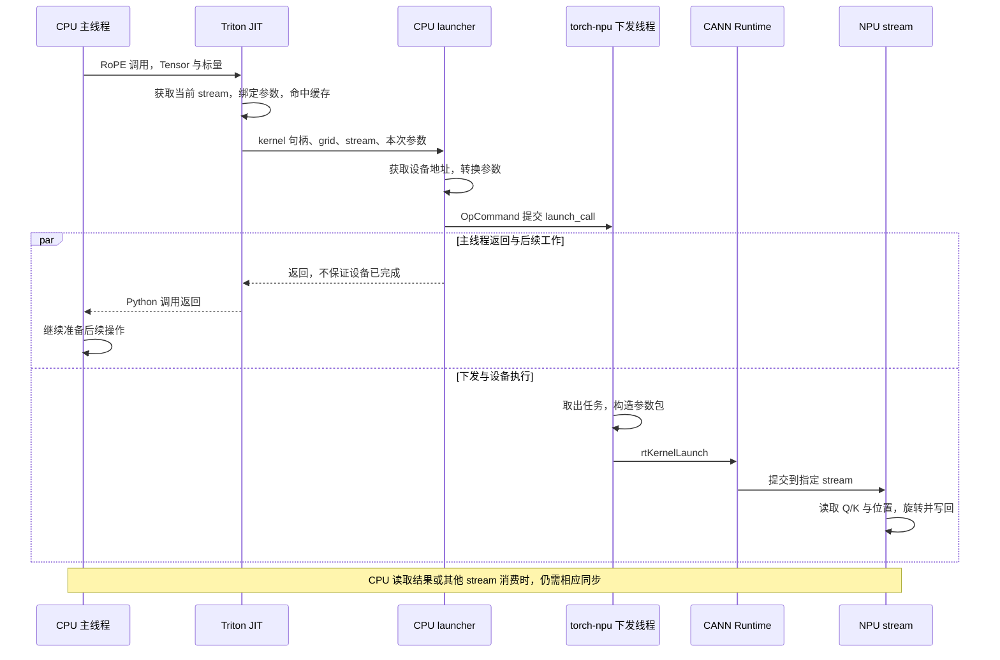

# Triton JIT 与 Ascend launcher：从 RoPE 调用到 NPU 执行

记录日期：2026-10-02。本文抽离 Practice 30 的 RoPE 调查，用于逐步阅读真实代码。依据是当日通过 `ssh ascend910` 只读检查的远端安装源码、运行时对象，以及 P30 已有缓存产物和 trace；本次整理没有重新运行推理或修改远端库。

**JIT 决定使用哪一个编译版本；launcher 把该版本和本次参数提交出去；NPU 执行已经编译好的指令。** 编译、注册、提交和设备执行是不同阶段，不能把它们的时间混为一谈。

关联材料：[P30 forward 分析](../../practice_30_cpu_submission_timeline/FORWARD_RESULTS.md) · [RoPE 精确关联图](../../practice_30_cpu_submission_timeline/report/forward/rope.svg) · [分析数据](../../practice_30_cpu_submission_timeline/report/forward/forward.json) · [Stream 源码分析](../streams_in_vllm_source_code/README.md)。

## 1. 版本、路径与证据范围

| 项目 | 本次检查的环境 |
|---|---|
| vLLM | `/vllm-workspace/vllm`，revision `ad7125a431e176d4161099480a66f0169609a690` |
| vLLM-Ascend | `/vllm-workspace/vllm-ascend`，revision `80610e4438dba05011b05f89fc45d91e96992671` |
| Triton 实际导入位置 | `/usr/local/python3.12.13/lib/python3.12/site-packages/triton/__init__.py`，报告版本 `3.2.0` |
| 研究对象 | Qwen2.5-0.5B-Instruct，Ascend910B2C，P30 eager 预热后的单次 RoPE |
| 原始实验目录 | `/data/tianchi/practice_30_cpu_submission_timeline/results/forward-01` |

下文 `T/` 是远端路径 `/usr/local/python3.12.13/lib/python3.12/site-packages/triton/` 的缩写。源码行号对应此次安装版本，不保证适用于其他 Triton/Ascend 版本；`3.2.0` 版本字符串本身也不足以确定完整构建 revision。

证据分三层：**安装源码**说明实现及可选分支；**实际方法代码对象、缓存 IR/元数据和动态库符号**验证所使用的实现与产物；**已有 trace**验证本次调用发生的队列和设备事件。静态代码或 `.so` 中存在一个符号，单独都不能证明某一次调用已经执行它。

## 2. 先纠正 `rope_native` 的边界

P30 的 observer 包装了 `CompiledKernel.run`，记录类型名为 `ascend.NPULauncher`。先前仅根据类型检查失败，将它描述成 native 类，这个判断不准确。

此次直接检查实际方法的 `__code__`，得到：

```text
NPULauncher.__init__ → T/backends/ascend/driver.py:105
NPULauncher.__call__ → T/backends/ascend/driver.py:127
NPUDriver.__init__   → T/backends/ascend/driver.py:145
```

**`NPULauncher` 是 Python 包装类，它的 `self.launch` 才是加载的 C++ 扩展入口。** 类型名含 `ascend`、或者 `inspect.getsourcefile(cls)` 报 built-in class，都不足以否定方法代码对象提供的证据。

因此，历史事件名 `rope_native` 保留用于关联原始记录，但其含义应读作“launcher 包装调用范围”，包含 Python 包装和 C++ 调用，并非纯 C++ 耗时。本次没有改写历史 trace，也没有新增 native 内部逐函数计时。

## 3. 从 RoPE 的 Python 调用进入 JIT

入口路径：

```text
/vllm-workspace/vllm-ascend/vllm_ascend/ops/rotary_embedding.py:153
  rope_forward_oot
    → :168 Triton 分支
/vllm-workspace/vllm-ascend/vllm_ascend/ops/triton/rope.py:256
  rope_forward_triton
    → :285 _triton_rope[(n_row,)](...)
```

`rope_forward_triton` 先检查 Q/K 连续性，必要时调用 `.contiguous()`，然后读取形状、stride 并计算 `n_row = min(num_tokens, num_vectorcore)`。核心调用可简写为：

```python
# 示意：省略部分实参，完整顺序见远端 rope.py:285。
_triton_rope[(n_row,)](
    q, q.stride(0),
    k, k.stride(0),
    ...,
    cos_sin_cache, cos_sin_cache.stride(0),
    positions, num_tokens,
    ...,
)
```

这里的 Q/K 是 Python Tensor 对象，数据位于 NPU 内存；stride、token 数等描述如何访问数据；`(n_row,)` 是启动 grid。此时 Python 尚未执行 RoPE 的旋转计算。

`@triton.jit` 将 `_triton_rope` 包装成 `JITFunction`。方括号语法来自 `T/runtime/jit.py:327` 的 `KernelInterface.__getitem__`：

```python
return lambda *args, **kwargs: self.run(
    grid=grid, warmup=False, *args, **kwargs
)
```

所以 `_triton_rope[grid](...)` 首先进入 **CPU 上的 `JITFunction.run()`**。

## 4. JIT 的参数绑定、特化与缓存

`T/runtime/jit.py:566` 的主要流程如下，省略 hooks 和检查代码：

```python
device = driver.active.get_current_device()
stream = driver.active.get_current_stream(device)

bound_args, sig_and_spec, constexpr_vals, \
    non_constexpr_vals, excess_kwargs = self.binder(*args, **kwargs)

key = ''.join(sig_and_spec) + str((constexpr_vals, excess_kwargs))
kernel = self.cache[device].get(key, None)

if kernel is None:
    kernel = self._do_compile(...)
```

### 4.1 binder 在做什么？

binder 负责绑定位置参数、关键字参数和默认值，并形成参数类型、特化信息、编译期常量和运行期实参。

| 参数类别 | RoPE 中的例子 | 作用 |
|---|---|---|
| Tensor | Q、K、positions、cos/sin 表 | 识别指针类型，启动时取得设备地址 |
| 普通标量 | stride、`num_tokens` | 参与运行；某些数值或对齐条件可能触发特化 |
| `tl.constexpr` | head dimension、`IS_NEOX_STYLE`、`BLOCK_SIZE_HEAD` | 在编译时确定代码结构 |
| 编译选项 | debug 等 | 影响编译版本与缓存选择 |

`T/runtime/jit.py:348` 的 `create_function_from_signature()` 构造 `dynamic_func` 的 Python 源码字符串，再动态执行生成 binder。`:396` 可以看到生成模板。它不是独立保存的手写函数文件；查生成器可以理解其行为，不能为生成函数编造独立文件行号。

### 4.2 什么叫特化？

特化是针对已知条件生成专门版本，例如 `IS_NEOX_STYLE=True` 在编译时选择对应旋转逻辑，对齐信息也可用于优化。部分普通参数也可能被识别为常量，最终不再出现在设备函数参数中。

**Q/K 的数值改变通常不会导致重新编译。** 缓存选择关注参数类型、编译期常量及特化条件；同一个编译版本可以读取多次调用的不同数据。也不能反过来认为所有不同形状、stride 或标量都一定共享同一个版本。

### 4.3 缓存命中分三个层次

| 状态 | 本次要做的工作 |
|---|---|
| 进程内已有对应 kernel，且句柄已初始化 | 使用现成对象，准备启动 |
| 进程内没有，磁盘已有对应编译产物 | 读取缓存，建立本进程的对象和句柄 |
| 进程内和磁盘均没有对应版本 | 执行编译流水线，再准备启动 |

`_do_compile()` 位于 `T/runtime/jit.py:764`。进入它并不等于真正重新生成机器码：`T/compiler/compiler.py:256` 仍会检查磁盘缓存，命中时返回 `CompiledKernel`。launcher `.so` 还有自己的缓存，见第 6 节。

## 5. 真正编译时发生什么？

当前 Ascend A2/A3 路径可按以下阶段阅读：

```text
Triton Python 函数 + 类型/编译期常量
    ↓ AST 与代码生成
Triton IR：.ttir
    ↓ Ascend 转换
中间表示：.ttadapter
    ↓ Ascend 编译工具
设备二进制：.npubin
```

`T/compiler/compiler.py:224` 是编译入口，`:282` 构造初始 IR，`:287` 遍历编译阶段，`:308` 保存各阶段产物。阶段注册在 `T/backends/ascend/compiler.py:939`；当前 A2/A3 二进制生成函数位于 `:502`，`:663` 通过 `subprocess.run(...)` 调用编译工具。

P30 原始实验缓存中确实存在以下文件，并非只根据函数名推断：

```text
/data/tianchi/practice_30_cpu_submission_timeline/results/
forward-01/diagnostic/triton_cache/<缓存目录>/
    _triton_rope.ttir
    _triton_rope.ttadapter
    _triton_rope.npubin
    _triton_rope.json
```

三个 RoPE 缓存版本的元数据均记录：`arch=Ascend910B2C`、`name=_triton_rope_aiv`、`mix_mode=aiv`、`parallel_mode=simd`、`force_simt_only=False`、`compile_on_910_95=False`。`.ttir` 中能看到 BF16 Q/K 指针、INT64 position 指针以及部分已消除的参数。

例如 `LvkYUs4ZsJSs_hpV6Il6ZsJsuTUGfY1c_X1dGvdeARY/_triton_rope.json` 对应 hash `2ef91852ce19b094acfe1a55e8897a66c26cb935067d8d5cfd7d5d1af75e0116`。这些文件支持“已生成编译产物”；它们不提供编译内部每个 pass 的耗时。

## 6. 两种可执行产物：设备 kernel 与主机 launcher

| 产物 | 执行位置 | 职责 |
|---|---|---|
| `_triton_rope.npubin` | NPU | 读取 Q/K，执行旋转，写回结果 |
| `launcher_cxx11abi*.so` | CPU | 解析参数、获取地址、构造任务、调用运行时 |

两者由 `T/compiler/compiler.py:403` 的 `CompiledKernel._init_handles()` 接起来：

```python
self.run = driver.active.launcher_cls(self.src, self.metadata)
self.module, self.function, self.n_regs, self.n_spills = \
    driver.active.utils.load_binary(
        self.name, self.kernel, self.metadata.shared, device
    )
```

方法开头检查 `self.module is not None`，已初始化就返回。访问 `run` 时通过 `__getattribute__` 触发该检查；不意味着每次启动都会重新注册。

### 6.1 生成并加载 CPU launcher

`T/backends/ascend/driver.py:105` 的 `NPULauncher.__init__` 根据参数签名、常量和 metadata 生成 C++ 包装源码，通过 `make_npu_launcher_stub()` 获取 `.so`，再加载其中的 `launch` 函数：

```python
wrapper_src = generate_npu_wrapper_src(constants, signature, metadata)
so_launcher_path = make_npu_launcher_stub(header_src, wrapper_src, metadata.debug)
# 经 importlib 加载 mod 后：
self.launch = getattr(mod, "launch")
```

`make_npu_launcher_stub()` 位于 `driver.py:244`：以生成的包装源码计算缓存键，`:271` 检查已有 `.so`；只有未命中才在 `:282` 构建扩展。因此 launcher 也不必每次重新编译。

### 6.2 向 CANN 注册设备 kernel

`driver.py:77` 的 `load_binary()` 调用 `npu_utils` 扩展。实际 C++ 源码在 `T/backends/ascend/npu_utils.cpp`：

```cpp
// :62
rtDevBinaryRegister(&devbin, &devbinHandle);
// :73，省略其余参数
rtFunctionRegister(devbinHandle, func_stub_handle, ...);
```

`function` 是供运行时识别 kernel 的注册句柄，不能当成设备机器指令的物理地址。源码确认二进制交给 CANN 注册；CANN 内部何时实际搬运代码、是否延迟加载，需要更底层证据，不能仅凭此函数确定。

## 7. 一次 launcher 调用内部做什么？

JIT 在 `T/runtime/jit.py:650` 将 grid、当前 stream、已注册的 function、metadata 和本次实参交给 `kernel.run(...)`：

```text
NPULauncher.__call__       Python 包装
    ↓ self.launch(...)
launch()                  .so 内的 C++ 入口
    ↓
_launch()                 构造提交逻辑
```

### 7.1 参数转换与设备地址

`driver.py:876` 开始的生成代码使用 `PyArg_ParseTuple()` 提取 Python 实参。`:533` 的 `getPointer()` 支持整数地址、`None` 或带 `data_ptr()` 的 Tensor 对象；对 Tensor 获取地址后调用 `aclrtPointerGetAttributes()` 检查地址属性。

**取得 Q/K 的设备地址不等于把整个 Tensor 重新从 CPU 复制到 NPU。** Q/K 已位于 NPU 内存，launcher 传递地址和访问参数。RoPE 包装层在不连续输入上可能产生的 `.contiguous()` 是另一段操作，不能混进“取得地址”的含义。

### 7.2 参数包与任务闭包

`driver.py:777` 在启用 taskqueue 时生成按值捕获的 `launch_call`；`:817` 在其中构造符合 kernel ABI 的参数结构体。内容包括未被编译期消除的指针和标量、grid，以及条件启用的辅助字段。

简化结构如下，实际字段由签名和 metadata 决定：

```text
Q 地址 / Q stride
K 地址 / K stride
cos/sin 表地址 / stride
positions 地址
剩余运行期标量
grid / 辅助参数
```

闭包中真正提交设备任务的默认代码在 `driver.py:734`：

```cpp
ret = rtKernelLaunch(
    func, blockNum, static_cast<void*>(&args), sizeof(args), NULL, stream
);
```

这里的 `blockNum` 是 kernel 启动并行块数，与 KV cache 的 physical block 不是同一个概念。grid 和物理核之间还可能存在后端映射，不能把任意 grid 直接当成实际利用的核数。

### 7.3 torch-npu 队列与下发线程

`T/backends/ascend/backend_register.py:333` 为 torch-npu 生成：

```cpp
at_npu::native::OpCommand cmd;
cmd.Name(name.c_str()).SetCustomHandler(launch_call).Run();
```

P30 的 trace 记录了该次 RoPE 的 Enqueue 与另一线程上的 Dequeue，支持“主线程提交任务、下发线程取出并执行提交逻辑”这条实际路径。检查实验缓存中的 launcher `.so`，也能找到 `OpCommand::SetCustomHandler`、`OpCommand::Run`、`aclrtPointerGetAttributes` 和 `rtKernelLaunch` 的动态符号引用。

当前 stream 在 JIT 开头获取。`T/backends/ascend/backend_register.py:262` 优先使用 `_npu_getCurrentRawStreamNoWait`，不存在时回退到 `_npu_getCurrentRawStream`。这里沿用当前 stream，不是每调用一次 RoPE 就创建一条新 stream。

### 7.4 可选分支不等于当前执行路径

| 源码中的分支 | 本次可以确认的范围 |
|---|---|
| `TRITON_ENABLE_TASKQUEUE` 默认开启，生成 `OpCommand` 提交 | 本次队列事件与缓存 `.so` 支持该路径 |
| 关闭 taskqueue | `driver.py:839` 的此版本生成代码会调用 `rtStreamSynchronize(stream)`；本次未测试该分支 |
| 910_95 与 SIMT 的特殊启动 | `driver.py:736` 可选择 `rtKernelLaunchWithFlagV2`；本次 RoPE metadata 不满足该条件 |
| workspace、跨块锁、调试输出等 | 都有条件生成逻辑，不能视为每次 RoPE 必然分配、拷贝或同步 |

按值捕获指针不等于自动持有 Tensor 的整个存储生命周期。若将任务移到其他 stream，仍需独立维护生产/消费顺序及内存存活；本文没有完整审计 allocator 的跨 stream 生命周期保证。

## 8. 已预热调用的时序图

以下对应 P30 eager 的缓存命中路径，不包含首次编译和注册。不同 CPU 线程及设备间的实际重叠仍以 trace 为准；下发线程可以在 Python 返回之前就开始处理任务。



launcher 返回、下发线程提交完成、NPU 完成计算，是不同时间点。同一 stream 上后续提交的消费者可利用设备顺序读取结果；CPU 读取或跨 stream 消费则需要相应同步保证。

## 9. 与 P30 的观测如何对应？

已有记录的精确关联链是：

```text
CPU rope_native scope（包含 Python launcher 包装）
    → Enqueue@_triton_rope，correlation 54355
    → Dequeue，correlation 54355
    → CANN connection 101148
    → NPU stream 46 / task 55088 / RoPE kernel
```

选中调用的编译次数为 0；预热留下的三个缓存 kernel 均已初始化，前后缓存指纹相同。所以本次测量的是已有 kernel 的启动与执行，不是冷启动编译成本。

| 记录范围 | 耗时 | 正确含义 |
|---|---:|---|
| `rope_native` 内部墙钟 | 36.460 µs | Python launcher 包装及其 C++ 调用范围 |
| 同一调用的 profiler 外层范围 | 50.780 µs | 包含 profiler 标记边界，不能与上一行混算 |
| NPU RoPE kernel | 3.320 µs | 精确关联到的设备 kernel 持续时间 |

这些数值不是可串行相加的三个阶段。观察本身明显扰动了选中 RoPE 的 Host 时间，不能直接推广成生产环境的稳定开销比例，也不能把 Host 调用时间解释成 CPU 全程等待 NPU。

在 P30 的 PIECEWISE graph decode 中，相关 RoPE kernel 位于捕获分区内；replay 复用已捕获任务，不需要为每一个图内 RoPE 再走一次上述完整 Python JIT/launcher 调用。本文详解的是 eager 热路径，不能把它按 kernel 数机械套到每次 graph replay 上。

## 10. 建议阅读顺序与尚未回答的问题

| 顺序 | 远端文件及行号（`T/` 前缀见第 1 节） | 带着什么问题读 |
|---|---|---|
| 1 | `/vllm-workspace/vllm-ascend/vllm_ascend/ops/triton/rope.py:256` | 调用者把哪些 Tensor、stride 和常量交给 kernel？ |
| 2 | `T/runtime/jit.py:566` | 每次调用检查什么？缓存命中后还做什么？ |
| 3 | `T/runtime/jit.py:348` | binder 的 `dynamic_func` 如何生成？ |
| 4 | `T/compiler/compiler.py:224`；`T/backends/ascend/compiler.py:939` | 磁盘缓存与真正编译的分界在哪里？ |
| 5 | `T/compiler/compiler.py:403` | 何时初始化 launcher 和 kernel 句柄？ |
| 6 | `T/backends/ascend/driver.py:104、244` | CPU launcher 如何生成、缓存和加载？ |
| 7 | `T/backends/ascend/npu_utils.cpp:40` | 二进制和函数如何注册给 CANN？ |
| 8 | `T/backends/ascend/driver.py:533、764、876` | Python 参数如何转换成地址、闭包和 ABI 参数包？ |
| 9 | `T/backends/ascend/backend_register.py:333` | 如何借助 torch-npu 提交自定义任务？ |

已经解释到 `rtKernelLaunch` 边界，但仍未完成：各 C++ 子步骤的耗时分解、CANN 内部代码/参数搬运的具体时刻、底层设备调度，以及 launcher 所依赖的完整跨 stream 内存生命周期保证。当前证据也不包含首次编译各个 pass 的时间。

后续遵循“先做薄，再做厚”：若继续测量，先选同一处已预热的 RoPE，进一步拆解一个未解释的边界，并检查插桩扰动，不立即增加大量模型、形状或 benchmark 组合。
