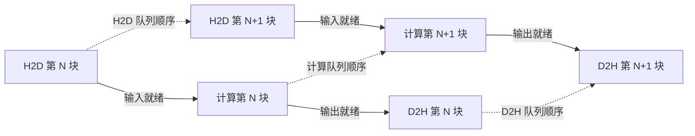
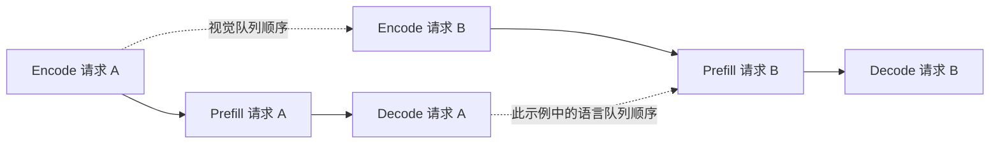

# CUDA 多 Stream：应用场景、同步依赖与图分析

整理日期：2026-09-28。本文以用户提供的五类应用场景为线索，补充 NVIDIA 官方文档、论文及框架文档，并关联本仓库的 kernel execution graph 实验。

原材料中的 `16more_horiz` 等编号没有对应参考文献，本文不将其作为引文，而是重新提供可追溯来源。以下是资料整理与研究推论，**不是本仓库新增的 CUDA 实机实验结果**；已有 Ascend 实验也不能直接证明 CUDA 框架具有相同实现。

## 1. 多 Stream 解决什么问题

多 stream 为不同任务提供可以独立推进的执行队列。实际能否并发，还取决于依赖、硬件资源、提交时机及运行时行为。创建两条 stream 不保证两个 kernel 同时执行，也不保证性能提升。[CUDA 异步执行指南](https://docs.nvidia.com/cuda/cuda-programming-guide/02-basics/asynchronous-execution.html)

| 场景 | 希望重叠的工作 | 必须保留的依赖 | 图分析的合适范围 |
|---|---|---|---|
| 计算与数据传输 | 下一块 H2D、当前块计算、上一块 D2H | 输入就绪、输出就绪、缓冲区复用 | 含 memcpy 和内存生命周期的流水线图 |
| 算子间并行 | 拓扑上独立的算子或分支 | RAW / WAR / WAW、分支汇合 | 单次 forward 的算子 / kernel DAG |
| 多模态流水线 | 不同请求的视觉编码和语言阶段 | 每个请求自己的图像特征和 KV 就绪 | 多请求、跨阶段 DAG |
| 有依赖 kernel 的细粒度重叠 | 已就绪 tile 的消费与后续 tile 的生产 | tile 数据就绪及内存可见性 | tile / thread-block 级 DAG |
| 多请求并发服务 | 独立请求或不同 graph 实例 | 请求内部依赖、共享状态和工作区安全 | 多请求执行图与资源竞争分析 |

这里的 RAW 是“写后读”，WAR 是“读后写”，WAW 是“写后写”。它们约束数据访问；stream FIFO 和 event wait 是实现这些约束的执行机制。两者不能混为同一种边。

## 2. 先明确同步语义

对于普通 kernel launch，同一 stream 内的工作按序执行；跨 stream 的数据消费者需要有可靠的就绪关系。最常见的设备侧连接方式如下，省略创建、销毁和错误处理：

```cpp
producer<<<grid_a, block_a, 0, stream_a>>>(buffer);
cudaEventRecord(ready, stream_a);
cudaStreamWaitEvent(stream_b, ready, 0);
consumer<<<grid_b, block_b, 0, stream_b>>>(buffer);
```

`ready` 表示 stream A 中排在该次 record 之前的工作完成；wait 约束 stream B 中随后提交的工作，不要求 CPU 等到 producer 完成才继续提交。相反，`cudaStreamSynchronize`、`cudaEventSynchronize` 是 host 等待，`cudaDeviceSynchronize` 的等待范围更大。详见 [CUDA 同步规则](https://docs.nvidia.com/cuda/cuda-programming-guide/02-basics/asynchronous-execution.html)。

还需注意三个边界：

- legacy default stream 可能引入隐式同步；per-thread default stream 和 non-blocking stream 的语义不同。下文使用 `S_H2D` 等名字，只是队列标签，不把“Stream 0”当作 CUDA 的特殊 NULL stream。
- “API 异步返回”“设备存在多条队列”“设备任务实际重叠”是三个不同事实。普通同流顺序也不应推广成覆盖所有特殊执行机制的绝对结论，例如 programmatic dependent launch 需要单独分析。[官方执行语义](https://docs.nvidia.com/cuda/cuda-programming-guide/02-basics/asynchronous-execution.html)
- 内存生命周期和执行依赖都要成立。PyTorch 的 `record_stream` 用于告知 allocator 某存储还在另一 stream 使用，不能替代 producer → consumer 的 event wait。参见本仓库对 [CUDA Stream Sanitizer 的源码分析](../pytorch_cuda_stream_san/README.md)。

## 3. 五类核心应用

### 3.1 计算与 H2D / D2H 传输重叠

将数据分块后，可以让 `S_H2D` 传输第 N+1 块、`S_compute` 计算第 N 块、`S_D2H` 回传第 N−1 块。每一块内部仍需满足：



图中 H1 和 C0 没有直接依赖，因而存在重叠机会；是否实际重叠需看 trace。要实现预期的 host/device 异步传输与计算重叠，需要 pinned host memory、设备 copy engine 支持及合适的 stream 使用方式。两个方向的传输能否同时重叠还受硬件能力限制；不能认为调用 `cudaMemcpyAsync` 就必然获得三阶段并发。[CUDA Best Practices：异步传输与计算重叠](https://docs.nvidia.com/cuda/cuda-c-best-practices-guide/index.html#asynchronous-and-overlapping-transfers-with-computation)

双缓冲还会引入图中未画出的复用边：H2D 读完之前不能改写对应 host 输入；计算或 D2H 完成之前不能覆盖仍被使用的 device 槽位；CPU 读回传结果前也必须确认 D2H 完成。本仓库的 [vLLM KV offload 同步问题分析](../vllm_syn_issuse_analysis/README.md) 展示了为何仅有“拷贝完成”或仅有“计算完成”不够，必须连接生产、消费、覆盖与回收过程。

HydraInfer 论文描述了 KV / image cache 的异步迁移，使用 CUDA IPC 与 NCCL 支持不同位置间的传输。但“每类迁移均使用独立 stream，且实际与 decode 重叠”仍需源码或 trace 证据；不能从“异步迁移”直接推出这一实现结论。[HydraInfer §4.3](https://arxiv.org/html/2505.12658v1)

### 3.2 单次模型执行中的算子间并行

对于独立分支，或者共享只读输入但写入不同输出的算子，可以研究将其提交到不同 stream。分支汇合点等待全部必需输入；原地操作、别名和 workspace 复用也可能引入额外约束，不能只看模块结构是否分叉。

- [IOS：Inter-Operator Scheduler for CNN Acceleration](https://arxiv.org/abs/2011.01302) 研究 CNN 算子的并行调度，利用动态规划寻找适合目标硬件的执行安排；配套有[作者实现](https://github.com/mit-han-lab/inter-operator-scheduler)。其结论不能不加验证地推广到所有 Transformer forward。
- [Opara：Exploiting Operator Parallelism for Expediting DNN Inference on GPUs](https://arxiv.org/abs/2312.10351) 利用算子并行，并考虑资源使用、相互干扰和发射顺序，结合 CUDA streams / CUDA Graph 支持执行。

原材料中“小算子 SM 效率甚至低于 10%”缺少具体模型、硬件及指标定义，本文不保留为通用定量结论。SM 活跃率、occupancy、算力利用率也不是同一个指标。后续应同时验证独立性、真实重叠和端到端收益，而不是仅用“小算子”判断是否值得分流。

### 3.3 多模态与跨请求流水线

HydraInfer 的 dual-stream 方案使用视觉 stream 和语言 stream，重叠**不同请求**的视觉编码与语言阶段。它不是说同一请求可以在图像特征尚未就绪时直接执行依赖这些特征的语言计算。[HydraInfer：架构与调度设计](https://arxiv.org/html/2505.12658v1)

据此，一个便于理解的依赖示意是：



这个图是依赖示意，不是论文 trace 的复刻。VB 可在请求 A 的语言阶段推进，但 PB 仍要等待 VB。因而，**单请求 forward 的 DAG 即使接近一条链，多请求合起来仍可能出现可并行的阶段**。应当明确分析窗口到底是一次 forward、一个完整请求，还是服务端同时在途的多个请求。

### 3.4 有依赖 kernel 的 tile 级重叠

[cuSync 论文](https://arxiv.org/abs/2305.13450)及其[作者实现](https://github.com/microsoft/cusync)研究细粒度同步：consumer 等待其所需 tile 的数据就绪，而不是等待整个 producer kernel 结束。实现需要相应的 kernel 改造、设备侧同步与内存可见性保证，不能只把两个现成的依赖 kernel 改投到不同 stream。

以 consumer 的第 i 个 tile 只依赖 producer 的第 i 个 tile 为例：

```text
整个 kernel 作为节点：  Producer ──完成后──> Consumer

细化数据就绪粒度：      P0 ──就绪──> C0
                       P1 ──就绪──> C1
                       P2 ──就绪──> C2
```

若没有其他约束，C0 可以在 P1 / P2 尚未完成时开始。这里改变的是节点粒度及同步实现，数据依赖并未消失；真实算子也可能存在跨 tile 依赖，必须按算法建图。

对本仓库研究的推论：kernel 级关键路径很长，只能说明**在当前节点粒度和执行约束下**可重排空间较小。它不排除通过 tile 级流水线、算子融合或其他 kernel 改造获得收益。cuSync 不能视为普通自动 stream 分配算法的直接效果。

### 3.5 多请求、多实例并发服务

不同请求可以使用不同 stream 提交计算，以利用单个请求未用满的资源。一个明确的官方例子是 TensorRT 的 cross-inference multi-streaming：使用不同 execution context，在不同 stream 上执行推理。它还区分单次推理内部的 auxiliary streams 和不同推理之间的 streams。[TensorRT 性能指南](https://docs.nvidia.com/deeplearning/tensorrt/latest/performance/optimization.html#cross-inference-multi-streaming)

但不能据此认为 vLLM、TGI、ONNX Runtime 默认都采用“一请求一 stream”：

- [vLLM](https://github.com/vllm-project/vllm) 支持 continuous batching，多请求可参与同一次模型执行。是否另开 stream、用来执行哪个阶段，需查具体版本和后端；“支持并发请求”本身不是 stream 分配策略的证据。
- [ONNX Runtime CUDA EP](https://onnxruntime.ai/docs/execution-providers/CUDA-ExecutionProvider.html) 提供 `user_compute_stream`、`use_ep_level_unified_stream` 等配置，执行 stream 取决于配置；其 CUDA Graph 使用文档还对同一 session 的并发 `Run()` 作出限制。
- 本文没有核验 TGI 某个具体版本的 stream 分配实现，因此不把它作为“每请求独立 stream”的已证实例。

CUDA Graph 也需区分 graph 实例和发射 stream：同一个 `cudaGraphExec_t` 的多次 launch 不会因换一条 stream 就并发执行；需要并发 graph 执行时，应实例化多个 executable graphs，并另外保证数据和工作区安全。[CUDA Runtime：cudaGraphLaunch](https://docs.nvidia.com/cuda/cuda-runtime-api/cuda_runtime_api/group__CUDART__GRAPH.html)

并发还会争用计算单元、带宽和缓存，可能使单请求延迟变差。因此“有 overlap”“吞吐量提高”“满足延迟目标的 goodput 提高”应分别测量，不能当作同一结论。[TensorRT 关于并发资源竞争的说明](https://docs.nvidia.com/deeplearning/tensorrt/latest/performance/optimization.html#cross-inference-multi-streaming)

## 4. 与本仓库已有实验的对应关系

| 已有材料 | 已能支持的认识 | 尚不能推出的结论 |
|---|---|---|
| [CUDA Stream Sanitizer 源码分析](../pytorch_cuda_stream_san/README.md) | 用访问冲突与 happens-before 判断是否缺少同步 | 检测到潜在竞争不等于测到了 kernel 同时执行 |
| [KV offload 同步案例](../vllm_syn_issuse_analysis/README.md) | 拷贝也必须纳入数据依赖与存储复用分析 | 任意异步拷贝都能安全与计算重叠 |
| [Practice 15：execution graph](../../practice_15_kernel_execution_graph/README.md) | 区分 host 提交、设备 stream 顺序、event 与可见数据依赖 | 观测到单 stream 就能排除模型的潜在分支 |
| [Practice 16：独立算子并行](../../practice_16_multistream_parallel/README.md)及[跨流依赖实验](../../practice_16_multistream_parallel/CROSS_STREAM_DEPENDENCY.md) | 独立工作可以重叠；依赖消费者仍需要正确等待 | 独立算子的收益可直接套用到整个模型 |
| [Practice 17：vLLM 多 stream](../../practice_17_vllm_multistream/README.md) | 已观测 Ascend 采样分支与模型使用不同物理 stream | vLLM 普遍按请求分配 stream，或整个 forward 自动拆流 |
| [Practice 18：数据依赖与调度](../../practice_18_kernel_data_dag/README.md) | 可见数据依赖投影上的关键路径和离线分流分析 | 已完成精确原生逐 kernel DAG，或已实机验证自动分流 |

因此，后续 DAG 分析应先写清三个条件：

1. **分析范围**：单次 forward、完整请求、多请求，还是包含传输的服务流水线。
2. **节点粒度**：框架算子、实际 kernel / memcpy，还是 tile。更换粒度可能需要新的采集手段和执行实现。
3. **边的依据**：数据访问、stream FIFO、event wait、host 同步、存储复用分别标记；未观测到的原生 workspace 依赖继续保留为覆盖缺口。

这五类场景提供的是不同层次的并行机会。它们不会推翻某次单流 trace 的观测，却能帮助界定：该观测覆盖了哪些工作、还没有研究哪些并行机制。
