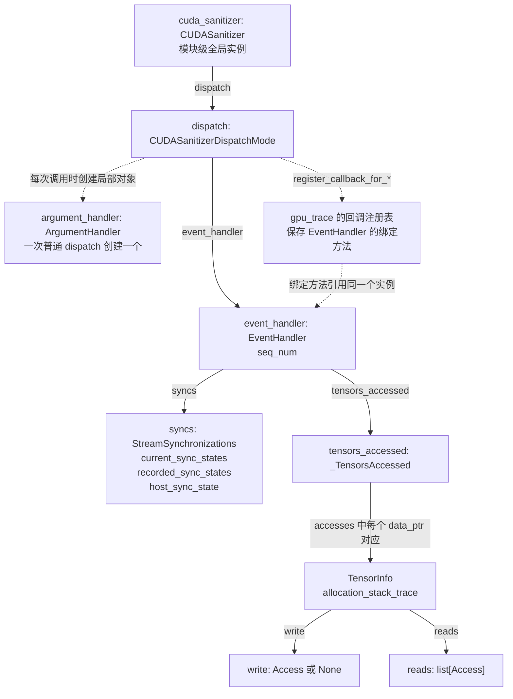
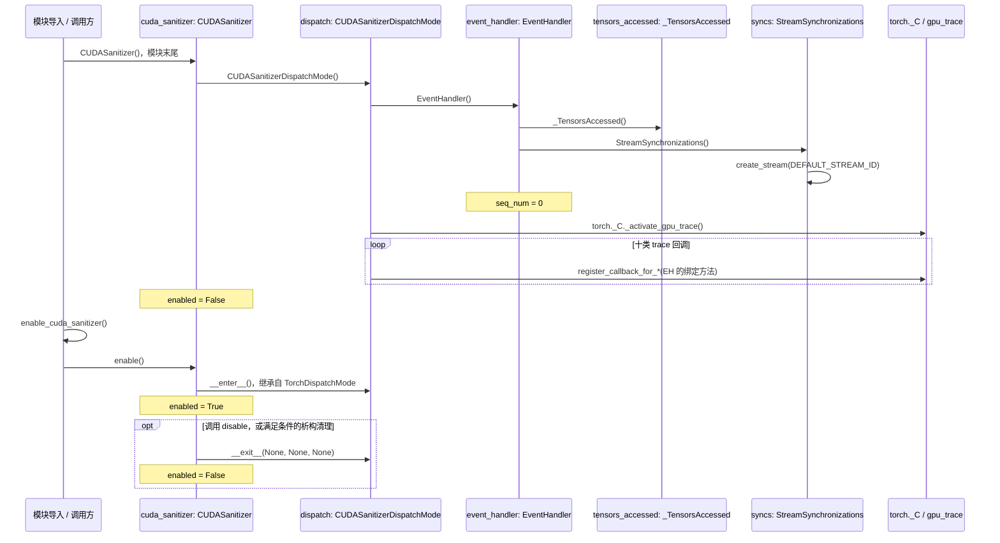
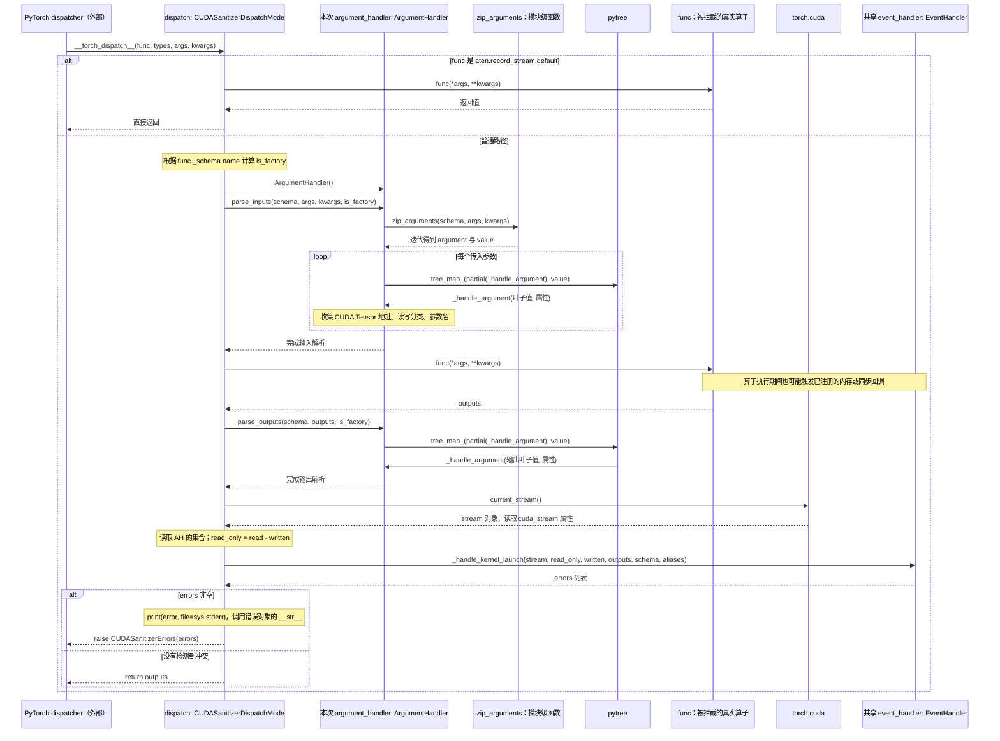
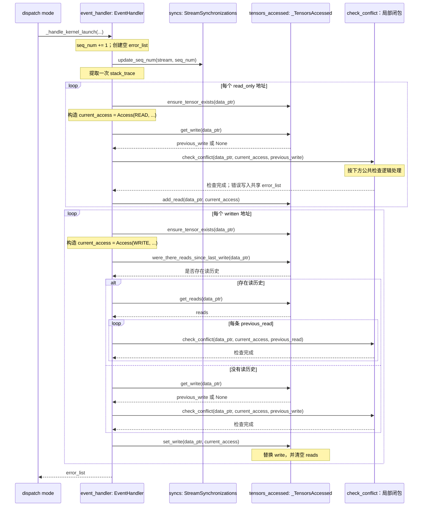
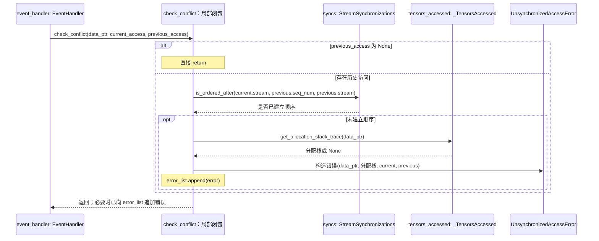
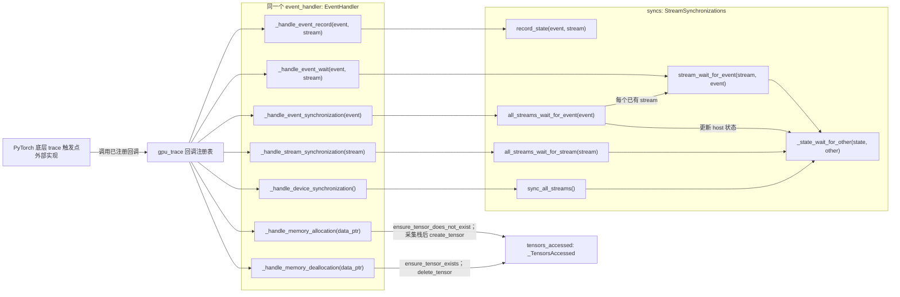

# CUDA Stream Sanitizer：对象关系与实际调用时序

本文配合 [实现分析](./README.md)，以本目录 [`_sanitizer.py`](./_sanitizer.py) 为依据。图中的实例名、属性名和方法名对应真实代码；PyTorch dispatcher 与 GPU trace 的内部实现位于该文件之外，以外部边界表示。

这些图来自静态源码分析，没有采集真实 GPU 调用轨迹。图中回调箭头表示运行时通知 Python 回调，不代表 GPU kernel 完成通知。

## 1. 对象持有关系：哪些状态长期保留

下图的实线表示属性引用或容器成员，虚线表示创建或注册关系，**不表示执行先后顺序**。



关键区别：

- `EventHandler`、`StreamSynchronizations`、`_TensorsAccessed` 随 dispatch mode 长期存在，跨算子保留状态。
- `ArgumentHandler` 是一次普通 `__torch_dispatch__` 调用的局部对象，只负责本次输入输出；`record_stream` 分支会提前返回，不创建它。
- GPU trace 注册的是这个 `event_handler` 实例的绑定方法，因此同步事件与算子检测修改的是同一套状态。
- `TensorInfo`、`Access` 是数据记录，不会主动执行检测。

源码依据：`EventHandler.__init__` 第 349 行，`CUDASanitizerDispatchMode.__init__` 第 562 行，局部 `ArgumentHandler()` 第 606 行，`CUDASanitizer.__init__` 第 637 行。

## 2. 初始化与启用：构造对象和进入 dispatch mode 是两步



构造时就激活 trace 并注册回调；`enable()` 才把 mode 放入 dispatch 上下文。`disable()` 在本文件中只退出 mode，没有对应的 trace 回调注销逻辑。

析构函数仅在 `sys` 尚可用、解释器未进入 finalizing、且 `enabled=True` 时调用 `disable()`。

源码依据：第 562、637、641、645、649、661、672 行。

## 3. 一次普通算子的实际调用顺序

这是跨对象的主要执行路径。`ArgumentHandler` 不调用 `EventHandler`；它保存集合，随后由 dispatch mode 读取并传给 `EventHandler`。



`zip_arguments` 是模块级生成器函数，由 `ArgumentHandler` 迭代以获取 schema 参数与实参的对应关系。`_handle_argument` 是经 `pytree.tree_map_` 调用的绑定方法回调，不是直接对整个参数对象只调用一次。

`_handle_kernel_launch` 由 Python dispatch mode 显式调用。此文件没有注册“每个硬件 kernel launch 都调用这个函数”的 trace 回调。检查发生在真实算子返回之后，也不要求 GPU 工作已经完成。

源码依据：`parse_inputs` 第 518 行、`parse_outputs` 第 543 行、`__torch_dispatch__` 第 596 行。

## 4. EventHandler 内部如何调用状态对象完成检测

为避免把一张图展开得过宽，下图将第 363 行的局部函数 `check_conflict` 单独画成执行参与者。它是 `_handle_kernel_launch` 内的闭包，**不是独立对象或类**。



上图每次 `check_conflict(...)` 调用，都在调用位置执行以下逻辑后返回：



调用方向是 `EventHandler → StreamSynchronizations` 查询先后关系，以及 `EventHandler → _TensorsAccessed` 查询或更新历史。两种状态对象不会相互调用。

`check_conflict` 发现错误时只向列表追加对象，不当场抛出。`EventHandler` 仍会按代码更新本次访问历史，最终由 dispatch mode 打印并抛出包装异常。

源码依据：第 354 至 426 行；`_TensorsAccessed.set_write` 第 223 行；`is_ordered_after` 第 333 行。

## 5. CUDA 同步与内存回调：如何进入同一个 EventHandler

这些回调绕过 `ArgumentHandler`，直接更新共享 `EventHandler` 内的状态对象。



event record 保存状态副本；其他同步路径通过 `_state_wait_for_other` 合并进度。图中省略了防御性的 `_ensure_*` 调用。下表补全全部十类注册关系：

| `gpu_trace` 注册函数后缀 | EventHandler 绑定方法 | 直接调用的状态方法 |
|---|---|---|
| `event_creation` | `_handle_event_creation(event)` | `syncs.create_event(event)` |
| `event_deletion` | `_handle_event_deletion(event)` | `syncs.delete_event(event)` |
| `event_record` | `_handle_event_record(event, stream)` | `syncs.record_state(event, stream)` |
| `event_wait` | `_handle_event_wait(event, stream)` | `syncs.stream_wait_for_event(stream, event)` |
| `memory_allocation` | `_handle_memory_allocation(data_ptr)` | `tensors_accessed.ensure_tensor_does_not_exist`，然后 `create_tensor` |
| `memory_deallocation` | `_handle_memory_deallocation(data_ptr)` | `tensors_accessed.ensure_tensor_exists`，然后 `delete_tensor` |
| `stream_creation` | `_handle_stream_creation(stream)` | `syncs.create_stream(stream)` |
| `device_synchronization` | `_handle_device_synchronization()` | `syncs.sync_all_streams()` |
| `stream_synchronization` | `_handle_stream_synchronization(stream)` | `syncs.all_streams_wait_for_stream(stream)` |
| `event_synchronization` | `_handle_event_synchronization(event)` | `syncs.all_streams_wait_for_event(event)` |

注册函数的完整前缀为 `register_callback_for_`。特别注意 event wait 回调收到的参数是 `(event, stream)`，转调状态方法时顺序变为 `(stream, event)`。

源码依据：绑定方法第 428 至 467 行；回调注册第 565 至 594 行；状态方法第 266 至 338 行。

## 6. 两条调用链在哪里汇合

```text
算子路径：
dispatcher
  → dispatch.__torch_dispatch__
  → dispatch 先调用 ArgumentHandler 解析，再执行 func，再解析输出
  → dispatch 调用 event_handler._handle_kernel_launch
  → event_handler 查询 syncs，并查询 / 更新 tensors_accessed

同步路径：
底层 trace 触发点
  → gpu_trace 中已经注册的绑定方法
  → 同一个 event_handler._handle_event_* / _handle_*_synchronization
  → 同一个 syncs 更新同步进度
```

`CUDASanitizerDispatchMode` 负责接入和调度，`ArgumentHandler` 负责本次访问分类，`EventHandler` 负责把访问历史与同步状态结合起来判断。实际同步进度由 `StreamSynchronizations` 保存，实际资源历史由 `_TensorsAccessed` 保存。
