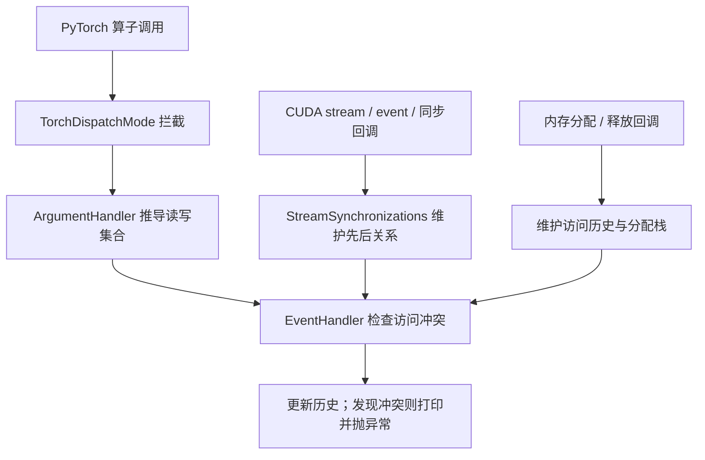

# PyTorch CUDA Stream Sanitizer：实现、方法抽象与开销分析

本文分析本目录的 [`_sanitizer.py`](./_sanitizer.py)。文件头标注它复制自 PyTorch 的 `torch/cuda/_sanitizer.py`，来源 commit 为 `6d2509d`。以下结论以这份本地快照为依据。

分析日期：2026-09-23。

验证范围：阅读源码，并在 CPU 上提取源码中的状态机和参数解析逻辑进行隔离验证。当前环境的 PyTorch 为 `2.6.0+cpu`，CUDA 不可用；没有运行真实 GPU 端到端实验，也没有测量性能。下文的 overhead 判断均为基于实现的推断。

配套图解：[对象关系与实际调用时序](./CALL_RELATIONSHIPS.md)。按源码中的实例、方法和回调展开初始化、算子执行、冲突检查及同步事件路径。

科研讨论：[研究方向与实验设计](./RESEARCH_DIRECTIONS.md)。讨论逻辑资源生命周期、访问摘要、图重放、历史压缩和根因定位，并整理相关工作与候选研究路线。第 9 节进一步记录低开销检测的候选设计、前提与待验证问题，供以后考虑。

## 1. 核心思路

CUDA Stream Sanitizer，简称 CSAN，记录每个 Tensor 的读写历史，并利用 stream、event 和 host 同步建立的先后关系，判断冲突访问之间是否具有可靠的执行顺序。

它检测的是“缺少同步保证的潜在竞争”。即使某次运行碰巧获得正确结果，只要没有建立必要的依赖，仍然可能报错。它不需要测量两个 kernel 是否真的在某一时刻重叠，也不需要等待数值结果出错。



这份实现有两路信息来源：

| 来源 | 提供的信息 | 用途 |
|---|---|---|
| `TorchDispatchMode` | 算子 schema、输入、输出 | 推导对 Tensor 的访问 |
| `torch.cuda._gpu_trace` | event、stream、同步、内存分配释放等回调 | 维护执行依赖和内存生命周期 |

`_gpu_trace` 提供回调注册机制；这个文件中的 `EventHandler` 消费事件并维护检测状态。它没有通过分析 kernel 指令来识别实际访存。

## 2. 源码结构与阅读入口

下表行号对应本目录的源码快照。

| 类或函数 | 行号 | 职责 |
|---|---:|---|
| `Access` | 63 | 保存一次访问及其诊断信息 |
| `UnsynchronizedAccessError` | 91 | 格式化一对冲突访问 |
| `TensorInfo` / `_TensorsAccessed` | 156 / 173 | 保存地址对应的访问历史和分配栈 |
| `StreamSynchronizations` | 228 | 维护各 stream 的同步进度 |
| `EventHandler._handle_kernel_launch` | 354 | 分配操作编号、检查冲突、更新历史 |
| `EventHandler._handle_*` | 428 | 将底层回调转换成状态变化 |
| `ArgumentHandler` | 488 | 根据 schema 识别输入输出读写 |
| `CUDASanitizerDispatchMode` | 561 | 注册回调并拦截算子 |
| `__torch_dispatch__` | 596 | 串起单次算子的处理流程 |
| `CUDASanitizer` / `enable_cuda_sanitizer` | 628 / 661 | 管理 dispatch mode 生命周期 |

建议先读 `__torch_dispatch__` 理解总流程，再读 `ArgumentHandler`、`StreamSynchronizations` 和 `_handle_kernel_launch`。

## 3. 一次算子调用如何被处理

`CUDASanitizerDispatchMode.__init__` 创建 `EventHandler`，激活 GPU trace，并注册 event 创建、删除、record、wait，内存分配、释放，stream 创建，以及 device、stream、event synchronize 的回调。

`__torch_dispatch__` 的主流程可以简化为：

```python
解析输入的读写属性
outputs = func(*args, **kwargs)
解析输出的读写属性

errors = 检查访问(
    当前_stream,
    只读地址集合,
    写地址集合,
    算子及参数信息,
)

if errors:
    打印每个错误
    抛出_CUDASanitizerErrors

return outputs
```

### 3.1 检查在算子执行之后

检测需要输出 Tensor 的地址，因此先调用真实算子，再检查访问。此时 CUDA 工作可能已经提交。CSAN 提供诊断，并不保证在错误工作提交前阻止它。

发现错误时先将详细信息打印到标准错误输出，再抛出异常。源码没有直接调用进程退出；通常是未捕获异常导致程序结束。

### 3.2 逻辑编号对应被拦截的算子调用

虽然处理函数名为 `_handle_kernel_launch`，它的调用点位于 Python dispatch 路径。一次被拦截的算子可能发射多个 kernel，也可能只操作元数据。

因此，`seq_num` 是检测器中的逻辑操作编号，不能直接当作硬件 kernel 编号。

### 3.3 `record_stream` 单独放行

`aten.record_stream.default` 被直接调用，不进入读写检测，也不在这里增加同步依赖。不能用这条路径中的 `record_stream` 替代 event wait 等执行顺序保证。

## 4. 如何推导 Tensor 的读写

### 4.1 根据 schema 的 alias 信息分类

`ArgumentHandler.parse_inputs` 将位置参数、关键字参数与 schema 中的参数对应，并检查：

```python
is_write = argument.alias_info is not None and argument.alias_info.is_write
```

典型分类如下：

| 调用 | schema 的关键部分 | 检测器的处理 |
|---|---|---|
| `y = x + z` | 普通 Tensor 输入与输出 | 读 `x/z`，写 `y` |
| `x.add_(z)` | `Tensor(a!) self` | 写 `x`，读 `z` |
| `v = x.view(...)` | `Tensor(a) self -> Tensor(a)` | 按元数据操作处理，不记录数据读写 |

`a` 表示 schema 中的 alias 关系，`!` 表示可能修改。实现把具有非写 alias 信息的参数视为 metadata-only；准确性依赖 schema 和这一分类规则。

对于 factory，设计意图是忽略仅用来获取 shape、dtype 等元数据的输入。该快照的具体 factory 实现有局限，见第 9 节。

### 4.2 遍历嵌套参数，按地址归并

`pytree.tree_map_` 遍历参数和输出中的嵌套结构，例如 Tensor 列表。只有 CUDA Tensor 会被收集。

追踪键是：

```python
data_ptr = value.data_ptr() if value.data_ptr() else id(value)
```

空 Tensor 的 `data_ptr()` 可能是 `0`，回退到对象 ID 可以避免把不同空 Tensor 归并为同一资源。

同一地址可能对应多个参数名，例如 `self` 和 `out`。`tensor_aliases` 保存这些名字用于报错，它本身不构建完整的存储别名关系。

### 4.3 写访问覆盖同一操作中的读访问

提交给检测器的两个集合是：

```python
read_only = dataptrs_read - dataptrs_written
read_write = dataptrs_written
```

如果同一地址既被读又被写，按写处理。因为只要涉及写，就需要检查它与此前读、写之间的依赖，无须额外保存同一操作的读记录。

`outputs` 集合用于说明该地址是否也是算子输出，主要服务于诊断展示。

## 5. 如何维护 stream 的同步关系

### 5.1 用进度向量表示先后保证

`StreamSynchronizations` 维护三个字典：

```python
current_sync_states[stream][other_stream] = seq_num
recorded_sync_states[event][other_stream] = seq_num
host_sync_state[other_stream] = seq_num
```

可以把每个 stream 的状态理解为一个类似向量时钟的进度向量。

例如：

```python
current_sync_states[B][A] = 12
```

表示 B 后续提交的操作，已经有顺序保证排在 A 上逻辑编号不超过 12 的操作之后。

这是执行依赖，不是实测完成时间。状态更新时，那些 GPU 工作未必已经完成。

每处理一个算子，检测器递增全局编号，并更新当前 stream 的自身分量：

```python
self.seq_num += 1
current_sync_states[stream][stream] = self.seq_num
```

全局编号用于标识操作。B 的编号大于 A，不等于 B 在 GPU 上保证排在 A 后面；跨 stream 的顺序必须由同步状态证明。

### 5.2 event record 保存快照，wait 合并快照

在 A 上记录 event E：

```python
recorded_sync_states[E] = current_sync_states[A].copy()
```

B 等待 E：

```python
for stream, seq_num in recorded_sync_states[E].items():
    current_sync_states[B][stream] = max(
        current_sync_states[B].get(stream, -1), seq_num
    )
```

这里的两个关键点是“快照”和“逐项最大值”。

快照保证 event 只覆盖记录时已有的工作：

```text
A: 写 x，编号 1
A: record E
A: 再写 x，编号 2
B: wait E
B: 读 x
```

B 等待 E 只覆盖编号 1，不能覆盖编号 2。因此 B 的读与第二次写仍然缺少顺序保证。

合并整个向量则保证依赖可以传递：

```text
A 的工作 → event → B 的工作 → event → C 的工作
```

B 已继承 A 的进度，因此 C 等待 B 的 event 时，也会继承对 A 的依赖。

### 5.3 host 同步传播到已有和未来的 stream

| 同步操作 | 检测器中的更新 |
|---|---|
| B wait event E | 将 E 的快照合并到 B |
| host 等待 E 完成 | 将 E 的快照合并到所有已有 stream 和 host 状态 |
| host 等待 A 完成 | 将 A 的状态合并到所有已有 stream 和 host 状态 |
| device synchronize | 汇总各 stream 的自身最新进度，再合并到所有 stream |

host 同步返回后，后续提交的工作可以依赖已经完成的工作，因此检测器更新所有已有 stream 的逻辑状态。

`host_sync_state` 还用于新 stream 初始化：

```python
current_sync_states[new_stream] = host_sync_state.copy()
```

这样，在 host 同步之后才创建的 stream，也能继承已经建立的顺序保证。

这些函数是在更新检测器状态，没有为了检测再给每个 stream 额外插入 CUDA wait。

## 6. 如何检查冲突与压缩访问历史

### 6.1 每个地址保留一条写历史和一组读历史

`TensorInfo` 保存：

```text
allocation_stack_trace
write: 最近一次写
reads: 最近一次写之后的所有读
```

每条 `Access` 保存读写类型、逻辑编号、stream、算子 schema、参数名、是否为输出和调用栈。

`_handle_kernel_launch` 的规则为：

| 当前访问 | 需要检查的历史访问 | 对应竞争 |
|---|---|---|
| 读 | 最近一次写 | RAW，写后读 |
| 写，且最近一次写之后有读 | 这些读全部检查 | WAR，读后写 |
| 写，且没有上述读 | 最近一次写 | WAW，写后写 |

读与读之间不需要建立互斥顺序。

### 6.2 最终判定是一个进度比较

对于此前访问 `previous` 和当前访问 `current`，检查：

```python
previous.seq_num <= current_sync_states[current.stream].get(
    previous.stream, -1
)
```

成立则已有顺序保证，否则生成 `UnsynchronizedAccessError`。

同 stream 内，当前操作已推进自身进度，较早操作自然通过。跨 stream 则需要同步传播相应进度；没有记录时默认值为 `-1`。

### 6.3 为什么有读历史时不再检查更早的写

在此前没有报错的执行前缀中：

```text
上次写 W → 后续读 R → 当前写 W'
```

处理 R 时已经验证 `W → R`。现在只需验证 `R → W'`，就可以通过传递性得到 `W → W'`。

多个读可能来自不同 stream，因此必须全部检查。某个 stream 上最近提交的读，并不能自动代表其他 stream 上的读。

新写记录完成后，替换 `write` 并清空 `reads`，从而无需保存全部历史写。但源码没有进一步按 stream 压缩读历史，相关成本见第 11 节。

### 6.4 一个完整例子

假设只考虑对 x 的访问：

```text
A: 写 x，seq = 1
B: 读 x，seq = 2
```

第一步之后：

```text
history[x].write = (WRITE, A, 1)
current_sync_states[A][A] = 1
```

第二步时，B 虽然已经推进自身进度到 2，但没有对 A 的依赖：

```text
current_sync_states[B].get(A, -1) = -1
1 <= -1 为 False，报告竞争
```

如果两步之间加入 `A record E` 和 `B wait E`，则 B 的状态包含 `A: 1`：

```text
1 <= 1 为 True，访问有序
```

这个例子说明：CPU 的调用顺序和逻辑编号大小，都不能代替跨 stream 同步。

## 7. 内存生命周期、错误报告与启用

内存分配回调创建地址对应的 `TensorInfo` 并记录分配栈；释放回调删除历史。这可以避免同一个地址重新分配后沿用旧对象的访问记录。

如果检测器启用较晚，可能遇到缺失的 allocation、stream creation 或 event creation。代码会补建相关状态；重复分配、重复 event 创建也有对应处理。这些补建不能恢复此前遗漏的真实访问和依赖，因此应尽早启用检测。

发现冲突时，报告包括：

- 冲突地址；
- 当前与此前访问的 stream、算子、参数名和读写类型；
- 两次访问的 Python 调用栈；
- 若捕获到了，Tensor 的分配调用栈。

一轮检查可能发现多个冲突，统一包装为 `CUDASanitizerErrors`。

文件末尾创建全局 `cuda_sanitizer`。`enable()` 进入 dispatch mode，`disable()` 退出；析构函数会考虑解释器是否已经进入清理阶段。

官方使用方式包括：

```bash
TORCH_CUDA_SANITIZER=1 python your_program.py
```

或者在程序开始时调用：

```python
from torch.cuda._sanitizer import enable_cuda_sanitizer

enable_cuda_sanitizer()
```

这里指安装的 PyTorch 所提供的 sanitizer。当前文件是供分析的源码快照，没有在本环境进行 CUDA 启用验证。

## 8. 将方法抽象为通用检测算法

这个方法可以概括为：记录资源访问，维护 happens-before 关系，检查冲突访问之间是否存在执行顺序保证。

### 8.1 三个基本概念

| 抽象概念 | 含义 | CSAN 中的实例 |
|---|---|---|
| 执行队列 | 队列内部有序，不同队列可以并发 | CUDA stream |
| 共享资源 | 多个队列可能访问的同一对象 | Tensor 地址 |
| 同步依赖 | 保证一些操作先于另一些操作 | event record/wait、host synchronize |

推广时，资源可以是 KV cache block、通信 buffer 或文件区间，队列可以是设备任务队列或有序工作线程。

### 8.2 将运行行为归一化为事件

接入层将真实行为转换成：

```text
Access(queue, resource, READ / WRITE)
Record(event, queue)
Wait(queue, event)
Synchronize(queue / event / device)
Allocate(resource)
Free(resource)
```

算子名、调用栈等是诊断信息，不参与核心顺序判定。识别每个真实操作访问哪些资源，是接入层的重要职责。

### 8.3 用进度向量压缩依赖图

维护 `V[B][A] = k`，表示 B 的后续操作保证排在 A 的第 k 个操作及其之前的操作之后。这里可以使用每队列局部编号；CSAN 的具体实现使用全局编号并按队列记录。

```text
队列 A 提交操作：推进 V[A][A]
A 记录 E：E = copy(V[A])
B 等待 E：V[B] = 逐项 max(V[B], E)
```

从图的角度看，同队列顺序和同步操作构成有向依赖图。进度向量压缩了这张图中的可达关系，使检测无需每次遍历整张图。

### 8.4 访问冲突与顺序判定

候选冲突必须同时满足：

```text
访问同一资源或重叠区域
并且至少一次是写
```

若此前访问是 A 上的第 k 个操作，当前访问在 B 上：

```text
k <= V[B][A]：已有顺序保证
k > V[B][A]：缺少顺序保证，报告潜在竞争
```

每个资源保存最近一次写及其后的读，再按第 6 节规则检查和更新历史。

### 8.5 迁移到 KV cache 时需要补充什么

例如：

```text
计算队列读取 block 42，生成 token
搬运队列覆盖 block 42，换入另一份 KV
```

归一化为：

```text
Read(compute_queue, block_42)
Write(copy_queue, block_42)
```

如果覆盖前没有等待计算队列读完，就报告竞争。一个 kernel 访问多个 block 时，应展开成多个资源访问事件。

迁移效果主要取决于：

| 设计选择 | 需要解决的问题 |
|---|---|
| 资源粒度 | 整个 Tensor、block，还是地址区间？过粗可能误报，遗漏重叠关系可能漏报 |
| 事件覆盖 | 是否捕获全部访问与同步？漏掉访问可能漏报，漏掉同步可能误报 |
| 生命周期身份 | 地址或 block 编号复用时，如何区分不同 allocation / generation |

还要区分同步错误和 stale access。旧请求在 block 重新分配后继续使用旧引用，即使执行完全有序，也可能访问错误的数据。happens-before 检查本身不足以识别这种问题，还需要检查 generation、所有者和有效期。

## 9. 本地源码快照的检测边界与具体局限

### 9.1 起始指针不等于完整内存区域

代码按 `data_ptr()` 建立历史，没有记录地址区间、shape、stride 或完整 storage alias 关系。

例如：

```python
a = x[0:8]
b = x[4:12]
```

a 和 b 区域重叠，但起始指针不同，会进入不同历史记录，可能漏掉冲突。反过来，对同一指针的访问也不会按实际元素范围进一步区分。

该算法不检查单个 kernel 内线程之间的竞争。

### 9.2 factory 匹配与分类的局限

第 52 行定义：

```python
FACTORY_FUNCTION_REGEX = re.compile("(new_.*|.*_like)")
```

第 604 行对完整的 `func._schema.name` 调用 `match`。由于名字带 namespace：

```text
aten::new_zeros  → 不匹配
aten::zeros_like → 匹配
```

另外，`is_factory=True` 同时影响输入和输出。忽略只用于 shape/dtype 的输入数据读取符合设计意图，但 `parse_outputs` 也会把输出归为 metadata-only，使被匹配 factory 的输出在这一层不记为写。

这不能被解释为真实 factory 没有初始化输出；检测分类与实际 kernel 行为需要区分。

### 9.3 多返回值共用第一个返回值的属性

`parse_outputs` 第 546 行使用：

```python
for res, value in zip(schema.returns, (outputs,)):
```

右侧只有一个元素，因此实际拿第一个 return schema 配合整个输出结构，再通过 `pytree` 遍历全部输出。

这不是简单地漏掉后续 Tensor，而是后续 Tensor 也应用第一个返回值的分类。若多个返回值的 alias 属性不同，可能分类不准确。

### 9.4 覆盖范围依赖可观察事件

仅凭这个文件，不能认定绕过 dispatcher 的自定义 kernel、算子内部的额外 stream、图重放中的每次访问都被完整建模。需要检查相应执行路径是否提供了正确的访问事件和同步事件。

启用前遗漏的历史也不能靠补建记录恢复。没有报错并不构成对所有执行行为的完整无竞争证明。

## 10. 已完成的隔离验证

验证直接提取本地源码中的相关类和方法执行，避免导入该快照时激活全局 GPU trace。状态机使用模拟的 stream、event 和地址编号；参数解析边界使用隔离的模拟结构验证。

| 验证项 | 结果 |
|---|---|
| 同 stream 写后读 | 不报错 |
| 不同 stream 未同步的 RAW / WAR / WAW | 分别报告冲突 |
| 不同 stream 的读读访问 | 不报错 |
| A → B → C 的 event 依赖传递 | 能继承并通过检查 |
| event 记录后 A 再次写，B 只等待旧 event | 能报告后续写与 B 的读之间的冲突 |
| host event / stream / device 同步 | 已有和之后创建的 stream 均继承相应进度 |
| 写者只等待多个读者中的一个 | 仍报告与未等待读者之间的冲突 |
| factory 正则匹配完整 schema 名称 | 确认 `aten::new_zeros` 不匹配、`aten::zeros_like` 匹配 |
| `is_factory=True` 的输出分类 | 确认按 metadata-only 处理 |
| 不同 alias 属性的多个返回值 | 确认全部使用首个返回值的分类 |

这些验证支持对状态机和局部实现行为的理解，不覆盖 CUDA 回调是否完整、真实设备执行、整个 PyTorch 版本的兼容性或实际性能。

## 11. Overhead：基于实现的判断

### 11.1 总体判断

这份实现很可能带来明显 overhead，尤其在算子多、单个 kernel 短、CPU 提交本来就紧张的场景。它更适合作为调试工具；没有实测，不能给出可靠减速比例，也不宜假定适合长期在 serving 热路径中常开。

主要成本在 CPU 逐算子处理，不只是最终的进度比较。

| 来源 | 每次执行的工作 | 成本特征 |
|---|---|---|
| Python dispatch | 进入检测逻辑，再调用真实算子 | 每算子增加提交路径工作 |
| 参数解析 | 遍历输入输出、读 schema、取得指针、构造 set/dict | 随参数及 Tensor 数量增长 |
| 调用栈采集 | 遍历 Python 栈并构造栈信息 | 每次 `_handle_kernel_launch` 都执行 |
| 访问历史维护 | 创建 `Access`、查字典、追加读历史、检查冲突 | 随资源及历史访问数量增长 |
| 同步状态维护 | event record 复制字典，wait 逐项合并 | 随已知 stream 分量数量增长 |
| 分配追踪 | 捕获分配栈并维护地址记录 | 分配越频繁，成本越明显 |

### 11.2 没有错误也会采集调用栈

第 383 行在每次 `_handle_kernel_launch` 中执行：

```python
stack_trace = traceback.StackSummary.extract(
    traceback.walk_stack(inspect.currentframe()), lookup_lines=False
)
stack_trace.reverse()
```

这是为了未来发生冲突时，仍能显示“此前访问”的调用位置。因此调用栈不能只在报错后才生成。

`lookup_lines=False` 避免当场查询源码行，但没有消除栈遍历与栈信息构造。即使程序完全没有竞争，该成本也持续存在。它很可能是主要成本之一，但实际占比需要 profile 才能确定。

同一算子访问多个地址时，所创建的 `Access` 引用同一个 `stack_trace`，并非每个地址都重新抓一次栈。

### 11.3 读历史没有按 stream 压缩

`add_read` 直接追加：

```python
self.accesses[data_ptr].reads.append(access)
```

若一个地址在没有写入的情况下被连续读取 N 次，会保留 N 条读记录及相关调用栈引用。下一次写需要遍历这些读；若一直只读，记录会持续积累，直到资源释放等清理发生。

这对反复读取模型权重的长时间推理场景值得关注。是否出现增长、增长多快，取决于访问是否被捕获、地址是否相同，以及资源生命周期。

从同队列有序的性质看，同一 stream 较晚的读通常可以代表较早的读所需的同步约束。按资源、按 stream 只保留最近读，是一个可能的优化方向；当前快照没有实施这种压缩。

### 11.4 stream 与 event 状态也存在扩展成本

event record 会复制一个进度字典，wait 会逐项取最大值。当 stream 数量增大，单次操作成本会随向量长度增加；host 同步还会更新多个 stream。

若有 S 个 stream，且它们的状态都包含其他 stream 的进度，stream 状态本身最坏可占用量级为 O(S²) 的字典条目。若同时保留 E 个 event，每个 event 快照最多包含 O(S) 个分量，还会有 O(E·S) 的条目。这是数据结构层面的估计，不是实测内存量。

### 11.5 没有逐算子强制同步，仍可能让 GPU 等待

检测路径没有为了每次检查主动调用 `cudaDeviceSynchronize()`，所以仍然保留异步提交模型。

但在提交下一个算子之前，CPU 必须先完成本次的参数解析、抓栈和历史检查。增加的 CPU 工作可能扩大 kernel 之间的提交间隙。

可以用一个忽略启动、排空和依赖细节的粗略模型理解：

```text
原始耗时 ≈ max(GPU 工作时间, CPU 提交时间)
启用之后 ≈ max(GPU 工作时间, CPU 提交时间 + 检测时间)
```

当 GPU 工作足够长，部分 CPU 开销可能被掩盖；当 CPU 提交成为瓶颈，检测开销就会转化成 GPU 空闲和总延迟。

### 11.6 对不同工作负载的预期

| 场景 | 预期影响 |
|---|---|
| 少量耗时较长的 GEMM / attention kernel | 部分 CPU 检测开销可能被 GPU 执行掩盖 |
| 大量短 kernel、小 Tensor 操作 | 相对开销很可能较大 |
| 原本受 Python / CPU 提交速度限制 | 更容易明显减速 |
| 长时间重复读取相同资源 | 还需关注读历史与调用栈的内存增长 |
| stream 多、event 操作频繁 | 向量复制与合并成本进一步增加 |

对于包含大量短操作的 decode 路径，应优先怀疑逐算子 Python 路径、无条件抓栈和未压缩读历史的成本。对于 CUDA Graph 等减少 Python dispatch 次数的路径，首先要核实检测覆盖，不能仅因为开销较低就推断检测效果保持不变。

## 12. 参考资料

- [本地分析对象：`_sanitizer.py`](./_sanitizer.py)
- [文件头标注的 PyTorch 来源版本](https://github.com/pytorch/pytorch/blob/6d2509d/torch/cuda/_sanitizer.py)
- [PyTorch CUDA Stream Sanitizer 官方文档](https://docs.pytorch.org/docs/2.14/cuda._sanitizer.html)：用途、启用方式和错误报告示例；文档将此功能标注为 prototype。
- [PyTorch `_gpu_trace.py`](https://github.com/pytorch/pytorch/blob/main/torch/cuda/_gpu_trace.py)：回调注册机制的补充说明；链接中的 main 会随时间变化。
