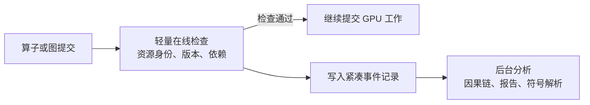

# 从 CUDA Stream Sanitizer 到异步 AI Serving 正确性检测

整理日期：2026-09-23。

本文基于本目录的 [实现分析](./README.md) 和 [对象调用关系](./CALL_RELATIONSHIPS.md)，整理后续科研问题、相关工作的边界以及实验设计。

以下方向属于研究候选问题。已有源码分析和局部状态机验证不等于这些方案已经实现，也不构成性能或正确性证明。相关资料用于初步定位，尚未完成系统性文献综述，不能据此宣称某个方向具有首创性。

## 1. 核心研究问题

可以将问题从“两个 stream 是否存在数据竞争”扩展为：

> 能否以较低开销，判断异步执行中的一次访问，既访问了正确的资源版本，又满足必要的执行顺序？

这包含两个相互关联的维度：

- 执行顺序：生产、消费、覆盖和回收之间是否建立了必要依赖。
- 资源语义：访问的区域、逻辑内容、生命周期和权限是否仍然符合调用方预期。

CSAN 的核心检查是针对已观察到的访问，利用 happens-before 关系判断冲突访问是否有序。但在 KV cache 复用、共享和迁移中，没有数据竞争并不意味着访问正确。

值得形成研究贡献的部分，应当能够落实为明确的错误模型、算法或抽象、可说明的保证，以及可复现的实验。单纯将 Python 代码改写为 C++、减少抓栈次数或替换容器，通常更接近工程优化。

## 2. 方向一：从物理地址竞争扩展到逻辑资源生命周期

### 2.1 为什么 happens-before 不够

考虑以下执行：

```text
block 42 属于请求 A，generation = 7
→ A 结束
→ block 42 分配给请求 B，generation = 8
→ 某个旧任务仍通过 A 的 block table 访问 block 42
```

最后一次访问即使与 B 的写入完全有序，也可能读到错误请求的数据。这是一类逻辑 stale access，不能仅靠增加同步解决。

CSAN 按地址跟踪访问，内存释放后会清理历史。框架内部一个大分配中的 KV block 复用，还可能根本不触发底层 allocation/free 回调。因此，需要把框架的逻辑生命周期引入检测模型。

### 2.2 候选访问模型

可以尝试将访问描述扩展为：

```text
Access(
    physical_region,
    expected_generation,
    logical_content_identity_or_permission,
    execution_queue,
    read_or_write
)
```

分别检查：

| 正确性条件 | 要回答的问题 |
|---|---|
| 空间有效性 | 是否访问允许的区域？ |
| 生命周期有效性 | 是否仍是调用方预期的那一代资源？ |
| 内容与权限有效性 | 是否允许访问这份 KV 内容？ |
| 执行顺序有效性 | 生产、消费、覆盖之间是否具有必要依赖？ |

这里的 generation 应表达访问原本绑定的资源版本，不能在检查时简单读取“当前最新 generation”并将其当成访问者的预期。

版本检查和物理区域竞争检查也需要同时保留：不同 generation 的任务仍可能访问同一物理区域，不能仅因为版本不同就将它们当作互不冲突的资源。

### 2.3 主要难点

真正的问题是如何把调度器知道的逻辑身份，关联到 GPU 实际使用的 block table、slot mapping 和物理地址。

仅在 CPU 提交前检查一次，可能漏掉检查之后发生的映射变化或资源复用。检测规则需要明确检查时点，以及检查后到实际消费之间的有效性保证。

同时，不能简单规定“请求 ID 必须等于 owner”。prefix cache 允许合法共享，需要描述共享只读、写时复制、回收和迁移等规则。

### 2.4 与已有工作的区别需要落在哪里

NVIDIA Compute Sanitizer 已能检测 stream-ordered allocation 的 use-before-alloc 和 use-after-free。因此，“支持异步生命周期检测”本身不是足够具体的新贡献。[官方文档](https://docs.nvidia.com/compute-sanitizer/ComputeSanitizer/index.html#stream-ordered-race-detection)

TensorRT-LLM 也提供针对 stale KV page 等问题的诊断辅助，说明已有系统已经关注到这类故障。[KV cache 文档](https://github.com/NVIDIA/TensorRT-LLM/blob/main/docs/source/features/kvcache.md)

候选贡献应进一步聚焦于框架内部子分配、逻辑版本、合法共享和异步实际访问之间的关联，并明确能检出哪些现有抽象无法表达的错误。

## 3. 方向二：足够准确、足够便宜的访问摘要

### 3.1 粒度选择形成精度与成本之间的矛盾

| 追踪粒度 | 可能的问题 |
|---|---|
| 整个 storage | 不相交切片也可能被认为冲突，产生误报 |
| Tensor 起始指针 | 起始地址不同但区域重叠的 view 可能漏检 |
| 每次实际访存 | 信息更细，但可能产生大量插桩成本 |

可以提出如下研究问题：

> 能否利用算子语义，生成比 Tensor 更精细、比逐访存更便宜的访问摘要？

例如，对特定 attention 执行生成：

```text
读取：block_table 指定的 KV blocks
写入：slot_mapping 指定的 token slots
```

这里的具体读写内容需要匹配实际算子实现，不能仅凭算子名称推断。

### 3.2 候选方法与难点

可以采用分层方案：

```text
已知算子 → 使用经过验证的访问摘要
动态索引 → 运行时解析必要的索引信息
未知算子 → 保守处理，或转入更精细的检查
```

主要难点是访问范围可能由运行时数据决定，仅靠 shape 和 schema 不足以推导。例如，block table 的形状不变，但其内容已经指向另一组 block。

需要定义摘要的覆盖关系：真实访问是否都被摘要覆盖？保守扩大范围会引入多少误报？不支持的执行路径应明确标为覆盖缺口，不能把缺少信息解释为安全。

### 3.3 已有工作与候选贡献

`cusan` 已结合编译期分析和运行时信息，将 CUDA 访问及同步语义提供给 ThreadSanitizer。[项目实现](https://github.com/tudasc/cusan)

HGRD 利用 host 代码中的参数信息辅助 GPU kernel 竞态分析。[论文：Towards an Accurate GPU Data Race Detector](https://arxiv.org/abs/2604.02106)

因此，“结合 host 和 device”本身不够具体。可进一步考察动态 Tensor、间接索引、框架子分配以及 serving 资源语义，是否需要新的摘要形式或组合规则。

## 4. 方向三：利用图重放复用正确性分析

### 4.1 重复结构与变化资源必须区分

相同 graph 反复执行，提供了摊薄分析成本的机会。但是：

> 执行结构重复，不代表访问的逻辑资源版本重复。

同一个 graph 可以继续使用相同 buffer 地址，而 buffer 中的 block table、slot mapping 或请求映射已经变化。

NVIDIA 的 CUDA Graph 文档描述了异步 replay 的 pinned-memory 竞争，以及不同 stream 并发 replay 共享内存池所产生的竞争。这说明图执行仍然需要跨边界的资源和同步分析。[官方故障说明](https://docs.nvidia.com/dl-cuda-graph/troubleshooting/numerical-errors.html)

### 4.2 候选方案：带有效条件的图摘要

```text
首次分析：
    图内部依赖
    对外读取与写入的资源
    动态资源映射所需条件
    资源生命周期约束

每次 replay：
    验证摘要有效条件
    实例化本轮资源映射
    检查与其他执行之间的冲突
```

需要回答：

1. 哪些内部检查可以安全复用？
2. 哪些变化必须使摘要失效？
3. 并发 replay、共享内存池、动态 block 映射如何组合检查？

不能简单把整个 graph 合并成一次读写，并假定这种合并不会损失信息。图内操作与图外操作的依赖和交错，可能要求保留多个入口、出口或内部边界。

### 4.3 可验证的研究目标

候选目标是：在明确的有效条件下，使重复执行的检测成本主要取决于变化的资源绑定和跨图依赖，而非全部内部访问次数。

需要给出摘要适用条件、失效规则和正确性论证，并在资源绑定变化、跨轮复用与并发图执行下验证。仅测量一个地址和映射始终不变的图，不足以支持该主张。

## 5. 方向四：保留检测能力的历史压缩

### 5.1 从 CSAN 的读历史增长出发

当前快照保留最后一次写之后的所有读。可以考虑每个 stream 仅保留最近一次读，再删除已被其他读的同步关系覆盖的记录。

其依据是：

```text
如果 R1 happens-before R2，
那么未来写只要排在 R2 之后，也就排在 R1 之后。
```

可将保留的记录理解为读访问的一个前沿，而不是完整历史。

### 5.2 科研问题不能停留在容器替换

更深入的问题包括：

- 压缩前后能否保持相同的首次竞态检测能力？
- 状态大小能否随实际并发度增长，而不随运行时间持续增长？
- 对重叠区域、资源复用和 graph 摘要，压缩规则是否仍成立？
- 保留检测能力后，是否还保留了足够的根因定位信息？

例如，只保留某个 stream 最新一次读，可能仍能检测一个后续冲突，但未必能列出所有历史冲突访问。需要明确承诺的是首次竞态、每个资源的竞态，还是完整冲突对集合。

### 5.3 与经典算法的关系

FastTrack 已利用 epoch 和自适应读历史表示，减少动态竞态检测的时间与空间成本。因此，单独移植这类方法通常属于已有算法的工程应用。[FastTrack 论文](https://www.cs.williams.edu/~freund/papers/fasttrack-7-2016.pdf)

候选贡献可能在于与资源版本、区域访问、重复执行摘要相结合，并给出正确性与空间界限。

还必须区分：

| 降低开销的方法 | 提供的保证 |
|---|---|
| 精确压缩 | 删除能够证明冗余的信息，保留指定检测性质 |
| 采样检测 | 主动放弃部分观察，需要说明可能漏检的范围 |

不能只比较运行速度，而省略两种方案不同的覆盖能力。

## 6. 方向五：从冲突报告到根因解释与修复建议

### 6.1 冲突访问并不直接等于根因

检测器报告“B 的读没有排在 A 的写之后”，而真实原因可能是：

- event 记录在最后一次写之前；
- 消费者等待了错误的 event；
- block 在消费者结束前被回收；
- graph replay 使用了旧 block table。

可以研究如何从错误访问向前追踪，构造最小因果证据：

```text
分配 → 生产 → event 记录 → 消费提交 → 回收或复用 → 错误访问
```

### 6.2 分类决定修复方式

| 错误类别 | 可能的修复方向 |
|---|---|
| 缺少执行依赖 | 增加或调整同步 |
| 生命周期过短 | 延迟回收，延长使用权 |
| 资源身份错误 | 更新映射，拒绝旧引用 |

给逻辑 stale access 增加一次 synchronize，可能只是让错误结果更稳定。因此，自动修复首先需要识别正确的错误类别。

若提出同步修复，还需检查是否引入依赖环，以及增加多少关键路径延迟、损失多少并行度。默认插入全局同步不能体现对根因和性能代价的理解。

这条方向可以先从可解释诊断入手，再考虑自动修复。其有效性应通过真实缺陷的定位和修复验证，而不仅是生成看起来合理的文字说明。

## 7. 推荐聚焦：KV block 生命周期与 graph replay

结合当前仓库对 KV cache、资源复用和执行图的研究，建议先聚焦逻辑资源生命周期，再加入图重放。

候选研究问题是：

> 如何在不逐次插桩所有 GPU 访存的情况下，检测 KV block 复用导致的异步生命周期错误，并正确处理计算图重放？

可以将工作分为三步：

1. 定义与复现错误：建立包含 generation、合法共享、回收和异步消费的小型模型，构造普通竞态及完全有序的 stale access。
2. 接入真实系统：关联调度器的 block 身份、block table 或 slot mapping、算子访问和 stream/event 信息，明确哪些执行路径已经覆盖。
3. 优化与扩展：在相同检测范围下压缩历史，再引入带条件的图摘要，研究重放时的资源重新绑定和摘要失效。

一个候选研究主张可以表述为：

> 在明确的访问与生命周期模型下，相比仅按物理地址跟踪 happens-before 的检测器，识别额外一类逻辑复用错误，并通过可验证的摘要复用控制运行成本。

这条主张需要由语义定义、算法保证、反例、真实系统接入和实验共同支撑。目前它是研究目标，不是已获得的结论。

## 8. 实验设计与证据要求

### 8.1 最小错误集合

| 用例 | 检验的能力 |
|---|---|
| 缺少 event wait | 普通跨队列竞态 |
| event 在最后一次写之前记录 | 同步覆盖范围 |
| kernel 尚未完成就复用 block | 异步生命周期 |
| 执行完全有序但仍使用旧 generation | 逻辑 stale access |
| 合法 prefix sharing | 避免把合法共享误报为所有权错误 |
| 不相交区域并发访问 | 区域精度和误报控制 |
| graph 结构不变但 block 映射变化 | 摘要失效与重放检查 |

每个错误用例应有对应的正确版本，防止检测器通过“一律报警”获得表面上的高检出率。

### 8.2 基线与消融

可比较的方案包括：原始 CSAN、仅改进资源区域的检测器、加入逻辑版本的检测器，以及进一步使用历史压缩或图摘要的版本。

对每个基线应先明确错误模型和覆盖范围。不能用只检测 kernel 内部 shared-memory 竞争的模式，直接代表所有跨 stream 或逻辑生命周期检测能力。

消融实验应分别移除 generation 检查、区域摘要、历史压缩和图摘要，以判断每个设计对覆盖能力及成本的实际贡献。

### 8.3 需要报告的指标

| 维度 | 建议指标 |
|---|---|
| 检测能力 | 各类错误的检出率、漏检原因、明确的覆盖缺口 |
| 准确性 | 合法共享、非重叠访问等正确用例上的误报率 |
| 诊断质量 | 首次定位时间、报告是否能指向真正根因 |
| CPU 成本 | 每次提交额外工作、抓栈与状态维护的成本分解 |
| 内存成本 | 峰值占用、长期运行中历史状态是否持续增长 |
| Serving 性能 | 吞吐、请求与 token 延迟、尾延迟 |
| 图摘要收益 | 首次分析成本、重放成本、失效率与重分析成本 |

真实缺陷复现和注入缺陷应分开统计。输出差异只能作为辅助证据：竞态不一定每次改变输出，数值差异也不必然来自竞态。

检测器本身会改变 CPU 提交速度和运行调度，实验需要区分“缺少必要依赖”和“这次恰好观察到错误输出”。未触发某个错误不能证明其他调度下也安全。

## 9. 后续考虑：如何有依据地减少运行时检查

本节记录进一步讨论的低开销设计建议，供未来评估。以下方案尚未在本目录实现或测量，也不表示已经确定采用。

核心思路是：让运行时检查“此前安全分析的条件是否仍然成立”，从而省去重复的完整分析。目标是有依据地减少工作，而不仅是把同样的分析转移到另一个线程或设备。

### 9.1 性能动机：减少 CPU 提交路径上的工作

当前 CSAN 在 CPU 的算子调用路径中完成解析、抓栈、冲突检查和历史维护。普通检测路径没有额外插入逐算子的设备全局同步，已经提交的 GPU 工作可以继续执行。

但如果 CPU 检测时间超过已有 GPU 工作能够掩盖的时间，后续提交就会延迟，GPU 可能因队列耗尽而空闲。因此，优化应同时考虑总分析量和提交路径延迟，而不能仅关注是否显式阻塞 GPU。

### 9.2 建议一：根据资源状态采用快速路径

不同资源的访问模式不同，可以研究如下分级检查：

| 资源状态 | 候选快速路径 | 需要重新分析的变化 |
|---|---|---|
| 已初始化且保持只读的权重 | 验证初始化依赖后，压缩重复读取记录 | 写入、替换或释放 |
| 已证明由一个 stream 独占的临时 buffer | 利用同 stream 顺序简化检测 | 其他 stream 开始访问 |
| 多个 stream 共享读取的资源 | 保存必要的读者进度 | 写入或回收 |
| KV block | 验证本轮使用权和 generation | 共享、迁移、覆盖或回收 |

例如，同一 stream 内的“分配 → 写入 → 读取 → 更新 → 读取 → 释放”，若能证明始终独占，就不必对每一步执行完整的跨 stream 分析。

快速路径成立需要明确证据：

- 不能因为此前只观察到一个 stream，就假定以后不会有其他访问。
- 独占转为共享时，必须保留此前尚未完成的访问依赖。
- 只读状态变化时，必须考虑既有读者，不能因为长期只读就丢弃所有读历史。
- 初始化依赖对新增消费者也要成立，不能只验证第一个消费者。

FastTrack 已提供根据访问模式切换紧凑 epoch 与较完整状态的算法基础。针对 serving 的机会在于进一步利用资源生命周期和算子语义减少事件处理，而非将自适应状态本身作为新贡献。[FastTrack 论文](https://www.cs.williams.edu/~freund/papers/fasttrack-7-2016.pdf)

### 9.3 建议二：将重复执行编译成带条件的访问摘要

对固定算子序列或计算图，预先生成：

```text
读取哪些权重
读取 block_table 指向的哪些 KV block
写入 slot_mapping 指向的哪些位置
要求哪些外部依赖
```

每次执行主要检查：

```text
图或算子版本是否匹配？
本轮绑定了哪些实际资源？
generation 和访问权限是否有效？
必要的外部依赖是否满足？
```

设计原则是缓存“安全成立的条件”，而不是缓存“这段代码以前运行安全”。同样的 shape、同样的地址并不足够；block table 内容和资源共享关系都可能变化。

若有效条件不成立，应退回完整检测并重新分析。摘要还必须保留与外部执行交错所需的内部边界，不能默认整个 graph 是原子操作。

可以借助编译期分析生成摘要，减少在 Python 热路径中临时推断的工作。`cusan` 已利用编译期分析与运行时信息建模 CUDA 访问和同步，可作为相关方法的参考。[cusan 项目](https://github.com/tudasc/cusan)

### 9.4 建议三：在线保留必要判定，后台生成详细诊断

可以考虑将检查与解释拆开：



图示是候选架构，在线检查范围及失败策略仍需定义。现有 CSAN 是先执行真实算子，再检查访问；如要将某些检查前移，需要提前获得相应访问摘要。

热路径中的紧凑记录可以包含：

```text
operation_id
stream_id
resource_id / generation
访问摘要编号
调用位置编号
```

对于固定图或固定调用位置，可复用预先登记的位置描述，减少每次完整遍历 Python 栈。但必须承认：

- 历史动态调用栈不能在报错之后凭空恢复。只记录位置编号，就只能提供相应粒度的诊断；若需要完整栈，仍需提前保存必要信息。
- 后台分析不消除事件采集成本，也不自动降低总工作量。
- 事件必须保留资源复用前的信息及足够的因果顺序，不能事后只读取已经变化的对象状态。
- 分析跟不上时，要明确扩容、背压或丢失覆盖的策略，不能静默丢弃事件并继续承诺完整检测。
- 若完整竞态分析也放到后台，就会延迟发现错误，并失去在原调用处立即抛异常的能力。

优先考虑的分工是前台保留便宜且关键的正确性检查，后台承担昂贵的解释。前台能够检查哪些性质，需要由资源模型和访问摘要决定。

### 9.5 建议四：验证 KV block 使用权交接

针对 KV block，可以探索由调度器发放带版本的使用凭证：

```text
block = 42
generation = 8
permission = READ
绑定的请求或共享内容身份
必须满足的生产者依赖
```

执行提交时验证凭证并登记消费者的完成依赖。回收时检查：

```text
是否还有使用者？
已提交的异步访问是否都得到完成保证？
能否安全进入下一代生命周期？
```

CPU 上请求结束或引用计数归零，不等于 GPU 已停止使用该 block。使用权释放必须与设备侧完成依赖关联，不能仅依赖 host 对象的生命周期。

如果访问摘要准确且所有访问入口受约束，就有机会将重复检查集中在以下节点：

```text
取得使用权 → 提交执行 → 共享或转移 → 回收复用
```

这是对框架使用协议的验证。若自定义 kernel 实际访问了凭证以外的区域，还需要其他机制发现；仅验证使用凭证不能代替实际访问覆盖。因此，该方案应与访问摘要或更细粒度检查组合评估。

### 9.6 候选组合与以后需要回答的问题

建议优先考虑以下组合，而不必一次实现全部功能：

```text
资源生命周期与使用权
    + 带有效条件的算子 / 图摘要
    + 轻量在线检查
    + 后台详细诊断
```

| 待验证问题 | 需要的证据 |
|---|---|
| 哪些检查可以省略？ | 在明确错误模型下，说明省略前后保留了什么检测性质 |
| 快速路径何时失效？ | 独占转共享、只读转写、资源复用及新增消费者的反例测试 |
| 摘要如何避免失效后继续使用？ | 图版本、动态映射、generation 变化的检测与回退验证 |
| 使用权能否覆盖真实消费？ | 调度器身份到实际访问区域的关联，以及完成依赖检查 |
| 后台是否跟得上？ | 事件产生与消费速度、积压量、内存上限和背压成本 |
| 诊断信息是否仍然足够？ | 紧凑位置记录与完整动态栈之间的定位能力比较 |
| 是否真的减少 GPU 等待？ | CPU 提交延迟、GPU 空闲间隙、吞吐和尾延迟的对比 |

最重要的约束是：若省略的信息恰好是区分正确与错误执行所必需的，方案就降低了检测覆盖，而非保持精度的优化。后续研究需要明确证明或验证哪些信息可以安全省略，以及省略后仍保留哪些保证。

## 10. 初步相关工作定位

| 工作 | 与本讨论相关的内容 | 阅读时应重点比较 |
|---|---|---|
| [FastTrack](https://www.cs.williams.edu/~freund/papers/fasttrack-7-2016.pdf) | epoch、自适应读历史、动态竞态检测 | 压缩规则与检测保证，避免把经典优化当作新算法 |
| [cusan](https://github.com/tudasc/cusan) | CUDA 编译期分析与运行时语义接入 ThreadSanitizer | 已支持哪些访问与同步建模，动态资源语义的边界 |
| [HGRD](https://arxiv.org/abs/2604.02106) | 利用 host 参数信息辅助 GPU kernel 分析 | host/device 联合分析与 serving 逻辑身份分析的区别 |
| [Compute Sanitizer](https://docs.nvidia.com/compute-sanitizer/ComputeSanitizer/index.html) | 内存检查、同步检查、异步分配生命周期检测等 | 不同子工具的错误模型，allocator 生命周期与逻辑子分配的区别 |
| [TensorRT-LLM KV cache 诊断](https://github.com/NVIDIA/TensorRT-LLM/blob/main/docs/source/features/kvcache.md) | stale KV page 等问题的诊断辅助 | 已有工程检测机制与候选通用模型的差异 |
| [CUDA Graph 数值错误诊断](https://docs.nvidia.com/dl-cuda-graph/troubleshooting/numerical-errors.html) | pinned-memory 竞争、共享池并发 replay 竞争 | 图重放的实际故障模式与摘要需要保留的边界 |

该表仅用于开始阅读和定位，不能代替完整的相关工作检索。后续应进一步核对 GPU kernel 竞态、异步任务检测、内存生命周期、图验证和 serving 正确性各方向的最新论文及工具实现。
