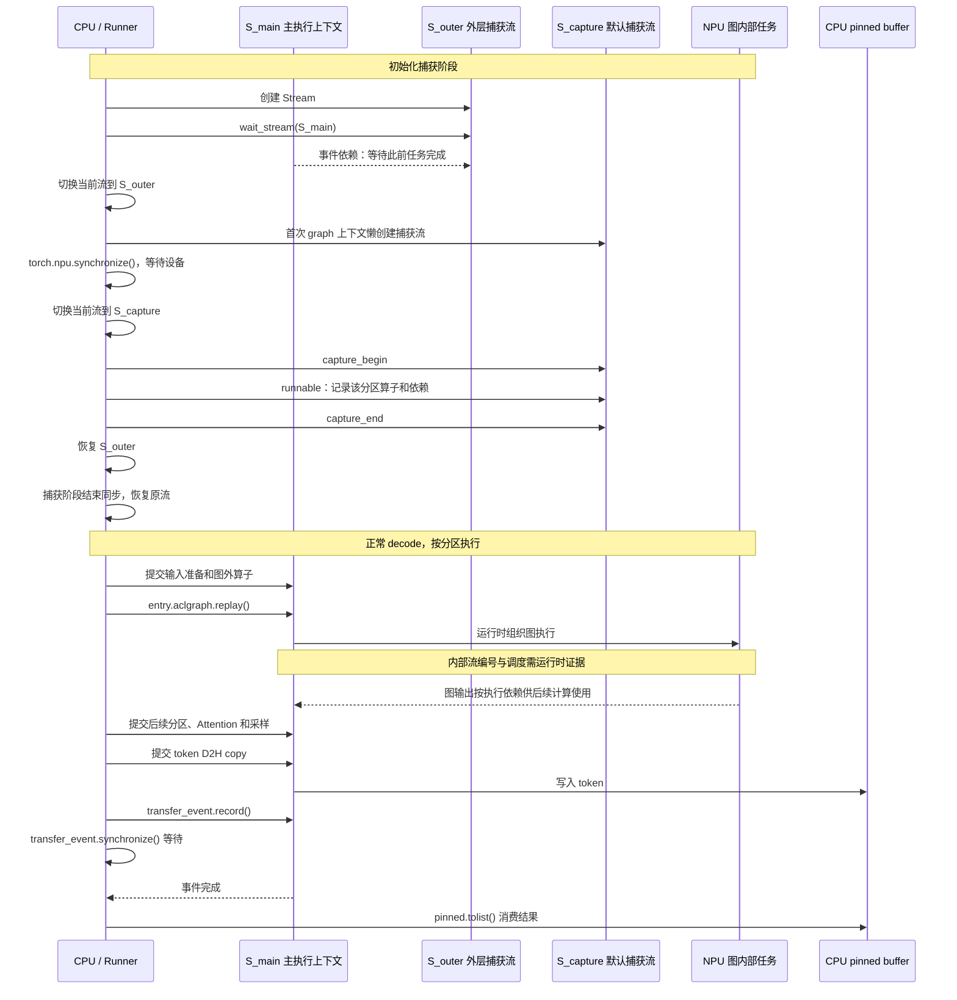

# vLLM / vLLM-Ascend 推理中的 Stream：远端源码阅读记录

整理日期：2026-09-29。本文记录通过 `ssh ascend910` 对远端当前源码所做的只读检查，解释 stream 的创建、切换、任务提交、同步和结果消费，并关联已有 Practice 26 的运行证据。

**当前 Qwen 实验的 stream 分配由 runner、算子调用时的当前 stream、graph 捕获封装共同决定。所追踪的源码路径中，没有“根据算子使用多少核，自动选择几条模型计算 stream”的决策链。Graph 中看到多个 stream ID，也不代表这些计算并行。**

本次检查没有修改远端源码、配置或服务，没有重新启动推理实验。分析读取的是远端实际安装、导入的源码，**没有使用本地或实验目录中的 `sources` 快照替代当前源码**。已有实验的配置、哈希清单、graph dump 和 profiler 输出只用于界定实验配置、比对版本以及核对运行证据。

## 1. 源码版本、导入路径与分析范围

### 1.1 远端检查结果

| 项目 | 检查结果 |
|---|---|
| vLLM 仓库 | `/vllm-workspace/vllm` |
| vLLM Git revision | `ad7125a431e176d4161099480a66f0169609a690` |
| vLLM-Ascend 仓库 | `/vllm-workspace/vllm-ascend` |
| vLLM-Ascend Git revision | `80610e4438dba05011b05f89fc45d91e96992671` |
| Python | `/usr/local/python3.12.13/bin/python` |
| 实际导入 vLLM | `/vllm-workspace/vllm/vllm/__init__.py` |
| 实际导入 vLLM-Ascend | `/vllm-workspace/vllm-ascend/vllm_ascend/__init__.py` |
| 实际导入 torch | `/usr/local/python3.12.13/lib/python3.12/site-packages/torch/__init__.py` |
| 实际导入 torch-npu | `/usr/local/python3.12.13/lib/python3.12/site-packages/torch_npu/__init__.py` |
| 版本 | vLLM `0.21.0+empty`；vLLM-Ascend `0.21.0rc1`；torch `2.10.0+cpu`；torch-npu `2.10.0` |

检查时，两个仓库没有 tracked 文件修改；Ascend 仓库存在未跟踪目录 `csrc/build_out/`。Git revision 本身不覆盖安装的依赖库版本和未跟踪构建产物，不能单凭 revision 宣称运行环境完全相同。

实际导入路径通过独立 Python 进程检查；该检查不是运行中 worker 的状态快照。

### 1.2 “当前实验路径”的含义

检查时没有运行中的推理服务。本文的“当前实验路径”指远端保存的 Practice 26 配置对应的执行路径，不代表本次重新运行并逐个打点验证了所有分支。

```text
模型：/data/huggingface_home/hub/Qwen2.5-0.5B-Instruct
TP=1，BF16，max_num_seqs=1
max_model_len=256，max_num_batched_tokens=256，block_size=128
temperature=0，ignore_eos=true，max_tokens=64
关闭 prefix caching、chunked prefill、async scheduling
enable_async_exponential=false

eager：--enforce-eager
graph：PIECEWISE，cudagraph_capture_sizes=[1]，custom_ops=["all"]
```

配置依据位于远端：

```text
/data/tianchi/practice_26_decode_utilization/results/2026-09-29-run01/
  control-0-eager/command.json
  control-1-graph/command.json
  graph-pipe/command.json
  graph-pipe/request.json
```

这是 dense Qwen、单卡、单请求配置，没有启用 MoE、KV offload、权重预取 offload 或 speculative decoding。随机采样辅助路径也不能直接归入当前贪心采样实验。

### 1.3 路径和证据约定

以下三个前缀都指向远端主机，**不是本地文件链接**。正文中的 `A/文件:行号` 等引用，应按这里展开为完整远端路径。

```text
A = /vllm-workspace/vllm-ascend/vllm_ascend
V = /vllm-workspace/vllm/vllm
P = /usr/local/python3.12.13/lib/python3.12/site-packages
```

源码行号适用于此次检查的版本。代码片段可能省略无关分支，含 `...` 的片段用于阅读，不是独立可执行程序。

本文区分三种证据：

- **源码事实**：远端实际文件中存在的实现和分支条件。
- **配置对应路径**：依据保存的启动命令、请求参数与源码条件判断的路径。
- **运行事实**：已有实验的 observer、graph dump、profiler 直接记录的内容。

## 2. 一条完整路径：创建 → 切换 → 提交 → 同步 → 消费

以当前 PIECEWISE graph 配置为主线，从初始化捕获一直读到正常 decode 后 CPU 获取 token。

为便于解释，给流起四类名称：

| 名称 | 含义 |
|---|---|
| `S_main` | 正常推理提交任务时的当前流；不预设固定 stream ID |
| `S_outer` | vLLM-Ascend 为外层捕获阶段创建的流 |
| `S_capture` | torch-npu graph 上下文实际选择的捕获流 |
| 图内部 stream | 图运行时层面的任务所属流，需要 graph dump / profiler 证据 |

这些标签不能直接与 profiler 中某个整数编号画等号。

### 2.1 Worker 创建 runner，并适配 CUDA 接口

入口：

```text
A/worker/worker.py:317–332
A/worker/model_runner_v1.py:274–275
```

```python
# worker.py:332
self.model_runner = NPUModelRunner(self.vllm_config, self.device)

# model_runner_v1.py:274–275
with _torch_cuda_wrapper():
    super().__init__(vllm_config, device)
```

当前版本在 `A/worker/worker.py:144–147` 对 vLLM `0.21.0` 明确回退到 v1 runner，因此这里追踪 `model_runner_v1.py`。

继承的上游 `GPUModelRunner` 能操作 NPU，是因为 `A/worker/model_runner_v1.py:4905–4911` 执行了以下替换：

```python
torch.Event = torch.npu.Event
torch.cuda.Event = torch.npu.Event
torch.cuda.Stream = torch.npu.Stream
torch.cuda.default_stream = torch.npu.default_stream
torch.cuda.current_stream = torch.npu.current_stream
torch.cuda.stream = torch.npu.stream
torch.cuda.synchronize = torch.npu.synchronize
```

因此，某些上游代码虽然写着 `torch.cuda.stream(...)`，沿这条初始化路径实际调用的是 NPU 实现。

需要注意两个边界：

- 普通解释器仅导入库时，检查到 `torch.cuda.Stream is torch.npu.Stream` 为 `False`。不能认为任意进程一经 import 就完成了该映射。
- 包装器退出时没有完整恢复原 CUDA 接口。`A/worker/model_runner_v1.py:4923–4931` 保留了部分 NPU 别名，并把 `torch.cuda.Event` 设为占位类。因此，它不是一个退出后完整还原环境的临时替换器，也不能把未列出的所有 `torch.cuda.*` API 都当作已适配。

### 2.2 初始化图时，创建外层捕获流

调用关系：

```text
NPUModelRunner.capture_model()
  → 替换上游 graph_capture 函数
  → GPUModelRunner.capture_model()
  → Ascend graph_capture()
```

依据：

```text
A/worker/model_runner_v1.py:4820–4824、4936–4946
V/v1/worker/gpu_model_runner.py:6203–6216
```

Ascend 的创建和切换代码位于 `A/worker/model_runner_v1.py:217–230`：

```python
graph_capture_context = GraphCaptureContext(torch.npu.Stream(device=device))
stream = graph_capture_context.stream

# 中间省略 nullcontext 的设置
curr_stream = torch.npu.current_stream()
if curr_stream != stream:
    stream.wait_stream(curr_stream)

with torch.npu.stream(stream), maybe_ca_context:
    yield graph_capture_context
```

逐句理解：

1. `Stream(...)` 申请 NPU stream 对象，记为 `S_outer`。
2. 保存进入捕获前的当前流，记为 `S_main`。
3. `S_outer.wait_stream(S_main)` 让以后提交到 `S_outer` 的任务等待 `S_main` 在该时点之前的工作。
4. `with torch.npu.stream(S_outer)` 将当前提交流切换为 `S_outer`。

这里的 `wait_stream` 只建立设备端顺序，不要求 CPU 等待 NPU 完成。实际实现见 `P/torch_npu/npu/streams.py:42–54`：

```python
def wait_stream(self, stream):
    self.wait_event(stream.record_event())
```

它在生产者流上记录事件，再让消费者流等待该事件。**它不涵盖生产者在这次 record 之后才提交的任务。**

### 2.3 进入具体分区捕获时，再切换一次流

Ascend 图包装器位于 `A/compilation/acl_graph.py:182–208`：

```python
aclgraph = torch.npu.NPUGraph()

# 中间省略配置与 offloader 处理
with torch.npu.graph(aclgraph, pool=self.graph_pool):
    output = self.runnable(*args, **kwargs)
```

这里没有传 `stream=`。继续读安装的 torch-npu，`P/torch_npu/npu/graphs.py:504–513`：

```python
if self.__class__.default_capture_stream is None:
    self.__class__.default_capture_stream = torch.npu.Stream()

self.capture_stream = (
    stream if stream is not None else self.__class__.default_capture_stream
)
self.stream_ctx = torch.npu.stream(self.capture_stream)
```

默认使用 torch-npu 懒创建的 `S_capture`。它存放在类属性上，**不是每个分区都显式执行一次 `Stream()` 来创建自己的捕获流**。

进入和退出逻辑位于 `P/torch_npu/npu/graphs.py:518–536`：

```python
def __enter__(self):
    torch.npu.synchronize()
    # 省略 GC/cache 与可选 dispatch 处理
    self.stream_ctx.__enter__()
    self.npu_graph.capture_begin(...)

def __exit__(self, exc_type, exc_value, traceback):
    self.npu_graph.capture_end()
    # 省略可选 dispatch 处理
    self.stream_ctx.__exit__(exc_type, exc_value, traceback)
```

这里依次发生：

1. `torch.npu.synchronize()`：CPU 等待设备工作完成。
2. 切换当前流到 `S_capture`。
3. `capture_begin()` 后，记录 `self.runnable(...)` 中该分区的任务。
4. `capture_end()` 后，恢复之前的 `S_outer`。

流切换本身位于 `P/torch_npu/npu/utils.py:203–229、245–257`：

```python
self.src_prev_stream = torch.npu.current_stream()
torch.npu.set_stream(cur_stream)

# 退出上下文时恢复
torch.npu.set_stream(self.src_prev_stream)
```

`set_stream()` 最终调用 `_C._npu_setStream(...)`。**切换流本身不自动建立生产者—消费者依赖，也不是完成等待。**

上游捕获阶段还有设备同步，见 `V/v1/worker/gpu_model_runner.py:6216、6222、6232`。因此，不能只看到外层 `wait_stream()`，就认为整个初始化捕获阶段不阻塞 CPU。

### 2.4 模型计算如何提交到流

正常 forward 入口：

```text
A/worker/model_runner_v1.py:2256–2258、2769–2788
```

`_model_forward(...)` 最终调用模型。Qwen Attention 的关键顺序见 `V/model_executor/models/qwen2.py:214–235`：

```python
qkv, _ = self.qkv_proj(hidden_states)
q, k, v = qkv.split([self.q_size, self.kv_size, self.kv_size], dim=-1)

q, k = self.rotary_emb(positions, q, k)
attn_output = self.attn(q, k, v)
output, _ = self.o_proj(attn_output)
```

Attention 需要 Q/K/V，输出投影需要 Attention 的结果。这些是真实的数据依赖。该段模型代码没有为每个算子选择不同 stream；流来自外围执行上下文及底层实现。

写 KV cache 的调用链：

```text
A/attention/attention_v1.py:1243–1253
  → A/device/device_op.py:44–47
```

```python
torch_npu._npu_reshape_and_cache(
    key=key,
    value=value,
    key_cache=key_cache,
    value_cache=value_cache,
    slot_indices=slot_mapping,
)
```

这里没有显式传 stream，任务通过设备后端当前执行上下文提交。不能仅凭这个 Python 调用列出 CANN 内部所有任务、流或调度细节。

Triton 也没有因为使用另一套算子实现，就自动获得独立并行流。slot mapping 的 launch 见 `A/worker/block_table.py:146–160`：

```python
_compute_slot_mapping_kernel[(num_reqs + 1,)](
    ...,
    self.block_table.gpu,
    ...,
    self.slot_mapping.gpu,
    ...,
)
```

继续向下，`P/triton/runtime/jit.py:571–572、648–651`：

```python
device = driver.active.get_current_device()
stream = driver.active.get_current_stream(device)

kernel.run(..., stream, ...)
```

Ascend driver 的桥接在 `P/triton/backends/ascend/driver.py:188–194`。对应 torch-npu 实现位于 `P/triton/backends/ascend/backend_register.py:262–273`，优先调用 `_npu_getCurrentRawStreamNoWait(device)`，不支持时调用 `_npu_getCurrentRawStream(device)`。

这条链说明：**Triton kernel 在 launch 时取得当前 NPU stream，再把句柄传给 launcher。**

### 2.5 正常 decode 执行 replay

位置：`A/compilation/acl_graph.py:248–272`。

```python
entry.aclgraph.replay()
return entry.output
```

返回的是与图关联的输出 tensor。Python 返回 tensor 不代表 NPU 已完成计算；后续消费仍须满足设备依赖和必要的 CPU 等待。

同处还有一个容易误读的同步：

```python
need_sync = self.runtime_mode == CUDAGraphMode.FULL and not is_draft_eagle
if not self.enable_enpu and need_sync:
    torch.npu.current_stream().synchronize()
```

当前模式是 `PIECEWISE`，不会执行这个 FULL 专属的 replay 前同步。这不等于整个推理没有其他同步。

同文件 `157–164` 在 runtime mode 为 `NONE` 或不匹配时直接调用 `self.runnable(...)`，不触发 capture/replay。当前只捕获大小为 1 的配置，不能把所有 prefill、warmup 和 decode 都算成同一条 replay 路径。

Python 源码确认了 replay 调用所在的执行上下文，但底层如何把图内部任务组织到 runtime stream，需要第 6 节的运行证据，不能单靠此处的 `replay()` 推断。

### 2.6 采样、D2H 与 CPU 消费

当前 `temperature=0`，贪心采样路径见：

```text
V/v1/sample/sampler.py:245–257
A/sample/sampler.py:104–124
```

普通分支执行：

```python
logits.argmax(dim=-1).view(-1)
```

当前关闭 async scheduling，随后 `A/worker/model_runner_v1.py:2616–2626` 调用：

```python
if not self.use_async_scheduling:
    ...
    valid_sampled_token_ids = self._to_list(sampled_token_ids)
```

`_to_list()` 继承自上游，位于 `V/v1/worker/gpu_model_runner.py:7099–7103`：

```python
pinned = self.sampled_token_ids_pinned_cpu[: sampled_token_ids.shape[0]]
pinned.copy_(sampled_token_ids, non_blocking=True)
self.transfer_event.record()
self.transfer_event.synchronize()
return pinned.tolist()
```

这五行给出明确的消费边界：

1. 采样计算已提交到 NPU。
2. 提交 NPU→CPU token 拷贝；这里没有切换到单独的输出流。
3. 在当前流记录 `transfer_event`。
4. CPU 在 `event.synchronize()` 等待拷贝完成。
5. CPU 才能读取 pinned buffer，生成 Python token 列表。

Event 和 CPU buffer 在 `V/v1/worker/gpu_model_runner.py:820–825` 初始化；此时构造函数中的 `torch.Event` 已由 Ascend runner 映射到 NPU Event。

`non_blocking=True` 描述拷贝提交方式，不能据此推导后续 CPU 不等待。当前请求还要求 logprobs，相关转换可能带来其他同步；这里讲的是 token 回传这一条完整路径，而非枚举整个请求的所有等待点。

## 3. Stream 时序图

此图表达源码层的控制关系，不表示真实耗时比例。`S_main`、`S_outer`、`S_capture` 是解释标签；“图内部任务”不预设其与 Python stream 一一对应。



图中 `G → M` 表示图输出的执行依赖，不声称源码在这个位置显式调用了某个 `wait_event()`，也不声称 Python 已揭示 CANN 的内部连接实现。

## 4. 其他路径：源码存在与当前启用必须分开

| 路径 | 创建、任务分配与依赖 | 当前实验状态 |
|---|---|---|
| 主执行路径 | Qwen forward 没有逐算子切流；算子经当前上下文提交；输出 `_to_list()` 用 Event 等待后由 CPU 读取 | eager、graph 都涉及 |
| 外层捕获流 | `A/worker/model_runner_v1.py:217–230` 创建、等待原流、切换进入 | graph 初始化启用 |
| torch-npu 默认捕获流 | `P/torch_npu/npu/graphs.py:504–536` 懒创建、切换、capture begin/end；进入前设备同步 | graph 初始化启用 |
| 随机采样辅助流 | `A/utils.py:479–485` 懒创建 `global_stream()`；`A/sample/sampler.py:32–42` 辅助流生成随机数，主流 `wait_stream()` 后执行 `div/argmax` | 当前贪心采样不走此分支 |
| 提前生成随机数 | `A/worker/model_runner_v1.py:2217–2222` 条件触发；`A/sample/sampler.py:89–102` 辅助流生成并 record；`:188` 消费前 `event.synchronize()` 阻塞 CPU | `enable_async_exponential=false`，未启用 |
| 异步输出拷贝流 | `V/v1/worker/gpu_model_runner.py:659–667` 创建；`:255–266` 拷贝流等待计算流，拷贝 token/logprobs，再记录完成事件；`:274–278` CPU 等待后释放持有的源 tensor | `--no-async-scheduling`，当前输出路径未启用 |
| FULL graph 参数更新流 | `A/worker/model_runner_v1.py:3671–3679` 创建；`:2737–2754` 按 FULL 条件调用更新 | 当前 PIECEWISE 未启用 |
| 权重预取流 | `A/model_executor/offloader/prefetch.py:36` 创建；`:249–262` 等待主流事件后 H2D；`:99–121` 消费计算等待拷贝 | 当前配置未启用预取 offload |
| MoE gate/shared-expert 流 | `A/ops/fused_moe/fused_moe.py:398、623、675、836` 创建或使用辅助流并建立等待 | 当前 dense Qwen 不走 MoE |
| KV offload 流 | 例如 `A/kv_offload/cpu_npu.py:67–68、207–213` 创建 D2H/H2D 流并安排等待、拷贝 | 当前未配置该 connector |

### 4.1 一个明确的跨流生产—消费例子：随机采样

这是源码存在的可选路径，不是当前贪心请求启用的分支。`A/sample/sampler.py:32–42`：

```python
with npu_stream_switch(global_stream()):
    q = torch.empty_like(probs)
    if len(generators) != probs.shape[0]:
        q.exponential_()
    if generators:
        for i, generator in generators.items():
            q[i].exponential_(generator=generator)

torch.npu.current_stream().wait_stream(global_stream())
return probs.div_(q).argmax(dim=-1).view(-1)
```

辅助流生成 `q`，退出上下文恢复原流，再让原流等待辅助流。`div_(q)` 才是消费随机数的计算。这个 `wait_stream()` 不要求 CPU 等待随机数生成完成。

另一条 `do_async_exponential()` 路径在 `A/sample/sampler.py:92–93` 先进入 `global_stream()` 上下文，再调用 `global_stream().wait_stream(torch.npu.current_stream())`。按上下文语义，此时 current stream 已是 global stream，不能把这一句读成主流到辅助流的依赖。是否需要其他依赖，应检查实际输入；本次没有将此观察判定为缺陷，也没有运行该分支。

### 4.2 FULL graph 的参数更新与 ExternalEvent

捕获 Attention 时，`A/attention/attention_v1.py:948–981`：

```python
event = torch.npu.ExternalEvent()
event.wait(stream)
event.reset(stream)

torch.npu.graph_task_group_begin(stream)
torch_npu._npu_paged_attention(...)
handle = torch.npu.graph_task_group_end(stream)
```

更新参数时，`A/attention/attention_v1.py:419、450–464`：

```python
with torch.npu.stream(update_stream):
    ...
    torch.npu.graph_task_update_begin(update_stream, handle)
    torch_npu._npu_paged_attention(...)
    torch.npu.graph_task_update_end(update_stream)
    event.record(update_stream)
```

这里由捕获的任务组、更新 handle 与 ExternalEvent 协作。不能理解为“换一条流，独立再计算一次普通 Attention”，也不能把该机制直接套到当前 PIECEWISE 实验。

### 4.3 辅助封装不能只看名字或注释

- `A/utils.py:1015–1023`：`npu_stream_switch()` 只返回 `torch.npu.stream(target_stream)` 或空上下文，不自动建立依赖。
- `A/utils.py:457–508`：多个流 getter 是懒创建缓存。部分注释写着返回 default stream，但实际代码调用 `torch_npu.npu.Stream()`，应以实现为准。
- `A/utils.py:440–454`：`current_stream()` 缓存首次获取的结果。注释提到 patch `set_stream`，但本次在 Ascend 源码中没有找到更新该缓存的对应实现。人为增加切流时，应核对调用者是否使用这个缓存 getter，不能仅凭注释假设它始终跟踪当前流。
- `P/torch_npu/npu/utils.py:260–272`：原生 `current_stream()` 从底层查询当前流，再包装为 Python 对象。返回一个新的 Python 包装对象，不等于新建一条底层设备队列。

## 5. 同步语义，以及 eager / graph 的差异

依据 `P/torch_npu/npu/streams.py:28–85、143–192`：

| 操作 | 作用 | CPU 是否等待设备完成 |
|---|---|---|
| `event.record(stream)` | 在指定流上记录完成标记 | 不作为完成等待 |
| `consumer.wait_event(event)` | 消费者后续任务等待事件 | 不等待事件完成后才返回 |
| `consumer.wait_stream(producer)` | 连接生产者此前任务与消费者后续任务 | 不等待生产者完成后才返回 |
| `event.synchronize()` | 等待事件完成 | 是 |
| `stream.synchronize()` | 等待该流工作完成 | 是 |
| `torch.npu.synchronize()` | 等待设备工作完成 | 是 |
| `with torch.npu.stream(s)` | 改变当前提交流，退出时恢复 | 本身不建立完成等待 |

这里区分的是 API 的设备完成等待语义，不表示非等待 API 没有任何主机侧开销。

| 模式 | 主要提交方式 | 需要注意的同步与生命周期 |
|---|---|---|
| eager | 每轮执行代码，逐项提交计算 | 当前路径依赖同流顺序；最终 token 回传存在 CPU Event 等待 |
| PIECEWISE graph | 初始化捕获分区，匹配的运行形状 replay；分区间仍可能执行图外算子 | 捕获阶段有同步；当前不走 FULL 专属 replay 前同步；最终 token 回传仍等待 |
| FULL graph（可选） | 更完整的图执行，并按实现更新动态参数 | 参数更新流、ExternalEvent、replay 顺序，以及相应 CPU 等待条件均需检查 |

Graph 减少 Host 逐算子下发开销，不代表消除所有 CPU 等待。多条流提供独立推进的可能性，也不代表算子之间没有数据依赖。

## 6. Python Stream、捕获流、图内部流：分别如何确认

### 6.1 证据边界

| 对象 | 可确认的证据 | 不能直接推导的内容 |
|---|---|---|
| Python 显式申请的 stream | 实际执行路径上的 `torch.npu.Stream()` 与分支条件 | 构造次数不等于底层 runtime stream 新建次数；底层可能管理、复用资源 |
| 捕获使用的 stream | 外层 `graph_capture()`、torch-npu `graph.capture_stream` 与上下文切换 | 25 个分区不意味着 Python 创建了 25 条捕获流 |
| 图内部任务所属流 | 原始 graph dump 的 `Model Id / Stream Id / Task Id` 与 profiler 设备任务 | Python 源码不能解释 CANN 为何选择某编号、如何分配内部资源 |
| replay 下发 | observer replay 记录与 profiler 运行时 API | API 返回时间不等于 NPU 完成时间 |

### 6.2 本次读取的远端原始运行记录

以下路径全部位于远端目录：

```text
/data/tianchi/practice_26_decode_utilization/results/2026-09-29-run01/graph-pipe/
```

| 文件 | 用途 |
|---|---|
| `command.json`、`request.json` | 启动配置与请求参数 |
| `vllm_revision.txt`、`vllm_ascend_revision.txt` | 实验时仓库 revision |
| `source_hashes.json` | 与当前实际文件计算出的哈希比较；没有用快照内容代替源码 |
| `observer-1238142.json` | capture、execute、sample、replay 记录 |
| `graph_dumps/1238142-g26.json` 等 | 图任务的 model / stream / task 标识 |
| `profiler/rank0_1238142_20260929135122733_ascend_pt/ASCEND_PROFILER_OUTPUT/kernel_details.csv` | 原始计算任务 stream 与设备计时 |
| 同目录 `trace_view.json` | Host API、设备事件与执行轨迹 |
| `analysis/summary.json` | 已有分析程序生成的统计，不是本次重新计算全部指标 |

核对得到：

- 原始 `kernel_details.csv` 中存在 **26 个计算任务 stream ID**。
- `observer-1238142.json` 记录 **1575 次 replay**，涉及 **25 个被 replay 的图对象**。它也包含 50 条 capture 记录，不能把初始化阶段全部捕获对象数与测量阶段使用的对象数混为一谈。
- 原始 `trace_view.json` 记录 **1575 次 `AscendCL@aclmdlRIExecuteAsync`**。
- 同一 trace 记录 **64 次 `aclrtSynchronizeEvent`**、**192 次 `aclrtSynchronizeStream`**。未经调用关联，不能将这些调用全部归因于某一行 Python。
- 已保存的 `analysis/summary.json` 报告 `overlap_us = 0`、`peak_compute_streams = 1`。这是此次分析窗口中计算任务的统计，不表示设备上所有类别的活动都不可能重叠。

原始 graph dump 的例子：

```text
graph_dumps/1238142-g26.json
  Model Id = 40
  Stream Id = 3
  任务包括 Cast、Gather、RmsNorm、MatMul、Triton RoPE

graph_dumps/1238142-g27.json
  Model Id = 44
  Stream Id = 7
```

Graph dump 的排列位置描述图任务；其示意时间不能用于计算真实重叠，应使用 profiler 的设备时间。

当前实际文件与实验清单中的哈希比对一致的文件包括：

```text
A/worker/model_runner_v1.py
V/v1/worker/gpu_model_runner.py
A/compilation/acl_graph.py
P/torch_npu/npu/graphs.py
```

实验记录的两库 revision 也与本次检查一致。该比对支持把这些关键实现与已有实验关联，但不等于验证了所有二进制依赖、环境变量或运行状态完全相同。

### 6.3 如何理解“1 条主流，加上 25 个分区内部流”

已有记录支持多个图关联的 stream 上存在任务，以及此次测量没有计算重叠。它们不支持“26 条主流同时运行”。

“1 + 25”应当限定为这次运行记录中的任务分布描述，而不是 Python 显式创建了 26 条主计算流，也不是 vLLM 对所有 PIECEWISE 模型的固定策略。Python 捕获流与 runtime 图内部 stream 不能直接一一对应。

尚未由本次检查证明的事项包括：底层 stream 资源分配算法、Python stream 到 runtime ID 的完整映射、CANN 每次 replay 的所有内部依赖连接。要回答这些问题，需要进一步读取可获得的 native 实现或增加运行时关联证据，不能从 Python API 名称补全推断。

## 7. 若改变任务所属 Stream，修改位置与安全条件

以下是后续实验的修改定位，本次没有实施修改。

| 调整目标 | 应检查或修改的位置 | 必须保留的依赖 |
|---|---|---|
| slot mapping kernel | `A/worker/block_table.py:137–160` 的 launch 周围 | block table、positions、query_start_loc 准备完成 → slot 计算 → KV 写入 |
| KV cache 写入 | `A/attention/attention_v1.py:1243–1253` | K/V、slot 准备完成 → cache 写入 → Attention 读取 |
| Qwen 计算分支 | `V/model_executor/models/qwen2.py:209–235、292–312` | 上游 hidden states/QKV → 新流计算 → 下游消费 |
| token D2H | `V/v1/worker/gpu_model_runner.py:7099–7103` | 采样完成 → 拷贝 → CPU 读取，并保护源 tensor 与 pinned buffer |
| 捕获使用的流 | `A/compilation/acl_graph.py:206` 显式传 `stream=`，同时检查外层捕获函数 | 捕获前初始化完成；跨流分支正确 join；capture 生命周期正确 |
| graph 内部算子分配 | 调整捕获时的计算与依赖组织，再重新捕获 | 只在 replay 外换当前流，不会自动重排图内每个算子的流归属 |

移动任务时必须同时维护四类约束。

**读之前等写完。** KV 写入流要等待 QKV 和 slot mapping；Attention 流要等待 KV 写入。一个 `with stream(...)` 只改变提交位置，不会自动补齐这些边。

**覆盖之前等旧读者完成。** Host 把 block 放回空闲队列，不代表旧 NPU 访问已经结束。新请求覆盖相同物理 block 前，仍需维护旧访问 → 新写入的顺序。

**异步使用期间保持存储有效。** Tensor 引用、allocator 的跨流使用记录、CPU pinned buffer 的复用时机需要一起检查。Event 排序不会自动延长所有对象的生命周期。上游异步输出对象在 `V/v1/worker/gpu_model_runner.py:248–252、274–278` 显式持有源 tensor，直到拷贝完成后才释放，就是具体例子。

**维护 graph 的固定地址和共享内存假设。** `A/compilation/acl_graph.py:182–183` 保存输入地址，`:248–255` 仅在调试模式检查地址一致；输出和 graph pool 也会复用。若使原本串行的 replay 重叠，必须重新检查输入、输出、workspace 与 KV 是否被提前改写。地址相同本身也不能证明其中的数据属于正确请求或正确代次。

## 8. 推荐阅读顺序

先读当前实际主线，再读可选辅助流，避免一开始被全仓库搜索结果淹没：

```text
A/worker/model_runner_v1.py:274
    CUDA → NPU 接口适配后的 runner 初始化
        ↓
A/worker/model_runner_v1.py:217
    创建外层捕获流、等待原流、切换
        ↓
A/compilation/acl_graph.py:206
    进入具体分区捕获
        ↓
P/torch_npu/npu/graphs.py:504
    选择实际捕获流，capture begin/end
        ↓
A/compilation/acl_graph.py:271
    正常推理 replay
        ↓
A/worker/model_runner_v1.py:2621
    获取生成的 token
        ↓
V/v1/worker/gpu_model_runner.py:7099
    D2H → Event 等待 → CPU 读取
```

第二遍再读 `A/sample/sampler.py:32–42` 的可选随机采样跨流路径，以及权重预取的 fork / copy / join，比较“同流顺序”“跨流设备等待”和“CPU 完成等待”的区别。

相关仓库材料：

- [Practice 22：Stream 生命周期追踪](../../practice_22_stream_lifecycle/README.md)
- [Practice 26：Decode 利用率研究](../../practice_26_decode_utilization/README.md)
- [CUDA 多 Stream 应用与同步](../cuda_stream_use_cases/README.md)
- [vLLM KV offload 同步问题](../vllm_syn_issuse_analysis/README.md)
