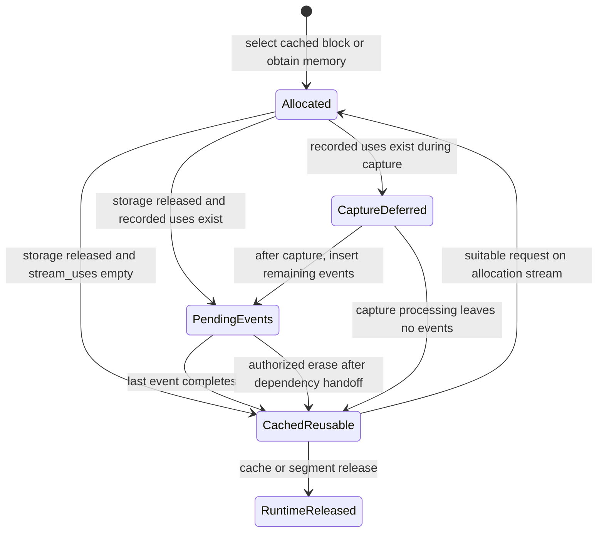

# torch npu device allocation and asynchronous memory lifetime

## 1. Executive summary

**[VERIFIED] torch-npu has a native, stream-aware caching allocator.** At the installed package's advertised source revision, ordinary Tensor destruction returns memory to a cache rather than immediately calling `aclrtFree`. Blocks retain their allocation stream; explicitly recorded uses form a set of streams, and normal non-capture free records an event on each member and withholds the block until all those events complete. **[INFERRED] The general classification is Case B: cross-stream lifetime protection requires an upper layer to inform the allocator, retain ownership, or arrange a dependency back to the allocation stream.** Selected subsystems do this automatically; arbitrary eager operators and stream guards do not provide a universal mechanism. An unrecorded use on S1 can therefore be invisible when a block allocated on S0 is freed and selected again on S0. This establishes a conditional mechanism to test, **not a demonstrated race or vulnerability** in the installed workload. No NPU experiment was run because the Ascend machine was already being used for other tests. Evidence: [NCA: `NpuCachingAllocator::allocate`, lines 3525–3554](https://github.com/Ascend/pytorch/blob/94f8a8e6b523d7ba553e1b80d5b5248478391526/torch_npu/csrc/core/npu/NPUCachingAllocator.cpp#L3525-L3554), [NCA: `DeviceCachingAllocator::free`, lines 1445–1483](https://github.com/Ascend/pytorch/blob/94f8a8e6b523d7ba553e1b80d5b5248478391526/torch_npu/csrc/core/npu/NPUCachingAllocator.cpp#L1445-L1483), [NCA: `DeviceCachingAllocator::recordStream`, lines 1557–1564](https://github.com/Ascend/pytorch/blob/94f8a8e6b523d7ba553e1b80d5b5248478391526/torch_npu/csrc/core/npu/NPUCachingAllocator.cpp#L1557-L1564), [NCA: `DeviceCachingAllocator::insert_events / process_events`, lines 2984–3063](https://github.com/Ascend/pytorch/blob/94f8a8e6b523d7ba553e1b80d5b5248478391526/torch_npu/csrc/core/npu/NPUCachingAllocator.cpp#L2984-L3063), [NCA: `DeviceCachingAllocator::get_free_block`, lines 2486–2547](https://github.com/Ascend/pytorch/blob/94f8a8e6b523d7ba553e1b80d5b5248478391526/torch_npu/csrc/core/npu/NPUCachingAllocator.cpp#L2486-L2547).

## 2. Allocator architecture

### Scope and evidence provenance

This report first uses the current repository's existing Ascend investigations for context, then independently reconstructs torch-npu from source. The local repository is an infrastructure study, not a torch-npu checkout. Its vLLM KV block studies concern logical suballocation inside long-lived Tensor storage; those logical releases do not necessarily call the Tensor allocator. They must not be equated with the storage lifecycle below. See the repository [roadmap](../../REAL_SYSTEM_ROADMAP.md) and [remote stream investigation](../streams_in_vllm_source_code/README.md).

Read-only inspection on **2026-10-02** found:

| Component | Pinned evidence |
|---|---|
| torch-npu | Package `2.10.0`; installed `version.py` advertises `94f8a8e6b523d7ba553e1b80d5b5248478391526` |
| PyTorch | `2.10.0+cpu`; revision `449b1768410104d3ed79d3bcfe4ba1d65c7f22c0` |
| op-plugin | `dedc316708372c9a8bfde4527abd2a94b74840f5`, identified in the repository's existing [source manifest](../vision_metadata_synchronization/sub_probe/sources/manifest.json); two installed OpApi headers match byte-for-byte |
| CANN | Headers under `/usr/local/Ascend/cann-9.0.0`; `acl_rt.h` hash reverified against the archived copy |
| Installed binary | `libtorch_npu.so`, SHA256 `d660bda23343553b86b2543622d5286346d4f42ad09d9fa20fc431c67a9c9b09` |

The collector read package metadata and files without importing torch or initializing the NPU. Eight selected installed torch-npu/op-plugin headers and Python files match the pinned upstream source. **[VERIFIED]** means established in that source, not disassembly proof that every installed machine-code path is identical. **[INFERRED]** marks conclusions combining mechanisms and runtime ordering assumptions. **[UNKNOWN]** marks missing runtime/build/application evidence. The inspected SSH shell's unset configuration variables are not the running workload's effective configuration. Provenance and hashes: [remote environment](remote_environment.json), [source manifest](source_manifest.json), [read-only collector](inspect_remote.py).

The search covered allocation/free/runtime APIs, pools/blocks/segments, caching/reuse, stream ownership, recording/erasure, events, synchronization, and deferred states across both repositories, including differently named host, workspace, swap, and pluggable allocators. Saved inventories: [broad file inventory](allocator_lifetime_file_inventory.txt), [recording and erasure inventory](stream_recording_inventory.txt), [torch-npu handoffs](stream_handoff_inventory_torch-npu.txt), [op-plugin handoffs](stream_handoff_inventory_op-plugin.txt). These are lexical inventories, not proof that every asynchronous path is correct.

### Source citation key

Citations give a file key, function/class, and **original source line range**, with a link pinned to its revision. Exact paths for the most frequently used keys are:

| Key | Path |
|---|---|
| NCA / NCAH | `torch_npu/csrc/core/npu/NPUCachingAllocator.cpp` / `.h` |
| FACT / STOR | `torch_npu/csrc/aten/common/TensorFactories.cpp` / `torch_npu/csrc/core/NPUStorageImpl.cpp` |
| STREAM / EVENT / EM | `torch_npu/csrc/core/npu/NPUStream.cpp` / `NPUEvent.cpp` / `NPUEventManager.cpp` |
| ASYNC / ACL | `torch_npu/csrc/core/npu/interface/AsyncTaskQueueInterface.cpp` / `AclInterface.cpp` |
| HCCL / LCCL | `torch_npu/csrc/distributed/ProcessGroupHCCL.cpp` / `ProcessGroupLCCL.cpp` |
| API / APIC / APIB | op-plugin: `op_plugin/utils/op_api_common.h` / `.cpp` / `op_api_common_base.h` |
| CUDA | PyTorch: `c10/cuda/CUDACachingAllocator.cpp` |

The complete key-to-path mapping is in [citation paths](citation_paths.json). All cited code is also preserved under [sources](sources), with its URL and SHA256 in the manifest.

### Main objects and relationships

All entries in this table are **[VERIFIED]**.

| Object or entry point | Actual role | Evidence |
|---|---|---|
| `NPUAllocator : c10::Allocator` and `NPUCachingAllocator::get()` | Public allocator interface; ordinary factories use the selected allocator. Inline wrappers dispatch raw allocation/free, stream recording, and cache operations to it. | [NCAH: `NPUAllocator / API wrappers`, lines 227–257](https://github.com/Ascend/pytorch/blob/94f8a8e6b523d7ba553e1b80d5b5248478391526/torch_npu/csrc/core/npu/NPUCachingAllocator.h#L227-L257); [NCAH: `raw_alloc / raw_delete`, lines 320–331](https://github.com/Ascend/pytorch/blob/94f8a8e6b523d7ba553e1b80d5b5248478391526/torch_npu/csrc/core/npu/NPUCachingAllocator.h#L320-L331); [NCAH: `recordStream`, lines 376–389](https://github.com/Ascend/pytorch/blob/94f8a8e6b523d7ba553e1b80d5b5248478391526/torch_npu/csrc/core/npu/NPUCachingAllocator.h#L376-L389) |
| `NpuCachingAllocator` | Native top-level allocator; mutex-protected `allocated_blocks` maps addresses to `Block*`, with per-device allocators. Registered for `PrivateUse1`; native backend installed by initialization. | [NCA: `NpuCachingAllocator / pointer map`, lines 3111–3139](https://github.com/Ascend/pytorch/blob/94f8a8e6b523d7ba553e1b80d5b5248478391526/torch_npu/csrc/core/npu/NPUCachingAllocator.cpp#L3111-L3139); [NCA: `REGISTER_ALLOCATOR / local_raw_delete`, lines 3785–3793](https://github.com/Ascend/pytorch/blob/94f8a8e6b523d7ba553e1b80d5b5248478391526/torch_npu/csrc/core/npu/NPUCachingAllocator.cpp#L3785-L3793); [NCA: `BackendStaticInitializer`, lines 3837–3845](https://github.com/Ascend/pytorch/blob/94f8a8e6b523d7ba553e1b80d5b5248478391526/torch_npu/csrc/core/npu/NPUCachingAllocator.cpp#L3837-L3845) |
| `DeviceCachingAllocator` | Per-device lock, small/large caches, active blocks, pending event queues, graph-private pools, and capture-deferred blocks. | [NCA: `DeviceCachingAllocator members`, lines 959–1024](https://github.com/Ascend/pytorch/blob/94f8a8e6b523d7ba553e1b80d5b5248478391526/torch_npu/csrc/core/npu/NPUCachingAllocator.cpp#L959-L1024) |
| `Block` | Device, allocation `aclrtStream`, `stream_uses`, pointer, size, requested size, allocated flag, split neighbors, event count, mapping/segment state, optional HCCL work association. No host-thread identifier. | [NCA: `Block`, lines 213–270](https://github.com/Ascend/pytorch/blob/94f8a8e6b523d7ba553e1b80d5b5248478391526/torch_npu/csrc/core/npu/NPUCachingAllocator.cpp#L213-L270) |
| `BlockPool` | Sorted reusable blocks, unmapped regions, small/large classification, private-pool owner and cached physical handles. Size comparator orders by stream, size, address. | [NCA: `BlockPool`, lines 195–209](https://github.com/Ascend/pytorch/blob/94f8a8e6b523d7ba553e1b80d5b5248478391526/torch_npu/csrc/core/npu/NPUCachingAllocator.cpp#L195-L209); [NCA: `BlockComparatorSize / Address`, lines 713–730](https://github.com/Ascend/pytorch/blob/94f8a8e6b523d7ba553e1b80d5b5248478391526/torch_npu/csrc/core/npu/NPUCachingAllocator.cpp#L713-L730) |
| `PrivatePool` | Separate small/large pools with graph reference and runtime-allocation accounting. | [NCA: `PrivatePool`, lines 805–823](https://github.com/Ascend/pytorch/blob/94f8a8e6b523d7ba553e1b80d5b5248478391526/torch_npu/csrc/core/npu/NPUCachingAllocator.cpp#L805-L823) |
| `ExpandableSegment` | Reserved virtual range with mapped physical allocations. This is a device-memory segment mechanism, not the application's logical KV block pool. | [NCA: `ExpandableSegment constructor / map`, lines 376–465](https://github.com/Ascend/pytorch/blob/94f8a8e6b523d7ba553e1b80d5b5248478391526/torch_npu/csrc/core/npu/NPUCachingAllocator.cpp#L376-L465) |
| `EventPool` | Per-device pool of `NPUEvent` wrappers; allocator events use `ACL_EVENT_CAPTURE_STREAM_PROGRESS`. | [NCA: `EventPool`, lines 758–801](https://github.com/Ascend/pytorch/blob/94f8a8e6b523d7ba553e1b80d5b5248478391526/torch_npu/csrc/core/npu/NPUCachingAllocator.cpp#L758-L801) |
| `npu_events` | Stream to deque of `(event, Block*)`; a block can appear in multiple stream queues. `event_count` counts remaining events. | [NCA: `pending bookkeeping`, lines 974–986](https://github.com/Ascend/pytorch/blob/94f8a8e6b523d7ba553e1b80d5b5248478391526/torch_npu/csrc/core/npu/NPUCachingAllocator.cpp#L974-L986); [NCA: `insert_events`, lines 2984–3009](https://github.com/Ascend/pytorch/blob/94f8a8e6b523d7ba553e1b80d5b5248478391526/torch_npu/csrc/core/npu/NPUCachingAllocator.cpp#L2984-L3009) |

### Runtime APIs and alternative allocators

**[VERIFIED] Public raw-memory APIs:** `torch_npu.npu.caching_allocator_alloc(size, device, stream)` chooses the current stream when omitted (executable code, despite its docstring saying default), then the Python C binding calls `raw_alloc_with_stream`. `caching_allocator_delete` reaches `raw_delete`, which uses normal native block free. Tensor factories use `c10::Allocator::allocate` instead. `torch_npu.npu.empty_cache()` invokes `_npu_emptyCache` when initialized. These APIs expose the cache; a raw pointer by itself carries no Tensor ownership. [MEM: `caching_allocator_alloc / caching_allocator_delete`, lines 76–125](https://github.com/Ascend/pytorch/blob/94f8a8e6b523d7ba553e1b80d5b5248478391526/torch_npu/npu/memory.py#L76-L125); [MOD: `THNPModule_npuCachingAllocator_raw_alloc / raw_delete`, lines 1591–1619](https://github.com/Ascend/pytorch/blob/94f8a8e6b523d7ba553e1b80d5b5248478391526/torch_npu/csrc/npu/Module.cpp#L1591-L1619); [MEM: `empty_cache`, lines 168–180](https://github.com/Ascend/pytorch/blob/94f8a8e6b523d7ba553e1b80d5b5248478391526/torch_npu/npu/memory.py#L168-L180).

**[VERIFIED]** Ordinary new native blocks call `c10_npu::acl::AclrtMallocAlign32`; its dynamic wrapper uses `aclrtMallocAlign32` when available and falls back to `aclrtMalloc`. Segment release calls `aclrtFree`. Expandable segments reserve addresses, allocate physical handles, and map them; unmapping synchronizes the device and either frees or caches physical handles. These different allocation modes preserve the native block/event accounting above. Evidence: [NCA: `alloc_block`, lines 2631–2697](https://github.com/Ascend/pytorch/blob/94f8a8e6b523d7ba553e1b80d5b5248478391526/torch_npu/csrc/core/npu/NPUCachingAllocator.cpp#L2631-L2697), [ACL: `AclrtMallocAlign32`, lines 640–650](https://github.com/Ascend/pytorch/blob/94f8a8e6b523d7ba553e1b80d5b5248478391526/torch_npu/csrc/core/npu/interface/AclInterface.cpp#L640-L650), [NCA: `release_block`, lines 2795–2820](https://github.com/Ascend/pytorch/blob/94f8a8e6b523d7ba553e1b80d5b5248478391526/torch_npu/csrc/core/npu/NPUCachingAllocator.cpp#L2795-L2820), [NCA: `ExpandableSegment constructor / map`, lines 376–465](https://github.com/Ascend/pytorch/blob/94f8a8e6b523d7ba553e1b80d5b5248478391526/torch_npu/csrc/core/npu/NPUCachingAllocator.cpp#L376-L465), [NCA: `ExpandableSegment::unmapHandles`, lines 573–603](https://github.com/Ascend/pytorch/blob/94f8a8e6b523d7ba553e1b80d5b5248478391526/torch_npu/csrc/core/npu/NPUCachingAllocator.cpp#L573-L603), [ACL: `physical allocation / mapping wrappers`, lines 735–810](https://github.com/Ascend/pytorch/blob/94f8a8e6b523d7ba553e1b80d5b5248478391526/torch_npu/csrc/core/npu/interface/AclInterface.cpp#L735-L810).

**[VERIFIED]** Other allocators have different contracts:

| Path | Contract and limits | Evidence |
|---|---|---|
| Forced uncached Tensor allocation | `allocate` chooses a different deleter; while NPU is initialized, deletion globally synchronizes before `aclrtFree`. Native `raw_alloc` still goes through cached `malloc`, so the setting must not be generalized to every allocation API. | [NCA: `allocate`, lines 3525–3554](https://github.com/Ascend/pytorch/blob/94f8a8e6b523d7ba553e1b80d5b5248478391526/torch_npu/csrc/core/npu/NPUCachingAllocator.cpp#L3525-L3554); [NCA: `uncached_delete`, lines 3100–3107](https://github.com/Ascend/pytorch/blob/94f8a8e6b523d7ba553e1b80d5b5248478391526/torch_npu/csrc/core/npu/NPUCachingAllocator.cpp#L3100-L3107); [NCA: `raw_alloc / raw_delete`, lines 3625–3652](https://github.com/Ascend/pytorch/blob/94f8a8e6b523d7ba553e1b80d5b5248478391526/torch_npu/csrc/core/npu/NPUCachingAllocator.cpp#L3625-L3652); [OPT: `CheckForceUncached`, lines 583–593](https://github.com/Ascend/pytorch/blob/94f8a8e6b523d7ba553e1b80d5b5248478391526/torch_npu/csrc/core/npu/register/OptionsManager.cpp#L583-L593) |
| Dedicated workspace allocator | One workspace per stream; sufficient capacity is reused directly; growth synchronizes before replacing the allocation. `free()` primarily updates bookkeeping. OpApi V2 can use this allocator; V1 uses a normal cached Tensor workspace. | [WORK: `DeviceWorkspaceAllocator::malloc / free`, lines 74–220](https://github.com/Ascend/pytorch/blob/94f8a8e6b523d7ba553e1b80d5b5248478391526/torch_npu/csrc/core/npu/NPUWorkspaceAllocator.cpp#L74-L220); [PREP: `unsafe_empty_workspace overloads`, lines 410–446](https://github.com/Ascend/pytorch/blob/94f8a8e6b523d7ba553e1b80d5b5248478391526/torch_npu/csrc/framework/utils/OpPreparation.cpp#L410-L446); [API: `EXEC_NPU_CMD_V1 / V2`, lines 306–443](https://github.com/Ascend/op-plugin/blob/dedc316708372c9a8bfde4527abd2a94b74840f5/op_plugin/utils/op_api_common.h#L306-L443) |
| Pluggable allocator | Recording/erasure calls invoke user callbacks only when installed. A missing callback is a no-op; native guarantees cannot be assumed. | [PLUG: `recordStream / eraseStream`, lines 250–265](https://github.com/Ascend/pytorch/blob/94f8a8e6b523d7ba553e1b80d5b5248478391526/torch_npu/csrc/npu/NPUPluggableAllocator.cpp#L250-L265) |
| Swap-memory allocator | Separate host-swap allocation path, distinct from ordinary device Tensor storage. | [SWAP: `NpuSwappedMemoryAllocator::allocate`, lines 115–124](https://github.com/Ascend/pytorch/blob/94f8a8e6b523d7ba553e1b80d5b5248478391526/torch_npu/csrc/core/npu/NPUSwappedMemoryAllocator.cpp#L115-L124) |

**[UNKNOWN]** Whether a running application overrides the backend, allocation configuration, task-queue settings, or memory pools was not determined by reading its process state. Static defaults are not effective workload settings. `expandable_segments` and lazy reclaim default false in source; configuration is read through `PYTORCH_NPU_ALLOC_CONF`. Evidence: [CONF: `configuration initialization / defaults`, lines 105–145](https://github.com/Ascend/pytorch/blob/94f8a8e6b523d7ba553e1b80d5b5248478391526/torch_npu/csrc/core/npu/NPUAllocatorConfig.h#L105-L145).

## 3. Allocation lifecycle

### One ordinary Tensor from creation to reuse

1. **[VERIFIED] Creation:** dispatcher registration includes NPU `empty`; `NPUNativeFunctions::empty` selects the NPU device, obtains `NPUCachingAllocator::get()`, computes bytes, calls `allocator->allocate`, creates NPU storage, then a Tensor implementation. `empty_with_format` is another factory route. [FACT: `NPUNativeFunctions::empty`, lines 86–133](https://github.com/Ascend/pytorch/blob/94f8a8e6b523d7ba553e1b80d5b5248478391526/torch_npu/csrc/aten/common/TensorFactories.cpp#L86-L133); [FACT: `empty_with_format`, lines 278–314](https://github.com/Ascend/pytorch/blob/94f8a8e6b523d7ba553e1b80d5b5248478391526/torch_npu/csrc/aten/common/TensorFactories.cpp#L278-L314).
2. **[VERIFIED] Allocation stream:** native `allocate` reads device and `getCurrentNPUStreamNoWait(device)`, returns a `DataPtr` with `local_raw_delete`, and inserts the address-to-block entry. The allocator does not wait for prior work just to create the Tensor. [NCA: `NpuCachingAllocator::allocate`, lines 3525–3554](https://github.com/Ascend/pytorch/blob/94f8a8e6b523d7ba553e1b80d5b5248478391526/torch_npu/csrc/core/npu/NPUCachingAllocator.cpp#L3525-L3554); [NCA: `NpuCachingAllocator::malloc`, lines 3157–3171](https://github.com/Ascend/pytorch/blob/94f8a8e6b523d7ba553e1b80d5b5248478391526/torch_npu/csrc/core/npu/NPUCachingAllocator.cpp#L3157-L3171).
3. **[VERIFIED] Selection:** per-device `malloc` processes pending events when configured and outside capture, rounds the request, selects its pool, and searches reusable blocks. It rejects a cached block whose allocation stream differs from the request stream. Otherwise it obtains a runtime allocation or maps an expandable region. `alloc_found_block` can split a larger block, marks it allocated, and adds it to `active_blocks`. [NCA: `DeviceCachingAllocator::malloc`, lines 1156–1245](https://github.com/Ascend/pytorch/blob/94f8a8e6b523d7ba553e1b80d5b5248478391526/torch_npu/csrc/core/npu/NPUCachingAllocator.cpp#L1156-L1245); [NCA: `DeviceCachingAllocator::get_free_block`, lines 2486–2547](https://github.com/Ascend/pytorch/blob/94f8a8e6b523d7ba553e1b80d5b5248478391526/torch_npu/csrc/core/npu/NPUCachingAllocator.cpp#L2486-L2547); [NCA: `alloc_found_block`, lines 1341–1443](https://github.com/Ascend/pytorch/blob/94f8a8e6b523d7ba553e1b80d5b5248478391526/torch_npu/csrc/core/npu/NPUCachingAllocator.cpp#L1341-L1443).
4. **[VERIFIED] Operator use:** ordinary operator execution selects the current NPU stream. With task queues, execution is submitted to a host queue with the selected runtime stream saved in its parameters; without that path, the operator launches directly. These entry points do not universally call `recordStream` for every input/output. [CMD: `OpCommand::Run`, lines 149–180](https://github.com/Ascend/pytorch/blob/94f8a8e6b523d7ba553e1b80d5b5248478391526/torch_npu/csrc/framework/OpCommand.cpp#L149-L180); [CMD: `RunOpApiV2`, lines 232–282](https://github.com/Ascend/pytorch/blob/94f8a8e6b523d7ba553e1b80d5b5248478391526/torch_npu/csrc/framework/OpCommand.cpp#L232-L282); [STREAM: `enCurrentNPUStream`, lines 601–636](https://github.com/Ascend/pytorch/blob/94f8a8e6b523d7ba553e1b80d5b5248478391526/torch_npu/csrc/core/npu/NPUStream.cpp#L601-L636); [API: `EXEC_NPU_CMD_V1 / V2`, lines 306–443](https://github.com/Ascend/op-plugin/blob/dedc316708372c9a8bfde4527abd2a94b74840f5/op_plugin/utils/op_api_common.h#L306-L443).
5. **[VERIFIED] Storage destruction:** storage holds the `DataPtr`; its release clears that pointer, whose owned context invokes the deleter. Tensor resource release resets its storage reference. Deleting one Python variable is sufficient only if no views, aliases, autograd state, native owners, or other storage references remain. [STOR: `NPUStorageImpl / release_resources`, lines 6–26](https://github.com/Ascend/pytorch/blob/94f8a8e6b523d7ba553e1b80d5b5248478391526/torch_npu/csrc/core/NPUStorageImpl.cpp#L6-L26); [TI: `TensorImpl::release_resources`, lines 275–280](https://github.com/pytorch/pytorch/blob/449b1768410104d3ed79d3bcfe4ba1d65c7f22c0/c10/core/TensorImpl.cpp#L275-L280); [SI: `StorageImpl::release_resources`, lines 95–107](sources/installed/torch/include/c10/core/StorageImpl.h#L95-L107); [UV: `UniqueVoidPtr constructor / clear`, lines 42–59](sources/installed/torch/include/c10/util/UniqueVoidPtr.h#L42-L59).
6. **[VERIFIED] Free request:** `local_raw_delete` reaches native `free`, removes the address from `allocated_blocks`, and dispatches by the saved block device. Device `free` sets `allocated=false`. With recorded streams it inserts completion events, or defers insertion during capture. With no recorded streams it calls `free_block` immediately. [NCA: `local_raw_delete`, lines 3790–3793](https://github.com/Ascend/pytorch/blob/94f8a8e6b523d7ba553e1b80d5b5248478391526/torch_npu/csrc/core/npu/NPUCachingAllocator.cpp#L3790-L3793); [NCA: `NpuCachingAllocator::free`, lines 3173–3190](https://github.com/Ascend/pytorch/blob/94f8a8e6b523d7ba553e1b80d5b5248478391526/torch_npu/csrc/core/npu/NPUCachingAllocator.cpp#L3173-L3190); [NCA: `DeviceCachingAllocator::free`, lines 1445–1483](https://github.com/Ascend/pytorch/blob/94f8a8e6b523d7ba553e1b80d5b5248478391526/torch_npu/csrc/core/npu/NPUCachingAllocator.cpp#L1445-L1483).
7. **[VERIFIED] Reusable cache:** `free_block` requires `!allocated && event_count==0`, merges eligible neighboring free blocks, removes the block from `active_blocks`, and inserts it into `pool.blocks`. It does not call `aclrtFree`. Normal pending blocks arrive here after the final event completes; special erasure/capture paths are discussed below. [NCA: `free_block`, lines 2337–2365](https://github.com/Ascend/pytorch/blob/94f8a8e6b523d7ba553e1b80d5b5248478391526/torch_npu/csrc/core/npu/NPUCachingAllocator.cpp#L2337-L2365); [NCA: `try_merge_blocks`, lines 2401–2428](https://github.com/Ascend/pytorch/blob/94f8a8e6b523d7ba553e1b80d5b5248478391526/torch_npu/csrc/core/npu/NPUCachingAllocator.cpp#L2401-L2428); [NCA: `process_events`, lines 3030–3063](https://github.com/Ascend/pytorch/blob/94f8a8e6b523d7ba553e1b80d5b5248478391526/torch_npu/csrc/core/npu/NPUCachingAllocator.cpp#L3030-L3063).
8. **[VERIFIED] Reuse or release:** a later suitable allocation on the saved allocation stream removes the cached block and marks it active again. Actual runtime free occurs on segment/cache release paths, rather than every Tensor deletion. [NCA: `get_free_block`, lines 2486–2547](https://github.com/Ascend/pytorch/blob/94f8a8e6b523d7ba553e1b80d5b5248478391526/torch_npu/csrc/core/npu/NPUCachingAllocator.cpp#L2486-L2547); [NCA: `alloc_found_block`, lines 1341–1443](https://github.com/Ascend/pytorch/blob/94f8a8e6b523d7ba553e1b80d5b5248478391526/torch_npu/csrc/core/npu/NPUCachingAllocator.cpp#L1341-L1443); [NCA: `release_cached_blocks / release_block`, lines 2752–2820](https://github.com/Ascend/pytorch/blob/94f8a8e6b523d7ba553e1b80d5b5248478391526/torch_npu/csrc/core/npu/NPUCachingAllocator.cpp#L2752-L2820).

### Direct answers A through E

| Question | Source-derived answer |
|---|---|
| A. Does normal free immediately call the runtime free API? | **[VERIFIED] No.** Native `free` transitions to event-pending or cached state. Uncached allocation and actual segment release are distinct paths. |
| B. Is memory retained? | **[VERIFIED] Yes.** Reusable blocks remain in the appropriate `BlockPool`; split blocks can be merged. |
| C. Exactly when reusable? | **[VERIFIED]** It must reach `pool.blocks`, with no live allocation or outstanding allocator events. The new request must match device, allocation stream, pool/capture domain, size, splitting and configuration constraints. A block with `allocated=false` alone is insufficient. |
| D. Host lifetime or device completion? | **[VERIFIED] Both, conditionally.** Host storage release initiates free. Recorded streams require event completion in the normal path. No recorded uses allows immediate cache insertion; allocation-stream order is then the protection assumed for later device accesses. |
| E. Distinct states? | **[VERIFIED] Yes**, represented by flags and membership, rather than one state enum. Capture deferral and unmapped virtual ranges add states beyond allocated/pending/reusable. |

The table follows the functions cited in the preceding chain. Snapshot construction explicitly sets `active = allocated || event_count > 0`, and Python-facing serialization emits `active_allocated`, `active_pending_free`, or `inactive`. A capture-deferred block can have `allocated=false` and `event_count=0` while still excluded from the reusable pool; snapshot `inactive` therefore is not by itself a reuse proof during capture. [NCA: `snapshot block fields`, lines 1995–2022](https://github.com/Ascend/pytorch/blob/94f8a8e6b523d7ba553e1b80d5b5248478391526/torch_npu/csrc/core/npu/NPUCachingAllocator.cpp#L1995-L2022); [MOD: `memory snapshot state serialization`, lines 1445–1456](https://github.com/Ascend/pytorch/blob/94f8a8e6b523d7ba553e1b80d5b5248478391526/torch_npu/csrc/npu/Module.cpp#L1445-L1456); [NCA: `capture-deferred free`, lines 1471–1483](https://github.com/Ascend/pytorch/blob/94f8a8e6b523d7ba553e1b80d5b5248478391526/torch_npu/csrc/core/npu/NPUCachingAllocator.cpp#L1471-L1483).



**[INFERRED]** The safety property is more precise than “the host cannot assign the address to B before A finishes.” Host assignment can happen early on the same stream while **device accesses to A happen before conflicting device accesses to B**. Safe reuse requires that ordering and a valid mapping. The allocator implements event completion for explicitly tracked additional uses, and stream-local reuse for the ordinary branch. It does not independently prove that every real device user is represented.

## 4. Stream and lifetime tracking

### Ownership and the recording API

**[VERIFIED] Every ordinary nonzero native device allocation is associated with an allocation stream.** It is saved in `Block::stream`, separate from the initially empty `stream_uses` set. It stays the cache-selection key after free. A Tensor created on S0 and passed to an operation while S1 is current does not thereby change this owner. [NCA: `Block constructors`, lines 213–270](https://github.com/Ascend/pytorch/blob/94f8a8e6b523d7ba553e1b80d5b5248478391526/torch_npu/csrc/core/npu/NPUCachingAllocator.cpp#L213-L270); [NCA: `allocate`, lines 3525–3554](https://github.com/Ascend/pytorch/blob/94f8a8e6b523d7ba553e1b80d5b5248478391526/torch_npu/csrc/core/npu/NPUCachingAllocator.cpp#L3525-L3554); [NCA: `BlockComparatorSize`, lines 713–722](https://github.com/Ascend/pytorch/blob/94f8a8e6b523d7ba553e1b80d5b5248478391526/torch_npu/csrc/core/npu/NPUCachingAllocator.cpp#L713-L722); [NCA: `get_free_block`, lines 2486–2547](https://github.com/Ascend/pytorch/blob/94f8a8e6b523d7ba553e1b80d5b5248478391526/torch_npu/csrc/core/npu/NPUCachingAllocator.cpp#L2486-L2547).

**[VERIFIED] `tensor.record_stream(stream)` exists.** The NPU implementation takes the Tensor's **storage** `DataPtr` and passes an unpacked NPU stream to the allocator; this protects the base storage for views, not only the view's offset address. The allocator-level API is `c10_npu::NPUCachingAllocator::recordStream(DataPtr, NPUStream)`. Native recording locates the block and inserts the stream into its set. Null pointers and DataPtrs with a different deleter are skipped. A comment about IPC reference counting is not sufficient to establish every IPC/device-completion guarantee; foreign storage requires a separate audit. [REC: `NPUNativeFunctions::record_stream`, lines 7–14](https://github.com/Ascend/pytorch/blob/94f8a8e6b523d7ba553e1b80d5b5248478391526/torch_npu/csrc/aten/ops/StreamAndEventKernelNpu.cpp#L7-L14); [NCAH: `recordStream wrapper`, lines 376–379](https://github.com/Ascend/pytorch/blob/94f8a8e6b523d7ba553e1b80d5b5248478391526/torch_npu/csrc/core/npu/NPUCachingAllocator.h#L376-L379); [NCA: `NpuCachingAllocator::recordStream`, lines 3348–3369](https://github.com/Ascend/pytorch/blob/94f8a8e6b523d7ba553e1b80d5b5248478391526/torch_npu/csrc/core/npu/NPUCachingAllocator.cpp#L3348-L3369); [NCA: `DeviceCachingAllocator::recordStream`, lines 1557–1564](https://github.com/Ascend/pytorch/blob/94f8a8e6b523d7ba553e1b80d5b5248478391526/torch_npu/csrc/core/npu/NPUCachingAllocator.cpp#L1557-L1564).

**[VERIFIED] Unlike the compared CUDA implementation, NPU recording does not skip the allocation stream.** Explicit `A.record_stream(S0)` inserts S0, and normal free will record an event there as well. Implicit owner-only uses still do not populate the set. [NCA: `DeviceCachingAllocator::recordStream`, lines 1557–1564](https://github.com/Ascend/pytorch/blob/94f8a8e6b523d7ba553e1b80d5b5248478391526/torch_npu/csrc/core/npu/NPUCachingAllocator.cpp#L1557-L1564); [CUDA: `DeviceCachingAllocator::recordStream`, lines 2044–2054](https://github.com/pytorch/pytorch/blob/449b1768410104d3ed79d3bcfe4ba1d65c7f22c0/c10/cuda/CUDACachingAllocator.cpp#L2044-L2054).

**[VERIFIED] Recording is metadata registration, not synchronization.** It inserts no event at that moment and no producer-to-consumer wait. Normal free records the event later. `Stream.wait_stream` is a different operation: it records an event on the other stream and waits on it. [NCA: `recordStream`, lines 1557–1564](https://github.com/Ascend/pytorch/blob/94f8a8e6b523d7ba553e1b80d5b5248478391526/torch_npu/csrc/core/npu/NPUCachingAllocator.cpp#L1557-L1564); [PYSTREAM: `Stream.wait_stream / record_event`, lines 42–69](https://github.com/Ascend/pytorch/blob/94f8a8e6b523d7ba553e1b80d5b5248478391526/torch_npu/npu/streams.py#L42-L69); [EVENT: `NPUEvent::record / block`, lines 114–154](https://github.com/Ascend/pytorch/blob/94f8a8e6b523d7ba553e1b80d5b5248478391526/torch_npu/csrc/core/npu/NPUEvent.cpp#L114-L154).

### Actual happens-before assumptions

For a storage allocation on S0, consumed on S1, there are two separate obligations:

| Obligation | Mechanism | Status |
|---|---|---|
| S1 must see the producer's completed writes on S0 | `S1.wait_stream(S0)` or an equivalent event/data dependency | **[VERIFIED]** available API; required ordering is **[INFERRED]** from asynchronous stream execution |
| Reuse on S0 must not conflict with old S1 accesses | `A.record_stream(S1)` before release; retain storage until S1 completion; or enqueue S0's wait for S1 before returning storage to S0's cache | **[VERIFIED]** allocator/event mechanisms; their safety under ordered submission is **[INFERRED]** |

A producer-to-consumer wait alone addresses the first obligation. It does not create the reverse dependency needed for later reuse on S0. Conversely `record_stream` alone does not make A's contents ready for S1. Runtime event waiting is explicit: the installed CANN header declares `aclrtStreamWaitEvent` as a stream dependency, and the NPU event wrapper launches that task. [CANN: `aclrtStreamWaitEvent`, lines 2400–2412](sources/installed/cann/acl_rt.h#L2400-L2412); [ASYNC: `EventTask::LaunchWaitTask`, lines 236–271](https://github.com/Ascend/pytorch/blob/94f8a8e6b523d7ba553e1b80d5b5248478391526/torch_npu/csrc/core/npu/interface/AsyncTaskQueueInterface.cpp#L236-L271).

**[INFERRED] Owner-stream case:** S0's old operations, then S0's later B operations, are ordered on the same runtime stream if the application submits them in that order. The allocator can cache A immediately even if its old operation is still executing. A task's host enqueue must precede the free/reuse-related subsequent enqueue; host races in submission itself are not solved by block locks. [STREAM: `enCurrentNPUStream`, lines 601–636](https://github.com/Ascend/pytorch/blob/94f8a8e6b523d7ba553e1b80d5b5248478391526/torch_npu/csrc/core/npu/NPUStream.cpp#L601-L636); [QUEUE: `Repository::WriteQueue`, lines 357–372](https://github.com/Ascend/pytorch/blob/94f8a8e6b523d7ba553e1b80d5b5248478391526/torch_npu/csrc/core/npu/NPUQueue.cpp#L357-L372); [NCA: `free / get_free_block`, lines 1445–1483](https://github.com/Ascend/pytorch/blob/94f8a8e6b523d7ba553e1b80d5b5248478391526/torch_npu/csrc/core/npu/NPUCachingAllocator.cpp#L1445-L1483); [NCA: `get_free_block`, lines 2486–2547](https://github.com/Ascend/pytorch/blob/94f8a8e6b523d7ba553e1b80d5b5248478391526/torch_npu/csrc/core/npu/NPUCachingAllocator.cpp#L2486-L2547).

**[INFERRED] Unknown S1 case:** if A was allocated on S0, used on S1 without recording or retention/reverse dependency, and its last storage owner disappears, the allocator can put it directly in S0's cache. A suitable B allocated on S0 can get that address while S1 still has outstanding accesses. The cache's stream partition does not exclude this sequence: it excludes a direct mismatched-stream cache selection, but B is deliberately allocated on the owner S0. This is the source-supported conditional surface, not evidence that a particular operation or application reproduces it.

### Default streams, custom streams, and host task queues

**[VERIFIED]** Default streams are global per-device stream objects; thread-local `current_streams` entries initially point to them. The default runtime stream is explicitly created with `ACL_STREAM_FAST_LAUNCH | ACL_STREAM_FAST_SYNC`; it is not established here as CUDA's implicit legacy synchronization domain. Pool streams are globally managed, with 32 entries per pool in this revision. The allocator does not have a default-stream branch that automatically completes all foreign-stream uses. [STREAM: `stream globals and thread-local state`, lines 57–93](https://github.com/Ascend/pytorch/blob/94f8a8e6b523d7ba553e1b80d5b5248478391526/torch_npu/csrc/core/npu/NPUStream.cpp#L57-L93); [STREAM: `initDefaultNPUStream`, lines 218–229](https://github.com/Ascend/pytorch/blob/94f8a8e6b523d7ba553e1b80d5b5248478391526/torch_npu/csrc/core/npu/NPUStream.cpp#L218-L229); [STREAM: `initNPUStreamsOnce`, lines 254–279](https://github.com/Ascend/pytorch/blob/94f8a8e6b523d7ba553e1b80d5b5248478391526/torch_npu/csrc/core/npu/NPUStream.cpp#L254-L279); [NCA: `free / recordStream`, lines 1445–1483](https://github.com/Ascend/pytorch/blob/94f8a8e6b523d7ba553e1b80d5b5248478391526/torch_npu/csrc/core/npu/NPUCachingAllocator.cpp#L1445-L1483); [NCA: `recordStream`, lines 1557–1564](https://github.com/Ascend/pytorch/blob/94f8a8e6b523d7ba553e1b80d5b5248478391526/torch_npu/csrc/core/npu/NPUCachingAllocator.cpp#L1557-L1564).

**[VERIFIED]** A stream guard changes the thread's current stream; it does not inspect Tensor arguments or record their storage. `setCurrentNPUStream` updates the thread-local slot. [GUARD: `NPUStreamGuard`, lines 152–210](https://github.com/Ascend/pytorch/blob/94f8a8e6b523d7ba553e1b80d5b5248478391526/torch_npu/csrc/core/npu/NPUGuard.h#L152-L210); [STREAM: `setCurrentNPUStream`, lines 639–650](https://github.com/Ascend/pytorch/blob/94f8a8e6b523d7ba553e1b80d5b5248478391526/torch_npu/csrc/core/npu/NPUStream.cpp#L639-L650).

**[VERIFIED]** The host queue and device stream are separate layers. `enCurrentNPUStream` saves `paramStream` and can enqueue into a shared default repository or a per-stream repository. The worker uses the saved runtime stream. Draining a host repository means launches have been processed, not that device operations completed. `NPUStream::stream()` can drain relevant host queues; `stream(false)`/NoWait avoid it. `synchronize()` invokes runtime synchronization. [STREAM: `enCurrentNPUStream`, lines 601–636](https://github.com/Ascend/pytorch/blob/94f8a8e6b523d7ba553e1b80d5b5248478391526/torch_npu/csrc/core/npu/NPUStream.cpp#L601-L636); [PAR: `AsncExecFunc`, lines 705–711](https://github.com/Ascend/pytorch/blob/94f8a8e6b523d7ba553e1b80d5b5248478391526/torch_npu/csrc/framework/OpParamMaker.cpp#L705-L711); [STREAM: `query / synchronize / stream`, lines 347–391](https://github.com/Ascend/pytorch/blob/94f8a8e6b523d7ba553e1b80d5b5248478391526/torch_npu/csrc/core/npu/NPUStream.cpp#L347-L391); [STREAM: `getCurrentNPUStreamNoWait`, lines 450–458](https://github.com/Ascend/pytorch/blob/94f8a8e6b523d7ba553e1b80d5b5248478391526/torch_npu/csrc/core/npu/NPUStream.cpp#L450-L458).

Source defaults are task queue enabled (`1`) and per-stream queue disabled (`0`). A shared host submitter does not turn different NPU streams into one completion-ordered device stream. [OPT: `GetTaskQueueEnable / GetPerStreamQueue`, lines 552–580](https://github.com/Ascend/pytorch/blob/94f8a8e6b523d7ba553e1b80d5b5248478391526/torch_npu/csrc/core/npu/register/OptionsManager.cpp#L552-L580).

### How much automatic tracking exists

**[VERIFIED] Selected upper layers record storage; the generic examined launch paths do not universally do so.** The complete lexical recording/erasure inventory is saved, and the important production callers are summarized below. Direct calls to native `NPUCachingAllocator::recordStream` in the scanned `.cpp` production sources comprise 40 torch-npu sites and 5 op-plugin sites, counting guarded branches separately. Interface declarations, wrappers, comments, tests and host-allocator `record_stream` are separate entries, not additional device-Tensor callers.

| Subsystem | Ownership, using stream, and lifetime action | Exact representative evidence |
|---|---|---|
| Explicit Tensor API | User holds A while registering the storage with the chosen stream. Stream marker is added before last storage release. | [REC: `NPUNativeFunctions::record_stream`, lines 7–14](https://github.com/Ascend/pytorch/blob/94f8a8e6b523d7ba553e1b80d5b5248478391526/torch_npu/csrc/aten/ops/StreamAndEventKernelNpu.cpp#L7-L14) |
| PyTorch autograd handoffs | Generic input-buffer code orders gradient transfers and records certain accumulated tensors through the device guard. NPU's guard maps `recordDataPtrOnStream` to native recording. This is selected autograd handling, not arbitrary forward tracking. | [AUTO: `record_stream_any_impl`, lines 31–78](https://github.com/pytorch/pytorch/blob/449b1768410104d3ed79d3bcfe4ba1d65c7f22c0/torch/csrc/autograd/input_buffer.cpp#L31-L78); [AUTO: `InputBuffer::add stream handoff`, lines 295–305](https://github.com/pytorch/pytorch/blob/449b1768410104d3ed79d3bcfe4ba1d65c7f22c0/torch/csrc/autograd/input_buffer.cpp#L295-L305); [GUARDIMPL: `recordDataPtrOnStream`, lines 241–245](https://github.com/Ascend/pytorch/blob/94f8a8e6b523d7ba553e1b80d5b5248478391526/torch_npu/csrc/core/npu/impl/NPUGuardImpl.cpp#L241-L245) |
| HCCL collectives and point-to-point | Caller tensors are used on dedicated communication streams. Input registration occurs in collective/coalesced/P2P helpers; operation lambdas register distinct outputs or conversion temporaries. Some modes instead retain strong Tensor references until a dependency handoff. | [HCCL: `collective registration`, lines 3924–3948](https://github.com/Ascend/pytorch/blob/94f8a8e6b523d7ba553e1b80d5b5248478391526/torch_npu/csrc/distributed/ProcessGroupHCCL.cpp#L3924-L3948); [HCCL: `collectiveCoalesced registration`, lines 4150–4170](https://github.com/Ascend/pytorch/blob/94f8a8e6b523d7ba553e1b80d5b5248478391526/torch_npu/csrc/distributed/ProcessGroupHCCL.cpp#L4150-L4170); [HCCL: `pointToPoint registration`, lines 4405–4419](https://github.com/Ascend/pytorch/blob/94f8a8e6b523d7ba553e1b80d5b5248478391526/torch_npu/csrc/distributed/ProcessGroupHCCL.cpp#L4405-L4419) |
| LCCL | General collective registers inputs on LCCL stream; allgather and reduce-scatter paths also register separate output/input tensors. | [LCCL: `collective registration`, lines 231–250](https://github.com/Ascend/pytorch/blob/94f8a8e6b523d7ba553e1b80d5b5248478391526/torch_npu/csrc/distributed/ProcessGroupLCCL.cpp#L231-L250); [LCCL: `allgather registration`, lines 324–365](https://github.com/Ascend/pytorch/blob/94f8a8e6b523d7ba553e1b80d5b5248478391526/torch_npu/csrc/distributed/ProcessGroupLCCL.cpp#L324-L365); [LCCL: `reduce_scatter registration`, lines 400–436](https://github.com/Ascend/pytorch/blob/94f8a8e6b523d7ba553e1b80d5b5248478391526/torch_npu/csrc/distributed/ProcessGroupLCCL.cpp#L400-L436) |
| TensorPipe send | Storage owner supplied to transport; records selected transport stream before handing its raw address to the message. | [PIPE: `TensorpipeNpuConverter::prepareTensorForSending`, lines 32–51](https://github.com/Ascend/pytorch/blob/94f8a8e6b523d7ba553e1b80d5b5248478391526/torch_npu/csrc/distributed/rpc/tensorpipe_npu.cpp#L32-L51) |
| TensorPipe receive | Allocates destination with the transport stream current. Actual code establishes allocation-stream ownership; it does not explicitly insert that stream in `stream_uses`, despite a comment suggesting recording. | [PIPE: `allocateTensorForReceiving`, lines 54–76](https://github.com/Ascend/pytorch/blob/94f8a8e6b523d7ba553e1b80d5b5248478391526/torch_npu/csrc/distributed/rpc/tensorpipe_npu.cpp#L54-L76) |
| Secondary-stream dropout and fused attention | Mask is allocated/generated on a secondary stream, then consumed on original stream. Guard destructor inserts secondary-to-original readiness; explicit recording of mask on original stream protects later reuse on its secondary allocation stream. | [SEC: `SecondaryStreamGuard destructor`, lines 22–27](https://github.com/Ascend/pytorch/blob/94f8a8e6b523d7ba553e1b80d5b5248478391526/torch_npu/csrc/core/npu/SecondaryStreamGuard.cpp#L22-L27); [DROPAPI: `_npu_dropout`, lines 80–119](https://github.com/Ascend/op-plugin/blob/dedc316708372c9a8bfde4527abd2a94b74840f5/op_plugin/ops/opapi/NativeDropoutKernelNpuOpApi.cpp#L80-L119); [DROP: `dropout_v1_out_nocheck`, lines 101–131](https://github.com/Ascend/op-plugin/blob/dedc316708372c9a8bfde4527abd2a94b74840f5/op_plugin/ops/aclops/DropoutKernelNpu.cpp#L101-L131); [BYTE: `dropout mask path`, lines 75–103](https://github.com/Ascend/op-plugin/blob/dedc316708372c9a8bfde4527abd2a94b74840f5/op_plugin/ops/aclops/DropoutWithByteMaskKernelNpu.cpp#L75-L103); [ADD: `npu_dropout_with_add_softmax_forward`, lines 47–76](https://github.com/Ascend/op-plugin/blob/dedc316708372c9a8bfde4527abd2a94b74840f5/op_plugin/ops/aclops/DropoutWithAddSoftmaxKernelNpu.cpp#L47-L76); [FUSED: `npu_fused_attention_score_fwd`, lines 158–184](https://github.com/Ascend/op-plugin/blob/dedc316708372c9a8bfde4527abd2a94b74840f5/op_plugin/ops/aclops/FusedAttentionScoreKernelNpu.cpp#L158-L184) |
| Compiled Tensor recording | Dynamo patches tracing to emit `fake_record_stream`; real execution of that function raises unless a backend pass replaces it. It is not source evidence of a silent no-op in eager execution. | [DYNAMO: `fake_record_stream / patch_record_stream`, lines 345–366](https://github.com/Ascend/pytorch/blob/94f8a8e6b523d7ba553e1b80d5b5248478391526/torch_npu/utils/_dynamo.py#L345-L366) |

All five op-plugin direct calls are covered by the secondary-stream row: NativeDropout line 117, aclops Dropout 128, ByteMask 100, AddSoftmax 63, FusedAttentionScore 180. For HCCL, all 32 direct sites are mapped here; exact statements are in the saved inventory and pinned file:

| HCCL family | `ProcessGroupHCCL.cpp` direct recording lines |
|---|---|
| General collective / coalesced / P2P | 3934, 3940 / 4163 / 4412 |
| allreduce / coalesced / reduce / out-of-place reduce | 4588 / 4825 / 4902 / 4982 |
| allgather variants | 5299, 5334, 5425, 5504, 5552, 5609 |
| reduce-scatter variants | 5662, 5697, 5817, 5891, 5955 |
| gather / scatter variants | 6286 / 6388, 6453, 6490, 6514 |
| receive variants | 6583, 6609 |
| all-to-all base / other all-to-all paths | 6713, 6820 / 6957, 7064, 7079, 7098 |

These are implementation branches, not 32 distinct public API contracts. [HCCL: `collective families and recording statements`, lines 3934–7098](https://github.com/Ascend/pytorch/blob/94f8a8e6b523d7ba553e1b80d5b5248478391526/torch_npu/csrc/distributed/ProcessGroupHCCL.cpp#L3934-L7098). LCCL's five direct statements are lines 244, 334, 356, 411, 430.

### HCCL dependency handoff and explicit erasure

**[VERIFIED]** HCCL `syncStreams` records the current producer stream and blocks the communication stream before using input data. Later `WorkHCCL::synchronizeInternal` blocks the caller's current stream on HCCL end events, then can erase communication-stream lifetime marks. Device `eraseStream` removes entries and pending events without querying their completion. Native top-level erasure only proceeds if the caller's current runtime stream equals the allocation stream; optimized block-pointer erasure also checks the associated Work pointer. [HCCL: `syncStreams`, lines 255–267](https://github.com/Ascend/pytorch/blob/94f8a8e6b523d7ba553e1b80d5b5248478391526/torch_npu/csrc/distributed/ProcessGroupHCCL.cpp#L255-L267); [HCCL: `WorkHCCL::synchronizeInternal`, lines 901–939](https://github.com/Ascend/pytorch/blob/94f8a8e6b523d7ba553e1b80d5b5248478391526/torch_npu/csrc/distributed/ProcessGroupHCCL.cpp#L901-L939); [NCA: `DeviceCachingAllocator::eraseStream`, lines 1566–1585](https://github.com/Ascend/pytorch/blob/94f8a8e6b523d7ba553e1b80d5b5248478391526/torch_npu/csrc/core/npu/NPUCachingAllocator.cpp#L1566-L1585); [NCA: `NpuCachingAllocator::eraseStream / eraseStreamWithBlockPtr`, lines 3371–3422](https://github.com/Ascend/pytorch/blob/94f8a8e6b523d7ba553e1b80d5b5248478391526/torch_npu/csrc/core/npu/NPUCachingAllocator.cpp#L3371-L3422).

**[INFERRED]** This substitutes a dependency chain for waiting for actual HCCL completion on the host: old communication access precedes the wait on S0, which precedes new reuse accesses on S0. Erasing only from S0 is significant. A wait installed on unrelated S2 would not protect future reuse on S0; the native check prevents that erasure. Correctness still depends on all relevant communication uses being covered by the end event and valid ordered submission.

**[VERIFIED]** `MULTI_STREAM_MEMORY_REUSE` modes are 0 `CLOSE`, 1 `ERASE_RECORD_STREAM` (default), 2 `AVOID_RECORD_STREAM`, 3 `ERASE_RECORD_STREAM_WITH_OPTIMIZE`. Mode 0 does not disable initial recording in the general collective helper; mode 2 stashes known collective inputs, falls back to recording for unknown operations, and still records P2P. Mode 1 clears lazy Tensor retention after the handoff; mode 2 unstashes. These are communication-specific strategies, not a global automatic record mechanism. [OPT: `GetMultiStreamMemoryReuse`, lines 59–84](https://github.com/Ascend/pytorch/blob/94f8a8e6b523d7ba553e1b80d5b5248478391526/torch_npu/csrc/core/npu/register/OptionsManager.cpp#L59-L84); [HCCL: `collective mode branches`, lines 3924–3948](https://github.com/Ascend/pytorch/blob/94f8a8e6b523d7ba553e1b80d5b5248478391526/torch_npu/csrc/distributed/ProcessGroupHCCL.cpp#L3924-L3948); [HCCL: `P2P recording`, lines 4405–4419](https://github.com/Ascend/pytorch/blob/94f8a8e6b523d7ba553e1b80d5b5248478391526/torch_npu/csrc/distributed/ProcessGroupHCCL.cpp#L4405-L4419); [HCCL: `synchronizeInternal release`, lines 915–939](https://github.com/Ascend/pytorch/blob/94f8a8e6b523d7ba553e1b80d5b5248478391526/torch_npu/csrc/distributed/ProcessGroupHCCL.cpp#L915-L939).

**[VERIFIED] HCCL retention also has a no-wait cleanup path.** `TensorShelf` holds strong `at::Tensor` references in a mutex-protected vector. The watchdog moves shelves of completed work to `shelvesToUnstash_`; a later `workEnqueue` clears those shelves on the calling thread. Thus memory can stay owned even after application references vanish, and can later become free through a communication-specific completion check. This is separate from native allocator event polling. [HCCL: `TensorShelf::stash / clear`, lines 548–580](https://github.com/Ascend/pytorch/blob/94f8a8e6b523d7ba553e1b80d5b5248478391526/torch_npu/csrc/distributed/ProcessGroupHCCL.cpp#L548-L580); [HCCL: `watchdog completed-work cleanup`, lines 2187–2208](https://github.com/Ascend/pytorch/blob/94f8a8e6b523d7ba553e1b80d5b5248478391526/torch_npu/csrc/distributed/ProcessGroupHCCL.cpp#L2187-L2208); [HCCL: `workEnqueue shelf cleanup`, lines 3249–3265](https://github.com/Ascend/pytorch/blob/94f8a8e6b523d7ba553e1b80d5b5248478391526/torch_npu/csrc/distributed/ProcessGroupHCCL.cpp#L3249-L3265).

**[INFERRED] Stashing requires its own handoff audit.** In mode 2, `synchronizeInternal` installs a wait on the caller's current stream and then unstashes; unlike native `eraseStream`, this unstash has no visible allocation-stream equality check in that function. If the caller waits on S2 but the input allocation owner is S0, establish what else keeps the input alive or orders S0 before assuming that handoff is sufficient. Actual owners, completion, output/Future retention and API stream preconditions still need checking. This is a candidate audit point, not a demonstrated defect. [HCCL: `synchronizeInternal wait and unstash`, lines 901–939](https://github.com/Ascend/pytorch/blob/94f8a8e6b523d7ba553e1b80d5b5248478391526/torch_npu/csrc/distributed/ProcessGroupHCCL.cpp#L901-L939).

**[VERIFIED]** Public `torch_npu.erase_stream(tensor, stream)` also exists and reaches the allocator through `_npu_eraseStream`. It is not itself a stream wait. A caller must establish the required ordering before dropping a mark; the allocation-stream check alone does not prove that a wait was inserted. [UTIL: `_erase_stream`, lines 460–490](https://github.com/Ascend/pytorch/blob/94f8a8e6b523d7ba553e1b80d5b5248478391526/torch_npu/npu/utils.py#L460-L490); [MOD: `THNPModule_npu_eraseStream_wrap`, lines 1093–1125](https://github.com/Ascend/pytorch/blob/94f8a8e6b523d7ba553e1b80d5b5248478391526/torch_npu/csrc/npu/Module.cpp#L1093-L1125); [NCA: `eraseStream`, lines 3371–3401](https://github.com/Ascend/pytorch/blob/94f8a8e6b523d7ba553e1b80d5b5248478391526/torch_npu/csrc/core/npu/NPUCachingAllocator.cpp#L3371-L3401). This is an explicit candidate audit boundary.

### Copies, DataLoader and operator queues

**[VERIFIED] Nonblocking host/device copy tracks host memory through a separate allocator.** The paths choose the current stream, launch an async copy, then pass the **host storage** to `CachingHostAllocator::process_non_blocking_copy`. Recognized cached host memory records its stream; unrecognized ordinary host memory falls back to synchronization. Registered external host memory has a separate path and needs its own ownership contract. This does not record arbitrary device storage on a foreign stream. [COPY: `copy_between_host_and_device`, lines 109–145](https://github.com/Ascend/pytorch/blob/94f8a8e6b523d7ba553e1b80d5b5248478391526/torch_npu/csrc/aten/common/CopyKernel.cpp#L109-L145); [COPYAPI: `copy_between_host_and_device`, lines 37–75](https://github.com/Ascend/pytorch/blob/94f8a8e6b523d7ba553e1b80d5b5248478391526/torch_npu/csrc/aten/ops/op_api/CopyKernelOpApi.cpp#L37-L75); [HOST: `process_host / process_non_blocking_copy`, lines 1307–1340](https://github.com/Ascend/pytorch/blob/94f8a8e6b523d7ba553e1b80d5b5248478391526/torch_npu/csrc/core/npu/CachingHostAllocator.cpp#L1307-L1340).

**[VERIFIED]** The copy wrapper itself forwards raw pointers; it does not retain device Storage or record its use. Same-device D2D legacy code uses async raw-pointer copy, and OpApi same-device copy invokes `aclnnInplaceCopy`. A newly created `.to(npu, non_blocking=True)` destination ordinarily has the current transfer stream as its allocation owner; using that result on a later compute stream requires the second handoff to be handled separately. Existing destination storage or source storage allocated on another stream merits audit. [CALCU: `LaunchAsyncCopyTaskWithModeSwitch`, lines 267–279](https://github.com/Ascend/pytorch/blob/94f8a8e6b523d7ba553e1b80d5b5248478391526/torch_npu/csrc/framework/utils/CalcuOpUtil.cpp#L267-L279); [ASYNC: `AsyncCopyTask::LaunchCopyTask`, lines 85–109](https://github.com/Ascend/pytorch/blob/94f8a8e6b523d7ba553e1b80d5b5248478391526/torch_npu/csrc/core/npu/interface/AsyncTaskQueueInterface.cpp#L85-L109); [COPYD2D: `copy_d2d_by_memcpy`, lines 22–51](https://github.com/Ascend/pytorch/blob/94f8a8e6b523d7ba553e1b80d5b5248478391526/torch_npu/csrc/aten/common/CopyKernelNpu.cpp#L22-L51); [COPYAPI: `copy_d2d_baseformat_opapi`, lines 78–90](https://github.com/Ascend/pytorch/blob/94f8a8e6b523d7ba553e1b80d5b5248478391526/torch_npu/csrc/aten/ops/op_api/CopyKernelOpApi.cpp#L78-L90); [TO: `NPUNativeFunctions::_to_copy`, lines 89–109](https://github.com/Ascend/pytorch/blob/94f8a8e6b523d7ba553e1b80d5b5248478391526/torch_npu/csrc/aten/common/ToKernelNpu.cpp#L89-L109).

**[VERIFIED]** Cross-device copy code has explicit event dependencies and/or synchronization: destination-to-source before the transfer, source-to-destination after it. A missing literal `recordStream` in that path is not sufficient to conclude missing protection. Which allocations match those stream dependencies remains part of the caller contract. [COPY: `copy_d2d`, lines 281–340](https://github.com/Ascend/pytorch/blob/94f8a8e6b523d7ba553e1b80d5b5248478391526/torch_npu/csrc/aten/common/CopyKernel.cpp#L281-L340).

**[VERIFIED]** DataLoader's pin-memory worker initializes its device and recursively pins CPU tensors; it does not itself transfer every batch to NPU or register device-Tensor uses. The application's `.to(...)` follows the copy path above. [PIN: `_pin_memory_loop`, lines 18–34](sources/installed/torch/utils/data/_utils/pin_memory.py#L18-L34); [PIN: `pin_memory`, lines 55–100](sources/installed/torch/utils/data/_utils/pin_memory.py#L55-L100).

**[VERIFIED]** Generic OpApi descriptors contain raw storage addresses. V2 `TensorStruct` copying owns copied descriptor metadata via `shared_ptr`, not a strong Tensor/Storage reference. The generic queue has parameter/closure retention and selected host-memory retention, but no universal per-device-Tensor stream-registration step in these examined launch/copy paths. Queue release occurs after launch submission rather than after an allocator event for every Tensor. [APIC: `ConvertType Tensor metadata`, lines 904–980](https://github.com/Ascend/op-plugin/blob/dedc316708372c9a8bfde4527abd2a94b74840f5/op_plugin/utils/op_api_common.cpp#L904-L980); [APIB: `TensorStruct`, lines 110–131](https://github.com/Ascend/op-plugin/blob/dedc316708372c9a8bfde4527abd2a94b74840f5/op_plugin/utils/op_api_common_base.h#L110-L131); [APIC: `CopyTypeV2 TensorStruct`, lines 1308–1325](https://github.com/Ascend/op-plugin/blob/dedc316708372c9a8bfde4527abd2a94b74840f5/op_plugin/utils/op_api_common.cpp#L1308-L1325); [DEF: `ExecuteParas`, lines 53–85](https://github.com/Ascend/pytorch/blob/94f8a8e6b523d7ba553e1b80d5b5248478391526/torch_npu/csrc/framework/NPUDefine.h#L53-L85); [DEFC: `ExecuteParas::Release`, lines 7–20](https://github.com/Ascend/pytorch/blob/94f8a8e6b523d7ba553e1b80d5b5248478391526/torch_npu/csrc/framework/NPUDefine.cpp#L7-L20); [DEFC: `ExecuteParasOpApi::Copy`, lines 50–60](https://github.com/Ascend/pytorch/blob/94f8a8e6b523d7ba553e1b80d5b5248478391526/torch_npu/csrc/framework/NPUDefine.cpp#L50-L60); [QUEUE: `ReadQueue dispatch / parameter release`, lines 447–483](https://github.com/Ascend/pytorch/blob/94f8a8e6b523d7ba553e1b80d5b5248478391526/torch_npu/csrc/core/npu/NPUQueue.cpp#L447-L483); [PAR: `AsncExecFunc / release handlers`, lines 705–739](https://github.com/Ascend/pytorch/blob/94f8a8e6b523d7ba553e1b80d5b5248478391526/torch_npu/csrc/framework/OpParamMaker.cpp#L705-L739).

**[INFERRED]** Host queue ownership may extend particular Tensor lifetimes, and particular operations may synchronize or retain additional state. It is not a structural guarantee covering any user-selected S1. This conclusion is narrower than “no operator retains tensors” and does not replace a per-operation audit.

## 5. Event and deferred free mechanism

### Creation, recording, querying and recycling

| Step | Actual mechanism | Evidence |
|---|---|---|
| Obtain wrapper | **[VERIFIED]** `EventPool::get(device)` reuses or creates `NPUEvent(ACL_EVENT_CAPTURE_STREAM_PROGRESS)`; custom deleter returns it to the per-device pool. | [NCA: `EventPool::get`, lines 764–785](https://github.com/Ascend/pytorch/blob/94f8a8e6b523d7ba553e1b80d5b5248478391526/torch_npu/csrc/core/npu/NPUCachingAllocator.cpp#L764-L785); [NCA: `create_event_internal`, lines 2922–2926](https://github.com/Ascend/pytorch/blob/94f8a8e6b523d7ba553e1b80d5b5248478391526/torch_npu/csrc/core/npu/NPUCachingAllocator.cpp#L2922-L2926) |
| Create native event | **[VERIFIED]** `NPUEvent::record` lazily calls `createEvent`; ACL wrapper selects extended or legacy native creation according to availability. | [EVENT: `record`, lines 114–130](https://github.com/Ascend/pytorch/blob/94f8a8e6b523d7ba553e1b80d5b5248478391526/torch_npu/csrc/core/npu/NPUEvent.cpp#L114-L130); [EVENT: `createEvent`, lines 258–275](https://github.com/Ascend/pytorch/blob/94f8a8e6b523d7ba553e1b80d5b5248478391526/torch_npu/csrc/core/npu/NPUEvent.cpp#L258-L275); [ACL: `AclrtCreateEventWithFlag`, lines 291–320](https://github.com/Ascend/pytorch/blob/94f8a8e6b523d7ba553e1b80d5b5248478391526/torch_npu/csrc/core/npu/interface/AclInterface.cpp#L291-L320) |
| Record end-of-use | **[VERIFIED]** Free moves `stream_uses` out, records an event on each listed stream, increments `event_count`, and appends `(event,block)` to that stream's deque. | [NCA: `insert_events`, lines 2984–3009](https://github.com/Ascend/pytorch/blob/94f8a8e6b523d7ba553e1b80d5b5248478391526/torch_npu/csrc/core/npu/NPUCachingAllocator.cpp#L2984-L3009) |
| Submit record with host queue | **[VERIFIED]** `LaunchRecordTask` temporarily selects the target stream, increments its unrecorded count, and enqueues. Queue worker calls `aclrtRecordEvent` then decreases that count. Without queue it records directly. | [ASYNC: `EventTask::LaunchRecordTask`, lines 185–220](https://github.com/Ascend/pytorch/blob/94f8a8e6b523d7ba553e1b80d5b5248478391526/torch_npu/csrc/core/npu/interface/AsyncTaskQueueInterface.cpp#L185-L220); [PAR: `RecordEventFunc`, lines 506–526](https://github.com/Ascend/pytorch/blob/94f8a8e6b523d7ba553e1b80d5b5248478391526/torch_npu/csrc/framework/OpParamMaker.cpp#L506-L526) |
| Query completion | **[VERIFIED]** `NPUEvent::query` first rejects a record not yet submitted by the host queue; then asks `AclQueryEventRecordedStatus`, dynamically resolved to `aclrtQueryEventStatus`, for `COMPLETE`. | [EVENT: `query`, lines 83–99](https://github.com/Ascend/pytorch/blob/94f8a8e6b523d7ba553e1b80d5b5248478391526/torch_npu/csrc/core/npu/NPUEvent.cpp#L83-L99); [EM: `unrecorded-count methods`, lines 110–147](https://github.com/Ascend/pytorch/blob/94f8a8e6b523d7ba553e1b80d5b5248478391526/torch_npu/csrc/core/npu/NPUEventManager.cpp#L110-L147); [ACL: `AclQueryEventRecordedStatus`, lines 334–343](https://github.com/Ascend/pytorch/blob/94f8a8e6b523d7ba553e1b80d5b5248478391526/torch_npu/csrc/core/npu/interface/AclInterface.cpp#L334-L343) |
| Move pending block into cache | **[VERIFIED]** `process_events` queries each stream's queue front, stops at its first incomplete event, decrements counts for complete events, and calls `free_block` at zero. Other stream queues are still examined. | [NCA: `process_events`, lines 3030–3063](https://github.com/Ascend/pytorch/blob/94f8a8e6b523d7ba553e1b80d5b5248478391526/torch_npu/csrc/core/npu/NPUCachingAllocator.cpp#L3030-L3063); [NCA: `free_block`, lines 2337–2365](https://github.com/Ascend/pytorch/blob/94f8a8e6b523d7ba553e1b80d5b5248478391526/torch_npu/csrc/core/npu/NPUCachingAllocator.cpp#L2337-L2365) |
| Recycle or destroy events | **[VERIFIED]** Removing an allocator event normally returns its wrapper to EventPool. Wrapper destruction launches native destruction through event machinery; the EventManager can defer destruction until host record/wait submission counts permit it. Its background workers concern event destruction, not automatic device-block reclamation. | [NCA: `EventPool`, lines 758–801](https://github.com/Ascend/pytorch/blob/94f8a8e6b523d7ba553e1b80d5b5248478391526/torch_npu/csrc/core/npu/NPUCachingAllocator.cpp#L758-L801); [EVENT: `NPUEvent destructor`, lines 52–70](https://github.com/Ascend/pytorch/blob/94f8a8e6b523d7ba553e1b80d5b5248478391526/torch_npu/csrc/core/npu/NPUEvent.cpp#L52-L70); [EM: `run / QueryAndDestroyEvent / LazyDestroy`, lines 10–82](https://github.com/Ascend/pytorch/blob/94f8a8e6b523d7ba553e1b80d5b5248478391526/torch_npu/csrc/core/npu/NPUEventManager.cpp#L10-L82) |

The installed CANN header separately documents creation flags, event recording, event-status querying, host synchronization and stream waits. These corroborate the native interfaces; they do not make CUDA comments proof of Ascend behavior. [CANN: `extended event creation`, lines 1436–1454](sources/installed/cann/acl_rt.h#L1436-L1454); [CANN: `aclrtRecordEvent`, lines 1476–1486](sources/installed/cann/acl_rt.h#L1476-L1486); [CANN: `aclrtQueryEventStatus`, lines 1517–1527](sources/installed/cann/acl_rt.h#L1517-L1527); [CANN: `aclrtSynchronizeEvent`, lines 1541–1550](sources/installed/cann/acl_rt.h#L1541-L1550).

### What triggers processing

All source-positive entries below are **[VERIFIED]**; absence of a background path is a scoped **[INFERRED]** finding from the scanned allocator and callers.

| Trigger | Behavior |
|---|---|
| Allocation, lazy reclaim off | Calls `process_events` before cache search if capture is not underway. |
| Allocation, lazy reclaim on | Processes if cache search fails or total queued event/block pairs exceeds 512; retries cache search when needed. |
| Normal free | Inserts events or directly caches; it does not ordinarily poll the entire pending list. |
| Stream/device synchronize | Makes device progress complete, but does not itself generally call device allocator `process_events`; a subsequent allocation can move completed pending blocks into cache. |
| `empty_cache` | Native `emptyCache` first synchronizes/drains device work, then releases cached blocks; `synchronize_and_free_events` waits pending native events and frees their blocks. Does not free live Tensor allocations. |
| Allocation pressure / GC | Certain release/retry paths globally synchronize. Executable GC code also synchronizes, despite its nearby comment saying otherwise. These slow paths must not be generalized to ordinary cache reuse. |
| Background thread / periodic polling | No general device-block pending-event poller found. Event-destruction and host parameter-release workers serve different purposes. |

Evidence: [NCA: `malloc event processing`, lines 1170–1213](https://github.com/Ascend/pytorch/blob/94f8a8e6b523d7ba553e1b80d5b5248478391526/torch_npu/csrc/core/npu/NPUCachingAllocator.cpp#L1170-L1213), [NCA: `kLazyQuerySize`, lines 100–110](https://github.com/Ascend/pytorch/blob/94f8a8e6b523d7ba553e1b80d5b5248478391526/torch_npu/csrc/core/npu/NPUCachingAllocator.cpp#L100-L110), [NCA: `free`, lines 1445–1483](https://github.com/Ascend/pytorch/blob/94f8a8e6b523d7ba553e1b80d5b5248478391526/torch_npu/csrc/core/npu/NPUCachingAllocator.cpp#L1445-L1483), [STREAM: `NPUStream::synchronize`, lines 358–361](https://github.com/Ascend/pytorch/blob/94f8a8e6b523d7ba553e1b80d5b5248478391526/torch_npu/csrc/core/npu/NPUStream.cpp#L358-L361), [STREAM: `npuSynchronizeDevice`, lines 554–580](https://github.com/Ascend/pytorch/blob/94f8a8e6b523d7ba553e1b80d5b5248478391526/torch_npu/csrc/core/npu/NPUStream.cpp#L554-L580), [NCA: `emptyCache`, lines 1612–1625](https://github.com/Ascend/pytorch/blob/94f8a8e6b523d7ba553e1b80d5b5248478391526/torch_npu/csrc/core/npu/NPUCachingAllocator.cpp#L1612-L1625), [NCA: `release_cached_blocks`, lines 2752–2776](https://github.com/Ascend/pytorch/blob/94f8a8e6b523d7ba553e1b80d5b5248478391526/torch_npu/csrc/core/npu/NPUCachingAllocator.cpp#L2752-L2776), [NCA: `synchronize_and_free_events`, lines 2929–2965](https://github.com/Ascend/pytorch/blob/94f8a8e6b523d7ba553e1b80d5b5248478391526/torch_npu/csrc/core/npu/NPUCachingAllocator.cpp#L2929-L2965), [NCA: `GC actual synchronization`, lines 2563–2620](https://github.com/Ascend/pytorch/blob/94f8a8e6b523d7ba553e1b80d5b5248478391526/torch_npu/csrc/core/npu/NPUCachingAllocator.cpp#L2563-L2620), [NCA: `release_available_cached_blocks`, lines 2701–2719](https://github.com/Ascend/pytorch/blob/94f8a8e6b523d7ba553e1b80d5b5248478391526/torch_npu/csrc/core/npu/NPUCachingAllocator.cpp#L2701-L2719), [NCA: `allocation retry`, lines 1230–1245](https://github.com/Ascend/pytorch/blob/94f8a8e6b523d7ba553e1b80d5b5248478391526/torch_npu/csrc/core/npu/NPUCachingAllocator.cpp#L1230-L1245).

### Capture and exceptional cleanup

**[VERIFIED]** Graph capture diverts allocations to private pools; capture begin requires a nondefault stream. While capture is underway, free with recorded uses defers event insertion. Later processing removes capture-recorded stream uses, inserts events for the remaining set, and caches immediately if no events remain. Pools remain separate and reference-counted through graph release. [GRAPH: `NPUGraph::capture_begin`, lines 161–178](https://github.com/Ascend/pytorch/blob/94f8a8e6b523d7ba553e1b80d5b5248478391526/torch_npu/csrc/core/npu/NPUGraph.cpp#L161-L178); [GRAPH: `pool capture registration / end`, lines 212–249](https://github.com/Ascend/pytorch/blob/94f8a8e6b523d7ba553e1b80d5b5248478391526/torch_npu/csrc/core/npu/NPUGraph.cpp#L212-L249); [GRAPH: `graph pool release`, lines 320–334](https://github.com/Ascend/pytorch/blob/94f8a8e6b523d7ba553e1b80d5b5248478391526/torch_npu/csrc/core/npu/NPUGraph.cpp#L320-L334); [NCA: `capture free`, lines 1471–1483](https://github.com/Ascend/pytorch/blob/94f8a8e6b523d7ba553e1b80d5b5248478391526/torch_npu/csrc/core/npu/NPUCachingAllocator.cpp#L1471-L1483); [NCA: `remove_npugraph_stream_uses / deferred processing`, lines 2968–3027](https://github.com/Ascend/pytorch/blob/94f8a8e6b523d7ba553e1b80d5b5248478391526/torch_npu/csrc/core/npu/NPUCachingAllocator.cpp#L2968-L3027); [NCA: `releasePool`, lines 2140–2157](https://github.com/Ascend/pytorch/blob/94f8a8e6b523d7ba553e1b80d5b5248478391526/torch_npu/csrc/core/npu/NPUCachingAllocator.cpp#L2140-L2157).

**[UNKNOWN]** The deferred-processing comment justifies removing capture stream marks using the CUDA Programming Guide. This report does **not** accept that citation as proof of CANN graph semantics. Ascend capture/replay dependencies, graph-owned buffers, shared private pools and external storage lifetime require a graph-specific audit and runtime characterization. Private-pool segregation is verified; universally safe graph reuse is not.

**[VERIFIED]** `CleanEvent` and erasure can decrement event counts and release blocks without ordinary completion queries. `CleanEvent` belongs to special cleanup rather than the ordinary successful free/query path. Failure/shutdown behavior should be analyzed separately before assigning normal-runtime guarantees to it. [NCA: `CleanEvent`, lines 1640–1652](https://github.com/Ascend/pytorch/blob/94f8a8e6b523d7ba553e1b80d5b5248478391526/torch_npu/csrc/core/npu/NPUCachingAllocator.cpp#L1640-L1652); [NCA: `eraseStream`, lines 1566–1585](https://github.com/Ascend/pytorch/blob/94f8a8e6b523d7ba553e1b80d5b5248478391526/torch_npu/csrc/core/npu/NPUCachingAllocator.cpp#L1566-L1585).

## 6. Cross thread behavior

**[VERIFIED] Current-stream selection is thread-local, while allocator metadata and runtime stream objects are shared.** Each host thread has its own current-stream array; setting S1 in T1 does not change T0's current stream. Stream equality wraps device/stream identity, not host-thread identity. Native pointer-map locking and per-device recursive locking serialize metadata modifications. There is no T0-owned cache partition separate from T1 for the same stream. [STREAM: `thread-local stream globals`, lines 67–93](https://github.com/Ascend/pytorch/blob/94f8a8e6b523d7ba553e1b80d5b5248478391526/torch_npu/csrc/core/npu/NPUStream.cpp#L67-L93); [STREAM: `initNPUStreamsOnce`, lines 254–279](https://github.com/Ascend/pytorch/blob/94f8a8e6b523d7ba553e1b80d5b5248478391526/torch_npu/csrc/core/npu/NPUStream.cpp#L254-L279); [STREAM: `setCurrentNPUStream`, lines 639–650](https://github.com/Ascend/pytorch/blob/94f8a8e6b523d7ba553e1b80d5b5248478391526/torch_npu/csrc/core/npu/NPUStream.cpp#L639-L650); [STREAMH: `NPUStream equality`, lines 29–32](https://github.com/Ascend/pytorch/blob/94f8a8e6b523d7ba553e1b80d5b5248478391526/torch_npu/csrc/core/npu/NPUStream.h#L29-L32); [NCA: `DeviceCachingAllocator mutex`, lines 959–986](https://github.com/Ascend/pytorch/blob/94f8a8e6b523d7ba553e1b80d5b5248478391526/torch_npu/csrc/core/npu/NPUCachingAllocator.cpp#L959-L986); [NCA: `NpuCachingAllocator pointer map`, lines 3111–3139](https://github.com/Ascend/pytorch/blob/94f8a8e6b523d7ba553e1b80d5b5248478391526/torch_npu/csrc/core/npu/NPUCachingAllocator.cpp#L3111-L3139).

For the question's T0/T1 sequence, the actual metadata is:

| Point | Metadata and obligation |
|---|---|
| T0 allocates A while S0 current | **[VERIFIED]** Block has device D, allocation stream S0, `allocated=true`, empty recorded-use set. |
| T0 enqueues S0 operation | **[VERIFIED]** Its launch carries S0. **[INFERRED]** It is covered by later same-stream ordering, not implicit insertion in `stream_uses`. |
| T1 receives A and uses it on S1 | **[VERIFIED]** Selecting S1 changes T1's TLS only. Unless an upper layer records, allocator metadata still says owner S0 and no recorded S1. **[INFERRED]** T1 needs a readiness dependency and lifetime protection. |
| T1 calls `A.record_stream(S1)` while holding A | **[VERIFIED]** S1 is inserted under the same device allocator lock; thread identity does not matter. |
| Last storage reference disappears in either thread | **[VERIFIED]** Address lookup and free use the block's saved device/stream/set. Free does not retag owner to the freeing thread's current stream. Recorded S1 leads to a pending event on S1; absent marks leads directly to S0 cache. |
| T1 allocates B while S0 current | **[VERIFIED]** Can select S0's reusable cache just as T0 can. If T1 allocates on S1, direct selection of the S0 block is rejected. |

Evidence: [NCA: `allocate`, lines 3525–3554](https://github.com/Ascend/pytorch/blob/94f8a8e6b523d7ba553e1b80d5b5248478391526/torch_npu/csrc/core/npu/NPUCachingAllocator.cpp#L3525-L3554), [NCA: `recordStream`, lines 3348–3369](https://github.com/Ascend/pytorch/blob/94f8a8e6b523d7ba553e1b80d5b5248478391526/torch_npu/csrc/core/npu/NPUCachingAllocator.cpp#L3348-L3369), [NCA: `native free`, lines 3173–3190](https://github.com/Ascend/pytorch/blob/94f8a8e6b523d7ba553e1b80d5b5248478391526/torch_npu/csrc/core/npu/NPUCachingAllocator.cpp#L3173-L3190), [NCA: `device free`, lines 1445–1483](https://github.com/Ascend/pytorch/blob/94f8a8e6b523d7ba553e1b80d5b5248478391526/torch_npu/csrc/core/npu/NPUCachingAllocator.cpp#L1445-L1483), [NCA: `get_free_block`, lines 2486–2547](https://github.com/Ascend/pytorch/blob/94f8a8e6b523d7ba553e1b80d5b5248478391526/torch_npu/csrc/core/npu/NPUCachingAllocator.cpp#L2486-L2547), [STREAM: `enCurrentNPUStream`, lines 601–636](https://github.com/Ascend/pytorch/blob/94f8a8e6b523d7ba553e1b80d5b5248478391526/torch_npu/csrc/core/npu/NPUStream.cpp#L601-L636).

**[INFERRED]** Locks protect host metadata consistency; they are not device-completion fences. Valid Tensor ownership must span enqueue and registration, so free cannot race ahead of the intended registration. Cross-thread transfer must also establish host ordering between producer submission, handoff, consumer submission and last release. A host queue's enqueue mutex serializes accepted task submissions, but does not infer missing producer/consumer dependencies or future use of a released raw pointer. [QUEUE: `WriteQueue`, lines 357–372](https://github.com/Ascend/pytorch/blob/94f8a8e6b523d7ba553e1b80d5b5248478391526/torch_npu/csrc/core/npu/NPUQueue.cpp#L357-L372); [NCA: `recordStream / free locking`, lines 1445–1483](https://github.com/Ascend/pytorch/blob/94f8a8e6b523d7ba553e1b80d5b5248478391526/torch_npu/csrc/core/npu/NPUCachingAllocator.cpp#L1445-L1483); [NCA: `recordStream`, lines 1557–1564](https://github.com/Ascend/pytorch/blob/94f8a8e6b523d7ba553e1b80d5b5248478391526/torch_npu/csrc/core/npu/NPUCachingAllocator.cpp#L1557-L1564).

**[UNKNOWN]** Static inspection does not prove the absence of every metadata race involving exceptional cleanup, raw Block handles, graph capture across threads, external allocators or arbitrary application raw pointers. Those are outside the normal ownership/registration sequence reconstructed here.

## 7. Comparison with PyTorch CUDA Caching Allocator

The NPU reconstruction above is independent of CUDA. Only now compare with the supplied CUDA lifetime scenario.

| Category | Classification at this revision |
|---|---|
| Case A: universal automatic tracking | **Not established. [VERIFIED]** Selected callers register uses; examined generic launches and stream guards do not provide universal registration. |
| Case B: explicit upper-layer registration | **Primary native classification. [INFERRED]** Owner-stream cache reuse plus explicit `stream_uses` and free-time events permit the unrecorded-side-stream scenario under its stated preconditions. |
| Case C: globally synchronized free/reuse | **Not the normal native path. [VERIFIED]** Present for uncached Tensor deletion and selected cache-release/pressure paths. |
| Case D: other protection | **[VERIFIED]** HCCL can retain Tensor ownership or transfer protection to owner-stream waits and erase marks; graphs use private pools; workspace reuse has its own stream-keyed mechanism. |
| Case E: insufficient evidence | **[UNKNOWN]** Exact runtime manifestation in the installed application, CANN capture assumptions, and alternative allocator contracts require more evidence. |

Native CUDA at the installed PyTorch revision also uses stream-use recording and events, but concrete differences matter. CUDA recording immediately ignores the allocation stream; this NPU implementation inserts it. NPU events go through ACL wrappers and can include host-queue unrecorded counts. NPU default streams are explicitly created runtime objects, and HCCL erasure has its own implementation. These findings cannot be inferred from CUDA's API names. [CUDA: `recordStream`, lines 2044–2054](https://github.com/pytorch/pytorch/blob/449b1768410104d3ed79d3bcfe4ba1d65c7f22c0/c10/cuda/CUDACachingAllocator.cpp#L2044-L2054); [CUDA: `insert_events / process_events`, lines 3637–3735](https://github.com/pytorch/pytorch/blob/449b1768410104d3ed79d3bcfe4ba1d65c7f22c0/c10/cuda/CUDACachingAllocator.cpp#L3637-L3735); [NCA: `recordStream`, lines 1557–1564](https://github.com/Ascend/pytorch/blob/94f8a8e6b523d7ba553e1b80d5b5248478391526/torch_npu/csrc/core/npu/NPUCachingAllocator.cpp#L1557-L1564); [EVENT: `query`, lines 83–99](https://github.com/Ascend/pytorch/blob/94f8a8e6b523d7ba553e1b80d5b5248478391526/torch_npu/csrc/core/npu/NPUEvent.cpp#L83-L99); [STREAM: `initDefaultNPUStream`, lines 218–229](https://github.com/Ascend/pytorch/blob/94f8a8e6b523d7ba553e1b80d5b5248478391526/torch_npu/csrc/core/npu/NPUStream.cpp#L218-L229); [NCA: `eraseStream`, lines 3371–3422](https://github.com/Ascend/pytorch/blob/94f8a8e6b523d7ba553e1b80d5b5248478391526/torch_npu/csrc/core/npu/NPUCachingAllocator.cpp#L3371-L3422).

**[INFERRED]** The supplied class of temporal race is structurally possible only if an actual S1 use remains unordered with conflicting new accesses, all storage owners really disappear, no hidden retention/synchronization applies, and a matching allocation reuses the block on S0. **[UNKNOWN]** No timing overlap, value corruption, unauthorized access, or vulnerability was demonstrated by this static investigation.

## 8. Candidate race condition surfaces

### Confirmed mechanisms

The following are **[VERIFIED] mechanisms**, not findings of defects:

- Explicit stream-use set and free-time event protection: [NCA: `recordStream`, lines 1557–1564](https://github.com/Ascend/pytorch/blob/94f8a8e6b523d7ba553e1b80d5b5248478391526/torch_npu/csrc/core/npu/NPUCachingAllocator.cpp#L1557-L1564), [NCA: `insert_events / process_events`, lines 2984–3063](https://github.com/Ascend/pytorch/blob/94f8a8e6b523d7ba553e1b80d5b5248478391526/torch_npu/csrc/core/npu/NPUCachingAllocator.cpp#L2984-L3063).
- Immediate owner-stream cache insertion when no stream uses are recorded: [NCA: `free`, lines 1471–1483](https://github.com/Ascend/pytorch/blob/94f8a8e6b523d7ba553e1b80d5b5248478391526/torch_npu/csrc/core/npu/NPUCachingAllocator.cpp#L1471-L1483), [NCA: `free_block`, lines 2337–2365](https://github.com/Ascend/pytorch/blob/94f8a8e6b523d7ba553e1b80d5b5248478391526/torch_npu/csrc/core/npu/NPUCachingAllocator.cpp#L2337-L2365).
- Cache selection restricted by allocation stream: [NCA: `get_free_block`, lines 2486–2547](https://github.com/Ascend/pytorch/blob/94f8a8e6b523d7ba553e1b80d5b5248478391526/torch_npu/csrc/core/npu/NPUCachingAllocator.cpp#L2486-L2547).
- Erasure without completion query, with caller-allocation-stream gating in the native public path: [NCA: `eraseStream`, lines 1566–1585](https://github.com/Ascend/pytorch/blob/94f8a8e6b523d7ba553e1b80d5b5248478391526/torch_npu/csrc/core/npu/NPUCachingAllocator.cpp#L1566-L1585), [NCA: `eraseStream`, lines 3371–3422](https://github.com/Ascend/pytorch/blob/94f8a8e6b523d7ba553e1b80d5b5248478391526/torch_npu/csrc/core/npu/NPUCachingAllocator.cpp#L3371-L3422).
- Specific internal cross-stream users register or retain storage, including masks and communication tensors: [DROPAPI: `mask handoff`, lines 80–119](https://github.com/Ascend/op-plugin/blob/dedc316708372c9a8bfde4527abd2a94b74840f5/op_plugin/ops/opapi/NativeDropoutKernelNpuOpApi.cpp#L80-L119), [HCCL: `collective branches`, lines 3924–3948](https://github.com/Ascend/pytorch/blob/94f8a8e6b523d7ba553e1b80d5b5248478391526/torch_npu/csrc/distributed/ProcessGroupHCCL.cpp#L3924-L3948).

### Plausible risks and candidate audit points

| Candidate audit point | Source observation | What must be checked before calling it a defect |
|---|---|---|
| Application/custom operator foreign-stream use | **[INFERRED]** No universal eager auto-registration; guards select stream only. [CMD: `RunOpApiV2`, lines 232–282](https://github.com/Ascend/pytorch/blob/94f8a8e6b523d7ba553e1b80d5b5248478391526/torch_npu/csrc/framework/OpCommand.cpp#L232-L282); [GUARD: `NPUStreamGuard`, lines 152–210](https://github.com/Ascend/pytorch/blob/94f8a8e6b523d7ba553e1b80d5b5248478391526/torch_npu/csrc/core/npu/NPUGuard.h#L152-L210) | Actual Tensor ownership, recorded stream, reverse waits and asynchronous launch behavior. |
| H2D result handed from transfer stream to compute stream | **[INFERRED]** Host pinning protection covers host storage, not subsequent device consumer. [HOST: `process_non_blocking_copy`, lines 1318–1340](https://github.com/Ascend/pytorch/blob/94f8a8e6b523d7ba553e1b80d5b5248478391526/torch_npu/csrc/core/npu/CachingHostAllocator.cpp#L1318-L1340) | Both readiness and device-storage lifetime of the returned batch. |
| D2D or nonblocking copy into existing foreign-stream storage | **[INFERRED]** Raw copy launch adds no generic device record. Cross-device path has explicit dependencies. [CALCU: `LaunchAsyncCopyTaskWithModeSwitch`, lines 267–279](https://github.com/Ascend/pytorch/blob/94f8a8e6b523d7ba553e1b80d5b5248478391526/torch_npu/csrc/framework/utils/CalcuOpUtil.cpp#L267-L279); [COPY: `cross-device path`, lines 281–340](https://github.com/Ascend/pytorch/blob/94f8a8e6b523d7ba553e1b80d5b5248478391526/torch_npu/csrc/aten/common/CopyKernel.cpp#L281-L340) | Owner stream of both source/destination, actual event handoffs, retention and synchronization. |
| Secondary-stream helpers without visible record | **[INFERRED]** Guard destructor supplies secondary-to-original readiness, not a reverse reuse dependency. Some mask users explicitly add recording. [SEC: `destructor`, lines 22–27](https://github.com/Ascend/pytorch/blob/94f8a8e6b523d7ba553e1b80d5b5248478391526/torch_npu/csrc/core/npu/SecondaryStreamGuard.cpp#L22-L27); [DROPAPI: `record mask`, lines 117–119](https://github.com/Ascend/op-plugin/blob/dedc316708372c9a8bfde4527abd2a94b74840f5/op_plugin/ops/opapi/NativeDropoutKernelNpuOpApi.cpp#L117-L119) | For each Tensor crossing the guard, identify owner and consumer streams; some buffers remain secondary-only or retained. Use saved handoff inventory. |
| Public `erase_stream` | **[INFERRED]** Allocation-stream gating does not itself insert a wait. [UTIL: `_erase_stream`, lines 460–490](https://github.com/Ascend/pytorch/blob/94f8a8e6b523d7ba553e1b80d5b5248478391526/torch_npu/npu/utils.py#L460-L490); [NCA: `eraseStream`, lines 3371–3401](https://github.com/Ascend/pytorch/blob/94f8a8e6b523d7ba553e1b80d5b5248478391526/torch_npu/csrc/core/npu/NPUCachingAllocator.cpp#L3371-L3401) | Prove relevant old uses precede an owner-stream dependency before erasure. |
| HCCL mode 2 wait on a stream other than allocation owner | **[INFERRED]** Strong stashes can be cleared after a wait on the caller current stream; no owner equality test is visible in unstash. Completion-driven watchdog cleanup is a separate path. [HCCL: `synchronizeInternal`, lines 901–939](https://github.com/Ascend/pytorch/blob/94f8a8e6b523d7ba553e1b80d5b5248478391526/torch_npu/csrc/distributed/ProcessGroupHCCL.cpp#L901-L939); [HCCL: `workEnqueue`, lines 3249–3265](https://github.com/Ascend/pytorch/blob/94f8a8e6b523d7ba553e1b80d5b5248478391526/torch_npu/csrc/distributed/ProcessGroupHCCL.cpp#L3249-L3265) | Determine all remaining owners and actual completion; prove old communication accesses precede future reuse on S0, even if wait occurs on S2. |
| HCCL optimized raw Block handles | **[INFERRED]** Uses saved block pointer and Work association after weak storage expires. [HCCL: `optimized metadata`, lines 3943–3947](https://github.com/Ascend/pytorch/blob/94f8a8e6b523d7ba553e1b80d5b5248478391526/torch_npu/csrc/distributed/ProcessGroupHCCL.cpp#L3943-L3947); [NCA: `eraseStreamWithBlockPtr`, lines 3403–3422](https://github.com/Ascend/pytorch/blob/94f8a8e6b523d7ba553e1b80d5b5248478391526/torch_npu/csrc/core/npu/NPUCachingAllocator.cpp#L3403-L3422) | Handle lifetime under merge/release, Work association updates, multiple concurrent uses and exceptional paths. No invalid handle observed. |
| Graph capture marks removed without event queries | **[UNKNOWN]** Executable removal is verified; its comment cites CUDA rather than CANN. [NCA: `capture processing`, lines 2968–3027](https://github.com/Ascend/pytorch/blob/94f8a8e6b523d7ba553e1b80d5b5248478391526/torch_npu/csrc/core/npu/NPUCachingAllocator.cpp#L2968-L3027) | Ascend graph capture/replay contract, joined branches, shared pools and external buffer retention. |
| Compiled `record_stream` replacement | **[UNKNOWN]** Fake trace emits an operation requiring backend replacement. [DYNAMO: `fake_record_stream`, lines 345–366](https://github.com/Ascend/pytorch/blob/94f8a8e6b523d7ba553e1b80d5b5248478391526/torch_npu/utils/_dynamo.py#L345-L366) | Does the actual installed backend preserve or replace lifetime tracking correctly? |
| External/IPC/pluggable/swap storage | **[UNKNOWN]** Native skips foreign deleters; plugins may omit callbacks. [NCA: `recordStream`, lines 3348–3369](https://github.com/Ascend/pytorch/blob/94f8a8e6b523d7ba553e1b80d5b5248478391526/torch_npu/csrc/core/npu/NPUCachingAllocator.cpp#L3348-L3369); [PLUG: `recordStream`, lines 250–257](https://github.com/Ascend/pytorch/blob/94f8a8e6b523d7ba553e1b80d5b5248478391526/torch_npu/csrc/npu/NPUPluggableAllocator.cpp#L250-L257) | Separate owner, runtime-completion and release protocol; native behavior cannot be transferred automatically. |

### Unverified hypotheses

**[UNKNOWN]** Whether any current workload has an unrecorded S1 use, whether same-address allocation occurs before the relevant old access, whether runtime/cache pressure happens to synchronize, whether a queued closure extends ownership in a selected path, or whether graph capture removal is valid on the installed CANN build. No issue is labeled a bug solely because a lexical search did not find `recordStream`.

## 9. Minimal experiment proposal

**Proposal only: not run.** Run later in an isolated process when an NPU is available for correctness testing. Use bounded memory and backlog; avoid reset, cache eviction or interference with the existing tests. No write to a reassigned candidate buffer is needed to characterize address selection.

**[VERIFIED] APIs used:** `torch_npu.npu.Stream`, `Event.record/query`, `Stream.wait_stream`, `torch_npu.npu.stream(...)`, ordinary `torch.empty(..., device='npu')`, and Tensor `record_stream`. Python wrappers implement wait via recorded events; the record bridge protects storage. [PYSTREAM: `Stream / wait methods`, lines 1–85](https://github.com/Ascend/pytorch/blob/94f8a8e6b523d7ba553e1b80d5b5248478391526/torch_npu/npu/streams.py#L1-L85); [PYSTREAM: `Event.record / query`, lines 143–170](https://github.com/Ascend/pytorch/blob/94f8a8e6b523d7ba553e1b80d5b5248478391526/torch_npu/npu/streams.py#L143-L170); [REC: `record_stream`, lines 7–14](https://github.com/Ascend/pytorch/blob/94f8a8e6b523d7ba553e1b80d5b5248478391526/torch_npu/csrc/aten/ops/StreamAndEventKernelNpu.cpp#L7-L14); [FACT: `empty`, lines 86–133](https://github.com/Ascend/pytorch/blob/94f8a8e6b523d7ba553e1b80d5b5248478391526/torch_npu/csrc/aten/common/TensorFactories.cpp#L86-L133). The Python `StreamContext` saves current streams, calls `set_stream`, and restores them on exit; `stream` returns that context, while `current_stream` wraps the C binding. [UTIL: `StreamContext / stream / set_stream / current_stream`, lines 176–272](https://github.com/Ascend/pytorch/blob/94f8a8e6b523d7ba553e1b80d5b5248478391526/torch_npu/npu/utils.py#L176-L272). Do not rely on a CUDA `_sleep` equivalent: no working implementation was established in this source audit.

Both variants keep the same producer-to-consumer dependency. The only intended difference is explicit lifetime registration. This is pseudocode; `prepare_and_warm_up_bounded_work` must choose warmed, supported NPU operations and retain every unrelated input/workspace until the run ends.

```python
import torch
import torch_npu

npu = torch_npu.npu
s0 = npu.current_stream()                 # A's allocation owner
s1 = npu.Stream()

# Allocate and warm up independent matrix inputs, matmul output/workspace,
# and observed on s1. Retain these for the entire run.
# Pick a small, bounded backlog, e.g. repeated warmed torch.mm(..., out=scratch).
# Finish warm-up before measurement; use a separate process for each variant.
prepare_and_warm_up_bounded_work(s1)

with npu.stream(s0):
    a = torch.empty((1 << 20,), dtype=torch.float32, device='npu')
    a.fill_(1)
    address_a = a.data_ptr()

with npu.stream(s1):
    s1.wait_stream(s0)                    # contents ready on consumer stream
    enqueue_bounded_warmed_work(s1)       # does not use a
    observed.copy_(a)                     # consumer of a on s1
    if correct_variant:
        a.record_stream(s1)              # correct lifetime variant
    # suspicious_variant omits only the preceding lifetime registration
    done = npu.Event()
    done.record(s1)

del a                                    # ensure no other owner/view kept it

held = []
observations = []
with npu.stream(s0):                      # same owner stream for cache search
    for _ in range(32):                  # cap: 128 MiB for these 4 MiB tensors
        complete_before = done.query()
        b = torch.empty((1 << 20,), dtype=torch.float32, device='npu')
        complete_after = done.query()
        observations.append((b.data_ptr() == address_a,
                             complete_before, complete_after))
        held.append(b)                   # no b writes; no raw-pointer accesses

# End the observation window before any CPU value inspection or logging.
s1.synchronize()
s0.synchronize()
# Now inspect observations and observed, then release held buffers.
```

The warm-up must also prepare `observed` with the same shape as A; do not accidentally retain A through a Python closure, view or reference list. Keep background matrices on their owner S1. Confirm empty allocations are not configured to fill storage for deterministic uninitialized-memory checking; candidate tensors should not be written during the address observation phase. Caching must be enabled for the native experiment; expandable and lazy-reclaim settings should be recorded. Baseline synchronization, if used, happens before measurement in the isolated test process, never in the measurement loop.

**[VERIFIED] Existing source tests are not measurements here.** `test_record_stream` contains explicit recording in a stream-copy scenario, but `tmp` remains a live Python reference throughout its address comparison; that test alone does not establish last-owner-release behavior. `test_erase_stream` checks address reuse after removing a mark and deleting a Tensor, without demonstrating a pending foreign-stream consumer. This proposal deliberately drops the last A reference and compares recorded versus unrecorded variants. [TEST: `test_record_stream / test_erase_stream`, lines 455–495](https://github.com/Ascend/pytorch/blob/94f8a8e6b523d7ba553e1b80d5b5248478391526/test/npu/test_npu.py#L455-L495).

**[INFERRED] Expected distinctions:** with recording and an actually pending allocator end-of-use event, the block is withheld until that event completes. Without recording, cache selection on S0 can return the address early, though other cached blocks, timing, pool splits or runtime slow paths can prevent observing that in a bounded run. With explicit owner-stream join `s0.wait_stream(s1)` before deleting A, early address reuse can be safe: the dependency protects B's future accesses without waiting for host-side completion. This alternative tests the ordering-based protection separately.

**[UNKNOWN] Interpretation limit:** `done.query() == False` means the terminal marker has not completed, possibly because it has not yet been submitted. It does **not** prove that `observed.copy_(a)` is still accessing A; the copy could have finished while the following marker remains pending. Address equality plus a pending terminal marker characterizes allocator behavior, not by itself a data race. Confirm temporal overlap with an actual device timeline of the old consumer and subsequent conflicting use in a separately designed, bounded correctness test. This proposal deliberately performs no writes through B, so it should not produce corruption as a detection mechanism.

A cross-thread extension uses a host queue/barrier to transfer a **strong Tensor reference** from T0 to T1, establishes S1's wait for S0, submits the consumer and optional registration in T1, and only then releases the last reference. Allocate replacement tensors while S0 is current in either thread. This isolates host-thread identity from stream identity; do not introduce a separate host ownership race.

## 10. Open questions requiring runtime experiments

1. **[UNKNOWN] Effective backend and configuration:** native versus pluggable; cache enabled; expandable segments; lazy reclaim; task queue 0/1/2; per-stream queue; HCCL reuse mode. Inspect these in the test process, not by treating an SSH shell's environment as another process's settings.
2. **[UNKNOWN] Device overlap:** can the chosen warmed consumer remain outstanding across last-reference release and owner-stream cache reuse? Separate host queue delay, device backlog, event completion and actual memory-access intervals.
3. **[UNKNOWN] Reclamation latency:** how many same-size allocations are needed to observe a reused address; do pending state and cached state match source with normal versus lazy querying? Avoid allocation-pressure synchronization confounding the window.
4. **[UNKNOWN] Runtime event generations:** verify recycled capture-progress events and host unrecorded counts across task queue/per-stream queue modes. Source checks are verified, but their full driver/runtime behavior is not measured here.
5. **[UNKNOWN] Thread combinations:** free from either host thread; default versus custom owners; two threads sharing the same stream versus distinct streams; confirm owner stream and registered set explain reuse rather than thread identity.
6. **[UNKNOWN] HCCL modes and cleanup:** test registration, stashing, Work.wait dependency handoff, optimized handles, overlapping communications and errors. No communication stress test was launched.
7. **[UNKNOWN] Graph-specific contract:** capture/replay, cross-stream branch joining, external storage, pool sharing, graph lifetime and compiled recording replacement under the installed CANN build.
8. **[UNKNOWN] Application KV lifetime:** logical KV slices may be reassigned while the containing Tensor remains alive. Native storage recording cannot on its own prove logical block generations, scheduler ownership, offload or kernel-reader correctness. Audit those at the vLLM layer separately.

The present result is a source reconstruction with frozen evidence and an experiment design. It does not include NPU workload execution, completion timing, corruption observations or a vulnerability claim.
