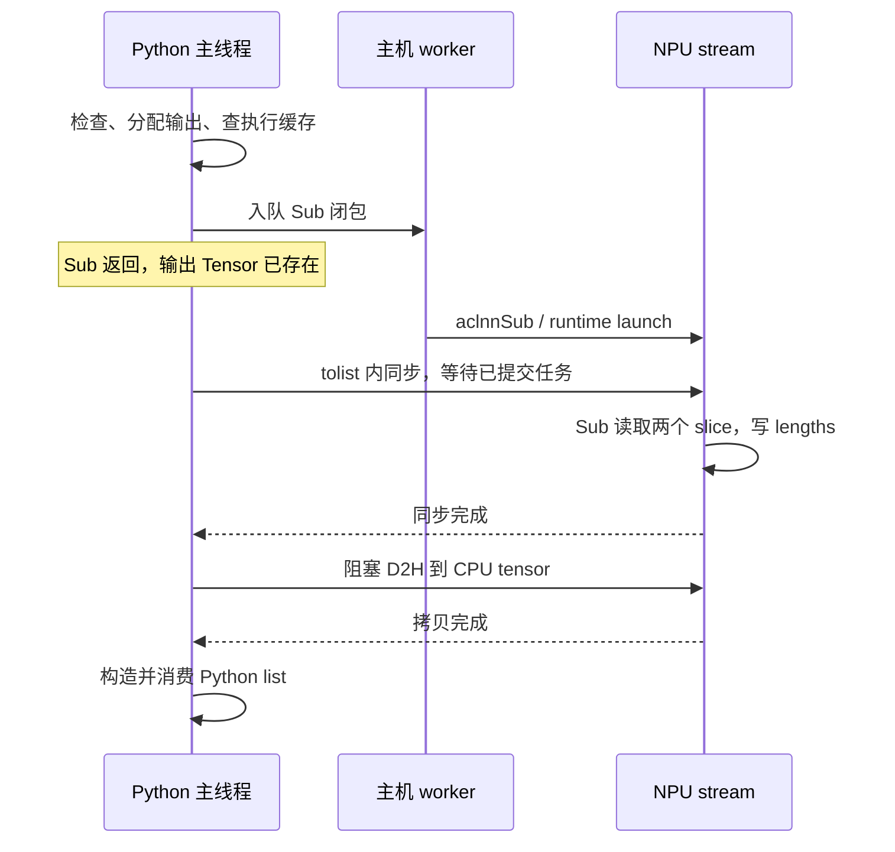

# lengths 的 Sub：CPU 提交、设备执行与内存地址

记录日期：2026-09-30。承接 [lengths 概念与待办 2](LENGTHS.md#6-待研究问题-2sub-是否阻塞-cpu怎样编译提交及寻址)。这次在原 Ascend 主机上进行了独立 eager 小数组实验，复现 `cu_seqlens[1:] - cu_seqlens[:-1]` 的 int32 差分；不是新一轮全模型性能实验。

**预热后的 Sub 可以在设备开始计算前返回 Python；首次调用则包含较重的主机准备，不能一概称为“完全非阻塞”。** `.tolist()` 和显式同步在 Sub 提交之后另外建立主机等待。本次还实际观测到安装目录中的 Sub ELF 被打开、执行缓存命中，以及两个 slice 的 storage 基址/offset 被传入 CANN 描述符。

## 1. 实验和证据边界

环境是 Ascend 910B2C、CANN 9.0.0、Python 3.12.13、torch 2.10.0+cpu、torch-npu 2.10。torch-npu revision 为 `94f8a8e6b523d7ba553e1b80d5b5248478391526`，其 op-plugin 子模块 revision 为 `dedc316708372c9a8bfde4527abd2a94b74840f5`。版本、分发注册表、环境变量及库哈希保存在各进程的 `environment.json`；源码固定版本与 SHA 见 [manifest.json](sub_probe/sources/manifest.json)。安装包自带 `op_api_common.h` 与该 revision 源码逐字节一致，其余公开源码与实际动态调用证据分别标明。

父 tensor 为 21 个 int32 累计值 `i*(i+1)//2`，两个长度为 20 的 slice 相减，期望输出 `[1, 2, …, 20]`。先完成输入 H2D，再开始测量。每轮末尾 join 并在测量范围外校验输出；持有所有输出直至完成，避免地址提前复用。

| 采集 | 次数 | 用途 |
|---|---:|---|
| 无 profiler、无诊断 hook：Sub / Sub+tolist / Sub+sync | 每组 1 次首次 + 100 次后续 | 主机调用耗时 |
| 单独 API hook：Sub | 1 + 5 | 同一进程的描述符、地址、线程、缓存和文件打开证据 |
| Level1 profiler：三个模式 | 每组 1 + 5 | 框架→主机队列→runtime launch→设备 kernel、同步与 memcpy 时间线 |

“首次”仅表示该进程初始化 NPU、准备输入之后的首次 Sub，**没有清理磁盘/系统缓存，不是硬件冷启动**。profiler 刻意不预热，以保留首次准备路径；其时间只用于因果和区间分析。每轮都有 join，后续样本代表串行微实验，不代表连续大队列或全模型吞吐。API、计时、profiler 分进程运行，不能把它们的地址、时间原点拼成同一次调用。

## 2. CPU 到 NPU 的实际调用链

上层业务表达式来自 Hugging Face Transformers 的 Qwen2.5-VL eager forward：`cu_seqlens[1:] - cu_seqlens[:-1]`。由于 `cu_seqlens` 已按 `hidden_states.device` 创建为 NPU PyTorch Tensor，两个 slice 仍是 NPU view；Python `-` 进入 `aten::sub.Tensor` 后，PyTorch dispatcher 根据 NPU 的 `PrivateUse1` dispatch key 选择 torch-npu 注册实现。若输入是 CPU Tensor，同一 ATen 算子会选择 CPU 实现；若输入是普通 Python list，列表减法会报错。这里没有经过 vLLM-Ascend，也不是 Python 源码直接编译成设备 kernel。概念和对象对照见 [lengths 笔记 2.1 节](LENGTHS.md#21-为什么一行-python-减法会变成-npu-sub)。

本机 `TASK_QUEUE_ENABLE` 和 `ASCEND_LAUNCH_BLOCKING` 均未设置。当前 [OptionsManager.cpp](sub_probe/sources/OptionsManager.cpp) 的 `GetTaskQueueEnable`（552–567 行）默认返回 **1**；`EXEC_NPU_CMD` 因而进入 **V1**。名称中的 `RunOpApiV2` 是另一层封装，不意味着启用了 `TASK_QUEUE_ENABLE=2`。

| 阶段 | 源码入口 | 当前路径的工作与线程 |
|---|---|---|
| Tensor 减法分发 | [SubKernelNpuOpApi.cpp](sub_probe/sources/SubKernelNpuOpApi.cpp)，tensor `sub`、`sub_out_npu_nocheck` | Python 主线程经 `aten::sub.Tensor` 进入 NPU 实现；检查 alpha、广播形状和输出 dtype |
| 输出分配 | [OpPreparation.cpp](sub_probe/sources/OpPreparation.cpp)，`apply_tensor_without_format` | 为输出申请 NPU 存储；此时有输出 Tensor/地址，不代表数值已计算 |
| 解析 API / 选取 stream / 查缓存 | [op_api_common.h](sub_probe/sources/op_api_common.h)，306–360 行 V1 宏、145–198 行 `hit_cache` | 主线程获取当前 stream，动态解析函数，查询执行缓存 |
| 缓存未命中：描述符与执行准备 | 同上；[op_api_common.cpp](sub_probe/sources/op_api_common.cpp)，`ConvertType(Tensor)` | 主线程创建三个 `aclTensor`，调用 `aclnnSubGetWorkspaceSize`，取得 executor 和 workspace 大小 |
| 入主机任务队列 | [OpCommand.cpp](sub_probe/sources/OpCommand.cpp)，232–283 行 `RunOpApiV2` | 主线程包装闭包，通过 `enCurrentNPUStream` 入队；入队/初始化/队列背压仍可能耗时 |
| 调用执行 API | V1 宏中的 `acl_call` | worker 出队，调用 `aclnnSub(workspace, size, executor, stream)` |
| runtime launch 和设备任务 | profiler 的 `Node@launch`、HostToDevice flow | 提交到指定 stream，设备执行 `aclnnSub_SubAiCore_Sub`，本次是 AI Vector Core |

CANN 两段 API 的签名见实际安装的 [aclnn_sub.h](sub_probe/sources/installed/aclnn_sub.h)。第一段接收输入/输出描述符和 alpha，返回执行信息；第二段使用 executor、workspace 和 stream 执行。Python Tensor 对象本身不会被搬到 NPU 作为参数。

诊断进程中，准备 API 在主线程 **1460894**，六次执行 API 在 worker **1460996**；传入 stream handle 均为 **140012811935744**。`aclnnSubGetWorkspaceSize` 和 `aclnnSub` 解析到 `libopapi_math.so`，`aclCreateTensor` 解析到 `libnnopbase.so`。这比仅查看宏定义更进一步，确认了本次运行使用的实际分支。

Tiling/执行方案属于 CANN 的执行准备过程。可见配置包含动态 shape 和 tiling 信息，但本轮未拦截其内部 tiling 函数、未解码实际选中的 tiling key 或最终 kernel 参数块，不能把第一阶段全部时间称为“tiling 时间”。

## 3. 首次准备、已有二进制与执行缓存

第一次 `PTAGetExecCache` 返回空，之后五次返回非空。首次创建三个 tensor 描述符并调用一次 `aclnnSubGetWorkspaceSize`，诊断区间为 **45.363 ms**。六次都调用了 `aclnnSub`；后五次跳过新的描述符创建和第一段 API。

首次准备过程中主线程打开安装目录中的 `sub.json` 与具体 kernel JSON，worker 执行阶段打开：

```text
/usr/local/Ascend/cann-9.0.0/opp/built-in/op_impl/ai_core/tbe/kernel/ascend910b/
  ops_legacy/sub/Sub_9342884c99c006e21fc9d5d9260b8bef_high_performance.o
```

该文件是 **262656 字节的 ELF**，SHA-256 为 `832be2b4750b56ae3f7a86029bed8b2ac2a3d28d18d3ce80c14fcdc1c2466429`，与配套 JSON 的 sha 匹配；metadata 中为 `RT_DEV_BINARY_MAGIC_ELF_AIVEC` / `VectorCore`。原始记录及配置见 [opened_sub_artifacts.json](sub_probe/results/delivery-r02/api-r02/opened_sub_artifacts.json)。没有把 CANN 二进制复制进仓库。

**观测支持“本次路径使用安装时已有的 Sub 二进制，并缓存执行准备信息”，不支持“每次 Python 减法都重新在设备编译”。** 首次的几十毫秒不能直接解释成编译成本；动态 shape、tiling 选择与重新编译也不是同一件事。文件 hook 仅覆盖选定的 libc 打开接口，不是完整系统调用/编译器跟踪，因此不据此断言整个 CANN 内部绝无其他即时准备或编译行为。

缓存也不是缓存 lengths 数值。六次输入/输出基址都经 `AddTensorAddrToCachedList` 登记，输出每次重新分配。缓存 key 相同，命中返回的 executor 句柄却可不同；每次 phase2 都使用该次返回的句柄。源码 `add_param_to_buf(Tensor)` 将 shape、dtype、stride、offset 等纳入 key，将存储地址单独登记。这样才能复用执行准备，同时写入本次输出。

## 4. Sub 是否阻塞 CPU：三组测量

下面来自无 profiler、无 hook 的三个独立进程。单位 µs，后续列为 100 次中位数。

| 模式 | 首次 Python Sub 调用 | 后续 Sub 调用 | 后续 Sub+消费/同步 | 后续范围外 join | 后续 Sub 开始至 join 完成 |
|---|---:|---:|---:|---:|---:|
| 仅 Sub | 47380.118 | 6.274 | 6.382 | 23.674 | 30.573 |
| Sub + `.tolist()` | 47485.489 | 6.188 | 38.829 | 1.793 | 40.958 |
| Sub + `stream.synchronize()` | 51531.973 | 6.218 | 32.623 | 2.252 | 35.043 |

各列分别求中位数，不能相加/相减得到严格成本拆分。仅 Sub 的消费列也包含分支判断和计时开销；join 列是 Python 同步调用的整体时间，包含队列推进/API 成本，不是纯设备计算。

API 诊断的五次后续调用中，Python 减法返回 **3.385–5.236 µs 后**，worker 才进入 `aclnnSub`。Level1 三组 trace 的 **15 次后续 `aten::sub` 均在 kernel 开始前返回**。反过来，三个进程的首次 `aten::sub` 都晚于本次 kernel 完成才结束，不能要求每次调用都呈现“先返回后执行”。首次 host 区间长并不证明它一直在等待 kernel，它也包含准备和入队等工作。

因此，“阻塞 CPU”需要指定线程和区间：主线程会花时间检查、分配、准备、入队；worker 继续发射；设备按 stream 顺序执行。`.tolist()`/显式同步在需要设备完成时让调用线程等待。这里没有测量操作系统线程的 runnable/sleep 状态，也没有证明 CPU 所有核心都被占住或完全停下。

## 5. 可复核的一次主机—设备时间线

选取 Level1 的 `SUB/tolist/2`，即首次之后的第二次后续调用。以下相对时间以该次 `aten::sub` 起点为 0，用十进制精确计算，单位 µs：

| 层/事件 | 开始 | 结束 | trace_index |
|---|---:|---:|---:|
| 主线程 `aten::sub` | 0.000 | 9.741 | 34 |
| worker `Dequeue@aclnnSub` | 13.905 | 19.675 | 101 |
| worker `Node@launch` | 15.145 | 18.687 | 193 |
| 主线程 `aclrtSynchronizeStream` | 22.751 | 38.519 | 195 |
| NPU `aclnnSub_SubAiCore_Sub` | 31.017 | 32.717 | 133 |
| 主线程 `aclrtMemcpy` | 38.995 | 46.625 | 196 |

这里 kernel 只有 **1.700 µs**，同步 API 是 **15.768 µs**。同步包含等待队列/设备推进及 API 开销；memcpy API 的 **7.630 µs** 也不能直接当作 80 字节 DMA 的纯传输时间。



该图是先后关系示意，横向距离不代表耗时，也不是新发现的全模型 DAG。未画范围外的校验 copy/join，避免混入被测操作。

同样的 `SUB/sub/2` 中，`aten::sub` 在 9.615 µs 结束，kernel 在 29.647–31.347 µs 执行，Sub scope 内无同步/拷贝。`SUB/sync/2` 的显式等待则是 `aclrtSynchronizeStreamWithTimeout`，20.860–34.195 µs，kernel 在 25.724–27.424 µs 执行。

复查方法：解压 [profile-tolist-r03/trace_view.json.gz](sub_probe/results/delivery-r03/profile-tolist-r03/trace_view.json.gz)，用 trace viewer 搜索 `SUB/tolist/2`。查看主线程、worker 和 **物理 stream 44 / task 2**。`async_npu` flow 对应框架与 kernel，`async_task_queue` 对应入队/出队，`HostToDevice` 对应 runtime launch 与 kernel；再核对 CSV 的 stream/task/name/start/duration。**这里 HostToDevice 是发射关联的 flow 名称，不是一次张量 H2D 拷贝。** [summary.json](sub_probe/results/summary.json) 保存三组 18 个 kernel 的完整关联索引，而不是按时间最近猜测。

trace 中还包含 scope 外的 join、结果校验 D2H 和 profiler 收尾同步，不能把它们统计成 Sub 自带的同步。

## 6. 输入输出内存：slice 的偏移到底传了什么

以下地址全部来自同一个 `api-r02` 进程，属于设备虚拟地址，不是物理地址；不要跨进程比较数值相同与否。

| Tensor | storage 基址 | `data_ptr()` | offset（元素） | shape / stride | 有效字节范围，相对父基址 |
|---|---:|---:|---:|---|---|
| parent | 20616935636992 | 20616935636992 | 0 | 21 / 1 | `[0,84)` |
| left=`parent[1:]` | 20616935636992 | 20616935636996 | 1 | 20 / 1 | `[4,84)` |
| right=`parent[:-1]` | 20616935636992 | 20616935636992 | 0 | 20 / 1 | `[0,80)` |
| 首次 output | 20616935637504 | 20616935637504 | 0 | 20 / 1 | 独立分配，80 字节 |

两个输入是共享 storage 的 view；创建切片无需拷贝这 80 字节。`left` 的逻辑起点向更高地址移动 4 字节，是合法 offset，不是结果错位。

首次 `aclCreateTensor` 实际收到的两个输入 **data 参数都是父 storage 基址**，分别配合 offset=1 和 offset=0。`ConvertType` 传递的是“storage 基址 + 元素 offset + shape/stride”，不是给 left 传 `data_ptr=base+4` 再加一次 offset。解析器按照 `GetWorkspaceSize` 中的 self/other/out 句柄绑定描述符，不能假设 C++ 参数转换总按左到右调用。

因此可在 CANN 描述符边界核对：

```text
有效地址 = storage_base + storage_offset * sizeof(int32)
out[i] = left[i] - right[i] = parent[i+1] - parent[i]
```

输入/输出数值在 Sub 期间留在 NPU 存储中；CPU 准备的是描述信息和执行请求。原始 API 证据中没有插入新的输入地址，profiler 中每次只有一个 Sub 计算 kernel，未观测到输入连续化/格式转换 kernel。**这不等于已经解码最终设备参数块，也不能排除 CANN 内部不可见实现细节。**

六次 CANN 显式 workspace size 均为 0、workspace 指针均为空；这是调用者提供的 workspace，不意味着驱动或库完全不使用内部存储。输出有效载荷每次 80 字节，分配器本次按 512 字节计入 allocated：父输入后 512，持有六个输出时 3584，释放输出并同步后回到 512。此指标不是 reserved memory，也不是把显存物理退还给系统的时刻。

[observations.json](sub_probe/results/delivery-r02/api-r02/observations.json) 记录每次输出地址、Sub 返回/消费/join 时间，以及最后释放引用到释放后同步的区间。具体底层 malloc/free 时刻、驱动物理页映射没有跟踪。本例用显式保留引用保证完成前不释放；并非对所有异步分配器生命周期规则的审计。

## 7. 复现与完成范围

入口为 [probe.py](sub_probe/probe.py)、[api_probe.c](sub_probe/api_probe.c)、[analyze.py](sub_probe/analyze.py)。远端隔离目录 `/data/tianchi/sub-path-audit-20260930`；脚本先检查设备空闲，最多等 5 次，不结束别的进程，也不修改安装包。诊断 preload 仅作用于指定进程；与 tolist 的早期诊断不同，这次保留环境原有 jemalloc preload。

```bash
source /usr/local/Ascend/cann-9.0.0/set_env.sh
gcc -shared -fPIC -O2 api_probe.c -o api_probe.so -ldl
LD_PRELOAD="$PWD/api_probe.so:${LD_PRELOAD:-}" \
  /usr/local/python3.12.13/bin/python probe.py --kind api --mode sub --output api-new
# mode 可选 sub / tolist / sync；输出目录必须不存在。
/usr/local/python3.12.13/bin/python probe.py --kind plain --mode sub --output plain-new
/usr/local/python3.12.13/bin/python probe.py --kind profile --mode tolist --output profile-new
```

本地无需 NPU 的复核：

```bash
python references/vision_metadata_synchronization/sub_probe/analyze.py
python -m unittest discover -s references/vision_metadata_synchronization/sub_probe -p 'test_*.py'
```

正式证据使用 `delivery-r02` 的 API/无 profiler 数据，`delivery-r03` 的 Level1 trace。r02 的 Level0 trace 也保留，但缺少 runtime API 时长，故补采 r03；各目录保存实际运行脚本，不把当前 Level1 配置冒称为 r02 配置。早期 api-r01 是试跑，不用于报告数字。10 个归档进程均完成数值校验和安装包哈希检查；三组无 profiler 共 303 次输出正确。离线检查还核对结果/源码 SHA、描述符/缓存地址、18 个 kernel 的 flow/CSV 关联。7 项测试含错 offset、陈旧输出地址、错 executor、缺 queue flow、错 stream、同步顺序错误六类反例。

待办 2 已完成到 **PyTorch→CANN 描述符/执行 API→runtime trace→设备 kernel** 的可观测层。尚未恢复最终设备参数块、实际 tiling key、内部缓冲及精确分配释放调用；也未对原全模型所有 Sub 地址作追踪。它们是进一步深挖的边界，不作为“完整 kernel 内存依赖 DAG 已完成”的证据。

本次正常 `[1,…,20]` 对照只验证了基线路径。后续于 2026-10-01 完成 [待办 3 的正确性与异常校验](CORRECTNESS.md)，另有 [HTML 报告](correctness_probe/report/index.html)展示 slice 共享存储、偏移和分段对照；最终设备参数块仍未解码。
