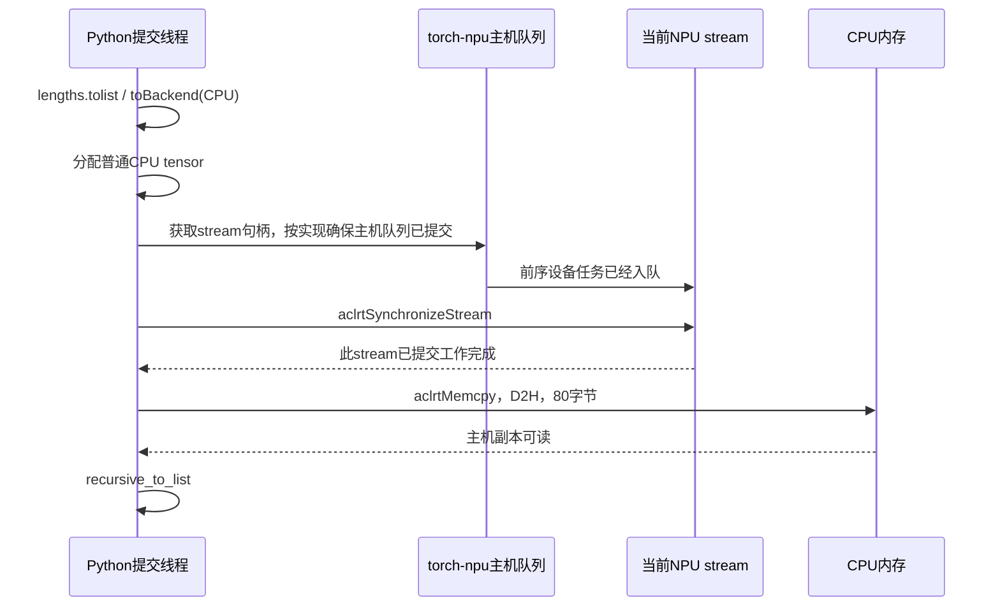

# `.tolist()` 的同步位置、源码调用链与 D2H 实测

2026-09-30，完成 [lengths 待办 1](LENGTHS.md#5-待研究问题-1tolist-同步在哪如何连接到-d2h)。本轮核对远端实际安装版本、dispatcher、二进制调用点，并运行独立的小数组诊断和计时。没有修改安装包、模型权重或已有服务。

**结论：这次 `.tolist()` 通过 torch-npu 的 `_to_copy` 分配普通 CPU 内存，经 `copy_` 进入 OpApi 拷贝路径，在调用线程上先执行 `aclrtSynchronizeStream`，再执行 `aclrtMemcpy(..., ACL_MEMCPY_DEVICE_TO_HOST)`；拷贝完成后，PyTorch 才在 CPU 上生成 Python 列表。**

这里修正此前笔记的一个具体函数定位：实际观测对应 `CopyKernelOpApi.cpp` 中直接调用 `aclrtSynchronizeStream` 的分支，不是 `CopyKernel.cpp` 中的 `AclrtSynchronizeStreamWithTimeout` 分支。两者都体现“先等待、再阻塞拷贝”，但不能混写为同一个实际调用点。

## 1. 版本与证据的来源

| 项目 | 本轮检查值 |
|---|---|
| torch | `2.10.0+cpu`，revision `449b1768410104d3ed79d3bcfe4ba1d65c7f22c0` |
| torch-npu | `2.10.0`，revision `94f8a8e6b523d7ba553e1b80d5b5248478391526` |
| Python / CANN 环境 | Python 3.12.13；`/usr/local/Ascend/cann-9.0.0` |
| 实际安装根目录 | `/usr/local/python3.12.13/lib/python3.12/site-packages` |
| 设备 | Ascend 910B2C，物理 5 / 容器逻辑 0 |
| 新诊断输入 | 合成的连续 20 元素 int32 tensor，值为 1–20；有效载荷 80 字节 |

Python 包路径、revision、dispatcher 注册表和库/头文件哈希来自实际远端安装环境，见 [environment.json](tolist_probe/results/instrument-r02/environment.json)。两个成功进程的运行前后包/库哈希一致，见各目录的 `integrity.json`。

用于逐行解释的 C++ 源文件从安装包报告的精确 revision 获取，保留于 [sources](tolist_probe/sources/manifest.json)。安装头文件 `TensorBody.h` 与 NPU 注册 YAML 另外从远端直接复制。源码快照是 revision 对应的上游文件，不声称它们全部存在于 wheel 内；二进制与源码之间再用 dispatcher、实际调用栈、PLT 调用点和拷贝参数交叉核对。

P27 的旧 trace 用于验证模型中的调用顺序与长等待；新实验用于验证内存和运行时调用。两轮包版本一致，但不能用本轮二进制哈希追溯证明旧采集时所有二进制都相同。

## 2. 完整调用链：从 Python 到 CANN

下表行号对应保存的源码或安装头文件；可离线阅读。不同分发/包装层可能没有同名 profiler 区间，不能把每一行都理解为单独的设备 kernel。

| 层级 | 函数与源码位置 | 具体作用 |
|---|---|---|
| Python 方法绑定 | [python_variable_methods.cpp](tolist_probe/sources/python_variable_methods.cpp)，1027 / 1332 行 | `THPVariable_tolist` 解包 Tensor，调用 `torch::utils::tensor_to_list` |
| PyTorch 列表转换 | [tensor_list.cpp](tolist_probe/sources/tensor_list.cpp)，47–73 行 | 非 CPU 输入先 `toBackend(CPU)`；转换期间释放 GIL；取回后调用 `recursive_to_list` |
| CPU 转换参数 | [安装 TensorBody.h](tolist_probe/results/instrument-r02/installed/TensorBody.h)，240 行 | `toBackend` 明确传入 `non_blocking=false, copy=false` |
| ATen `to` | [TensorConversions.cpp](tolist_probe/sources/TensorConversions.cpp)，425–447 行 | `to_impl` 判断不能直接返回原 tensor，因为目标设备从 NPU 变成 CPU，然后进入 `_to_copy` |
| NPU `_to_copy` | [ToKernelNpu.cpp](tolist_probe/sources/ToKernelNpu.cpp)，27 / 89–109 行 | 合并 dtype/device 参数；本次连续路径分配 CPU tensor，调用 `r.copy_(self, non_blocking)` |
| CPU 内存分配 | [EmptyTensor.cpp](tolist_probe/sources/EmptyTensor.cpp)，13–29 / 103 / 169 行 | 本环境覆盖了 CPU `empty` 注册；`pin_memory=false` 时选择 `c10::GetCPUAllocator()` |
| NPU copy 分发 | [CopyKernelOpApi.cpp](tolist_probe/sources/CopyKernelOpApi.cpp)，169–201 行 | `NPUNativeOpApiFunctions::copy_` 看到源是 NPU、目标是 CPU，进入 D2H 分支 |
| D2H 参数 | 同文件，106–112 / 146–154 行 | 连续、相同 dtype/shape 的输入直接进入拷贝；方向设为 `ACL_MEMCPY_DEVICE_TO_HOST` |
| 同步与拷贝 | 同文件，37–73 行，尤其 51–54 行 | 获取当前 NPU stream，先 `aclrtSynchronizeStream(stream)`，再调用 `AclrtMemcpyWithModeSwitch` |
| 地址展开与 CANN API | [CalcuOpUtil.cpp](tolist_probe/sources/CalcuOpUtil.cpp)，242–250 / 136–139 行 | 根据 storage 基址及字节偏移获得源/目标地址，最终 `aclrtMemcpy(dst, dstMax, src, count, kind)` |
| 主机结果消费 | [tensor_list.cpp](tolist_probe/sources/tensor_list.cpp)，13–38 / 66–73 行 | 遍历 CPU tensor 数据与 stride，生成 Python list 和 Python 标量 |

`copy=false` 不表示“不拷贝”：它表示不强制对本可复用的 tensor 再复制；跨设备转换仍需要主机副本。`non_blocking=false` 才是本次进入阻塞拷贝分支的关键参数。

dispatcher 实测 `aten::_to_copy` 的 PrivateUse1 注册来自 `torch_npu/csrc/aten/RegisterNPU.cpp:33542`，不是 PyTorch 通用 CPU `_to_copy` 实现。`copy_` 同样注册到 NPU 后端；即使目标 tensor 在 CPU，其 NPU 源输入也参与分发。注册 YAML 的 `copy_` 设置了 `op_api: True`。

## 3. 等待发生在哪个线程、哪条 stream



[NPUStream.h](tolist_probe/sources/NPUStream.h) 的隐式 `aclrtStream` 转换调用 `stream()`；[NPUStream.cpp](tolist_probe/sources/NPUStream.cpp) 364–391 行在相应队列模式下调用 `MakeSureQueueEmpty`。这处理的是主机提交队列，之后的 CANN stream 同步才等待设备执行完成。该机制说明等待可能出现在进入 CANN 同步 API **之前**，不能把整个 `.tolist()` 的主机等待都归入某一条 API duration。本轮没有分别量化 `MakeSureQueueEmpty` 的耗时，也没有恢复 P27 的每个主机队列元素。

新诊断的同步和 memcpy 都在调用线程 TID 上发生，同步收到的句柄等于 Python 当前 stream 的实际 `npu_stream` 句柄。这个句柄不是 P27 的物理 stream 编号 43，两次运行的编号/地址也不能互换。

等待针对当前 stream 的已提交工作，可能包含排在长度差分之前的视觉计算；它不是对 `lengths` 单个 tensor 做最小依赖等待，也不等于同步整张卡。其他 stream 已提交的工作可以继续，但只有一个 CPU 提交线程时，该线程尚未发射的任务必须等它返回。

PyTorch 释放 GIL 允许其他 Python 线程有机会运行，并不让当前线程跳过等待。设备副本可读后再重新进入 Python 列表构造。

## 4. 怎样确认底层实际到达 D2H

本轮使用两个互补的进程内观察器：`TorchDispatchMode` 记录 `_to_copy` 的源 tensor 和返回的 CPU tensor；小型 `LD_PRELOAD` 库截获 `aclrtSynchronizeStream` / `aclrtMemcpy`，随后原样转调原函数。仅记录调用参数、线程、时间与返回码，不改写指针或拷贝内容，也不解引用 NPU 指针。

在 `instrument-r02` 的一次 `.tolist()` 中，直接观测到：

| 项目 | 值 |
|---|---|
| 源 NPU tensor `data_ptr()` | `0x12c041200000` |
| `_to_copy` 返回的 CPU tensor `data_ptr()` | `0x22c5fc80` |
| CANN memcpy `src` / `dst` | 分别与以上两个地址完全一致 |
| `count` | 80 字节 |
| `kind` | 2，即安装 CANN 头文件的 `ACL_MEMCPY_DEVICE_TO_HOST` |
| 当前 stream 句柄 / 同步实参 | 均为 `0x20fd3e30` |
| CPU tensor `is_pinned()` | `False` |
| 调用结果 | 同步与 memcpy 返回码均为 0，Python 列表与输入参考完全一致 |

原始记录见 [diagnostic.json](tolist_probe/results/instrument-r02/diagnostic.json)。地址是该进程的地址空间标识，不是物理内存地址，也不是可跨进程复用的地址。

`_to_copy` 的源码计算 `pin_out = non_blocking && ...`，此处为 false，实测 `is_pinned=False` 与其一致。对本次连续 int32 路径，框架把原 NPU 数据地址直接交给 CANN，目标直接是最终供列表构造读取的 CPU tensor，没有观察到框架层另加的数据暂存 tensor。**CANN/驱动内部是否再次暂存、使用什么传输引擎，本轮不可见。** 不据此断言整个硬件路径只有一次物理搬运。

源码给出的地址计算是 `storage.data() + storage_offset * itemsize`；本例偏移为 0。非零偏移和 Sub 输入输出寻址的完整验证留给待办 2。

额外的二进制证据如下：

- [memcpy_stack.txt](tolist_probe/results/instrument-r02/memcpy_stack.txt) 保存未启用 dispatch observer 的 `.tolist()` 调用栈，覆盖 PyTorch `to` / `_to_copy` / `copy_` 与 `libtorch_npu`。
- [installed_copy_disassembly.txt](tolist_probe/results/installed_copy_disassembly.txt) 的库偏移 `0x10e8e26` 调用 `aclrtSynchronizeStream@plt`，随后经过 `0x10e8f8a` 的调用点。
- [runtime_linkage.txt](tolist_probe/results/runtime_linkage.txt) 显示后续包装在 `0x44f9e58` 跳转到 `aclrtMemcpy@plt`，并记录 `libtorch_npu.so` 对 `libascendcl.so` 的动态依赖及 CANN memcpy 枚举。

该安装库缺少这些内部函数的完整调试符号；反汇编显示的邻近符号名可能与实际函数无关，不能拿 `ValueError` 等自动标签作为源码函数名。这里仅使用明确的调用偏移、导入 API 和真实调用栈对应关系。

## 5. 三次 tolist 与只取一次的实测

在相同 NPU tensor 上执行三次 `.tolist()`，实测三次同步、三次 80 字节 D2H。只做一次并把返回的 Python 列表复用于三处，则各一次；在已经返回的 CPU tensor 上调用 `.tolist()`，两者均为零。

| 诊断操作 | stream 同步次数 | D2H 次数 |
|---|---:|---:|
| NPU tensor `.tolist()`，观察临时 CPU tensor | 1 | 1 |
| 三次 `.tolist()` | 3 | 3 |
| 一次 `.tolist()`，列表复用三次 | 1 | 1 |
| 显式 `x.to('cpu')` | 1 | 1 |
| CPU tensor `.tolist()` | 0 | 0 |

原始模型中 Q/K/V 切分的三次调用可以因此区分为：重复生成 CPU 副本/列表，而不是三组不同的分段长度。部分临时 CPU 地址被分配器复用；地址相同不表示数据被缓存而省略了拷贝，运行时确实记录了三次 D2H。

计时在另一个进程进行，不带 profiler、dispatch observer 或诊断 hook，保留环境原有的 jemalloc preload。每项 1000 个样本、轮换执行位置；输入是已就绪的 20 元素 int32 tensor，没有前序模型工作排队：

| 操作 | 主机耗时中位数 |
|---|---:|
| 三次 NPU `.tolist()` | 24.588 µs |
| 一次 NPU `.tolist()` 后复用列表 | 8.546 µs |
| 显式转 CPU tensor | 8.412 µs |
| CPU tensor `.tolist()` | 0.521 µs |

见 [timings.json](tolist_probe/results/timing-r02/timings.json)。CPU-only 数字包含 Python 调用和列表构造路径，不是纯 `recursive_to_list` C++ 函数体的独立计时；不能用不同样本的中位数相减，声称精确分解了原始调用的每项开销。合成输入 1–20 也不能代表任意长度值、列表大小的对象构造成本。

诊断中同步 API 和 memcpy API 单独计时，见 [summary.json](tolist_probe/results/summary.json)；它们用于展示 API 边界，不作为正常性能测量。诊断进程使用 hook preload，原环境的 jemalloc 未同时保留；因此诊断分配/耗时不与无 hook 计时直接比较。以上计时也不证明全模型耗时能按比例缩短。

## 6. 与 P27 模型 trace 的对应

P27 的 `native / prefill-beach-v256 / parallel / 重复 1` 首次窗口 attention 同样记录到 `aten::to → aten::_to_copy → aten::copy_`。每个 copy 区间里先有 `AscendCL@aclrtSynchronizeStream`，再有 `AscendCL@aclrtMemcpy`：

| 对应读取 | copy_ trace_index | 同步 API µs | memcpy trace_index | memcpy API µs |
|---|---:|---:|---:|---:|
| Q | 116736 | 42.705 | 671940 | 15.409 |
| K | 116763 | 0.530 | 671942 | 8.197 |
| V | 116790 | 0.381 | 671944 | 8.005 |

这些不是新小数组试验的数字；来源和查找方法见[原笔记](README.md#84-真实-trace80-字节也会触发等待)。模型中的首个同步还要等待设备队列推进，不能把其 42.705 µs 当作搬运 80 字节的耗时。真正的 Sub kernel 在该实例中仅运行 1.580 µs，见 [lengths 笔记](LENGTHS.md#3-sub-的实际调用与计算证据)。

本轮没有更改全模型 attention，因此没有新增“仅把每层三次 tolist 合并为一次”的全模型性能结论。新对照只验证这项改动的 API 次数与小数组调用成本。

## 7. non_blocking 能改变什么

`non_blocking` 对 NPU→CPU 拷贝有作用，但 `.tolist()` 没有这个参数，其内部 `toBackend(CPU)` 固定传 `non_blocking=false`。因此不能给 `.tolist()` 直接添加开关来消除同步。

在本次连续 tensor 的 torch-npu 实现中，`False` 走先 stream 同步、再阻塞 D2H 的分支；`True` 走 `LaunchAsyncCopyTaskWithModeSwitch`，跳过这里的显式 stream 同步。NPU `_to_copy` 对这个异步 D2H 路径还会设置 `pin_out=true`，申请 pinned CPU 目标内存。这是源码分支分析，本轮没有把异步 D2H 纳入计时对照。

可以显式调用 `host_lengths = lengths.to('cpu', non_blocking=True)`，但返回不表示 CPU 缓冲区已经可读。紧接着调用 CPU tensor 的 `.tolist()` 不会自动等待之前的 D2H；必须在消费前确认拷贝完成。示意如下，生产和拷贝使用同一 stream：

```python
with torch.npu.stream(producer_stream):
    lengths = cu_seqlens[1:] - cu_seqlens[:-1]
    host_lengths = lengths.to('cpu', non_blocking=True)
    copied = torch.npu.Event()
    copied.record()  # 位于拷贝之后

# 此处可以做不依赖长度值的主机工作；保持相关 tensor 的生命周期。
copied.synchronize()  # CPU 即将读取，必须先等拷贝完成。
sizes = host_lengths.tolist()
```

若改用另一条拷贝 stream，还需明确建立“长度生产完成→拷贝”的依赖。`non_blocking=True` 本身不自动修复跨 stream 的生产/消费关系，也不意味着主机调用零开销、任何情况下都绝不等待。

当前 eager attention 在得到长度后马上用 Python 列表拆分 Q/K/V。如果异步提交后立即等待 event，等待只是换了位置；有独立工作可安排在提交与消费之间时，才有机会隐藏等待。P27 的 `lengths` 变体直接由 CPU grid 预计算长度，省掉了每层设备差分及 D2H，这比为本来可在 CPU 确定的元数据引入异步回传更直接。

## 8. 完成范围、复核与剩余边界

待办 1 的五项均已完成到当前可观测层：绑定/分发调用链、阻塞参数和分配器、stream 同步与主机队列关系、D2H 指针/大小/pinned 状态、三次与一次调用及主机列表构造的独立对照。驱动内部暂存/DMA、准确 GIL 调度耗时和单独的主机队列排空时长仍明确保留为不可见或未独立测量，不将它们写成已证明事实。

执行入口与复核工具见 [probe.py](tolist_probe/probe.py)、[acl_probe.c](tolist_probe/acl_probe.c)、[analyze.py](tolist_probe/analyze.py)。本地无需 NPU：

```bash
python references/vision_metadata_synchronization/tolist_probe/analyze.py
python -m unittest discover -s references/vision_metadata_synchronization/tolist_probe -p 'test_*.py'
```

验证覆盖原始记录，以及删除同步、错配 CPU 目标、拷贝早于等待结束、错流、错传输方向五种反例，共 6 项测试。成功采集进程还检查包/库哈希前后一致和全部结果相等。

远端隔离目录为 `/data/tianchi/tolist-path-audit-20260930`。复现时选择新的输出目录，设备忙时脚本会退出；诊断库只在指定进程中加载，不安装到系统。先在相同目录编译：

```bash
gcc -shared -fPIC -O2 acl_probe.c -o acl_probe.so -ldl
source /usr/local/Ascend/cann-9.0.0/set_env.sh
env LD_PRELOAD="$PWD/acl_probe.so" /usr/local/python3.12.13/bin/python probe.py --instrument --output instrument-new
/usr/local/python3.12.13/bin/python probe.py --output timing-new
```

正式引用 `instrument-r02` 和 `timing-r02`，各自保存实际执行脚本。`instrument-r01` 是早期诊断；首次 timing-r01 因环境自带 jemalloc preload 被过严的检查拒绝，没有生成计时样本，修正检查后才生成 timing-r02。后来尝试补充动态库路径记录时，instrument-r03 检测到其他设备进程，初始化 NPU 前退出；[占用记录](tolist_probe/results/supplement_aborted_device_busy.txt)保留，未终止或干扰其他进程。包/库哈希与二进制动态依赖检查已覆盖本轮所需的版本与链接证据。
